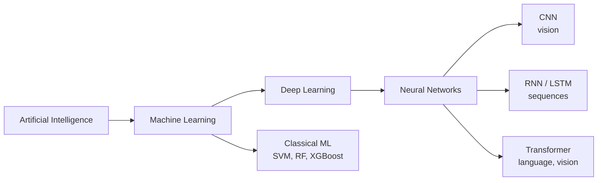
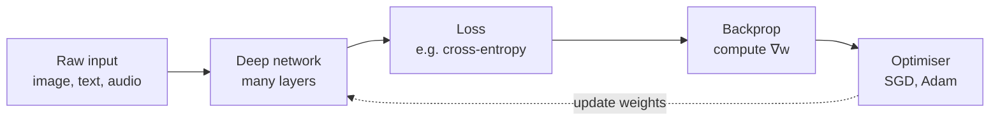

## Introduction & Motivating Example

Big picture (no jargon)

**Deep learning** is machine learning done with many-layered neural networks that **learn their own features** from raw data. Classical ML (SVM, Random Forest, XGBoost) demands that humans hand-craft features ("count the corners", "extract SIFT descriptors"); deep learning lets the network discover features layer by layer — edges → textures → parts → objects. Given enough data and compute, this approach has crushed the previous state of the art on perception tasks (vision, speech) and now language too.

**Real-world analogy.** Old way: a chef with a cookbook of recipes hand-tuned for each dish. Deep way: a chef who tastes thousands of dishes, gradually internalising the principles of cuisine, and can then invent new ones. The neural network *learns* the cookbook from examples instead of being told the recipes.

### Vocabulary — every term, defined plainly

- **Artificial Intelligence (AI)** — broad goal of building machines that act intelligently.
- **Machine Learning (ML)** — subfield of AI; learn patterns from data instead of hand-coded rules.
- **Deep Learning (DL)** — subfield of ML using **deep neural networks** (many layers).
- **Neural network** — function built from layers of "neurons" (weighted sums + non-linear activations).
- **Layer** — a group of neurons that act in parallel on the same input vector.
- **Hidden layer** — any layer between the input and the output (its activations are not directly observed).
- **Hierarchical / representation learning** — successive layers transform the input into progressively more abstract features.
- **End-to-end learning** — train from raw input to final prediction, with no hand-engineered intermediate features.
- **GPU (Graphics Processing Unit)** — massively parallel chip; performs matrix multiplications 10–100× faster than CPU.
- **ImageNet** — landmark labelled-image benchmark (~14M images, 1000 classes); 2012 AlexNet result kicked off the deep-learning era.
- **Universal approximator** — a model class that can approximate any continuous function (given enough capacity). MLPs and most NN architectures qualify.
- **CNN** (Convolutional NN) — vision specialist using shared local filters.
- **RNN / LSTM / GRU** — recurrent networks for sequences.
- **Transformer** — attention-based architecture dominating modern NLP and increasingly vision.

### Picture it — the AI / ML / DL nesting

### Build the idea — why "deep"?

- **Shallow** model — one (or zero) hidden layer. Universal approximator *in theory*, but may need exponential width to capture complex functions.
- **Deep** model — many hidden layers, each progressively transforming the data. The composition of simple non-linearities yields rich features with far fewer total neurons.

The key empirical fact: depth turns out to be a much more efficient way to express complicated functions than width. A 50-layer ResNet captures things a wide-but-shallow network never can with the same parameter budget.

### Build the idea — three things that made DL work (~2012)

1. **Big data** — ImageNet's 14M labelled images, then web-scale text and video.
2. **Big compute** — GPUs (and now TPUs) make the matrix multiplies at the heart of every layer 10–100× faster than CPUs.
3. **Better algorithms** — ReLU activation, dropout, batch normalisation, Adam optimiser, residual connections (ResNet), attention (Transformer).

Any one of these alone wouldn't have been enough; together they pushed neural nets from a niche curiosity to the dominant paradigm.

### Build the idea — motivating timeline (ImageNet)

| Era | Approach | ImageNet top-5 error |
|---|---|---|
| 2010 | Hand-crafted features + SVM | ~28 % |
| 2012 | **AlexNet (CNN)** — Krizhevsky et al. | 15.3 % |
| 2014 | VGG / GoogLeNet | ~7 % |
| 2015 | ResNet | 3.6 % (below human ~5 %) |
| 2020+ | Vision Transformers | < 1 % on many splits |

### Build the idea — the deep learning workflow

### Build the idea — when deep learning shines (and when it doesn't)

**Wins on:** images, speech, text, video, reinforcement learning. Anything with abundant data and rich raw structure that benefits from learned features.

**Loses (or ties) on:**
- **Tabular data** — XGBoost / LightGBM still dominate.
- **Small data** — deep nets overfit; classical ML or transfer learning works better.
- **Interpretability-critical applications** — deep nets are opaque.
- **Resource-constrained deployment** — large models need GPUs, lots of memory, energy.

<dl class="symbols">
  <dt>$L$</dt><dd>number of layers in a deep network</dd>
  <dt>$\mathbf w$</dt><dd>parameters (weights and biases) of the network</dd>
  <dt>$\nabla_{\mathbf w} L$</dt><dd>gradient of loss wrt weights, computed by backpropagation</dd>
</dl>

### Worked example — fully expanded

Worked example: cat-vs-dog classifier, two eras compared

**Era 1 — classical pipeline (2010).**

1. Preprocess image (resize, grayscale).
2. Compute hand-crafted features: SIFT descriptors at keypoints, HOG (gradient histograms), colour histograms.
3. Pool features into a fixed-length "bag-of-visual-words" vector via k-Means quantisation.
4. Train a linear SVM on the bag-of-words vector.

**Result:** ~80 % accuracy on a 10 k-image dataset. Each step required PhD-level expertise. Adding a new class meant re-tuning the pipeline.

**Era 2 — deep pipeline (2014+).**

1. Resize image to 224×224 RGB pixels.
2. Feed raw pixels into a pre-trained CNN (e.g. ResNet-50).
3. Replace the final softmax with a new 2-class output and fine-tune (transfer learning).

**Result:** ~99 % accuracy with the same dataset. **Zero hand-engineering.**

**What is the network doing internally?** Visualising a trained CNN:
- **Layer 1**: edge detectors (oriented lines).
- **Layer 2**: corner / texture detectors.
- **Layer 3**: simple parts (eyes, ears).
- **Deeper layers**: full object parts (snouts, whiskers, paws).
- **Final layer**: probability over "cat" and "dog".

Each layer is a learnable change of representation. The classical pipeline replaced layers 1–4 with hand-coded SIFT + HOG, throwing away the chance to *learn* what features are best for the data.

### How to think about it

Mental model — successive change of representation

Each layer of a deep network is a *learnable change of representation*. The network keeps reshaping the input until classes become **linearly separable** in the final layer's space; the classifier on top then becomes trivial. All the magic is in the layers underneath.

This is also why **transfer learning** works: the lower layers learn generic visual primitives (edges, textures) that are useful across many tasks. Train on ImageNet, then re-use those layers for medical imaging, satellite imagery, or industrial inspection — the early features transfer "for free".

**When this comes up in ML.** Every modern computer vision system (Tesla autopilot, medical imaging, surveillance), every speech recognition system (Alexa, Siri), every large language model (ChatGPT, Claude, Gemini), every image generator (DALL·E, Stable Diffusion). The *concepts* in this module — layers, activations, loss, backprop, GPUs — are the foundation of all of it.

Watch out — common traps

- **"Just throw a deep net at it" is rarely the answer.** For small or tabular data, classical ML usually wins.
- **Deep nets need careful initialisation, normalisation, and regularisation.** Naive training diverges. Most of this course covers the mechanics that *make* deep nets train.
- **Compute hungry.** Training cost (energy, time, $$$) is a real constraint. Inference can be expensive too.
- **Data hungry.** A typical deep model needs 10⁵–10⁹ samples to outperform classical ML. With less data, transfer learning is the rescue plan.
- **Opaque.** Without interpretability tooling (saliency maps, SHAP), you don't know why the model made a prediction — a problem in regulated domains.
- **Distribution shift.** A model trained on lab images may flop on smartphone photos. The "test set" must really match deployment.

Exam tip

Three guaranteed sub-questions: **(a) name the three enablers** of the 2012 deep-learning breakthrough (data + compute + algorithms); **(b) compare classical vs deep pipelines** for a perception task (cat-vs-dog, speech, sentiment); **(c) explain "representation learning"** in one sentence — successive layers transform the input until classes are linearly separable in the final layer's space.

