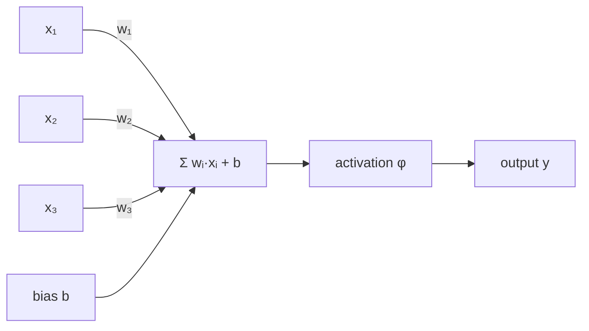
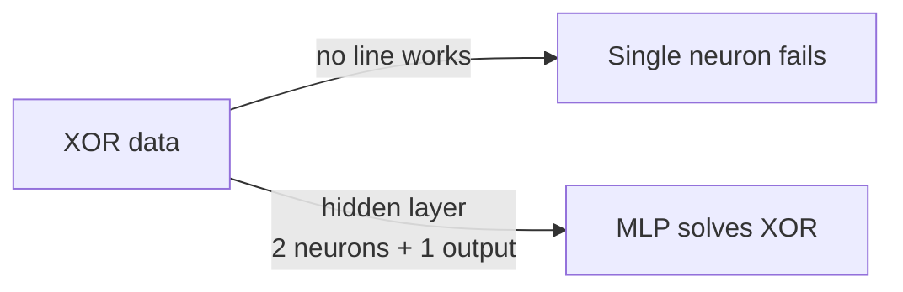

## Artificial Neuron & Perceptron

Big picture (no jargon)

The **artificial neuron** is the atom of every neural network. It does exactly three things: **(1)** weight each input, **(2)** add them up plus a bias, **(3)** pass the sum through a non-linear "activation" function. The **perceptron** (Rosenblatt, 1958) is the original artificial neuron, with a hard 0/1 step activation — and it is the great-great-grandfather of every modern deep network from AlexNet to GPT.

A perceptron alone can only solve **linearly separable** problems — it draws a straight line through the data. To solve curved problems (like XOR), you need to **stack neurons into layers** → multi-layer perceptron, which is the next module.

**Real-world analogy.** A single neuron is like a hiring committee voting on a candidate. Each member (input) has a different say (weight), the chair adds a baseline opinion (bias), and the final decision (activation) is "hire / don't hire" (step) or a confidence score (sigmoid). One committee = one straight-line decision rule. To capture nuanced "hire if (X *and* Y) *or* (Z *and not* W)" decisions, you need a hierarchy of committees — i.e. layers.

### Vocabulary — every term, defined plainly

- **Artificial neuron / unit / perceptron** — basic computational element: weighted sum + bias + activation.
- **Weight $w_i$** — what the neuron has learned about input $i$. Sign indicates direction; magnitude indicates importance.
- **Bias $b$** — constant offset; shifts the decision threshold. Without it, the boundary must pass through the origin.
- **Pre-activation $z = \mathbf w^\top \mathbf x + b$** — the weighted sum before the activation.
- **Activation function $\varphi$** — the non-linearity (step, sigmoid, tanh, ReLU, ...).
- **Step function** — 1 if $z \ge 0$, else 0. Original perceptron activation; non-differentiable.
- **Sigmoid** — $\sigma(z) = 1/(1+e^{-z})$; smooth S-curve from 0 to 1.
- **tanh** — hyperbolic tangent; smooth from $-1$ to $+1$; zero-centred.
- **ReLU** (Rectified Linear Unit) — $\max(0, z)$; the de-facto default activation in deep nets.
- **Leaky ReLU** — $\max(\alpha z, z)$ with small $\alpha$ (e.g. 0.01); fixes "dying ReLU".
- **Softmax** — multi-class output activation; turns a vector of scores into a probability distribution.
- **Linear separability** — the existence of a hyperplane separating two classes. Required for a single perceptron to succeed.
- **Perceptron learning rule** — additive weight update on each misclassified sample.
- **XOR problem** — the canonical *non-linearly-separable* binary task; cannot be solved by one neuron.
- **Vanishing gradient** — gradients shrink toward zero in deep networks with saturating activations (sigmoid, tanh); ReLU mitigates.
- **Dying ReLU** — a unit stuck at output 0 forever because its pre-activation is always negative; fix with Leaky ReLU.

### Picture it

### Build the idea — the neuron equation

$$
y \;=\; \varphi\!\left(\sum_{i=1}^d w_i\, x_i + b\right) \;=\; \varphi\!\left(\mathbf w^\top \mathbf x + b\right).
$$

The pre-activation $z = \mathbf w^\top \mathbf x + b$ is a linear function of the input; everything *interesting* about a neuron is hiding in the activation $\varphi$.

### Build the idea — common activations

| Name | Formula | Range | Notes |
|---|---|---|---|
| **Step** (perceptron) | $\mathbf 1\{z \ge 0\}$ | $\{0, 1\}$ | Non-differentiable; historical only |
| **Sigmoid** | $1 / (1 + e^{-z})$ | $(0, 1)$ | Saturates → vanishing gradient |
| **tanh** | $(e^z - e^{-z})/(e^z + e^{-z})$ | $(-1, 1)$ | Zero-centred; still saturates |
| **ReLU** | $\max(0, z)$ | $[0, \infty)$ | Default; cheap; "dying ReLU" risk |
| **Leaky ReLU** | $\max(\alpha z, z)$ | $\mathbb R$ | Fixes dying ReLU |
| **Softmax** (output) | $e^{z_k} / \sum_j e^{z_j}$ | $(0, 1)$, summing to 1 | Multi-class probabilities |

### Build the idea — perceptron learning rule

For binary labels $y \in \{-1, +1\}$ and a perceptron with step activation, on each **misclassified** training sample $(\mathbf x_i, y_i)$:

$$
\mathbf w \;\leftarrow\; \mathbf w + \eta\, y_i\, \mathbf x_i, \qquad b \;\leftarrow\; b + \eta\, y_i.
$$

Correctly classified samples → no update.

**Convergence theorem (Rosenblatt, 1962).** If the data is linearly separable with margin $\gamma$ and bounded inputs $\|\mathbf x\| \le R$, the perceptron rule converges in at most $(R/\gamma)^2$ updates. **Caveat:** if the data is *not* linearly separable, the algorithm never converges.

### Build the idea — what a single neuron CANNOT do (XOR)

| $x_1$ | $x_2$ | XOR |
|---|---|---|
| 0 | 0 | 0 |
| 0 | 1 | 1 |
| 1 | 0 | 1 |
| 1 | 1 | 0 |

There is **no straight line** in the $(x_1, x_2)$ plane that separates the two `1`s from the two `0`s. So a single perceptron cannot represent XOR. Minsky & Papert highlighted this in 1969 and inadvertently triggered the first "AI winter" — for over a decade neural networks were considered a dead end. The fix is **stacking neurons into layers** (multi-layer perceptron, MLP), which we cover in module 5.

<dl class="symbols">
  <dt>$w_i$</dt><dd>weight on input $i$ — learned</dd>
  <dt>$b$</dt><dd>bias / threshold offset — learned</dd>
  <dt>$z$</dt><dd>pre-activation: $\mathbf w^\top \mathbf x + b$</dd>
  <dt>$\varphi$</dt><dd>activation function</dd>
  <dt>$\eta$</dt><dd>learning rate (perceptron rule)</dd>
  <dt>$\gamma$</dt><dd>margin (perceptron convergence theorem)</dd>
</dl>

### Worked example — fully expanded

Worked example: a neuron implementing OR (and why XOR fails)

**OR gate.** Choose weights $\mathbf w = (1, 1)$, bias $b = -0.5$, step activation.

Compute $z = w_1 x_1 + w_2 x_2 + b$ and $y = \mathbf 1\{z \ge 0\}$ for each input:

| $x_1$ | $x_2$ | $z = x_1 + x_2 - 0.5$ | $y$ | Expected OR |
|---|---|---|---|---|
| 0 | 0 | $-0.5$ | 0 | 0 ✓ |
| 0 | 1 | $0.5$ | 1 | 1 ✓ |
| 1 | 0 | $0.5$ | 1 | 1 ✓ |
| 1 | 1 | $1.5$ | 1 | 1 ✓ |

Works! The decision boundary is $x_1 + x_2 = 0.5$ — a straight line cleanly separating $(0, 0)$ from the other three points.

**AND gate.** Same weights, but $b = -1.5$:

| $x_1$ | $x_2$ | $z = x_1 + x_2 - 1.5$ | $y$ | Expected AND |
|---|---|---|---|---|
| 0 | 0 | $-1.5$ | 0 | 0 ✓ |
| 0 | 1 | $-0.5$ | 0 | 0 ✓ |
| 1 | 0 | $-0.5$ | 0 | 0 ✓ |
| 1 | 1 | $0.5$ | 1 | 1 ✓ |

Works! Boundary $x_1 + x_2 = 1.5$.

**XOR — try and fail.** Suppose we attempt $w_1 = 1, w_2 = 1, b = -1$:

| $x_1$ | $x_2$ | $z = x_1 + x_2 - 1$ | $y$ | Expected XOR |
|---|---|---|---|---|
| 0 | 0 | $-1$ | 0 | 0 ✓ |
| 0 | 1 | $0$ | 1 | 1 ✓ |
| 1 | 0 | $0$ | 1 | 1 ✓ |
| 1 | 1 | $1$ | **1** | **0** ✗ |

Inputs $(1, 1)$ are misclassified. **No** assignment of $w_1, w_2, b$ makes all four rows correct — verifiable by trying to draw the dividing line on paper. The XOR pattern requires *two* parallel decision boundaries, which one neuron cannot produce.

**Solution sketch (preview).** With a hidden layer of 2 neurons computing OR and NAND, then a top neuron computing AND, an MLP solves XOR. (XOR = OR AND NAND.)

### How to think about it

Mental model — a vote with weights and a threshold

A neuron asks: "is the **weighted vote** above threshold?" The weights say *how much each input matters and in which direction* (positive weight = vote yes, negative = vote no, magnitude = how loud). The bias is the threshold offset (high bias = easy to fire). The activation function decides whether the verdict is sharp (step: yes/no) or graded (sigmoid: 0–1 confidence; ReLU: amplitude).

The decision *surface* of one neuron is always a hyperplane in input space. Stacking → curved surfaces. The perceptron is therefore the *linear classifier* in disguise — the same mathematical object as logistic regression, with a step activation instead of a sigmoid.

**When this comes up in ML.** Every layer of every deep network is a stack of these neurons computing in parallel. Understanding the single-neuron equation $\mathbf w^\top \mathbf x + b$, which is then activated, is essential before you can read backprop or any modern architecture diagram.

Watch out — common traps

- **A single perceptron only solves linearly separable problems.** Minsky & Papert's 1969 critique on this point essentially killed neural network research for ~15 years.
- **Modern networks never use the step function** — backprop needs gradients. **ReLU is the de-facto default**.
- **Without bias**, all hyperplanes pass through the origin → severely restricted model. *Always* include a bias.
- **Sigmoid / tanh saturate** at extreme inputs ($|z|$ large), making their gradients $\approx 0$ and stalling training in deep nets. ReLU avoids this on its positive half.
- **Dying ReLU**: a unit whose pre-activation is *always* negative outputs zero and gets zero gradient → never updates. Use Leaky ReLU or careful initialisation.
- **Softmax is for the output layer**, not hidden layers. It's the multi-class probabilistic activation, not a "non-linearity" in the usual sense.

Exam tip

Three guaranteed sub-questions: **(a) write out the neuron equation** $y = \varphi(\mathbf w^\top \mathbf x + b)$ with explicit shapes; **(b) demonstrate that XOR cannot be solved by a single perceptron** — try a couple of weight choices, show one input is always misclassified; **(c) explain why ReLU replaced sigmoid as the default activation in deep networks** — no vanishing gradient on its positive half, and trivially cheap to compute. The OR / AND truth-table style numerical example is also classic.

