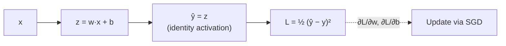
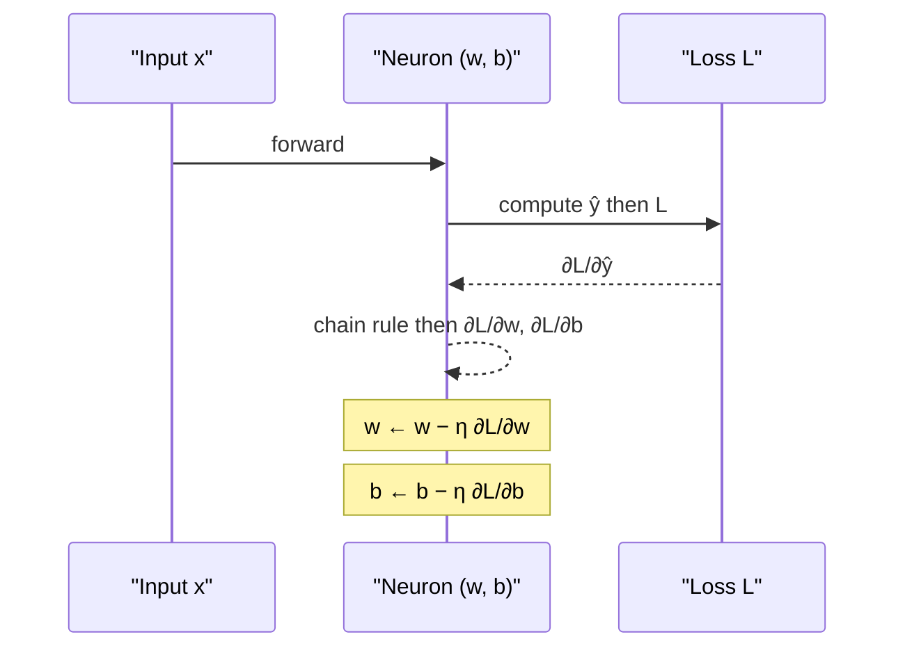

## Linear Neural Network for Regression

Big picture (no jargon)

The simplest possible neural network — **one neuron, identity activation, MSE loss** — is mathematically identical to **linear regression**. There's no new math here, but going through it carefully introduces every component you'll need for deep nets: **forward pass** (compute prediction), **loss** (measure error), **gradient** (find which way to nudge each parameter), **update** (take a small step in that direction). Even a 100-billion-parameter LLM trains using exactly this four-step recipe.

**Real-world analogy.** A thermostat takes a small action toward the target temperature, observes the result, then adjusts. The "learning rate" is how aggressively it adjusts: too much = overshoot and oscillate; too little = takes forever to reach target. SGD on a neural network is a thermostat for parameters.

### Vocabulary — every term, defined plainly

- **Linear NN for regression** — one neuron, identity activation $\varphi(z) = z$, real-valued output.
- **Forward pass** — compute the prediction $\hat y$ from input $\mathbf x$.
- **Loss** $L$ — scalar measure of how wrong one prediction is.
- **Cost** $J$ — average loss over a batch / dataset.
- **Mean Squared Error (MSE)** — the standard regression loss.
- **Gradient** — vector of partial derivatives of the loss wrt each parameter.
- **Backward pass** — computing those gradients via the chain rule.
- **(Stochastic) Gradient Descent (SGD)** — parameter update rule that moves opposite to the gradient.
- **Learning rate** $\eta$ — step size in SGD; the most important hyperparameter in deep learning.
- **Mini-batch** — a small subset of the training data (typically 32–256 samples) over which the gradient is averaged.
- **Epoch** — one full pass through the training set.
- **Identity activation** — $\varphi(z) = z$; no non-linearity. With this, an MLP collapses to a single linear layer.
- **Normal equation** — closed-form $\mathbf w^* = (X^\top X)^{-1} X^\top \mathbf y$ for linear regression. Possible here because the loss is convex quadratic.

### Picture it

### Build the idea — the model

$$
\hat y \;=\; \mathbf w^\top \mathbf x + b.
$$

This is one neuron with the identity activation $\varphi(z) = z$. Same model class as linear regression — but now we'll train it the **NN way** (gradient descent) rather than via the closed-form normal equation, so the recipe extends to deeper nets later.

### Build the idea — loss (MSE)

For one sample:

$$
L \;=\; \tfrac12 (\hat y - y)^2.
$$

For a batch of $n$:

$$
J \;=\; \frac{1}{2n}\sum_{i=1}^n (\hat y_i - y_i)^2.
$$

The factor of $\tfrac12$ is purely cosmetic — it cancels the 2 from the derivative.

### Build the idea — gradients

By the chain rule:

$$
\frac{\partial L}{\partial w_j} \;=\; \underbrace{(\hat y - y)}_{\partial L / \partial \hat y} \cdot \underbrace{x_j}_{\partial \hat y / \partial w_j}, \qquad
\frac{\partial L}{\partial b} \;=\; (\hat y - y).
$$

In vector form:

$$
\nabla_{\mathbf w}\, L \;=\; (\hat y - y)\, \mathbf x.
$$

### Build the idea — SGD update

$$
\mathbf w \;\leftarrow\; \mathbf w - \eta\, (\hat y - y)\, \mathbf x, \qquad b \;\leftarrow\; b - \eta\, (\hat y - y).
$$

Iterate over training samples until $J$ stops decreasing.

### Build the idea — mini-batch SGD

Compute the gradient on a batch of size $B$ (typically 32–256):

$$
\mathbf w \;\leftarrow\; \mathbf w - \frac{\eta}{B}\sum_{i \in \text{batch}} (\hat y_i - y_i)\, \mathbf x_i.
$$

Trade-off: $B$ small → noisy but fast updates that benefit from GPU parallelism less; $B$ large → smooth but expensive updates. Mini-batch is the standard.

### Forward → backward → update (one training step)

<dl class="symbols">
  <dt>$\mathbf w, b$</dt><dd>weights and bias of the neuron</dd>
  <dt>$\hat y$</dt><dd>prediction</dd>
  <dt>$y$</dt><dd>true target</dd>
  <dt>$L, J$</dt><dd>per-sample loss / batch cost</dd>
  <dt>$\eta$</dt><dd>learning rate</dd>
  <dt>$B$</dt><dd>mini-batch size</dd>
</dl>

### Worked example — fully expanded

Worked example: one full SGD step on a single sample

**Setup.** Single sample $x = 2$, $y = 5$. Initial parameters $w = 1$, $b = 0$. Learning rate $\eta = 0.1$.

**Step 1 — forward pass.**

$$
\hat y \;=\; w \cdot x + b \;=\; 1 \cdot 2 + 0 \;=\; 2.
$$

**Step 2 — loss.**

$$
L \;=\; \tfrac12 (2 - 5)^2 \;=\; \tfrac12 \cdot 9 \;=\; 4.5.
$$

**Step 3 — backward pass.** Error $e = \hat y - y = -3$.

$$
\frac{\partial L}{\partial w} \;=\; e \cdot x \;=\; -3 \cdot 2 \;=\; -6, \qquad
\frac{\partial L}{\partial b} \;=\; e \;=\; -3.
$$

**Step 4 — SGD update.**

$$
w \;\leftarrow\; 1 - 0.1 \cdot (-6) \;=\; 1 + 0.6 \;=\; 1.6, \qquad
b \;\leftarrow\; 0 - 0.1 \cdot (-3) \;=\; 0 + 0.3 \;=\; 0.3.
$$

**Step 5 — verify the loss decreased.** New forward:

$$
\hat y \;=\; 1.6 \cdot 2 + 0.3 \;=\; 3.5, \qquad L \;=\; \tfrac12 (3.5 - 5)^2 \;=\; \tfrac12 \cdot 2.25 \;=\; 1.125.
$$

Loss dropped from $4.5 \to 1.125$ — the step worked.

**Step 6 — what if we'd chosen $\eta$ too big?** Try $\eta = 1.0$:

$$
w \;\leftarrow\; 1 - 1.0 \cdot (-6) \;=\; 7, \qquad b \;\leftarrow\; 0 - 1.0 \cdot (-3) \;=\; 3.
$$

New forward: $\hat y = 7 \cdot 2 + 3 = 17$. New loss: $\tfrac12(17-5)^2 = 72$. **Worse than before** — we overshot.

**Step 7 — what if $\eta$ too small?** Try $\eta = 0.01$:

$$
w \;\leftarrow\; 1.06, \qquad b \;\leftarrow\; 0.03, \qquad \hat y \;=\; 2.15, \qquad L \;\approx\; 4.06.
$$

Improved, but barely — would take many steps to reach target.

**Take-away.** $\eta$ controls the step size. A "good" $\eta$ for this problem is around $0.05$–$0.2$.

### How to think about it

Mental model — gradient descent as a hiker on a foggy hillside

You're standing on a hillside in heavy fog and want to reach the bottom. You can't see far, but you *can* feel the slope under your feet. Strategy: take a small step in the steepest downhill direction, repeat. That's gradient descent. The slope under your feet is the **gradient** of the loss surface; the step size is the **learning rate** $\eta$.

For linear regression with MSE the loss surface is a perfect bowl (convex), so this strategy is guaranteed to reach the unique minimum. For deep nets the surface is full of saddle points, plateaus and ravines — but the same recipe still works astonishingly well in practice.

**When this comes up in ML.** Every NN training step in every framework (PyTorch, TensorFlow, JAX) is exactly this: forward → loss → backward → update. Mastering this small example means you understand the inner loop of all of deep learning.

Watch out — common traps

- **Learning rate is the most important hyperparameter.** Too big → divergence (loss explodes); too small → painfully slow training. Modern best practice: use a **learning-rate schedule** (warmup + cosine decay).
- **Without an activation function**, stacking layers gives you... a linear function. So a "linear NN" with multiple layers is **no more powerful** than a single neuron. Non-linearity is what makes depth worth it.
- **Always normalise inputs** (zero mean, unit variance). Gradient magnitudes scale with $\|\mathbf x\|$, so unscaled inputs blow up the effective learning rate of some weights and starve others.
- **MSE is sensitive to outliers** (squared penalty). For heavy-tailed targets, consider Huber loss.
- **The closed form** $\mathbf w^* = (X^\top X)^{-1} X^\top \mathbf y$ exists for linear regression — but it does *not* exist for deeper nets. Studying SGD here prepares you for the deep case.

Exam tip

Three guaranteed sub-questions: **(a) derive $\nabla_{\mathbf w} L$ from scratch** using the chain rule on $L = \tfrac12 (\mathbf w^\top \mathbf x + b - y)^2$; **(b) trace one full SGD step on a tiny example** (the $x=2, y=5$ scenario above is canonical); **(c) discuss the role of $\eta$** — too small → slow, too big → divergence. This module is the bedrock for backprop in deep networks (module 5).

