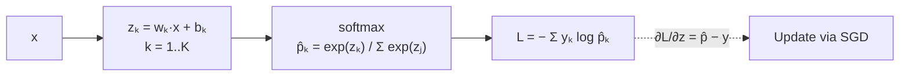

## Linear Neural Network for Classification

Big picture (no jargon)

Take the single-neuron regression model from the last module, swap the **identity activation** for **softmax** and the **MSE loss** for **cross-entropy**, and the same one-layer network becomes a multi-class classifier — i.e. **softmax regression** (a.k.a. multinomial logistic regression). Same backprop machinery, different *head*.

The punchline that matters most: the gradient at the logits is

$$
\frac{\partial L}{\partial z_k} \;=\; \hat p_k - y_k.
$$

Predicted minus true. **The cleanest formula in deep learning.** It's why softmax + cross-entropy is the universal multi-class output combo.

**Real-world analogy.** A weather forecaster gives probabilities for "sunny / cloudy / rainy". The reality is one of the three (one-hot). Cross-entropy says: "your loss is small if you put high probability on the actual outcome and big if you didn't". The gradient says: "increase the probability you assigned to today's actual weather, decrease the others — by exactly how wrong you were."

### Vocabulary — every term, defined plainly

- **Linear NN for classification** — one layer with $K$ output neurons, softmax activation, cross-entropy loss.
- **Logit $z_k$** — the pre-softmax score for class $k$: $z_k = \mathbf w_k^\top \mathbf x + b_k$.
- **Softmax** — multi-class output activation that turns logits into a probability distribution.
- **Cross-entropy (CE)** — the standard classification loss, equal to negative log-likelihood for the categorical distribution.
- **One-hot encoding** — target vector with 1 in the true-class slot and 0 elsewhere.
- **Categorical / multinomial distribution** — a single draw from $K$ classes.
- **Maximum Likelihood Estimation (MLE)** — pick parameters that maximise probability of observed data; cross-entropy is its negative log.
- **Numerical stability / log-sum-exp trick** — subtract the max logit before exponentiating to prevent overflow.
- **Sigmoid + Binary Cross-Entropy (BCE)** — the equivalent setup for $K=2$ classes; faster than 2-way softmax.

### Picture it

### Build the idea — softmax

For $K$ classes:

$$
\hat p_k \;=\; \frac{e^{z_k}}{\sum_{j=1}^K e^{z_j}}, \qquad \text{where } z_k = \mathbf w_k^\top \mathbf x + b_k.
$$

Output $\hat{\mathbf p} \in (0,1)^K$ with $\sum_k \hat p_k = 1$ — a valid probability distribution over the $K$ classes.

Properties:
- **Shift invariant.** Adding any constant $c$ to every logit leaves $\hat{\mathbf p}$ unchanged. Used for the log-sum-exp trick.
- **Differentiable** approximation to argmax.
- Reduces to **sigmoid** when $K = 2$ (set $z_2 = 0$).

### Build the idea — cross-entropy loss

For a one-hot target $\mathbf y$ ($y_k = 1$ if true class is $k$, else 0):

$$
L \;=\; -\sum_{k=1}^K y_k \log \hat p_k \;=\; -\log \hat p_{\text{true class}}.
$$

(Average over a batch.) Cross-entropy is the negative log-likelihood of the categorical distribution → MLE.

### Build the idea — the very clean gradient

By a couple of pages of algebra (chain rule + softmax derivative + $\log$ derivative):

$$
\boxed{\frac{\partial L}{\partial z_k} \;=\; \hat p_k - y_k.}
$$

That's it. Predicted minus true. The softmax + cross-entropy combination is engineered so the gradient at the logits collapses into this clean form — both numerically stable *and* trivially fast to compute.

By chain rule the parameter gradients are then:

$$
\frac{\partial L}{\partial \mathbf w_k} \;=\; (\hat p_k - y_k)\, \mathbf x, \qquad
\frac{\partial L}{\partial b_k} \;=\; \hat p_k - y_k.
$$

### Build the idea — why not just use MSE?

| Loss | Gradient at $\hat p$ wrt $z$ | Behaviour when very wrong |
|---|---|---|
| MSE | $(\hat p - y) \cdot \hat p (1 - \hat p)$ | Vanishes (factor $\hat p(1-\hat p)$) → slow learning |
| **Cross-entropy** | $\hat p - y$ | Strong gradient even when very wrong → fast learning |

Cross-entropy is also the **MLE** for the categorical distribution → principled choice on top of being practically faster.

### Build the idea — numerical stability (log-sum-exp)

Computing $e^{z_k}$ overflows for large $z_k$ ($e^{1000}$ is `inf`). Subtract the max:

$$
\log \sum_j e^{z_j} \;=\; c + \log \sum_j e^{z_j - c}, \qquad c = \max_j z_j.
$$

After subtraction every exponent is $\le 0$ and so $e^{z_j - c} \in (0, 1]$ — no overflow. PyTorch's `nn.CrossEntropyLoss` and TensorFlow's `tf.nn.softmax_cross_entropy_with_logits` handle this internally — which is why **you should pass them raw logits, not softmax output**.

<dl class="symbols">
  <dt>$z_k$</dt><dd>logit (pre-softmax score) for class $k$</dd>
  <dt>$\hat p_k$</dt><dd>predicted probability for class $k$</dd>
  <dt>$y_k$</dt><dd>indicator: 1 for the true class, 0 otherwise (one-hot)</dd>
  <dt>$K$</dt><dd>number of classes</dd>
  <dt>$\mathbf w_k$</dt><dd>weight vector for class $k$ (one row of the weight matrix)</dd>
</dl>

### Worked example — fully expanded

Worked example: softmax + cross-entropy on a 3-class instance

**Setup.** $K = 3$ classes. Logits $\mathbf z = (2.0, 1.0, 0.1)$. True class = 0, so $\mathbf y = (1, 0, 0)$.

**Step 1 — exponentiate.**

$$
e^{z_0} \approx 7.389, \quad e^{z_1} \approx 2.718, \quad e^{z_2} \approx 1.105. \qquad \sum_j e^{z_j} \approx 11.213.
$$

**Step 2 — softmax.**

$$
\hat p_0 \approx \frac{7.389}{11.213} \approx 0.659, \quad \hat p_1 \approx \frac{2.718}{11.213} \approx 0.242, \quad \hat p_2 \approx \frac{1.105}{11.213} \approx 0.099.
$$

Check: $0.659 + 0.242 + 0.099 = 1.000$ ✓

**Step 3 — cross-entropy loss.**

$$
L \;=\; -\log \hat p_{\text{true}} \;=\; -\log 0.659 \;\approx\; 0.417.
$$

**Step 4 — gradient at logits.**

$$
\frac{\partial L}{\partial \mathbf z} \;=\; \hat{\mathbf p} - \mathbf y \;\approx\; (0.659 - 1,\; 0.242 - 0,\; 0.099 - 0) \;=\; (-0.341,\; 0.242,\; 0.099).
$$

**Interpretation.** The gradient is *negative* on $z_0$ → SGD will *increase* $z_0$ (the true class score). The gradient is *positive* on $z_1, z_2$ → SGD will *decrease* those scores. The next forward pass will produce a higher $\hat p_0$. Magnitude exactly equals "how wrong" we were on each class.

**Step 5 — log-sum-exp stability check.** Try $\mathbf z = (1002, 1001, 1000.1)$ — same shape, but huge offset. Naïve: $e^{1002}$ overflows. Trick: subtract $c = 1002$ → $\mathbf z - c = (0, -1, -1.9)$, $e^{\cdot} \approx (1, 0.368, 0.150)$, sum $\approx 1.518$, $\hat{\mathbf p} \approx (0.659, 0.242, 0.099)$ — same answer, no overflow.

### How to think about it

Mental model — softmax is "differentiable argmax", cross-entropy is "negative log-confidence in the right answer"

- **Softmax**: turns arbitrary scores into a probability distribution by exponentiating (positive numbers) then normalising (sum to 1). The gap between the largest and second-largest logit determines how "peaked" the distribution is.
- **Cross-entropy**: a single number measuring "how surprised was I by the truth?" If the model was 99 % confident in the right answer, $-\log 0.99 \approx 0.01$ (tiny loss). If it gave only 1 % to the right answer, $-\log 0.01 \approx 4.6$ (huge loss).
- **Together** they're the engineered pair: gradient is just predicted minus true, no slow regions, numerically stable.

**When this comes up in ML.** This is the output layer of every multi-class classifier you'll ever build — image classification, language model next-token prediction, medical diagnosis, sentiment classification. **It is the most-used pair of equations in modern deep learning.**

Watch out — common traps

- **Don't apply softmax twice** (once in your model, again inside `CrossEntropyLoss`). Most frameworks expect raw logits — passing them softmaxed gives wrong gradients and a silently broken model.
- **For binary classification use sigmoid + BCE**, not 2-class softmax + CE. They're mathematically equivalent but the binary form is faster and saves a parameter.
- **Numerical stability**: never compute $e^{z_k} / \sum_j e^{z_j}$ naïvely with large logits. Always use log-sum-exp.
- **Cross-entropy assumes one-hot targets** (or soft targets summing to 1). Don't pass it raw class indices unless using a framework function that expects them.
- **Class imbalance**: cross-entropy treats every sample equally → rare classes get under-trained. Fix with class weights or focal loss.
- **Softmax temperature** $T$ ($\hat p_k \propto e^{z_k / T}$) controls "peakedness" — lower $T$ → sharper distribution. Used in knowledge distillation and language model sampling.

Exam tip

Three guaranteed sub-questions: **(a) memorise** the punchline $\partial L / \partial z = \hat{\mathbf p} - \mathbf y$ and **derive it** (softmax derivative is $\partial \hat p_i / \partial z_j = \hat p_i (\delta_{ij} - \hat p_j)$; combine with $\partial L / \partial \hat p_k = -y_k / \hat p_k$); **(b) compute softmax + cross-entropy + gradient on a 3-class numerical example** (the $\mathbf z = (2, 1, 0.1)$ scenario is canonical); **(c) explain why CE beats MSE for classification** — strong gradient when very wrong, no $\hat p (1-\hat p)$ vanishing factor, plus principled MLE justification.

