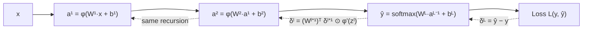

## Deep Feedforward Networks (MLPs) & Backpropagation

Big picture (no jargon)

A **multi-layer perceptron (MLP)** stacks linear layers with non-linear activations to form a **universal function approximator**. **Backpropagation** is the algorithm that computes gradients for *all* parameters in $\mathcal O(\text{forward cost})$ time by applying the chain rule **layer by layer, starting from the output**. Without backprop, training deep nets would be computationally hopeless. With it, a 100-billion-parameter model can be updated in milliseconds per step.

The key idea: rather than re-deriving "the gradient of the loss wrt some weight buried 50 layers deep" from scratch, you propagate an **error signal** $\boldsymbol\delta^{(\ell)}$ backward through the network — each layer turns the next layer's $\boldsymbol\delta$ into its own $\boldsymbol\delta$ via a tiny chain-rule formula. Cache forward activations on the way in; use them to compute gradients on the way out.

**Real-world analogy.** Imagine a factory assembly line where every station added a small change. The final product fails inspection. To assign blame, the inspector walks backward down the line: at each station they ask "given the defect coming back from the next station, how much of it is this station's fault, and how should this station adjust?" The backward walk is backprop; each station updates its own controls based on the local blame signal.

### Vocabulary — every term, defined plainly

- **MLP (Multi-Layer Perceptron)** — feedforward network of fully-connected (dense) layers with non-linear activations.
- **Feedforward** — information flows in one direction, input → output, no cycles. (RNNs are the opposite.)
- **Hidden layer** — any layer between input and output.
- **Layer index $\ell$** — 1, …, $L$ where $L$ is the output layer.
- **Pre-activation $\mathbf z^{(\ell)}$** — the linear combination $W^{(\ell)} \mathbf a^{(\ell-1)} + \mathbf b^{(\ell)}$.
- **Activation $\mathbf a^{(\ell)}$** — the post-non-linearity output: $\varphi(\mathbf z^{(\ell)})$.
- **Error signal $\boldsymbol\delta^{(\ell)}$** — gradient of loss wrt pre-activation: $\partial L / \partial \mathbf z^{(\ell)}$.
- **Forward pass** — compute all $\mathbf z^{(\ell)}, \mathbf a^{(\ell)}$ and the loss.
- **Backward pass** — compute all $\boldsymbol\delta^{(\ell)}$ and parameter gradients.
- **Chain rule** — $\frac{dL}{dx} = \frac{dL}{dy} \cdot \frac{dy}{dx}$; backprop is the chain rule applied recursively.
- **Computational graph** — DAG representing the network as a sequence of differentiable ops.
- **Autograd / autodiff** — automatic differentiation framework that builds the computational graph and runs backprop for you (PyTorch, JAX, TensorFlow).
- **Hadamard / element-wise product $\odot$** — multiply two vectors / matrices element by element.
- **Universal Approximation Theorem** — a single hidden layer with sufficient width can approximate any continuous function on a compact set.
- **Vanishing gradient** — gradients shrink layer by layer in deep nets with saturating activations → upstream weights barely update.
- **Exploding gradient** — opposite: gradients blow up (large weights, no normalisation).
- **Xavier / Glorot init**, **He / Kaiming init** — variance-preserving weight initialisations for tanh / ReLU respectively.

### Picture it — forward and backward

### Build the idea — forward pass

For layers $\ell = 1, \dots, L$:

$$
\mathbf z^{(\ell)} \;=\; W^{(\ell)}\, \mathbf a^{(\ell-1)} + \mathbf b^{(\ell)}, \qquad
\mathbf a^{(\ell)} \;=\; \varphi\!\left(\mathbf z^{(\ell)}\right),
$$

with $\mathbf a^{(0)} = \mathbf x$ and $\mathbf a^{(L)} = \hat{\mathbf y}$ (often softmax for classification, identity for regression).

**Cache** every $\mathbf a^{(\ell-1)}$ and $\mathbf z^{(\ell)}$ — the backward pass needs them.

### Build the idea — backward pass (chain rule)

Define the error signal:

$$
\boldsymbol\delta^{(\ell)} \;=\; \frac{\partial L}{\partial \mathbf z^{(\ell)}}.
$$

**Output layer (softmax + cross-entropy):**

$$
\boldsymbol\delta^{(L)} \;=\; \hat{\mathbf y} - \mathbf y.
$$

(For MSE + identity output: $\boldsymbol\delta^{(L)} = \hat{\mathbf y} - \mathbf y$ as well — coincidence of the same formula!)

**Recursion** (layers $\ell = L-1, \dots, 1$):

$$
\boxed{\boldsymbol\delta^{(\ell)} \;=\; \left(W^{(\ell+1)}\right)^\top\, \boldsymbol\delta^{(\ell+1)} \;\odot\; \varphi'\!\left(\mathbf z^{(\ell)}\right).}
$$

Read it as: "send the next layer's error signal back through the next layer's weights, then *gate* it by the local activation derivative".

**Parameter gradients** at every layer:

$$
\frac{\partial L}{\partial W^{(\ell)}} \;=\; \boldsymbol\delta^{(\ell)} \left(\mathbf a^{(\ell-1)}\right)^\top, \qquad
\frac{\partial L}{\partial \mathbf b^{(\ell)}} \;=\; \boldsymbol\delta^{(\ell)}.
$$

Then SGD update: $W^{(\ell)} \leftarrow W^{(\ell)} - \eta\, \partial L / \partial W^{(\ell)}$, etc.

### Build the idea — Universal Approximation Theorem (informal)

**Theorem (Cybenko 1989, Hornik 1991).** A feedforward network with **a single** hidden layer of sufficient width and a non-polynomial activation can approximate any continuous function on a compact subset of $\mathbb R^d$ to arbitrary accuracy.

**Caveat 1.** Width may need to be **exponential** in input dimension for hard functions.

**Caveat 2.** The theorem is purely existential — it tells you *some* network exists, not how to *find* it.

**Why depth helps.** Deep networks can express the same functions with far fewer total neurons than shallow ones. Empirically, training **deeper** nets tends to be easier and to generalise better than training **wider** ones.

### Build the idea — why we use ReLU

| Activation | $\varphi'(z)$ | Vanishing gradient? |
|---|---|---|
| Sigmoid | $\sigma(z)(1-\sigma(z)) \le 0.25$ | Severe at $|z|$ large |
| tanh | $1 - \tanh^2 z \le 1$ | Same |
| **ReLU** | $\mathbf 1\{z > 0\}$ — i.e. 0 or 1 | Half-fixed: gradient $=1$ for active neurons |

In a deep net, the chain rule multiplies $\varphi'$ at every layer. Sigmoid's $\le 0.25$ → after 10 layers, gradient shrinks by $\le 4^{-10} \approx 10^{-6}$ → vanishing. ReLU's positive half has $\varphi' = 1$ → no shrinkage, gradient flows freely.

### Build the idea — initialisation matters

- **Xavier / Glorot** (for tanh / sigmoid): $W \sim \mathcal N(0, 2/(n_\text{in} + n_\text{out}))$.
- **He / Kaiming** (for ReLU): $W \sim \mathcal N(0, 2/n_\text{in})$.
- **All-zeros init** = symmetry → all neurons learn the same thing → useless. Always break symmetry with random init.
- **Bad init** → activations / gradients explode or vanish on the very first forward pass, before any learning happens.

<dl class="symbols">
  <dt>$L$</dt><dd>number of layers (or scalar loss — context decides)</dd>
  <dt>$W^{(\ell)}, \mathbf b^{(\ell)}$</dt><dd>weights and biases of layer $\ell$</dd>
  <dt>$\mathbf z^{(\ell)}$</dt><dd>pre-activation at layer $\ell$</dd>
  <dt>$\mathbf a^{(\ell)}$</dt><dd>post-activation at layer $\ell$ (so $\mathbf a^{(0)} = \mathbf x$, $\mathbf a^{(L)} = \hat{\mathbf y}$)</dd>
  <dt>$\boldsymbol\delta^{(\ell)}$</dt><dd>error signal: $\partial L / \partial \mathbf z^{(\ell)}$</dd>
  <dt>$\odot$</dt><dd>Hadamard (element-wise) product</dd>
  <dt>$\varphi'$</dt><dd>derivative of the activation</dd>
</dl>

### Worked example — fully expanded

Worked example: backprop through a tiny 2-layer MLP

**Architecture.** 2-input, 1-hidden-unit, 1-output regression net with ReLU hidden activation, identity output, MSE loss.

**Parameters.** $W^{(1)} = (1, 2)$ (row vector, so hidden unit), $b^{(1)} = 0$, $W^{(2)} = 3$ (scalar), $b^{(2)} = 0$.

**Sample.** $\mathbf x = (1, 1)$, target $y = 10$.

**Step 1 — forward, layer 1.**

$$
z^{(1)} \;=\; 1 \cdot 1 + 2 \cdot 1 + 0 \;=\; 3, \qquad a^{(1)} \;=\; \mathrm{ReLU}(3) \;=\; 3.
$$

**Step 2 — forward, layer 2 (output).**

$$
z^{(2)} \;=\; 3 \cdot 3 + 0 \;=\; 9, \qquad \hat y \;=\; z^{(2)} \;=\; 9.
$$

**Step 3 — loss.**

$$
L \;=\; \tfrac12 (\hat y - y)^2 \;=\; \tfrac12 (9 - 10)^2 \;=\; 0.5.
$$

**Step 4 — backward, layer 2.**

$$
\delta^{(2)} \;=\; \frac{\partial L}{\partial z^{(2)}} \;=\; \hat y - y \;=\; -1.
$$

Parameter grads at layer 2:

$$
\frac{\partial L}{\partial W^{(2)}} \;=\; \delta^{(2)} \cdot a^{(1)} \;=\; -1 \cdot 3 \;=\; -3, \qquad
\frac{\partial L}{\partial b^{(2)}} \;=\; \delta^{(2)} \;=\; -1.
$$

**Step 5 — backward, layer 1 (recursion).**

$\varphi' = \mathrm{ReLU}'(z^{(1)}) = \mathbf 1\{z^{(1)} > 0\} = \mathbf 1\{3 > 0\} = 1$.

$$
\delta^{(1)} \;=\; \left(W^{(2)}\right)^\top \delta^{(2)} \odot \varphi'(z^{(1)}) \;=\; 3 \cdot (-1) \cdot 1 \;=\; -3.
$$

Parameter grads at layer 1:

$$
\frac{\partial L}{\partial W^{(1)}} \;=\; \delta^{(1)}\, \mathbf x^\top \;=\; -3 \cdot (1, 1) \;=\; (-3, -3), \qquad
\frac{\partial L}{\partial b^{(1)}} \;=\; \delta^{(1)} \;=\; -3.
$$

**Step 6 — SGD update with $\eta = 0.05$.**

$$
W^{(2)} \leftarrow 3 - 0.05 \cdot (-3) \;=\; 3.15, \qquad b^{(2)} \leftarrow 0 - 0.05 \cdot (-1) \;=\; 0.05,
$$

$$
W^{(1)} \leftarrow (1, 2) - 0.05 \cdot (-3, -3) \;=\; (1.15, 2.15), \qquad b^{(1)} \leftarrow 0 - 0.05 \cdot (-3) \;=\; 0.15.
$$

**Step 7 — verify loss decreased.** New forward:

$$
z^{(1)} = 1.15 + 2.15 + 0.15 = 3.45, \quad a^{(1)} = 3.45, \quad \hat y = 3.15 \cdot 3.45 + 0.05 = 10.92, \quad L = \tfrac12 (10.92 - 10)^2 \approx 0.42.
$$

Loss dropped from $0.5 \to 0.42$ — backprop step worked. (A second iteration with the same $\eta$ would keep it improving.)

### How to think about it

Mental model — backprop is the chain rule applied recursively, with caching

Two things make backprop work:

1. **Recursion.** $\boldsymbol\delta^{(\ell)}$ is computed from $\boldsymbol\delta^{(\ell+1)}$ — you only need the *next* layer's error signal, not all subsequent ones. So one pass forward + one pass backward gives gradients for *every* parameter in time linear in the network size.

2. **Caching.** Backward needs the cached $\mathbf a^{(\ell-1)}$ and $\mathbf z^{(\ell)}$ — that's why training a deep net's *memory* cost grows with depth (you store activations for the backward pass), even though *compute* is just 2× the forward cost.

Modern frameworks (PyTorch, JAX, TF) build the **computational graph** dynamically (or statically) and run backprop automatically — you write only the forward pass; **autograd** handles the rest. But understanding the math means you can debug shape mismatches, add custom layers, and know why your gradients are vanishing / exploding.

**When this comes up in ML.** Every single training step of every neural network — CNNs, RNNs, Transformers, GANs, diffusion models. Backprop is the universal workhorse. Knowing it cold is non-negotiable.

Watch out — common traps

- **Without non-linearity**, an MLP is just a single linear layer. Stacked matrices compose into one matrix. The activation function is *not* optional.
- **Bad init** → activations or gradients explode or vanish on the very first forward pass. Use **He init for ReLU**, **Xavier for tanh / sigmoid**.
- **Backprop does NOT find the global optimum** — only a local one. In practice, local optima of overparameterised deep nets are usually good enough (loss landscape is "benign" empirically).
- **Vanishing gradient** in deep nets with sigmoid / tanh — switch to ReLU, add **batch norm**, use **residual connections** (ResNet).
- **Exploding gradient** — clip gradients (`torch.nn.utils.clip_grad_norm_`), reduce learning rate, normalise.
- **Don't forget to zero gradients** between SGD steps in PyTorch (`optimizer.zero_grad()`). Otherwise gradients accumulate.
- **Memory** is the practical bottleneck for very deep nets — you cache activations for the backward pass. Techniques: **gradient checkpointing** (recompute activations on the way back), **mixed-precision training**.
- **Overflow / underflow** in the loss → use stable formulations (log-sum-exp, framework `CrossEntropyLoss` on raw logits).

Exam tip

Three guaranteed sub-questions: **(a) write the forward and backward equations symbolically with shapes** ($\boldsymbol\delta^{(\ell)} = (W^{(\ell+1)})^\top \boldsymbol\delta^{(\ell+1)} \odot \varphi'(\mathbf z^{(\ell)})$, $\partial L / \partial W^{(\ell)} = \boldsymbol\delta^{(\ell)} (\mathbf a^{(\ell-1)})^\top$); **(b) trace backprop on a tiny 2-layer numerical example** (the one above is canonical); **(c) explain the vanishing gradient problem** by tracking $\boldsymbol\delta^{(\ell)}$ through deep sigmoid layers and how ReLU + He init + batch norm + residual connections each help. State the **Universal Approximation Theorem** and its caveats.

