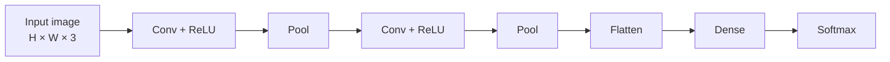
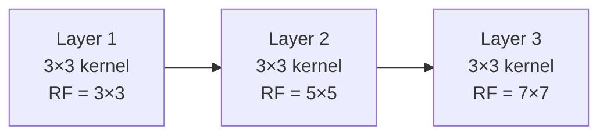

## Convolutional Neural Networks (CNNs)

Big picture (no jargon)

A fully-connected layer applied to a 224×224 RGB image has 150 528 inputs per neuron — wasteful, parameter-heavy, and ignores the obvious fact that **nearby pixels are related** while far-away pixels usually aren't. **Convolutional Neural Networks (CNNs)** bake in two priors that match natural images:

1. **Locality** — useful features (an edge, a corner, an eye) are local; you don't need the whole image to spot them.
2. **Translation invariance** — a cat in the top-left is still a cat in the bottom-right; the same detector should work everywhere.

CNNs implement both with **shared, local filters** (small weight matrices) **convolved (slid) across the image**. Same handful of weights, applied at every spatial location → drastically fewer parameters, and the model automatically detects the same feature wherever it appears.

**Real-world analogy.** Looking for typos on a printed page: you slide your eyes across, applying the same "is this a typo?" check at each location. You don't need a separate, position-specific typo-detector for the top-left vs the bottom-right of the page. Your eye-brain system uses **one shared detector slid across all positions** — exactly what a conv filter does.

### Vocabulary — every term, defined plainly

- **CNN (Convolutional Neural Network)** — neural network that uses convolution instead of full connectivity in (most of) its layers.
- **Filter / kernel $K$** — small weight matrix (typically 3×3 or 5×5) slid across the input.
- **Channel** — depth dimension of a feature map (RGB image = 3 input channels).
- **Feature map** — output of one filter applied across all positions.
- **Convolution (in DL)** — technically *cross-correlation* (no kernel flip), but universally called convolution.
- **Stride $s$** — step size of the slide; $s=2$ halves spatial size.
- **Padding $p$** — zeros added around the border so the output keeps a target spatial size. "Same" padding $p = (k-1)/2$ keeps spatial size when $s = 1$.
- **Receptive field** — the input region a deep-layer neuron "sees".
- **Pooling** — non-learnable spatial downsampling (max or average).
- **Max pool** — output is the max in each $k \times k$ window.
- **Global average pool (GAP)** — average across all spatial positions → one number per channel; replaces final FC layer.
- **Sparse connectivity** — each output neuron sees only a small input window.
- **Parameter sharing / weight tying** — the same filter weights are used at every spatial position.
- **Translation equivariance** — shift the input by $\Delta$, the feature map shifts by $\Delta$. Combined with global pooling → translation invariance.
- **Strided conv** — convolution with stride > 1; alternative to pooling that is *learnable*.
- **1×1 conv** — convolution with a 1×1 kernel; mixes channels per pixel; "MLP applied per spatial location".

### Picture it — typical CNN architecture

### Build the idea — the convolution operation

For input $X$ ($H \times W$, single channel) and kernel $K$ ($k \times k$):

$$
Y[i, j] \;=\; \sum_{u=0}^{k-1} \sum_{v=0}^{k-1} K[u, v] \cdot X[i + u,\, j + v].
$$

For multi-channel input ($C_\text{in}$ channels) producing $C_\text{out}$ feature maps, each output channel uses its own kernel of shape $k \times k \times C_\text{in}$:

$$
Y_o[i, j] \;=\; \sum_{c=1}^{C_\text{in}} \sum_{u=0}^{k-1} \sum_{v=0}^{k-1} K_o[u, v, c] \cdot X[i+u, j+v, c] \;+\; b_o.
$$

### Build the idea — output spatial size

$$
H_\text{out} \;=\; \left\lfloor \frac{H + 2p - k}{s} \right\rfloor + 1,
$$

with padding $p$ and stride $s$ (analogous formula for $W$).

| Param | Effect |
|---|---|
| Kernel size $k$ | Receptive field; bigger = more context, more params |
| Stride $s$ | $s > 1$ downsamples spatial dims |
| Padding $p$ | "Same" padding $p = (k-1)/2$ keeps spatial size with $s = 1$ |
| Channels $C_\text{in}, C_\text{out}$ | Depth of feature maps |

### Build the idea — parameter count for one conv layer

$$
\#\text{params} \;=\; (k \cdot k \cdot C_\text{in} + 1) \cdot C_\text{out},
$$

(the $+1$ is the bias). Example: a 3×3 kernel from 64 → 128 channels:

$$
(3 \cdot 3 \cdot 64 + 1) \cdot 128 \;=\; 73\,856.
$$

Compare to a fully-connected layer between two 56×56×64 feature maps:

$$
(56 \cdot 56 \cdot 64) \cdot (56 \cdot 56 \cdot 64) \;\approx\; 4 \times 10^{10}.
$$

**Conv is $5 \times 10^5$× cheaper** in parameters — that's the punchline.

### Build the idea — pooling

Reduce spatial size and inject some translation invariance.

| Pool | Operation |
|---|---|
| **Max pool** | $\max$ in each $k \times k$ window — keeps strongest activation |
| **Avg pool** | mean in each window — smoother |
| **Global avg pool** | one number per channel — replaces final FC; reduces overfitting and parameter count |

Pooling has **no learnable parameters**.

### Build the idea — receptive field grows with depth

Stacking small (3×3) kernels is preferred over a single large (7×7) kernel: same receptive field, **fewer parameters**, **more non-linearities** between them. (VGG was the architecture that popularised this design rule.)

### Build the idea — why CNNs work for images

1. **Sparse connectivity** — each output sees only a small input window.
2. **Parameter sharing** — same filter slid everywhere → translation equivariance + few params.
3. **Hierarchical features** — early layers learn edges, then textures, then parts, then objects.

<dl class="symbols">
  <dt>$X, Y$</dt><dd>input feature map / output feature map</dd>
  <dt>$K$</dt><dd>convolution kernel (filter)</dd>
  <dt>$k$</dt><dd>kernel spatial size (e.g. 3 for 3×3)</dd>
  <dt>$s$</dt><dd>stride</dd>
  <dt>$p$</dt><dd>padding</dd>
  <dt>$C_\text{in}, C_\text{out}$</dt><dd>input / output channels</dd>
</dl>

### Worked example — fully expanded

Worked example: 2×2 convolution on a 3×3 input

**Setup.** Input $X$ (3×3, single channel), kernel $K$ (2×2), stride $s = 1$, no padding ($p = 0$).

$$
X = \begin{pmatrix} 1 & 2 & 3 \\ 4 & 5 & 6 \\ 7 & 8 & 9 \end{pmatrix}, \qquad K = \begin{pmatrix} 1 & 0 \\ 0 & -1 \end{pmatrix}.
$$

**Step 1 — output spatial size.**

$$
H_\text{out} \;=\; \lfloor (3 + 0 - 2) / 1 \rfloor + 1 \;=\; 2.
$$

So $Y$ is 2×2.

**Step 2 — slide the kernel and compute each output.**

Position $(0, 0)$: window is $\begin{pmatrix} 1 & 2 \\ 4 & 5 \end{pmatrix}$. Element-wise multiply with $K$ then sum:

$$
Y[0, 0] \;=\; 1 \cdot 1 + 2 \cdot 0 + 4 \cdot 0 + 5 \cdot (-1) \;=\; 1 - 5 \;=\; -4.
$$

Position $(0, 1)$: window $\begin{pmatrix} 2 & 3 \\ 5 & 6 \end{pmatrix}$:

$$
Y[0, 1] \;=\; 2 \cdot 1 + 3 \cdot 0 + 5 \cdot 0 + 6 \cdot (-1) \;=\; 2 - 6 \;=\; -4.
$$

Position $(1, 0)$: window $\begin{pmatrix} 4 & 5 \\ 7 & 8 \end{pmatrix}$:

$$
Y[1, 0] \;=\; 4 - 8 \;=\; -4.
$$

Position $(1, 1)$: window $\begin{pmatrix} 5 & 6 \\ 8 & 9 \end{pmatrix}$:

$$
Y[1, 1] \;=\; 5 - 9 \;=\; -4.
$$

**Step 3 — interpret.**

$$
Y \;=\; \begin{pmatrix} -4 & -4 \\ -4 & -4 \end{pmatrix}.
$$

The kernel computes "top-left minus bottom-right" of each 2×2 patch. Since this input increases uniformly along the diagonal, every patch has the same diagonal difference → same output.

**Step 4 — try strided.** Same setup but $s = 2$:

$$
H_\text{out} \;=\; \lfloor (3 + 0 - 2) / 2 \rfloor + 1 \;=\; 1.
$$

Output is 1×1: only the top-left window fits, $Y = (-4)$.

**Step 5 — try padding.** Same kernel, $s = 1$, $p = 1$:

$$
H_\text{out} \;=\; \lfloor (3 + 2 - 2) / 1 \rfloor + 1 \;=\; 4.
$$

Output is 4×4 — bigger than input.

### How to think about it

Mental model — a conv filter is a learnable template matcher

A conv filter is a small **template** (e.g. "vertical edge", "small green blob"); the output value at each location is **how strongly that template matches the input at that location**. By learning many filters in parallel (typically 32–512 per layer), the network builds a vocabulary of visual concepts — and by stacking layers, simple concepts (edges) get composed into complex ones (eyes → faces → people).

**Pooling** then makes the vocabulary slightly position-tolerant: "I detected a strong vertical edge *somewhere* in this 2×2 patch" is more useful than "I detected a vertical edge at exactly pixel (12, 7)".

**When this comes up in ML.** Every image classifier (ResNet, VGG, EfficientNet), every object detector (YOLO, Faster R-CNN), every segmentation model (U-Net, DeepLab), every diffusion model (Stable Diffusion's UNet backbone), most speech models (1-D conv on spectrograms). Even **Vision Transformers**, which famously *replace* the conv backbone, still use convolutions in the patch-embedding step. Knowing CNNs cold is non-negotiable for vision work.

Watch out — common traps

- **"Conv" in deep learning is technically cross-correlation** — kernel is NOT flipped (unlike signal-processing convolution). The framework doesn't care which name you use, but theory papers may.
- **Strided conv vs pool**: both downsample, but strided conv is *learnable* — modern nets often replace pooling with strided conv (ResNet does this).
- **Output size formula trips up many.** Practise with $k = 3, s = 2, p = 1$ until automatic. Common bug: mistakenly applying the formula to channels.
- **Dimension mismatch with batches.** PyTorch tensor shape is $(N, C, H, W)$ — batch first, channels second. TF/Keras is $(N, H, W, C)$. Don't mix them.
- **Big kernels are wasteful.** Two 3×3 kernels stacked have the same RF as one 5×5 but $2(3 \cdot 3) = 18$ params per channel pair vs $25$ — and add an extra non-linearity. Modern nets default to 3×3.
- **Pooling discards information.** For tasks needing precise localisation (segmentation, detection), use strided conv or dilated conv instead, or recover detail with skip connections (U-Net).
- **The first conv often uses a larger kernel** (e.g. 7×7 in ResNet) to quickly grow the receptive field on the high-res input.

Exam tip

Three guaranteed sub-questions: **(a) compute output spatial dims** given $H, k, s, p$ — practise until the formula $\lfloor (H + 2p - k)/s \rfloor + 1$ is automatic; **(b) compute the parameter count** of a conv layer — formula $(k \cdot k \cdot C_\text{in} + 1) \cdot C_\text{out}$; **(c) explain weight sharing and translation equivariance** in one sentence each — and contrast with a fully-connected layer's parameter cost.

