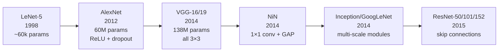
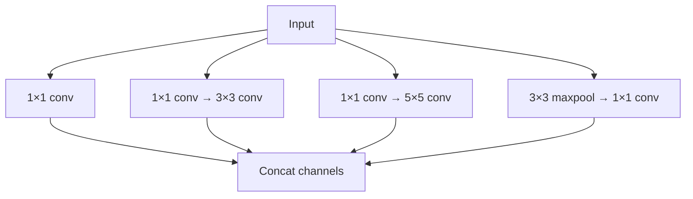
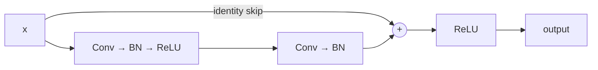

## Deep CNN Architectures (LeNet → AlexNet → VGG → NiN → Inception → ResNet)

Big picture (no jargon)

Each landmark CNN architecture solved a specific limitation of its predecessor. **AlexNet** (2012) proved deep CNNs could crush hand-engineered features on ImageNet, kicking off the deep-learning revolution. **VGG** showed that depth + small kernels matter. **NiN** introduced the 1×1 conv (channel mixing). **Inception/GoogLeNet** went wide *and* multi-scale per layer. **ResNet** (2015) broke the 100-layer barrier by adding **skip connections** — the most important architectural idea after the convolution itself.

Reading these architectures in order is reading the **historical conversation** of how the deep-learning community solved one problem at a time.

**Real-world analogy.** Building taller skyscrapers: each generation needed a new structural innovation. Steel frame → reinforced concrete → tuned mass dampers → tubular structures. Each unlocked a new height regime. CNN architectures are the same — each unlocked a new "depth regime" with a key engineering trick.

### Vocabulary — every term, defined plainly

- **LeNet-5** (LeCun, 1998) — 5-layer CNN for digit recognition; the first practical CNN.
- **AlexNet** (Krizhevsky, 2012) — 8-layer CNN; first to use ReLU + dropout + GPU training at scale; won ImageNet 2012.
- **VGG-16/19** (Simonyan & Zisserman, 2014) — 16/19 layers of all 3×3 convs; uniform, deep, parameter-heavy (138M).
- **NiN (Network-in-Network)** (Lin, 2014) — popularised **1×1 conv** and **global average pooling**.
- **Inception / GoogLeNet** (Szegedy, 2014) — 22 layers, multi-scale "Inception modules", only 6.8M params.
- **ResNet** (He, 2015) — residual blocks with **identity skip connections**; trained 152+ layer networks; below-human ImageNet error.
- **1×1 convolution** — kernel of size 1×1; mixes channels per pixel; cheap channel-count change; per-pixel non-linearity.
- **Global Average Pooling (GAP)** — average over all spatial positions per channel → one vector → linear classifier; replaces giant FC head.
- **Inception module** — multiple kernel sizes (1×1, 3×3, 5×5) + pool, all in parallel, then concatenate channels.
- **Residual block** — output = $F(\mathbf x) + \mathbf x$; the conv path learns the *change* on top of identity.
- **Skip / shortcut connection** — direct path from block input to block output; provides a "gradient highway".
- **Degradation problem** — past ~20 layers, plain CNNs' *training* error gets *worse* with depth (not overfitting — optimisation difficulty).
- **Top-5 error** — fraction of test images where the true class is *not* in the model's top-5 predictions.
- **DenseNet, EfficientNet, ConvNeXt** — modern descendants building on residual learning.

### Picture it — the architecture timeline

### Build the idea — AlexNet (Krizhevsky 2012), the breakthrough

- **8 layers**: 5 conv + 3 fully-connected.
- **First** to use **ReLU** at scale (vs. tanh/sigmoid) → much faster training, no vanishing gradients.
- **Dropout** in FC layers (then-novel regulariser).
- **Data augmentation**: random crops, horizontal flips, colour jitter.
- Trained on **2 GPUs** (NVIDIA GTX 580, 3 GB each), splitting the network across them.
- **Won ImageNet 2012** with top-5 error 15.3 % vs. previous winner 26.2 % — a *catastrophic* gap that proved deep CNNs were the future.

### Build the idea — VGG (2014), go deeper, all 3×3

- **16 or 19 layers**, only **3×3 conv** + **2×2 max pool**.
- Insight: **stack small filters** instead of using big ones. Two 3×3 convs ≈ one 5×5 receptive field, but with **fewer parameters** and **more ReLUs** (more non-linearity).
- Architecture is uniform → easy to implement, easy to scale.
- **138M parameters** (almost all in the final FC layers) → memory-heavy. Often replaced FC with GAP in practice.

### Build the idea — Network-in-Network (NiN), the 1×1 conv

A **1×1 convolution** mixes channels at one spatial location — equivalent to an MLP applied per pixel. Used to:

1. **Change channel count cheaply** (e.g. 256 → 64 to save downstream compute).
2. **Add a per-pixel non-linearity** in between bigger convs.
3. **Replace big FC heads with Global Average Pooling** → one number per channel → linear classifier. Drastically reduces parameters.

The 1×1 conv looks trivial but unlocked Inception and ResNet — both lean heavily on it.

### Build the idea — Inception / GoogLeNet (2014), multi-scale modules

- Each Inception block runs **multiple kernel sizes in parallel** and concatenates → the network can capture features at multiple scales without choosing in advance.
- **1×1 convs reduce channels before** the expensive 3×3 / 5×5 → enormous compute savings.
- **22 layers, only ~6.8M params** (vs VGG's 138M) — **20× fewer parameters**, similar accuracy.

### Build the idea — ResNet (He et al. 2015), skip connections

**The deep network problem.** As depth grows past ~20 layers, plain CNNs' *training* error gets *worse* — this is **degradation**, not overfitting (test error tracks training error). The optimisation problem of "learning the identity through several non-linear layers" turns out to be hard for SGD.

**ResNet's fix — residual block:**

Each block learns a **residual** $F(\mathbf x)$ and outputs $F(\mathbf x) + \mathbf x$. If the optimal layer transformation is the identity, the network simply sets $F = 0$ — far easier than learning identity through several non-linear layers. **Adding more blocks can never *hurt*** (in principle), only help.

**Result:** 152-layer networks train cleanly. **ResNet-152 won ImageNet 2015** with 3.6 % top-5 error — *below* the human ~5 % baseline.

**Bonus:** the skip provides a **gradient highway** — gradients can flow back from the loss to early layers without being attenuated layer by layer (mitigates vanishing gradient).

### Build the idea — quick comparison

| Net | Year | Layers | Params | Top-5 error |
|---|---|---|---|---|
| LeNet-5 | 1998 | 5 | ~60 k | (MNIST only) |
| AlexNet | 2012 | 8 | 60 M | 15.3 % |
| VGG-16 | 2014 | 16 | 138 M | 7.3 % |
| GoogLeNet | 2014 | 22 | 6.8 M | 6.7 % |
| ResNet-152 | 2015 | 152 | 60 M | 3.6 % |

<dl class="symbols">
  <dt>$F(\mathbf x)$</dt><dd>residual function in a ResNet block</dd>
  <dt>$F(\mathbf x) + \mathbf x$</dt><dd>residual block output (identity shortcut added)</dd>
  <dt>RF</dt><dd>receptive field</dd>
  <dt>BN</dt><dd>batch normalisation (covered in module 15)</dd>
  <dt>GAP</dt><dd>global average pooling</dd>
</dl>

### Worked example — fully expanded

Worked example: a residual block in action

**Setup.** Input feature map $\mathbf x \in \mathbb R^{56 \times 56 \times 64}$. Two 3×3 convs with 64 → 64 channels and BN, ReLU as shown above.

**Forward.** Conv path produces $F(\mathbf x) \in \mathbb R^{56 \times 56 \times 64}$. Output: $\mathbf y = \text{ReLU}(F(\mathbf x) + \mathbf x)$.

**Edge case 1 — identity-mapping scenario.** Suppose the ideal transformation for this block is the identity (i.e. nothing should change). The network sets the conv weights → 0, so $F(\mathbf x) = 0$, and $\mathbf y = \text{ReLU}(\mathbf x) = \mathbf x$ (assuming $\mathbf x \ge 0$, true after the previous ReLU). **Block becomes a no-op.** A plain CNN block would have to learn identity through two non-linear layers — much harder.

**Edge case 2 — shape mismatch.** When the next stage has different channels (say 64 → 128) or downsamples spatially (stride 2), the identity shortcut needs adjusting. Use a **1×1 conv with stride 2** on the shortcut path:

$$
\mathbf y \;=\; \text{ReLU}(F(\mathbf x) + W_s \mathbf x), \qquad W_s : 64 \to 128, \; \text{stride 2}.
$$

**Gradient highway.** During backprop, the gradient at the block output splits two ways: one through the convs (multiplied by their Jacobians, can shrink) and one straight through the identity (no shrinkage). So even if the conv path's gradient vanishes, the identity branch passes the gradient untouched to earlier layers.

**Parameter count.** A 3×3 conv 64 → 64 has $(3 \cdot 3 \cdot 64 + 1) \cdot 64 = 36\,928$ params; two of them = $\approx 74$ k per residual block. A ResNet-50 has 16 such blocks (plus bottleneck variants).

### How to think about it

Mental model — three design philosophies

- **VGG**: "be deep and uniform — just stack 3×3 convs."
- **Inception**: "let the network choose the scale — run multiple kernel sizes in parallel and concatenate."
- **ResNet**: "give the gradient a highway from output to input — every layer becomes optional."

ResNet's idea — that **adding a layer should be no worse than not adding it** — is so fundamental that it appears in almost every architecture since: Transformers (residual connections around each sub-layer), DenseNet (every layer connected to every later layer), U-Net (encoder-decoder skip connections), modern LLMs (residual streams).

**When this comes up in ML.** Every modern vision backbone is a descendant of ResNet (ResNeXt, EfficientNet, RegNet, ConvNeXt). Even Vision Transformers use residual connections in every block. Inception modules live on in multi-scale designs (FPN, ASPP). VGG is still the textbook example for explaining "depth + small kernels". Knowing the timeline equips you to read any modern architecture diagram fluently.

Watch out — common traps

- **VGG is huge** — almost all parameters live in the final FC layers (the convs are cheap by comparison). Replace with **GAP** to slim drastically.
- **ResNet's identity shortcut requires matching channel/spatial dims**; otherwise use a 1×1 conv on the shortcut to reshape.
- **"More layers = always better"** is a half-truth: ResNet-152 helps; ResNet-1001 stops helping. Width and resolution matter too (EfficientNet's compound scaling).
- **Don't confuse degradation with overfitting.** Degradation: training error goes *up* with depth (optimisation issue). Overfitting: training error stays low but test error goes up.
- **Modern descendants (DenseNet, EfficientNet, ConvNeXt)** all build on ResNet-style residual learning. ConvNeXt explicitly tries to match Vision Transformers using only convs + ResNet design choices + modern training tricks.
- **Inception modules look complex** but reduce to "multiple parallel branches concatenated". Don't be intimidated by the diagram.

Exam tip

Three guaranteed sub-questions: **(a) explain *why* deeper plain CNNs degrade and *how* residual connections fix it** — identity shortcut, "block becomes no-op when conv path is zero", gradient highway; **(b) describe the role of 1×1 convs** in NiN / Inception / ResNet bottlenecks — channel mixing, channel-count change, per-pixel non-linearity; **(c) compare param counts of VGG vs GoogLeNet** and explain the difference (GoogLeNet uses 1×1 reductions before expensive convs + GAP instead of FC). Bonus: state ResNet-152's ImageNet top-5 error and that it beats human baseline.

