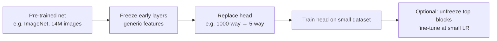
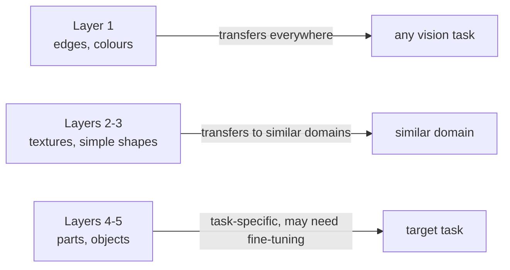

## Transfer Learning & Fine-Tuning

Big picture (no jargon)

Training a deep network from scratch needs **millions** of labelled examples and **lots** of GPU-hours. Most real-world projects have neither. **Transfer learning** sidesteps the problem entirely: take a network already trained on a huge dataset (ImageNet for vision; web-scale text for language), keep its learned **representations**, and adapt only the top layers to your small task. It's the single most practical trick in modern deep learning — and it's why a single engineer with a laptop can build a state-of-the-art classifier in an afternoon.

**Real-world analogy.** You wouldn't ask a hiring candidate to relearn arithmetic before training them on tax forms — they already know arithmetic from school. Pre-training is "general school education" for a network; fine-tuning is "on-the-job specialisation" for your specific task. Throw away the general education, and you'll spend 10 years training your tax accountant from kindergarten.

### Vocabulary — every term, defined plainly

- **Source task / source domain** — the original task the model was pretrained on (e.g. ImageNet 1000-way classification).
- **Target task / target domain** — your specific task (e.g. flower species classification).
- **Pretrained model** — a model whose weights have already been learned on the source task.
- **Backbone** — the feature-extraction layers (everything except the final classifier head).
- **Head** — the final task-specific layer(s) (typically a linear classifier).
- **Feature extraction** — freeze the backbone; train only a new head on the target data.
- **Fine-tuning** — unfreeze some/all backbone layers and continue training at a small learning rate.
- **Freezing** — set `requires_grad = False` on a parameter so it isn't updated by SGD.
- **Discriminative learning rates** — different LRs per layer-group: lower for early (already-good) layers, higher for the head.
- **Catastrophic forgetting** — too-large fine-tune LR wipes out pretrained features.
- **Domain shift** — source and target data distributions differ; impacts how much fine-tuning is needed.
- **LoRA (Low-Rank Adaptation)** — add small low-rank matrices to frozen weights; trains a tiny fraction of params (popular for LLMs).
- **Adapter** — small bottleneck modules inserted between frozen layers; same idea family as LoRA.
- **Prompting / in-context learning** — adapt a frozen model purely via the input prompt (no weight updates).
- **GAP, BN eval mode** — see modules 6 and 15.

### Picture it — the transfer-learning workflow

### Build the idea — two strategies

| Strategy | When to use | What you train |
|---|---|---|
| **Feature extraction** | Tiny dataset; target similar to source | Only the new head |
| **Fine-tuning** | Larger dataset; target dissimilar to source | Head + top conv blocks at small LR |

### Build the idea — why it works (feature hierarchy reuse)

A pretrained CNN's early layers learn **generic features** (edges, colours, textures) that are useful for almost any visual task. Deeper layers are increasingly **task-specific** (cat-ear detectors trained on ImageNet aren't directly useful for medical X-rays).

So early layers transfer well to new tasks, while later layers may need adapting → "freeze early, fine-tune late" is the universal recipe.

### Build the idea — recipe: feature extraction (4 steps)

1. **Load** a pretrained model: `torchvision.models.resnet50(weights="DEFAULT")`.
2. **Freeze** all parameters: `for p in model.parameters(): p.requires_grad = False`.
3. **Replace** the final layer with one matching your number of classes: `model.fc = nn.Linear(2048, num_target_classes)`.
4. **Train** only that head on your data (high LR is fine — only the new layer is updating).

### Build the idea — recipe: fine-tuning (extends feature extraction)

Steps 1–3 same as above.

4. Train the **head** for a few epochs at standard LR (e.g. $10^{-3}$).
5. **Unfreeze** the top conv blocks (e.g. last 1–2 stages of ResNet).
6. Continue training at a **low** LR (e.g. $10^{-5}$ — about 100× smaller than the head LR). Large LR would destroy the pretrained features.

### Build the idea — how much to fine-tune?

| Target dataset size | Target similar to source? | Recommendation |
|---|---|---|
| Small (< 1 k) | Yes (e.g. flowers, given ImageNet) | **Feature extraction only** |
| Small | No (e.g. medical X-rays) | **Fine-tune later layers** |
| Large (> 100 k) | Yes | **Fine-tune most/all layers** |
| Large | No | **Fine-tune all** (or train from scratch if huge) |

### Build the idea — discriminative learning rates

Use **lower LR for early layers** (already good, don't disturb) and **higher LR for later layers** (task-specific, need to learn). Common schedule:

| Layer group | LR |
|---|---|
| First conv stage | $10^{-5}$ |
| Middle stages | $10^{-4}$ |
| Head | $10^{-3}$ |

### Build the idea — beyond vision

The same principle applies to NLP and beyond:

- **BERT, GPT, T5, Llama** — pretrained on web-scale text via masked-LM or autoregressive objectives, then fine-tuned for specific tasks (sentiment, NER, QA, summarisation).
- **CLIP** — pretrained on (image, caption) pairs; transfers to many vision tasks via text prompts.
- **Wav2Vec 2.0** — self-supervised audio pretraining, fine-tune for ASR.
- **LoRA / Adapters** — add tiny trainable matrices to frozen weights. Trains < 1 % of params; matches full fine-tuning quality on many tasks. Standard for LLM fine-tuning today.
- **Prompting / in-context learning** — adapt LLMs purely via input examples, no weight updates.

<dl class="symbols">
  <dt>backbone</dt><dd>feature extractor (everything except the head)</dd>
  <dt>head</dt><dd>task-specific final layer(s)</dd>
  <dt>$\eta_\text{head}, \eta_\text{backbone}$</dt><dd>typically differ by 10–100×</dd>
</dl>

### Worked example — fully expanded

Worked example: 5-class flower classifier with 200 images

**Goal.** Classify 5 species of flowers; only 200 labelled images (40 per class). From scratch this would require ~10 k+ images for decent accuracy.

**Step 1 — feature extraction phase.**

Load the pretrained backbone:
- `model = torchvision.models.resnet50(weights="IMAGENET1K_V2")` (~25M params, trained on 14M ImageNet images).

Freeze and replace head:
- `for p in model.parameters(): p.requires_grad = False`
- `model.fc = nn.Linear(2048, 5)` (head has $2048 \cdot 5 + 5 = 10\,245$ trainable params).

Train head only for 10 epochs, Adam, $\text{LR} = 10^{-3}$.

**Result:** ~85 % validation accuracy. The frozen backbone's 2048-dim feature vectors are already discriminative enough that a linear classifier nearly suffices.

**Step 2 — fine-tuning phase.**

Unfreeze the last two ResNet stages: `for p in model.layer3.parameters(): p.requires_grad = True; for p in model.layer4.parameters(): p.requires_grad = True`.

Continue training for 10 more epochs at $\text{LR} = 10^{-5}$ (100× smaller than head LR — protects pretrained features).

**Result:** ~93 % validation accuracy.

**Step 3 — comparison.** Same dataset, same epochs, training from scratch (random init):

- ResNet-50 from scratch on 200 images → ~50 % accuracy (essentially overfits, can't learn features from so little data).

**Step 4 — preprocessing reminder.** Use the **same input pipeline** the pretrained model expects:

- Resize to 224×224.
- Normalise: mean = $(0.485, 0.456, 0.406)$, std = $(0.229, 0.224, 0.225)$ (ImageNet stats).

If you skip normalisation, the pretrained convs see inputs in the wrong scale → generic features misfire → garbage predictions.

**Step 5 — augmentation.** Add random horizontal flip, random crop, colour jitter. Boosts to ~95 % on this tiny dataset.

### How to think about it

Mental model — pretraining is internet-scale general education, fine-tuning is on-the-job specialisation

The internet is the world's biggest training dataset. By pretraining on it (ImageNet, Common Crawl, YouTube), models acquire **general perceptual / linguistic competence** that no individual project could ever afford to teach from scratch. Fine-tuning then takes this competent generalist and **specialises** them for your specific task with very little additional data.

Three rules of thumb:
1. **Match preprocessing** to the pretrained model's expectations (mean/std, resize). Otherwise the generic features misfire.
2. **Lower LR for earlier layers**, higher LR for later layers. Early layers are already good; aggressive updates wreck them.
3. **The smaller your dataset, the more you should freeze.** Tiny dataset → freeze everything but the head. Large dataset → fine-tune freely.

**When this comes up in ML.** **Almost every applied deep-learning project starts here.** Image classification, object detection, segmentation, NLP downstream tasks, speech recognition, audio classification — all built on top of pretrained backbones. **LLM fine-tuning is currently a multi-billion-dollar industry** entirely based on this idea (LoRA, RLHF, instruction tuning all extend it).

Watch out — common traps

- **Use the same input preprocessing** the pretrained model expects (mean / std / size). Otherwise the generic features won't fire correctly. Most common silent bug.
- **BatchNorm in eval mode** uses stored running statistics — don't accidentally re-train BN layers on a tiny batch and corrupt the running averages. Default: keep BN frozen during fine-tuning of small datasets.
- **Catastrophic forgetting** — too-large fine-tune LR wipes out pretrained features. Always start with $10^{-5}$ – $10^{-4}$ when unfreezing.
- **Forgetting to replace the head**, or replacing with the wrong output dim, leaves you predicting 1000 ImageNet classes instead of your 5.
- **Domain mismatch** — ImageNet features transfer beautifully to natural photos, less well to satellite imagery or medical X-rays. For very different domains, prefer self-supervised pretraining on in-domain unlabelled data.
- **Don't blindly fine-tune the entire net** with a tiny dataset — you'll overfit and degrade the pretrained features. Freeze first, fine-tune later (or use LoRA).
- **License & usage rights** — some pretrained model weights have non-commercial licenses. Check before deploying.

Exam tip

Three guaranteed sub-questions: **(a) explain *why* early layers transfer better than late layers** — generic features (edges, textures) vs task-specific features (object parts); **(b) outline both recipes (feature-extract vs fine-tune) crisply** — load → freeze → replace head → train, then (for fine-tune) unfreeze top blocks at small LR; **(c) name 2–3 real pretrained models** for vision (ResNet, EfficientNet, ViT, CLIP) and language (BERT, GPT, T5, Llama). Bonus: mention LoRA for parameter-efficient fine-tuning.

