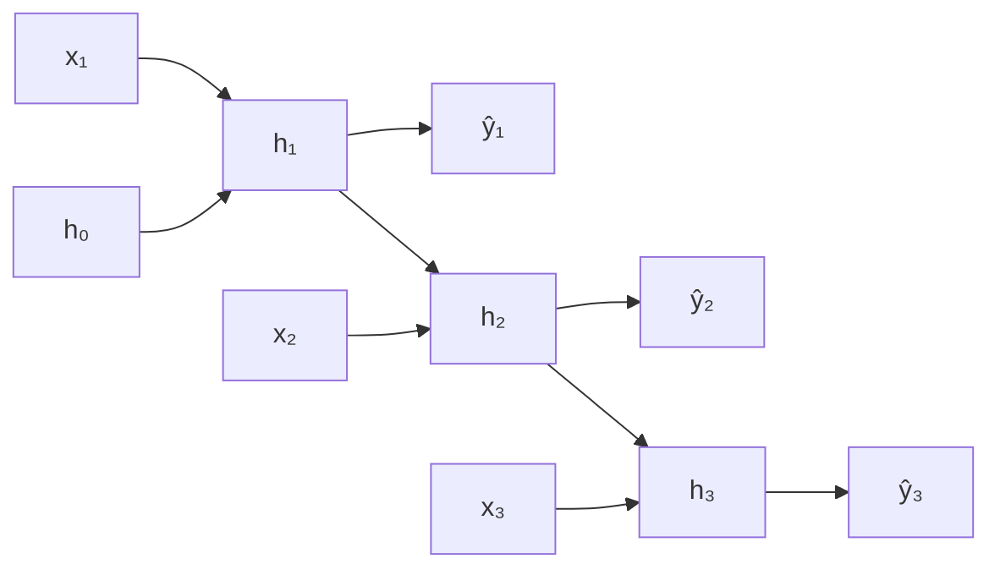

## Recurrent Neural Networks (RNNs)

Big picture (no jargon)

CNNs handle **fixed-size grids** (e.g. images). But what if your input is a sentence (variable length), a time series, or an audio waveform? **Recurrent Neural Networks (RNNs)** handle **sequences of arbitrary length** by carrying a **hidden state $\mathbf h_t$** — a "running summary" of everything seen so far. The same weights are applied at *every* time step (parameter sharing across time), so an RNN can process a 5-word sentence or a 5000-word document with the same parameter count.

The catch: vanilla RNNs **cannot remember things from very far back** — gradients vanish (or explode) when backpropagating through long sequences. Modules 10 (LSTM/GRU), 11 (attention), and 12 (Transformer) all attack this exact limitation.

**Real-world analogy.** Reading a novel: you build up a mental "current state" of the plot as you go. At each new word, you update your mental state based on (1) the new word and (2) your prior state. Same brain ("same weights") used at every word. That's the RNN. The vanishing-gradient problem is like trying to remember a name from page 3 by page 300 — the signal fades.

### Vocabulary — every term, defined plainly

- **Sequence** — ordered collection of inputs $\mathbf x_1, \mathbf x_2, \dots, \mathbf x_T$ of variable length $T$.
- **Time step $t$** — index along the sequence.
- **Hidden state $\mathbf h_t$** — the "running summary" / "memory" vector at time $t$.
- **Recurrence** — $\mathbf h_t$ depends on both the new input $\mathbf x_t$ and the previous state $\mathbf h_{t-1}$.
- **$W_{xh}, W_{hh}, W_{hy}$** — input-to-hidden, hidden-to-hidden (recurrent), and hidden-to-output weight matrices.
- **Parameter sharing across time** — the same weight matrices apply at every step $t$.
- **Unrolling** — write the RNN out as a feedforward network with $T$ copies of the recurrent cell.
- **Backpropagation Through Time (BPTT)** — standard backprop on the unrolled graph.
- **Truncated BPTT** — backprop through only the last $k$ steps; saves memory on long sequences.
- **Vanishing gradient (RNN)** — repeated multiplication of small Jacobians during BPTT shrinks gradients to zero → can't learn long-range dependencies.
- **Exploding gradient (RNN)** — repeated multiplication of large Jacobians blows gradients up → loss goes to NaN.
- **Gradient clipping** — cap the gradient norm to prevent explosion.
- **Many-to-one** — sequence input → single output (e.g. sentiment classification).
- **Many-to-many sync** — sequence in, sequence out, same length (e.g. POS tagging).
- **Many-to-many async / encoder–decoder** — sequence in, sequence out, possibly different lengths (e.g. translation).
- **Bidirectional RNN** — two RNNs, one forward and one backward; concat their hidden states. Captures both past and future context.

### Picture it — the unrolled RNN

Same $W_{xh}, W_{hh}, W_{hy}$ are reused at every time step.

### Build the idea — the vanilla RNN equations

$$
\mathbf h_t \;=\; \tanh\!\left(W_{xh}\, \mathbf x_t + W_{hh}\, \mathbf h_{t-1} + \mathbf b_h\right),
$$

$$
\hat{\mathbf y}_t \;=\; W_{hy}\, \mathbf h_t + \mathbf b_y.
$$

**Parameter count** is independent of sequence length $T$ (parameter sharing across time):

$$
|\theta| \;=\; (d_x + d_h + 1) \cdot d_h + (d_h + 1) \cdot d_y.
$$

### Build the idea — sequence task patterns

| Pattern | Example | Output usage |
|---|---|---|
| **One-to-many** | image → caption | $\hat{\mathbf y}_1, \hat{\mathbf y}_2, \dots$ |
| **Many-to-one** | sentence → sentiment | only $\hat{\mathbf y}_T$ |
| **Many-to-many (sync)** | POS tagging | $\hat{\mathbf y}_t$ for each $t$ |
| **Many-to-many (async)** | translation, summarisation | encoder–decoder |

### Build the idea — Backpropagation Through Time (BPTT)

Unroll the RNN for $T$ steps and run standard backprop on the resulting feedforward graph. Total loss $L = \sum_{t=1}^T L_t$. The gradient on $W_{hh}$ accumulates contributions from all time steps:

$$
\frac{\partial L}{\partial W_{hh}} \;=\; \sum_{t=1}^T \frac{\partial L_t}{\partial W_{hh}}.
$$

Each term $\partial L_t / \partial W_{hh}$ involves a **product of Jacobians** from step $t$ back to step 1.

### Build the idea — vanishing and exploding gradients

The gradient flowing back from step $T$ to step 1 contains:

$$
\prod_{k=1}^{T-1} \frac{\partial \mathbf h_{k+1}}{\partial \mathbf h_k} \;\approx\; \prod_{k=1}^{T-1} W_{hh}^\top \cdot \mathrm{diag}(\tanh'(\mathbf z_k)).
$$

Let $\lambda_\text{max}(W_{hh})$ be the largest eigenvalue:

- If $|\lambda_\text{max}| \cdot \tanh'_\text{max} < 1$ → gradient **vanishes** exponentially in $T$ → RNN can't learn long-range dependencies (typically loses signal after 5–10 steps).
- If $|\lambda_\text{max}| \cdot \tanh'_\text{max} > 1$ → gradient **explodes** → loss spikes to NaN.

**Mitigations:**

1. **Gradient clipping** (cap global norm at e.g. 1.0 or 5.0) — directly prevents explosions; cheap, universal.
2. **Better init** — orthogonal initialisation of $W_{hh}$ keeps eigenvalues near 1.
3. **Gated cells** — LSTM and GRU (next module) add gates that *control* gradient flow, fundamentally fixing vanishing.
4. **Truncated BPTT** — limit gradient back to $k$ steps; doesn't help long-range learning but caps memory cost.
5. **Better activations / architectures** — ReLU + careful init, or skip-connections in time (Transformer's full solution).

<dl class="symbols">
  <dt>$\mathbf h_t$</dt><dd>hidden state at time $t$ — the running summary</dd>
  <dt>$\mathbf x_t$</dt><dd>input at time $t$</dd>
  <dt>$\hat{\mathbf y}_t$</dt><dd>prediction at time $t$ (when applicable)</dd>
  <dt>$W_{xh}, W_{hh}, W_{hy}$</dt><dd>input, recurrent, and output weight matrices</dd>
  <dt>$T$</dt><dd>sequence length</dd>
  <dt>$\tanh'$</dt><dd>derivative of tanh, $\le 1$</dd>
</dl>

### Worked example — fully expanded

Worked example: 1-D RNN unrolled for 3 steps

**Setup.** Scalar (1-D) RNN, all parameters scalars: $W_{xh} = 0.5$, $W_{hh} = 0.8$, $b_h = 0$. Initial state $h_0 = 0$. Input $\mathbf x = (1, 1, 1)$ (constant).

**Step 1 — forward at $t = 1$.**

$$
h_1 \;=\; \tanh(0.5 \cdot 1 + 0.8 \cdot 0 + 0) \;=\; \tanh(0.5) \;\approx\; 0.4621.
$$

**Step 2 — forward at $t = 2$.**

$$
h_2 \;=\; \tanh(0.5 \cdot 1 + 0.8 \cdot 0.4621) \;=\; \tanh(0.5 + 0.3697) \;=\; \tanh(0.8697) \;\approx\; 0.7011.
$$

**Step 3 — forward at $t = 3$.**

$$
h_3 \;=\; \tanh(0.5 + 0.8 \cdot 0.7011) \;=\; \tanh(0.5 + 0.5609) \;=\; \tanh(1.0609) \;\approx\; 0.7858.
$$

**Step 4 — interpret.** The hidden state monotonically grows toward an attractor $h^* \approx 0.831$ (where $h^* = \tanh(0.5 + 0.8 h^*)$). The RNN is "remembering" that the input has been $1$ for a few steps in a row.

**Step 5 — vanishing-gradient mini demo.** Suppose loss is $L = h_3$ (cares about the final state only). Backpropagating to $h_1$ requires:

$$
\frac{\partial h_3}{\partial h_1} \;=\; \frac{\partial h_3}{\partial h_2} \cdot \frac{\partial h_2}{\partial h_1}.
$$

Each Jacobian $\partial h_{t+1} / \partial h_t = W_{hh} \cdot \tanh'(z_t)$. With $W_{hh} = 0.8$ and $\tanh'(0.87) \approx 1 - 0.7^2 = 0.51$:

$$
\frac{\partial h_3}{\partial h_2} \approx 0.8 \cdot \tanh'(1.06) \approx 0.8 \cdot 0.38 = 0.304,
$$
$$
\frac{\partial h_2}{\partial h_1} \approx 0.8 \cdot \tanh'(0.87) \approx 0.8 \cdot 0.51 = 0.408,
$$
$$
\frac{\partial h_3}{\partial h_1} \approx 0.304 \cdot 0.408 \approx 0.124.
$$

After only 2 steps the gradient is already 8× smaller. Extend to 30 steps and you'd get $\sim 0.4^{30} \approx 10^{-12}$ — vanished.

### How to think about it

Mental model — a notebook updated word by word

Think of the hidden state $\mathbf h_t$ as a notebook the network keeps as it reads through a sequence. At each step it:

1. **Reads** the new input $\mathbf x_t$.
2. **Updates** the notebook based on the new input and the previous notebook contents: $\mathbf h_t = \tanh(W_{xh} \mathbf x_t + W_{hh} \mathbf h_{t-1} + \mathbf b_h)$.
3. (Optionally) **emits** an output $\hat{\mathbf y}_t$ based on the current notebook.

The same writing rule ($W_{hh}, W_{xh}$) is used at every step — that's parameter sharing across time and is what lets the network handle variable-length sequences.

The vanishing-gradient problem is the brutal reality: writing rules that involve **multiplication by the same small matrix repeatedly** wash out old information. Gates (LSTM/GRU) replace multiplication with **addition** along a "memory cell" path, which fixes vanishing for the long-term memory. Attention (Transformer) goes further: connect every step directly to every other step, no recurrence at all.

**When this comes up in ML.** RNNs ruled NLP from 2014–2017 (machine translation, language modelling), then were largely replaced by Transformers around 2018. They're still relevant for: small-scale time series forecasting, low-latency speech recognition, edge / IoT sequence modelling (smaller footprint than Transformers), and as the conceptual stepping stone to LSTMs and attention. Knowing RNNs cold is required to read any sequence-modelling literature.

Watch out — common traps

- **Vanilla RNNs cannot learn long-range dependencies in practice** (typically lose signal after 5–10 steps). Use **LSTM / GRU** for anything beyond short sequences.
- **BPTT memory grows linearly with sequence length** — store all $T$ activations to compute gradients. Use **truncated BPTT** for long sequences.
- **Always clip gradients** (e.g. global norm 1.0 or 5.0) — without it, exploding gradients will spike loss to NaN unpredictably.
- **Don't reset the hidden state every batch unless intended.** For continuous sequences (language modelling), carry state across batches; for IID sequences (sentiment), reset.
- **Sequence length and padding.** Real batches contain sequences of different lengths → pad to max + use `pack_padded_sequence` (PyTorch) so padding doesn't pollute gradients.
- **Bidirectional ≠ causal.** A bidirectional RNN looks at *future* tokens too — use only when the entire sequence is available at inference (e.g. NER), not for language generation.
- **No parallelism in time.** RNNs process step by step → slow on GPUs. Transformers are massively parallel — one of their key advantages.

Exam tip

Three guaranteed sub-questions: **(a) write the vanilla RNN equations** ($\mathbf h_t = \tanh(W_{xh} \mathbf x_t + W_{hh} \mathbf h_{t-1} + \mathbf b_h)$, $\hat{\mathbf y}_t = W_{hy} \mathbf h_t + \mathbf b_y$) and **unroll a 3-step example numerically** (the $\mathbf x = (1, 1, 1)$ scenario above is canonical); **(b) explain vanishing/exploding gradients** via the Jacobian product $\prod \partial \mathbf h_{k+1} / \partial \mathbf h_k$ and why it shrinks/blows up exponentially in $T$; **(c) name fixes** — gradient clipping, orthogonal init, gated cells (LSTM/GRU), truncated BPTT. Bonus: state the four sequence task patterns with one example each.

