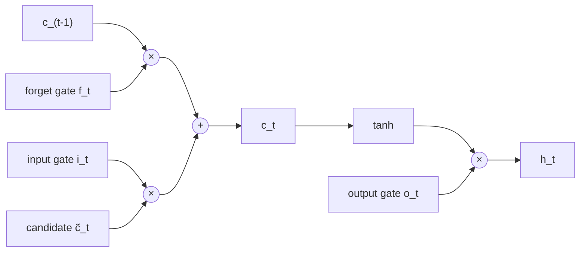
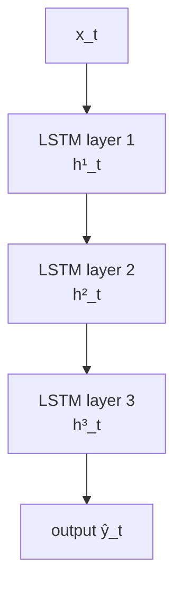

## LSTM, GRU, BiLSTM, Stacked RNNs

Big picture (no jargon)

Vanilla RNNs (last module) **choke on long sequences** because gradients vanish exponentially with depth-in-time. **LSTM** (Long Short-Term Memory, 1997) and **GRU** (Gated Recurrent Unit, 2014) introduce **gates** — small neural sub-networks that learn what to **remember**, what to **forget**, and what to **expose** as output — creating a "gradient highway" through time via an *additive* memory update. **BiLSTM** processes the sequence both ways (concat hidden states); **stacked RNNs** layer multiple recurrent layers for deeper temporal features.

LSTMs ruled NLP from 2014–2017 (Google Translate's first neural version was a stacked LSTM with attention). They were largely replaced by Transformers (modules 11–12), but remain the canonical example of "fix vanishing gradient with gating".

**Real-world analogy.** A whiteboard in a meeting room: at each moment you (1) **erase** some old content (forget gate), (2) **write** new content (input gate), (3) **read off** what's currently on the board (output gate). The board persists with little decay if nothing is erased — that's the LSTM's cell state, the "constant error carousel".

### Vocabulary — every term, defined plainly

- **Cell state $\mathbf c_t$** — long-term memory; flows nearly unchanged when the forget gate $\approx 1$.
- **Hidden state $\mathbf h_t$** — short-term, exposed output; what downstream layers see.
- **Gate** — sigmoid-activated vector in $[0, 1]$ acting as a soft on/off switch element-wise.
- **Forget gate $\mathbf f_t$** — what fraction of each cell-state element to keep.
- **Input gate $\mathbf i_t$** — what fraction of the candidate update to write.
- **Output gate $\mathbf o_t$** — what fraction of the cell state to expose as hidden state.
- **Candidate cell $\tilde{\mathbf c}_t$** — the new content (tanh) to potentially write.
- **Constant error carousel (CEC)** — the additive $\mathbf c$ update that lets gradients flow through without shrinkage.
- **Update gate $\mathbf z_t$ (GRU)** — interpolates between old hidden state and new candidate.
- **Reset gate $\mathbf r_t$ (GRU)** — controls how much of the previous state to use when computing the candidate.
- **BiLSTM** — two LSTMs (forward + backward); concat hidden states; needs the whole sequence.
- **Stacked RNN** — multi-layer recurrent network; higher layers operate on lower layers' hidden states.
- **Forget bias init** — initialise $\mathbf b_f \to 1$ so the network starts out "remembering by default".

### Picture it — the LSTM cell

### Build the idea — LSTM equations

For input $\mathbf x_t$, previous hidden $\mathbf h_{t-1}$, and previous cell $\mathbf c_{t-1}$:

$$
\begin{aligned}
\mathbf f_t &\;=\; \sigma\!\left(W_f\, [\mathbf h_{t-1}, \mathbf x_t] + \mathbf b_f\right) & \text{forget gate}\\
\mathbf i_t &\;=\; \sigma\!\left(W_i\, [\mathbf h_{t-1}, \mathbf x_t] + \mathbf b_i\right) & \text{input gate}\\
\tilde{\mathbf c}_t &\;=\; \tanh\!\left(W_c\, [\mathbf h_{t-1}, \mathbf x_t] + \mathbf b_c\right) & \text{candidate cell}\\
\mathbf c_t &\;=\; \mathbf f_t \odot \mathbf c_{t-1} + \mathbf i_t \odot \tilde{\mathbf c}_t & \text{cell update}\\
\mathbf o_t &\;=\; \sigma\!\left(W_o\, [\mathbf h_{t-1}, \mathbf x_t] + \mathbf b_o\right) & \text{output gate}\\
\mathbf h_t &\;=\; \mathbf o_t \odot \tanh(\mathbf c_t) & \text{hidden state}
\end{aligned}
$$

(All weight matrices act on the concatenation $[\mathbf h_{t-1}, \mathbf x_t]$.)

### Build the idea — GRU equations (fewer gates, comparable performance)

$$
\begin{aligned}
\mathbf z_t &\;=\; \sigma\!\left(W_z\, [\mathbf h_{t-1}, \mathbf x_t]\right) & \text{update gate}\\
\mathbf r_t &\;=\; \sigma\!\left(W_r\, [\mathbf h_{t-1}, \mathbf x_t]\right) & \text{reset gate}\\
\tilde{\mathbf h}_t &\;=\; \tanh\!\left(W_h\, [\mathbf r_t \odot \mathbf h_{t-1},\; \mathbf x_t]\right) & \text{candidate}\\
\mathbf h_t &\;=\; (1 - \mathbf z_t) \odot \mathbf h_{t-1} + \mathbf z_t \odot \tilde{\mathbf h}_t & \text{blend}
\end{aligned}
$$

GRU merges cell and hidden state into one — fewer parameters, similar accuracy on most tasks.

### Build the idea — LSTM vs GRU

| | LSTM | GRU |
|---|---|---|
| Gates | 3 (forget, input, output) | 2 (update, reset) |
| State | $\mathbf h_t$ + $\mathbf c_t$ | $\mathbf h_t$ only |
| Params | More (~33 % more for same dim) | Fewer |
| Long sequences | Slight edge | Similar |
| Speed | Slower | Faster |
| Empirical | Hard to call universal winner | Often a tie |

### Build the idea — Bidirectional LSTM (BiLSTM)

Run one LSTM left-to-right and another right-to-left over the same sequence; concatenate hidden states at each step:

$$
\mathbf h_t \;=\; \left[\overrightarrow{\mathbf h}_t;\; \overleftarrow{\mathbf h}_t\right].
$$

Useful when the *whole* sequence is known in advance (NER, POS tagging, speech recognition with full audio). **Not valid for autoregressive generation** — the backward pass would peek at the future.

### Build the idea — Stacked RNNs

Feed the hidden states of one recurrent layer as inputs to a higher recurrent layer. Typical: 2–4 layers. Each layer learns more abstract temporal features.

### Build the idea — why LSTM fixes vanishing gradients

The cell update is **additive**:

$$
\mathbf c_t \;=\; \mathbf f_t \odot \mathbf c_{t-1} + \mathbf i_t \odot \tilde{\mathbf c}_t.
$$

So:

$$
\frac{\partial \mathbf c_t}{\partial \mathbf c_{t-1}} \;\approx\; \mathrm{diag}(\mathbf f_t).
$$

If the forget gate is near 1, this Jacobian is near the identity → gradients pass through largely intact across many time steps. This is the **constant error carousel (CEC)**. Vanilla RNNs multiply by $W_{hh} \cdot \mathrm{diag}(\tanh')$ at every step → exponential decay.

<dl class="symbols">
  <dt>$\mathbf c_t$</dt><dd>cell state — long-term memory</dd>
  <dt>$\mathbf h_t$</dt><dd>hidden state — short-term, exposed</dd>
  <dt>$\mathbf f_t, \mathbf i_t, \mathbf o_t$</dt><dd>LSTM forget / input / output gates ($\in [0, 1]$)</dd>
  <dt>$\tilde{\mathbf c}_t$</dt><dd>candidate cell content (tanh)</dd>
  <dt>$\mathbf z_t, \mathbf r_t$</dt><dd>GRU update / reset gates</dd>
  <dt>$\odot$</dt><dd>element-wise (Hadamard) product</dd>
</dl>

### Worked example — fully expanded

Worked example: long-range memory through 50 steps

**Scenario.** At step 1, an LSTM reads the word "**Paris**" in the sentence "I lived in Paris for many years before moving to..." and stores it in its cell state $\mathbf c_1$. At step 50, the model needs to predict "**French**" (as in "I speak French fluently").

**Vanilla RNN behaviour.** $\mathbf h$ is updated multiplicatively at each step: $\mathbf h_t = \tanh(W_{hh} \mathbf h_{t-1} + \cdots)$. After 50 steps, the contribution of $\mathbf h_1$ to $\mathbf h_{50}$ is multiplied by $\sim 50$ Jacobians, each of norm $< 1$. Even at norm 0.8, $0.8^{50} \approx 1.4 \times 10^{-5}$ — "Paris" has effectively been forgotten.

**LSTM behaviour.** Suppose during training the network learns: "if you've stored a country name, keep remembering it indefinitely." Then $\mathbf f_t$ (the slot of $\mathbf c$ holding the country) stays near 1 for steps $2, 3, \dots, 50$:

$$
\mathbf c_{50}\big|_\text{country slot} \;\approx\; \mathbf f_{50} \cdot \mathbf f_{49} \cdots \mathbf f_2 \cdot \mathbf c_1\big|_\text{country slot} \;\approx\; 1^{49} \cdot \mathbf c_1\big|_\text{country slot}.
$$

So $\mathbf c_{50}$ still contains "Paris" 50 steps later. The output gate $\mathbf o_{50}$ then exposes it via $\mathbf h_{50}$, and the next-token classifier predicts "French".

**Numerical illustration.** Take a 1-D LSTM cell. $c_0 = 0$. At step 1: $i_1 = 1, \tilde c_1 = 0.7$ (encoding "Paris"), $f_1 = 0$ → $c_1 = 0 + 1 \cdot 0.7 = 0.7$.

For steps 2–49, suppose the network sees neutral words and learns $f_t = 0.99, i_t = 0$ (no new info, hold tight):

$$
c_{49} \;=\; 0.99^{48} \cdot 0.7 \;\approx\; 0.62 \cdot 0.7 \;\approx\; 0.434.
$$

Still substantial signal. Compare a vanilla RNN with $W_{hh} = 0.99$ and $\tanh' \approx 0.5$:

$$
h_{49} / h_1 \;\approx\; (0.99 \cdot 0.5)^{48} \;\approx\; 0.495^{48} \;\approx\; 10^{-15}.
$$

Vanished. The CEC is the difference.

**Step 50 — extracting the answer.** Suppose $o_{50} = 1$ (allow read-out). Then:

$$
h_{50} \;=\; 1 \cdot \tanh(0.434) \;\approx\; 0.41,
$$

a clean, non-vanished signal that the classifier can use to pick "French".

### How to think about it

Mental model — gates control a conveyor belt of memories

Imagine the cell state $\mathbf c$ as a **conveyor belt** of long-term memories moving through time:

- **Forget gate** is a **robotic arm** that *removes* items from the belt.
- **Input gate** + **candidate** is a robotic arm that *places new items* on the belt.
- **Output gate** is a **window** that decides which items the rest of the network can *see*.

The belt itself moves with very little friction — that's the additive update; it's why gradients don't vanish along it. Each gate is just a small sigmoid-activated layer that learns *when* to engage.

GRUs simplify by merging the forget+input gates into a single "update" gate $\mathbf z_t$ (interpolate between old and new) and merging cell+hidden states.

**When this comes up in ML.** LSTM-based seq2seq models (with attention) ran Google Translate for years. LSTMs power most older speech recognition systems. They remain a strong baseline for time-series forecasting, low-latency speech (smaller footprint than Transformers), and edge deployment. Conceptually, the "additive memory + gates" idea reappears in **Highway Networks**, **ResNets** (skip connections are basically a forget-gate-of-1 in space rather than time), **Neural Turing Machines**, and **State Space Models** (Mamba, S4). Knowing LSTMs gives you a vocabulary for reading any "memory + gating" architecture.

Watch out — common traps

- **LSTM/GRU help but don't *eliminate* vanishing gradients** — for sequences in the thousands or longer, attention/Transformers are better.
- **BiLSTM is NOT valid for next-token prediction** (would peek at the future). Use unidirectional LSTM or a Transformer with causal masking.
- **Initialise the forget-gate bias to 1** — encourages remembering by default; helps training significantly. Most frameworks do this automatically; double-check.
- **No parallelism in time.** Like vanilla RNNs, LSTMs process step by step → slow on GPUs. This is the practical reason Transformers won.
- **Memory cost** of BPTT through LSTM is large — store activations of *all* gates and states for every time step. Use truncated BPTT for very long sequences.
- **Don't mix dropout into the recurrent connection** naïvely (kills the gradient highway). Use **variational dropout** (same mask at every step) or apply dropout only to non-recurrent parts.
- **Gradient clipping is still needed** (LSTMs can still explode, especially if forget gate is initialised badly).

Exam tip

Three guaranteed sub-questions: **(a) draw and label all 6 LSTM equations** ($\mathbf f, \mathbf i, \tilde{\mathbf c}, \mathbf c, \mathbf o, \mathbf h$); **(b) explain *which line* prevents vanishing gradients** — the additive cell update $\mathbf c_t = \mathbf f_t \odot \mathbf c_{t-1} + \mathbf i_t \odot \tilde{\mathbf c}_t$ → $\partial \mathbf c_t / \partial \mathbf c_{t-1} \approx \mathrm{diag}(\mathbf f_t)$ → "constant error carousel"; **(c) compare LSTM vs GRU in 2–3 bullet points** (3 vs 2 gates, $\mathbf c + \mathbf h$ vs $\mathbf h$ only, similar accuracy in practice). Bonus: explain why BiLSTMs work for tagging but not for generation, and state the forget-gate bias-init trick.

