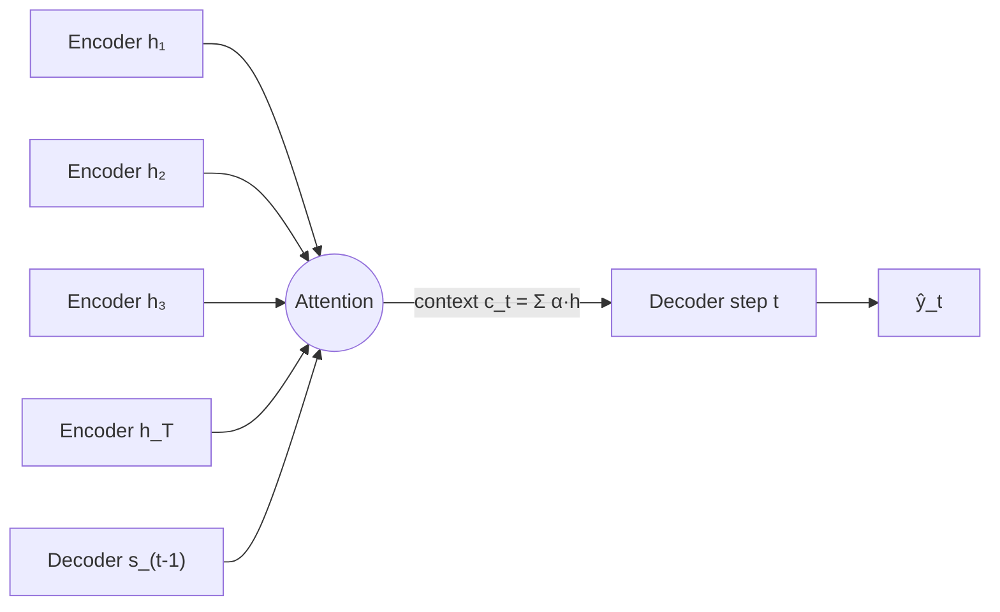
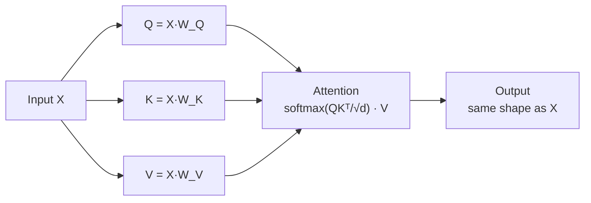

## Attention Mechanism

Big picture (no jargon)

Even an LSTM forces an entire sentence through one fixed-size hidden state — a brutal bottleneck for translation, summarisation, and long-context tasks. **Attention** (Bahdanau, Cho, Bengio 2014) was invented for exactly this: rather than relying on a single hidden state, let the decoder **look back at every encoder state** and weight them by **relevance** to the current output. The decoder's "context vector" at each step is a learned, soft-weighted sum of all encoder hidden states.

This idea — **soft, content-based dictionary lookup** — turned out to be so powerful that the **Transformer** (Vaswani et al. 2017, next module) **dropped recurrence entirely** and used attention as the *only* sequence operation. Today, attention is the dominant building block of modern AI.

**Real-world analogy.** When translating a sentence, a human translator constantly **glances back** at different parts of the source sentence depending on which target word they're producing. Producing the article "le" → glance at the source noun's gender. Producing the verb's ending → glance at the subject. Attention is the network's way of mimicking this glance-and-focus behaviour, fully differentiable so it can be learned by gradient descent.

### Vocabulary — every term, defined plainly

- **Attention mechanism** — soft, content-based way to look up a weighted combination of values from a key-value memory.
- **Query $\mathbf q$** — "what am I looking for right now?"
- **Key $\mathbf k_i$** — "what does memory item $i$ advertise?"
- **Value $\mathbf v_i$** — "what does memory item $i$ contribute if attended to?"
- **Score** — compatibility between a query and a key (dot product, additive, etc.).
- **Attention weight $\alpha_i$** — softmax-normalised score; weights sum to 1.
- **Context vector** — output of attention: weighted sum of values $\sum_i \alpha_i \mathbf v_i$.
- **Bahdanau / additive attention (2014)** — score uses a small MLP: $\mathbf v^\top \tanh(W_q \mathbf q + W_k \mathbf k_i)$.
- **Luong / dot-product attention (2015)** — score is $\mathbf q^\top \mathbf k_i$.
- **Scaled dot-product attention (Transformer 2017)** — score is $\mathbf q^\top \mathbf k_i / \sqrt{d_k}$; standard today.
- **Self-attention** — Q, K, V all come from the *same* sequence (every token attends to every other token in the same sequence).
- **Cross-attention** — Q from one sequence (e.g. decoder), K and V from another (encoder).
- **Multi-head attention** — run $h$ attention computations in parallel with different learned projections; concat.
- **Causal / masked attention** — set scores for future positions to $-\infty$ before softmax → autoregressive generation.
- **Positional encoding** — token-position information added to embeddings; needed because attention is permutation-invariant.

### Picture it — Bahdanau encoder–decoder attention

### Build the idea — the general formulation (Q, K, V)

For one query $\mathbf q$ and a memory bank of $n$ (key, value) pairs:

$$
\text{score}_i \;=\; f(\mathbf q, \mathbf k_i), \qquad
\alpha_i \;=\; \frac{\exp(\text{score}_i)}{\sum_{j=1}^n \exp(\text{score}_j)}, \qquad
\text{output} \;=\; \sum_{i=1}^n \alpha_i\, \mathbf v_i.
$$

The output is a **convex combination of values** weighted by relevance; differentiable end-to-end.

### Build the idea — three score functions

| Name | Formula | Note |
|---|---|---|
| **Additive (Bahdanau)** | $\mathbf v^\top \tanh(W_q \mathbf q + W_k \mathbf k_i)$ | First proposed; small MLP per pair |
| **Dot-product (Luong)** | $\mathbf q^\top \mathbf k_i$ | No params; cheap matmul |
| **Scaled dot-product (Transformer)** | $\dfrac{\mathbf q^\top \mathbf k_i}{\sqrt{d_k}}$ | Standard today |

**Why scaling?** When $d_k$ is large, the dot product $\mathbf q^\top \mathbf k_i$ has variance $\sim d_k$ → softmax saturates (one entry $\approx 1$, rest $\approx 0$) → vanishing gradient. Dividing by $\sqrt{d_k}$ keeps variance $\sim 1$ → softmax stays in its smooth, gradient-friendly regime.

### Build the idea — matrix form (the workhorse)

Stack queries into $Q \in \mathbb R^{n_q \times d_k}$, keys into $K \in \mathbb R^{n_k \times d_k}$, values into $V \in \mathbb R^{n_k \times d_v}$:

$$
\boxed{\text{Attention}(Q, K, V) \;=\; \mathrm{softmax}\!\left(\frac{Q K^\top}{\sqrt{d_k}}\right) V.}
$$

Output shape: $n_q \times d_v$. The softmax is row-wise (each query's weights sum to 1).

**Compute cost.** $Q K^\top$ is $n_q \times n_k$; for self-attention $n_q = n_k = n$ → **$\mathcal O(n^2 d)$**. This is the famous quadratic cost.

### Build the idea — self-attention (the Transformer's key move)

Take a sequence $X = (\mathbf x_1, \dots, \mathbf x_n)$. Project linearly:

$$
Q \;=\; X W_Q, \qquad K \;=\; X W_K, \qquad V \;=\; X W_V.
$$

Now apply the boxed formula. Every token attends to every other token in the *same* sequence — dependencies of any range, captured in $\mathcal O(n^2 d)$ flops.

### Build the idea — multi-head attention

Run $h$ attention computations in parallel, each with **its own learned projections** for $Q, K, V$:

$$
\text{MultiHead}(Q, K, V) \;=\; \left[\text{head}_1;\; \dots;\; \text{head}_h\right] W_O,
$$

$$
\text{head}_i \;=\; \text{Attention}\!\left(Q W_Q^{(i)},\; K W_K^{(i)},\; V W_V^{(i)}\right).
$$

Each head can attend to a different "kind" of relationship — syntactic, positional, semantic. Empirically, different heads do specialise (one head does nearby-token attention, another does subject-verb agreement, etc.). $d_k$ per head is typically $d_\text{model} / h$ so total compute matches single-head.

<dl class="symbols">
  <dt>$\mathbf q, \mathbf k_i, \mathbf v_i$</dt><dd>query, key, value vectors</dd>
  <dt>$Q, K, V$</dt><dd>stacked matrices for batched computation</dd>
  <dt>$\alpha_i$</dt><dd>attention weight ($\in [0, 1]$, sum to 1)</dd>
  <dt>$d_k$</dt><dd>key dimension (= query dim)</dd>
  <dt>$d_v$</dt><dd>value dimension</dd>
  <dt>$h$</dt><dd>number of attention heads</dd>
  <dt>$n$</dt><dd>sequence length</dd>
</dl>

### Worked example — fully expanded

Worked example: attention by hand on 3 tokens

**Setup.** Sequence of 3 tokens. Each token has been linearly projected to query, key, and value vectors of dimension $d_k = d_v = 2$:

$$
Q = \begin{pmatrix} 1 & 0 \\ 0 & 1 \\ 1 & 1 \end{pmatrix}, \qquad
K = \begin{pmatrix} 1 & 0 \\ 0 & 1 \\ 1 & 1 \end{pmatrix}, \qquad
V = \begin{pmatrix} 10 & 0 \\ 0 & 10 \\ 5 & 5 \end{pmatrix}.
$$

**Step 1 — score matrix $Q K^\top$.**

$$
Q K^\top \;=\; \begin{pmatrix} 1 & 0 \\ 0 & 1 \\ 1 & 1 \end{pmatrix} \begin{pmatrix} 1 & 0 & 1 \\ 0 & 1 & 1 \end{pmatrix} \;=\; \begin{pmatrix} 1 & 0 & 1 \\ 0 & 1 & 1 \\ 1 & 1 & 2 \end{pmatrix}.
$$

**Step 2 — scale by $\sqrt{d_k} = \sqrt 2 \approx 1.414$.**

$$
\frac{Q K^\top}{\sqrt 2} \;\approx\; \begin{pmatrix} 0.707 & 0 & 0.707 \\ 0 & 0.707 & 0.707 \\ 0.707 & 0.707 & 1.414 \end{pmatrix}.
$$

**Step 3 — row-wise softmax.** For row 1 (query 1):

$$
e^{0.707} \approx 2.028, \quad e^0 = 1, \quad e^{0.707} \approx 2.028. \quad \sum \approx 5.057.
$$
$$
\alpha_1 \;\approx\; (0.401,\; 0.198,\; 0.401).
$$

For row 2 (query 2): same shape by symmetry → $\alpha_2 \approx (0.198, 0.401, 0.401)$.

For row 3 (query 3): scores $(0.707, 0.707, 1.414)$, exponentials $(2.028, 2.028, 4.114)$, sum $\approx 8.170$ →

$$
\alpha_3 \;\approx\; (0.248,\; 0.248,\; 0.504).
$$

**Step 4 — outputs.** Each output row is $\sum_i \alpha_i \mathbf v_i$.

For query 1: $0.401 \cdot (10, 0) + 0.198 \cdot (0, 10) + 0.401 \cdot (5, 5) = (4.01 + 0 + 2.005,\; 0 + 1.98 + 2.005) = (6.02,\; 3.99)$.

For query 2: $0.198 \cdot (10, 0) + 0.401 \cdot (0, 10) + 0.401 \cdot (5, 5) = (1.98 + 0 + 2.005,\; 0 + 4.01 + 2.005) = (3.99,\; 6.02)$.

For query 3: $0.248 \cdot (10, 0) + 0.248 \cdot (0, 10) + 0.504 \cdot (5, 5) = (2.48 + 0 + 2.52,\; 0 + 2.48 + 2.52) = (5.00,\; 5.00)$.

So output:

$$
\text{Attention}(Q, K, V) \;\approx\; \begin{pmatrix} 6.02 & 3.99 \\ 3.99 & 6.02 \\ 5.00 & 5.00 \end{pmatrix}.
$$

**Interpretation.** Token 1 (query "look like (1, 0)") attends most to keys 1 and 3 (which contain a `1` in the first slot) → output mixes their values, leaning toward $\mathbf v_1 = (10, 0)$. Token 3 (query $(1,1)$) attends most to key 3 (highest dot product) → output is exactly $\mathbf v_3 = (5, 5)$. **Attention found the most "compatible" memory items by content.**

**Step 5 — translation analogy.** Replace these toy vectors with real word embeddings: when the decoder is producing the 3rd French word "un" in "I am a student" → "Je suis un étudiant", attention over the English encoder states might give weights $(0.05, 0.10, 0.80, 0.05)$ on (I, am, a, student). The decoder's context vector is dominated by the encoder state for "a" → produces "un".

### How to think about it

Mental model — soft, content-based dictionary lookup

Attention is **soft, content-based dictionary lookup**:

- The **query** asks a question.
- Each **key** advertises an answer.
- **Softmax** picks the best matches (ranking by score).
- The **values** are the actual content returned — weighted by the rankings.

Unlike a real (hard) dictionary, every key contributes a (possibly tiny) fraction → **fully differentiable** → trainable by SGD.

**Self-attention** is the special case where the dictionary is the same sequence as the queries — every token gets to attend to every other token in $\mathcal O(1)$ "graph distance" (vs $\mathcal O(n)$ for RNNs). That single property is what makes Transformers so good at long-range dependencies and why they replaced RNNs.

**Multi-head attention** parallelises this lookup across multiple "interpretations" of the same sequence — heads specialise to syntactic, semantic, positional patterns.

**When this comes up in ML.** Every modern foundation model: BERT, GPT, T5, Llama, Claude, Gemini, ViT, Whisper, Stable Diffusion (cross-attention to text prompts), AlphaFold (attention over protein residues), DALL·E, SAM, … Attention is **the** building block of the 2020s. Knowing the boxed formula cold is non-negotiable.

Watch out — common traps

- **Self-attention is $\mathcal O(n^2)$ in sequence length** — prohibitive for very long sequences. Linear attention (Linformer, Performer), sparse attention (Longformer, BigBird), and FlashAttention (algorithmic memory savings) all attack this.
- **Without positional encoding, self-attention is permutation-invariant** — it has no idea about order. *Always* add positional info (sinusoidal, learned, RoPE).
- **The $\sqrt{d_k}$ normalisation matters.** Without it, dot products scale with $d_k$, pushing softmax into saturated regions where gradients vanish. This is a common bug in DIY implementations.
- **Causal mask must be applied before softmax**, not after — otherwise the row no longer sums to 1.
- **Padding tokens should be masked out** — a $-\infty$ pre-softmax score makes them get attention weight 0. Skip and you'll be averaging in junk.
- **Multi-head ≠ deep.** Multi-head is *parallel* attention; depth comes from stacking *layers*. A single-layer multi-head attention is still shallow.
- **Attention weights are NOT a perfect explanation.** They show *where* the model looked, but not always *why*. Treat with caution as interpretability tool.

Exam tip

Three guaranteed sub-questions: **(a) memorise the scaled dot-product formula** — $\text{Attention}(Q, K, V) = \mathrm{softmax}(Q K^\top / \sqrt{d_k}) V$ — and **draw the Q/K/V flow**; **(b) compute one attention output by hand on a tiny example** ($n = 3$, $d_k = 2$ as above is canonical); **(c) explain multi-head** in one sentence — "do scaled dot-product attention $h$ times in parallel with different learned projections, then concat". Bonus: state the role of $\sqrt{d_k}$, why positional encoding is needed, and the difference between self-attention and cross-attention.

