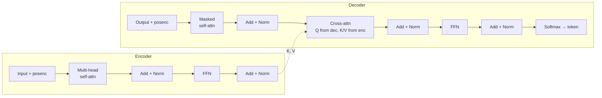

## Transformer Architecture

<div class="callout intuition"><span class="callout-title">Big picture (no jargon)</span>

The **Transformer** ("Attention Is All You Need", Vaswani et al. 2017) **drops recurrence and convolutions entirely** and uses only **self-attention** + **feed-forward layers** + **layer normalisation** + **residual connections**. The result: every token in a sequence is processed **in parallel** (no time-step loop), every token can communicate with every other token in a single layer ($\mathcal O(1)$ "graph distance"), and long-range dependencies are easy. This is the architecture behind **BERT, GPT, T5, ViT, Llama, Claude, Gemini** — every modern foundation model.

The cost: **$\mathcal O(n^2)$** memory and compute in sequence length $n$ — bearable up to $n \sim 8$k, painful beyond. The whole "long-context" research area (FlashAttention, sparse attention, linear attention, state-space models) exists to push that boundary.

**Real-world analogy.** A meeting room where everyone has direct eye contact with everyone else (self-attention), each person silently writes notes on what they heard (FFN), and a moderator periodically resets the temperature (LayerNorm). Repeat that meeting structure 12 / 24 / 96 times in a stack — that's a Transformer. No "telephone game" of one-step-at-a-time information passing (RNN); everyone can hear everyone in one pass.

</div>

### Vocabulary — every term, defined plainly

- **Transformer** — encoder–decoder neural net using only self-attention, FFN, residuals, and LayerNorm.
- **Encoder** — stack of $N$ identical blocks; processes the source sequence; outputs contextual embeddings.
- **Decoder** — stack of $N$ identical blocks; generates the target sequence one token at a time during inference, all positions in parallel during training.
- **Encoder block** — multi-head self-attention + position-wise FFN, each with residual + LayerNorm.
- **Decoder block (3 sub-layers)** — masked self-attention + cross-attention + FFN, each with residual + LayerNorm.
- **Multi-head self-attention** — see module 11; every token attends to every other token in the same sequence.
- **Cross-attention** — Q from decoder, K and V from final encoder output; how the decoder reads from the source.
- **Causal / masked self-attention** — set scores for future positions to $-\infty$ before softmax → autoregressive.
- **Position-wise FFN** — same MLP applied independently to each position; $d_\text{ff}$ typically $4 d_\text{model}$.
- **LayerNorm** — normalise each token's feature vector to mean 0, variance 1, then scale + shift with learnable params.
- **Residual / skip connection** — input added to sub-layer output before LayerNorm; gradient highway.
- **Pre-norm vs post-norm** — LayerNorm before vs after the sub-layer; pre-norm is more stable for deep stacks.
- **Positional encoding (PE)** — token-position info added to embeddings (sinusoidal, learned, relative, RoPE).
- **Sinusoidal PE** — original; uses $\sin/\cos$ at multiple frequencies; no learnable params; extrapolates to longer sequences.
- **RoPE (Rotary Position Embedding)** — rotates Q and K by position-dependent angles; used by Llama, GPT-NeoX, modern models.
- **KV cache** — at inference, cache previously computed K and V to avoid recomputing each step.
- **FlashAttention** — IO-aware exact attention; same math, much less memory traffic.
- **BERT, GPT, T5/BART, ViT** — major architectural variants (encoder-only, decoder-only, encoder–decoder, vision encoder).

### Picture it — encoder + decoder



Each block (encoder or decoder) is repeated $N$ times (typically 6 in the original paper, 12–96 in modern LLMs).

### Build the idea — encoder block (post-norm form, original paper)

$$
\begin{aligned}
\mathbf Z &\;=\; \mathrm{LayerNorm}\!\left(\mathbf X + \mathrm{MultiHead}(\mathbf X, \mathbf X, \mathbf X)\right), \\
\mathbf Y &\;=\; \mathrm{LayerNorm}\!\left(\mathbf Z + \mathrm{FFN}(\mathbf Z)\right).
\end{aligned}
$$

Modern variants use **pre-norm** (LayerNorm before the sub-layer) for better stability at large depth.

### Build the idea — decoder block (3 sub-layers)

1. **Masked multi-head self-attention** — the decoder attends only to *past* positions of the target sequence (causal mask).
2. **Cross-attention** — queries come from the decoder's previous sub-layer; keys and values come from the **final encoder output**. This is how the decoder *reads from the source sequence*.
3. **Position-wise feed-forward network**.

Each sub-layer is followed by a residual connection + LayerNorm.

### Build the idea — position-wise feed-forward network (FFN)

The same MLP is applied independently to each position:

$$
\mathrm{FFN}(\mathbf x) \;=\; W_2\, \mathrm{ReLU}(W_1 \mathbf x + \mathbf b_1) + \mathbf b_2.
$$

Hidden dim $d_\text{ff}$ is typically $4 d_\text{model}$ (e.g. $d_\text{model} = 512$ → $d_\text{ff} = 2048$). Modern variants swap ReLU for GELU or SwiGLU.

**Most of a Transformer's parameters live in the FFNs**, not the attention. Self-attention is the *communication* operation; FFN is the *thinking / refinement* operation.

### Build the idea — positional encoding

Self-attention is **order-blind** (permutation-equivariant): shuffle the input tokens, you get a shuffled output. To inject order, **add** a position-dependent vector to each token embedding.

Original Transformer used sinusoids:

$$
\mathrm{PE}_{(\text{pos},\, 2i)} \;=\; \sin\!\left(\text{pos} / 10000^{2i / d}\right), \qquad
\mathrm{PE}_{(\text{pos},\, 2i+1)} \;=\; \cos\!\left(\text{pos} / 10000^{2i / d}\right).
$$

Different frequencies for different feature dimensions → unique pattern per position. Sinusoids extrapolate to sequences longer than seen in training (in theory).

Modern variants:
- **Learned absolute** — a free parameter per position.
- **Relative** — encode relative distance between query and key (T5 style).
- **RoPE** (rotary) — rotate Q and K by position-dependent angles; used by Llama, GPT-NeoX, modern open LLMs.

### Build the idea — causal masking (decoder)

In the decoder's masked self-attention, set scores for future positions to $-\infty$ **before** softmax → those positions get attention weight 0.

```
Mask matrix (T=4):  [[ 0,  -∞,  -∞,  -∞],
                    [ 0,   0,  -∞,  -∞],
                    [ 0,   0,   0,  -∞],
                    [ 0,   0,   0,   0]]
```

This lets the decoder generate one token at a time during inference (no peeking) **while training in parallel** — at training, each position predicts the next token using only past tokens, all positions computed simultaneously.

### Build the idea — why Transformers won

| | RNN/LSTM | CNN | **Transformer** |
|---|---|---|---|
| Parallelism over sequence | ✗ | ✓ | ✓ |
| Path length between any two tokens | $\mathcal O(n)$ | $\mathcal O(\log n)$ | $\mathcal O(1)$ |
| Long-range dependencies | hard | medium | easy |
| Compute per layer | $\mathcal O(n d^2)$ | $\mathcal O(k n d^2)$ | $\mathcal O(n^2 d + n d^2)$ |

The $\mathcal O(n^2)$ term is the Transformer's main weakness; bearable for $n \lesssim 8$k, painful beyond.

### Build the idea — famous variants

| Model | Encoder/Decoder | Use |
|---|---|---|
| **BERT** | Encoder only | Classification, QA, embeddings (masked-LM pretraining) |
| **GPT family** | Decoder only (causal) | Text generation, chat (autoregressive pretraining) |
| **T5 / BART** | Encoder–decoder | Translation, summarisation (denoising / span-corruption pretraining) |
| **ViT** | Encoder only | Vision (patches as tokens — module 13) |

<dl class="symbols">
  <dt>$N$</dt><dd>number of encoder/decoder blocks</dd>
  <dt>$d_\text{model}$</dt><dd>token embedding dim</dd>
  <dt>$d_\text{ff}$</dt><dd>FFN hidden dim ($\approx 4 d_\text{model}$)</dd>
  <dt>$h$</dt><dd>number of attention heads</dd>
  <dt>$n$</dt><dd>sequence length</dd>
</dl>

### Worked example — fully expanded

<div class="callout example"><span class="callout-title">Worked example: GPT-3 by the numbers</span>

GPT-3 (Brown et al. 2020) is a **decoder-only** Transformer at extreme scale. The math is identical to the equations above.

**Architecture.**
- $N = 96$ blocks (depth).
- $d_\text{model} = 12\,288$ (token embedding dim).
- $h = 96$ attention heads, each of dim $d_k = d_\text{model} / h = 128$.
- $d_\text{ff} = 4 \cdot d_\text{model} = 49\,152$.

**Parameter count (rough estimate per block).** Three sets of weight matrices live in each Transformer block:

1. **Self-attention projections.** $4$ matrices of shape $d_\text{model} \times d_\text{model}$ ($W_Q, W_K, W_V, W_O$): $4 \cdot 12288^2 \approx 6.04 \times 10^8$ params.
2. **FFN.** $W_1: d_\text{model} \to d_\text{ff}$ and $W_2: d_\text{ff} \to d_\text{model}$: $2 \cdot 12288 \cdot 49152 \approx 1.21 \times 10^9$ params (the FFN dominates!).
3. **LayerNorm + biases.** Tiny — ignore for back-of-envelope.

Per block: $\approx 1.81 \times 10^9$ params. Total over 96 blocks: $\approx 1.74 \times 10^{11} \approx 175$ B params. ✓

**Training.**
- ~300 B tokens of web text (Common Crawl, Wikipedia, books, code).
- 1024 V100 GPUs for ~34 days.
- Cost: ~\$5 M of compute.

**Inference per token.** Forward pass through the entire stack with **masked** self-attention; reuse cached K, V from earlier tokens (KV cache) so each new token's compute is $\mathcal O(n d)$ rather than $\mathcal O(n^2 d)$.

**Step-by-step computation for a single new token at position $t$:**

1. Embed input token + add positional info → $\mathbf x \in \mathbb R^{12288}$.
2. For each block (96 of them):
    a. Compute $\mathbf q, \mathbf k, \mathbf v$ from $\mathbf x$ via $W_Q, W_K, W_V$.
    b. Append new $\mathbf k, \mathbf v$ to the cache (current length $t$).
    c. Self-attention: $\mathbf q$ attends to all $t$ cached keys → context vector.
    d. Residual + LayerNorm.
    e. FFN with hidden dim 49152 → residual + LayerNorm.
3. Final LayerNorm + project to vocabulary logits → softmax → sample next token.

Same equations as the original 2017 paper, just **at extreme scale**.

</div>

### How to think about it

<div class="callout intuition"><span class="callout-title">Mental model — every block does two things: mix tokens then mix features</span>

Each Transformer block does **two operations**:

1. **Mix tokens** — multi-head self-attention. *Communication* across the sequence: every position can pull information from every other position.
2. **Mix features** — position-wise FFN. *Refinement* per position: an MLP that processes each token's vector independently.

Stack many blocks (12–96) → a hierarchy that builds from token-level facts (lower layers) to sentence-level / document-level meaning (higher layers).

Residual connections + LayerNorm wrap each sub-layer to keep training stable at depth: the residual provides a gradient highway (like ResNet), LayerNorm keeps activations from blowing up.

The encoder–decoder split is for tasks that map one sequence to another (translation). For language modelling and chat, just use a decoder-only Transformer (GPT). For embedding / classification, just use an encoder (BERT). For seq2seq with bidirectional source encoding, use both (T5).

**When this comes up in ML.** Every large language model since 2018. Every modern speech model (Whisper). Most vision models since 2020 (ViT, Swin, DETR). Many scientific models (AlphaFold's Evoformer, ESMFold). Diffusion models use Transformers in their UNet (Stable Diffusion 3, DiT). Knowing the encoder/decoder block diagrams cold is **the** prerequisite for reading any modern AI paper.

</div>

<div class="callout warn"><span class="callout-title">Watch out — common traps</span>

- **Without positional encoding**, a Transformer treats "dog bites man" and "man bites dog" identically — same bag of tokens, no order signal.
- **LayerNorm placement (pre-norm vs post-norm) matters.** Pre-norm trains more stably at extreme depth → modern preference. Original paper used post-norm but it requires careful warmup.
- **$\mathcal O(n^2)$ memory** makes long contexts expensive. Solutions: **FlashAttention** (algorithmic — same math, IO-aware), **sparse / linear attention** (architectural — different math), **KV cache** (inference only).
- **Dropout placement matters.** Apply after attention output and after FFN, before the residual add. Don't drop on the residual path.
- **Causal mask must be applied before softmax.** A common DIY bug: applying after softmax means the row no longer sums to 1.
- **Padding tokens need masking** — mask their attention scores to $-\infty$, or you average garbage into legitimate positions.
- **Pretraining objective ≠ task.** A masked-LM (BERT) gives strong embeddings but cannot generate fluent text. An autoregressive LM (GPT) generates fluently but has weaker bidirectional embeddings. Pick the right family for the job.

</div>

<div class="callout tip"><span class="callout-title">Exam tip</span>

Three guaranteed sub-questions: **(a) draw the encoder + decoder block diagrams** labelling every sub-layer (multi-head self-attn, cross-attn, FFN, residual + LayerNorm around each); **(b) explain *why* masked self-attention is needed in the decoder** — to allow autoregressive generation while keeping training parallel; the mask zeros out future positions before softmax; **(c) state the role of positional encoding** and at least one variant (sinusoidal, learned, RoPE). Bonus: state $\mathcal O(n^2)$ as the Transformer's main weakness, identify FFN as where most parameters live, and name the three pretraining families (BERT / GPT / T5).

</div>
