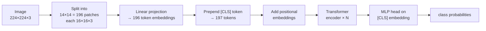
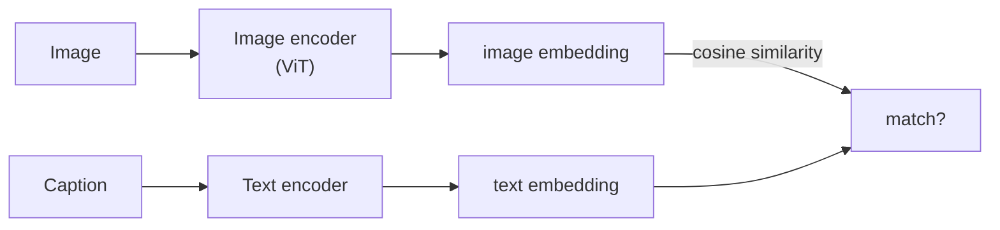

## Vision Transformers and Pretraining

Big picture (no jargon)

The **Vision Transformer (ViT)** (Dosovitskiy et al. 2020) showed that **the same Transformer encoder used in NLP can do image classification** — just chop the image into 16×16 patches, treat each patch as a "word", add positional embeddings, and run a standard Transformer encoder. With **enough data** (JFT-300M), ViT matches or beats CNNs. With less data, CNNs still win because of their built-in inductive bias (locality + translation invariance).

**Pretraining** (training a giant model on a generic, self-supervised objective) and **fine-tuning** (adapting it to a downstream task with little labelled data) is the dominant paradigm of modern AI. **MAE** (Masked Autoencoder) and **DINO** for vision; **CLIP** for vision-language; **BERT/GPT/T5** for text. Together with the Transformer architecture, these are why we have **foundation models**.

**Real-world analogy.** ViT is like reading a comic strip — you can recognise characters and scenes from a sequence of small panels (16×16 patches). Pretraining is like sending a child to school for 12 years on a general curriculum so they can later pick up a new subject (specialised job) in days, not years. The general curriculum is what gives the foundation model its broad competence.

### Vocabulary — every term, defined plainly

- **Vision Transformer (ViT)** — Transformer encoder applied to image patches as tokens.
- **Patch** — a $P \times P$ pixel block (typically $16 \times 16$); flattened and linearly projected to a token embedding.
- **Patch embedding** — linear projection from $\mathbb R^{P^2 \cdot C}$ to $\mathbb R^{d_\text{model}}$.
- **CLS token** — extra learnable token prepended to the sequence; its final embedding is used as the image representation for classification.
- **Positional embedding** — added to patch embeddings; encodes spatial position; usually learned 1-D in ViT (works fine).
- **Inductive bias** — built-in assumptions about the world (e.g., locality, translation invariance in CNNs). ViT has *less*; needs more data.
- **ViT-B / ViT-L / ViT-H** — Base / Large / Huge variants; differ in depth, width, heads.
- **JFT-300M** — Google's internal 300M-image dataset used to pretrain ViT.
- **Pretraining** — training on a large, generic, often self-supervised objective.
- **Self-supervised** — labels are derived from the data itself (no human annotation).
- **Fine-tuning** — adapting a pretrained model to a downstream task (often with a tiny labelled dataset).
- **MAE (Masked Autoencoder)** — self-supervised pretraining: hide ~75 % of patches, ask the network to reconstruct them.
- **DINO / DINOv2** — self-distillation for self-supervised vision representations; produces strong embeddings without labels.
- **CLIP** — Contrastive Language-Image Pretraining; learns aligned image and text embeddings via contrastive loss.
- **Foundation model** — large, pretrained model adaptable to many tasks (BERT, GPT, ViT, CLIP, …).
- **Scaling laws** — empirical power-law relationships between model size, data size, compute, and loss (Kaplan, Chinchilla).

### Picture it — Vision Transformer

### Build the idea — ViT pipeline

1. **Patchify.** Split a $H \times W \times C$ image into $\frac{HW}{P^2}$ non-overlapping patches of size $P \times P \times C$. For $H = W = 224$, $P = 16$, $C = 3$ → $14 \times 14 = 196$ patches, each a $768$-dim vector after flattening ($16 \cdot 16 \cdot 3 = 768$).
2. **Linear projection.** Embed each patch with a single learned linear layer → $196$ token embeddings of dim $d_\text{model}$.
3. **Prepend CLS token.** Add a learnable token $\mathbf x_\text{CLS}$ at position 0; the sequence is now $197$ tokens.
4. **Add positional embeddings.** 1-D learnable positional embedding for each of the $197$ positions.
5. **Transformer encoder.** Standard $N$-layer encoder (multi-head self-attention + FFN + residual + LayerNorm), exactly as in module 12.
6. **Classification head.** Take the *final* embedding of the CLS token → a small MLP → softmax over classes.

That's it. No convolutions anywhere.

### Build the idea — ViT vs CNN, the inductive-bias trade-off

CNNs build in **locality** (a pixel only sees its neighbours) and **translation invariance** (same kernel slides everywhere). These are hard-coded assumptions about images.

ViT has **none of that**. Self-attention allows global mixing from layer 1; positional embeddings are *learned*; nothing forces translation invariance.

**Consequence.** ViT needs *much* more data to learn what CNNs already know:

| Pretraining data | ViT vs ResNet |
|---|---|
| ImageNet-1k (1.3M images) | CNN wins |
| ImageNet-21k (14M images) | Roughly tied |
| JFT-300M (300M images, Google internal) | ViT wins |

When data is abundant, ViT's flexibility (no rigid bias) becomes an advantage. When data is scarce, CNN's prior structure is a free lunch.

### Build the idea — model variants

| Model | Layers $N$ | $d_\text{model}$ | Heads $h$ | Params |
|---|---:|---:|---:|---:|
| ViT-Base | 12 | 768 | 12 | 86 M |
| ViT-Large | 24 | 1024 | 16 | 307 M |
| ViT-Huge | 32 | 1280 | 16 | 632 M |

### Build the idea — pretraining paradigms

**1. Supervised pretraining.** Pretrain on a giant labelled dataset (e.g., ImageNet-21k, JFT-300M); fine-tune on a smaller target dataset. Strong, expensive labels.

**2. Self-supervised — MAE (He et al. 2021).**
- Mask out ~**75 %** of patches at random (this works! 75 % is much more aggressive than NLP's BERT 15 %).
- Encoder sees only the *visible* patches.
- A small decoder receives the encoder output + mask tokens and reconstructs the missing pixels.
- Loss: pixel-level MSE on the masked patches only.
- After pretraining, throw away the decoder; use the encoder for downstream tasks.

Why so much masking? Pixel redundancy is high (neighbouring pixels are similar). 75 % forces the model to learn meaningful global structure.

**3. Self-supervised — DINO (Caron et al. 2021).** Self-distillation: a student network's output (different augmented view) is trained to match a teacher network's output (different view of the same image). Teacher = exponential moving average of the student. No labels, no negatives.

**4. Vision-language — CLIP (Radford et al. 2021).** Train a vision encoder + text encoder jointly so that **matched image-caption pairs** have high cosine similarity in a shared embedding space and **mismatched pairs** have low similarity. Trained on **400M image-text pairs scraped from the web**. Result: zero-shot image classification by simply scoring "a photo of a {class_name}" against the image — no fine-tuning needed.

### Build the idea — fine-tuning vs linear probe vs zero-shot

| Method | What you train | When to use |
|---|---|---|
| **Fine-tune** | All weights (or LoRA) | Best accuracy; have ≥ a few thousand labels |
| **Linear probe** | Only a new classifier on frozen features | Quick eval of pretraining quality; very small data |
| **Zero-shot** (CLIP) | Nothing | No labels at all; new class discovered at deploy time |

### Build the idea — scaling laws

Empirically (Kaplan, OpenAI 2020; Hoffmann/Chinchilla, DeepMind 2022): model loss follows **power laws** in data size, parameter count, and compute. **Chinchilla** found that for compute-optimal training, **data tokens ≈ 20 × parameters**. Most pre-Chinchilla LLMs were over-parameterised relative to data. Scaling laws are *the* reason the field obsesses about parameter counts and dataset sizes.

<dl class="symbols">
  <dt>$P$</dt><dd>patch size (typically 16)</dd>
  <dt>$H, W, C$</dt><dd>image height, width, channels</dd>
  <dt>$d_\text{model}$</dt><dd>token embedding dim</dd>
  <dt>CLS</dt><dd>classification token; its final embedding represents the whole image</dd>
</dl>

### Worked example — fully expanded

Worked example: ViT-B/16 on a 224×224 image

**Image.** $224 \times 224 \times 3$ RGB.

**Step 1 — patchify.** $P = 16$ → $\frac{224}{16} = 14$ patches per side → $14 \times 14 = 196$ patches. Each patch is $16 \times 16 \times 3 = 768$ pixels (flattened).

**Step 2 — embed.** Linear projection $\mathbb R^{768} \to \mathbb R^{768}$ ($d_\text{model} = 768$ for ViT-B). 196 token embeddings, each $\in \mathbb R^{768}$.

**Step 3 — prepend CLS.** Sequence is now $197 \times 768$.

**Step 4 — add positional embeddings.** 197 learned 768-dim vectors, added element-wise.

**Step 5 — encoder.** 12 standard Transformer encoder blocks. Each block:
- Multi-head self-attention with $h = 12$ heads, $d_k = 768 / 12 = 64$ per head.
- FFN with $d_\text{ff} = 4 \cdot 768 = 3072$.
- Residual + LayerNorm.

**Step 6 — classification.** Take the CLS token's final embedding (a 768-dim vector). Linear → 1000 logits (for ImageNet) → softmax → predicted class.

**Compute cost per image.** Self-attention is $\mathcal O(n^2 d) = \mathcal O(197^2 \cdot 768) \approx 3 \times 10^7$ ops per layer for attention (modest). FFN is $\mathcal O(n \cdot d \cdot d_\text{ff}) = \mathcal O(197 \cdot 768 \cdot 3072) \approx 4.6 \times 10^8$ per layer. Per layer: ~$5 \times 10^8$ FLOPs. Over 12 layers: $\sim 6 \times 10^9$ FLOPs ≈ 17 GFLOPs total — comparable to a ResNet-50 forward pass (~4 GFLOPs) but with much more flexibility.

**Parameter count.**
- Patch embedding: $768 \times 768 \approx 6 \times 10^5$.
- Per encoder block: $\sim 7 \times 10^6$ (attention $\approx 4 \cdot 768^2 \approx 2.4 \times 10^6$ + FFN $\approx 2 \cdot 768 \cdot 3072 \approx 4.7 \times 10^6$).
- 12 blocks: $\sim 8.5 \times 10^7$.
- Plus CLS, posenc, classifier head — total ≈ **86 M params** ✓.

**Pretraining.** Train on JFT-300M for 7 epochs → fine-tune on ImageNet → 88.5 % top-1, beating ResNet-152.

### How to think about it

Mental model — image as a sequence; data as the new compute

**ViT** says: stop hard-coding "images are local + translation-invariant"; just **let attention learn it from data, given enough data**. This is the same lesson as elsewhere in deep learning: hand-engineered features (SIFT, HOG) → CNNs (learned features) → Transformers (learned everything, even the locality bias).

**Pretraining + fine-tuning** is the workhorse of modern ML:
- Pretrain a giant model once on a generic, self-supervised objective.
- Fine-tune it cheaply on dozens of downstream tasks.
- The pretrained model becomes a **foundation** — a starting point everyone builds on.

**Self-supervised pretraining** (MAE, DINO, CLIP) is the unlock — it removes the need for human labels, letting models train on the entire internet of images and text.

**CLIP** is special: it enables **zero-shot classification** by embedding the class names as text. New class needed? Just write its name; no retraining.

**When this comes up in ML.** ViTs are now the default vision backbone for foundation models (Segment Anything, DINOv2, AlphaFold-Multimer). CLIP embeddings power text-to-image search and are the conditioning signal for Stable Diffusion / DALL·E. MAE is the recipe behind most modern self-supervised vision pretraining. Fine-tuning a pretrained ViT or CLIP encoder is the **default first move** for any modern vision project — you basically never train from scratch on small datasets anymore.

Watch out — common traps

- **ViTs need lots of data** — training ViT-B from scratch on ImageNet-1k (1.3M images) underperforms ResNet. Either pretrain on bigger data or use heavy augmentation (e.g., DeiT recipe).
- **Patch size matters.** Smaller patches → more tokens → quadratic blowup. $P = 16$ is the standard sweet spot.
- **Position encoding interpolation** is needed if you fine-tune at a different image resolution than pretraining.
- **CLS token isn't sacred** — global average pooling over patch tokens often works just as well; some recent ViTs drop CLS.
- **MAE: the encoder sees only visible patches** (75 % gone). The mask tokens are introduced *only* at the decoder. This makes pretraining ~3-4× faster than naively masking all 100 % through the encoder.
- **CLIP's zero-shot accuracy is only as good as its training data** — if the concept wasn't in the 400M scraped pairs, it can't recognise it. Also: CLIP inherits the biases of its scraped data.
- **Fine-tune the right way.** Use a *small* learning rate for pretrained layers (or freeze early ones); use a *large* one for the new classifier head — this is **discriminative learning rates** from module 8.
- **Foundation models are not free of their training data.** They reproduce its biases, errors, and copyright issues. Always evaluate on your own held-out test set, not just the public benchmark.

Exam tip

Three guaranteed sub-questions: **(a) draw the ViT pipeline**: patchify → linear embedding → CLS token → positional embedding → Transformer encoder → MLP head on CLS; state that 224×224 with patch 16 → 196 patches; **(b) explain why ViT needs more data than CNN** — fewer inductive biases (no built-in locality / translation invariance), so it must learn them from data; **(c) describe one self-supervised method** (MAE: mask 75 % of patches and reconstruct pixels; or CLIP: contrastive image-text alignment for zero-shot transfer). Bonus: name three foundation-model families (BERT, GPT, ViT/CLIP) and state the Chinchilla rule (≈ 20 tokens per parameter for compute-optimal LM training).

