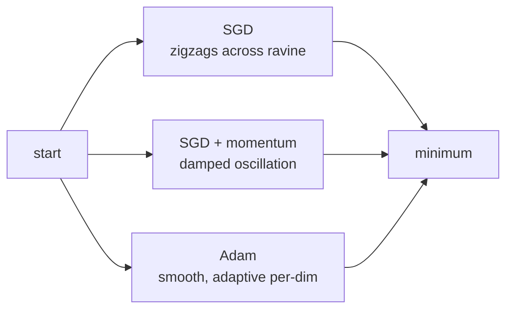
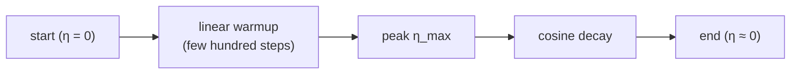

## Deep Optimization — Adam, Momentum, Schedules

Big picture (no jargon)

Vanilla SGD ($\theta \leftarrow \theta - \eta \nabla L$) trains modern deep nets badly: oscillates in narrow ravines, stalls on plateaus, takes uniform steps regardless of curvature. Modern optimizers fix this with **two tricks** that combine into **Adam** (the default optimizer for almost everything):

1. **Momentum** — accumulate an exponentially weighted average of past gradients → smoother trajectory; cuts through ravines.
2. **Per-parameter adaptive learning rates** — divide each parameter's step by the magnitude of its recent gradients → big gradients get small steps, small gradients get big steps.

Plus a **learning-rate schedule** that reduces $\eta$ over training (warmup + cosine decay), and you have the recipe behind every modern Transformer, CNN, and diffusion-model training run.

**Real-world analogy.** Vanilla SGD is walking blindfolded down a noisy hillside, stepping with a fixed stride. Momentum is letting a heavy ball roll downhill — short bumps don't deflect it. Adaptive LR is adjusting your stride to the terrain — small steps on cliffs, big strides on flat ground. The schedule is sprinting at first (warmup + high LR) and tip-toeing as you near the bottom (cosine decay).

### Vocabulary — every term, defined plainly

- **Optimizer** — algorithm for updating parameters using gradients.
- **SGD** — stochastic gradient descent; one step per mini-batch.
- **Momentum** — exponential moving average of past gradients; $\beta \approx 0.9$.
- **Nesterov momentum** — momentum with a "look-ahead" gradient; slightly faster.
- **Adagrad** — divides each parameter's step by $\sqrt{\sum_t g_t^2}$; learning rate decays to zero.
- **RMSProp** — Adagrad with exponential moving average instead of full sum; LR doesn't decay to zero.
- **Adam** — momentum + RMSProp + bias correction; the standard default.
- **Bias correction** — divides the moving averages by $1 - \beta^t$ to undo init-at-zero bias.
- **AdamW** — Adam with **decoupled** weight decay; correct way to combine L2 with adaptive optimizers.
- **Learning-rate schedule** — function $\eta(t)$ that varies the LR over training (warmup, step decay, cosine, …).
- **Warmup** — start with a small LR, ramp up over the first few hundred / thousand steps.
- **Cosine decay** — smooth half-cosine schedule from initial LR down to (near) zero.
- **Linear scaling rule** — when batch size $\times k$, multiply LR by $k$ (with warmup).
- **Gradient clipping** — cap the global norm of the gradient at some threshold; prevents exploding-gradient blowups (RNNs, Transformers).

### Picture it — SGD vs SGD+momentum vs Adam in a ravine

### Build the idea — vanilla SGD with momentum

$$
\mathbf v_t \;=\; \beta\, \mathbf v_{t-1} + \mathbf g_t, \qquad \theta_{t+1} \;=\; \theta_t - \eta\, \mathbf v_t.
$$

$\mathbf g_t = \nabla_\theta L(\theta_t; \text{batch})$ is the mini-batch gradient. $\beta \approx 0.9$ → effective averaging window of $1/(1-\beta) = 10$ recent gradients.

**Nesterov variant** — evaluate gradient at the *look-ahead* point $\theta_t - \eta \beta \mathbf v_{t-1}$ instead of $\theta_t$. Slightly improved convergence; usually a small win.

### Build the idea — Adagrad → RMSProp

**Adagrad** (Duchi 2011): per-parameter adaptive LR by accumulated squared gradients.

$$
G_t \;=\; G_{t-1} + \mathbf g_t^2, \qquad \theta_{t+1} \;=\; \theta_t - \frac{\eta}{\sqrt{G_t + \varepsilon}} \odot \mathbf g_t.
$$

Frequently updated weights get smaller steps; rarely updated weights (e.g. embeddings of rare words) get bigger steps. **Problem:** $G_t$ grows monotonically → effective LR → 0 → training stalls.

**RMSProp** (Hinton lecture 2012): replace the sum with an exponential moving average:

$$
G_t \;=\; \rho\, G_{t-1} + (1 - \rho)\, \mathbf g_t^2.
$$

Now the denominator stays bounded; LR doesn't decay to zero. Common $\rho = 0.9$.

### Build the idea — Adam (the default)

**Adam** (Kingma & Ba 2014) = momentum + RMSProp + bias correction.

$$
\begin{aligned}
\mathbf m_t &\;=\; \beta_1\, \mathbf m_{t-1} + (1-\beta_1)\, \mathbf g_t & \text{1st moment (mean of gradients)}\\
\mathbf v_t &\;=\; \beta_2\, \mathbf v_{t-1} + (1-\beta_2)\, \mathbf g_t^2 & \text{2nd moment (uncentered variance)}\\
\hat{\mathbf m}_t &\;=\; \mathbf m_t / (1 - \beta_1^t) & \text{bias correction}\\
\hat{\mathbf v}_t &\;=\; \mathbf v_t / (1 - \beta_2^t) & \text{bias correction}\\
\theta_{t+1} &\;=\; \theta_t - \frac{\eta}{\sqrt{\hat{\mathbf v}_t} + \varepsilon}\, \hat{\mathbf m}_t.
\end{aligned}
$$

**Default hyperparameters** (rarely need to change): $\beta_1 = 0.9$, $\beta_2 = 0.999$, $\varepsilon = 10^{-8}$, $\eta = 10^{-3}$ (or $10^{-4}$ for Transformers).

**Why bias correction?** $\mathbf m_0 = \mathbf v_0 = 0$, so the EMAs are biased toward zero in the first few steps. Dividing by $1 - \beta^t$ removes this bias (correction is large early, vanishes as $t \to \infty$).

### Build the idea — AdamW (correct weight decay)

L2 regularisation in Adam gets *scaled* by the adaptive LR — weights with large gradients get less regularisation than they should. **AdamW** (Loshchilov & Hutter 2017) **decouples** weight decay from the gradient update:

$$
\theta_{t+1} \;=\; \theta_t - \eta\!\left(\frac{\hat{\mathbf m}_t}{\sqrt{\hat{\mathbf v}_t} + \varepsilon} + \lambda \theta_t\right).
$$

The $\lambda \theta_t$ term is added directly, *not* via the gradient. Always prefer **AdamW** over Adam for Transformers (this is what BERT, GPT, ViT all use).

### Build the idea — learning-rate schedules

**Step decay** — divide $\eta$ by 10 every $k$ epochs (classic CNN recipe).

**Cosine decay** — smooth schedule:

$$
\eta(t) \;=\; \eta_\min + \tfrac{1}{2}(\eta_\max - \eta_\min)\!\left(1 + \cos\!\left(\frac{t}{T} \pi\right)\right).
$$

Standard for modern CNNs and ViTs.

**Warmup + cosine** — linear ramp-up for the first $T_w$ steps, then cosine decay. Standard for Transformers (BERT, GPT, ViT). Why warmup? At init, the model's predictions are random → gradients can be huge or wildly inconsistent → a high LR causes blow-up. Warmup gives the model time to stabilise before pushing hard.

### Build the idea — linear scaling rule (large batch training)

Goyal et al. 2017 (Facebook): when you scale batch size by $k$, scale LR by $k$ (with warmup). Justification: a step with batch $k B$ is approximately $k$ "small-batch" steps' worth of gradient → take $k$× the step.

This rule lets you train ResNet-50 on ImageNet in 1 hour with batch 8192 (vs the old 256-batch baseline).

### Build the idea — gradient clipping (RNNs, Transformers)

If $\|\mathbf g\|_2 > c$, rescale: $\mathbf g \leftarrow \mathbf g \cdot c / \|\mathbf g\|_2$. Prevents the rare exploding-gradient catastrophe in RNNs and the early-Transformer-training instability. Common $c = 1.0$.

<dl class="symbols">
  <dt>$\eta$</dt><dd>learning rate</dd>
  <dt>$\beta, \beta_1, \beta_2$</dt><dd>EMA decay rates</dd>
  <dt>$\mathbf m_t$</dt><dd>1st moment (mean of gradients)</dd>
  <dt>$\mathbf v_t$</dt><dd>2nd moment (uncentered variance)</dd>
  <dt>$\varepsilon$</dt><dd>numerical stabiliser ($\sim 10^{-8}$)</dd>
  <dt>$\lambda$</dt><dd>weight-decay coefficient</dd>
</dl>

### Worked example — fully expanded

Worked example: 3 Adam steps by hand

**Setup.** Single scalar parameter $\theta$, init $\theta_0 = 1.0$. Loss $L(\theta) = \tfrac12 \theta^2$ → gradient $g = \theta$. Adam defaults: $\beta_1 = 0.9$, $\beta_2 = 0.999$, $\eta = 0.1$ (large for visibility), $\varepsilon = 10^{-8}$. Init $m_0 = v_0 = 0$.

**Step 1** ($t = 1$). $g_1 = \theta_0 = 1.0$.

$$
m_1 = 0.9 \cdot 0 + 0.1 \cdot 1.0 = 0.1; \quad v_1 = 0.999 \cdot 0 + 0.001 \cdot 1 = 0.001.
$$

Bias correction: $\hat m_1 = 0.1 / (1 - 0.9) = 1.0; \quad \hat v_1 = 0.001 / (1 - 0.999) = 1.0$. (Bias correction undoes the underestimation perfectly at $t = 1$.)

Update: $\theta_1 = 1.0 - 0.1 \cdot (1.0 / (\sqrt{1.0} + \varepsilon)) \approx 1.0 - 0.1 = 0.9$.

**Step 2** ($t = 2$). $g_2 = \theta_1 = 0.9$.

$$
m_2 = 0.9 \cdot 0.1 + 0.1 \cdot 0.9 = 0.09 + 0.09 = 0.18.
$$
$$
v_2 = 0.999 \cdot 0.001 + 0.001 \cdot 0.81 = 0.000999 + 0.00081 = 0.001809.
$$

Bias correction: $\hat m_2 = 0.18 / (1 - 0.81) = 0.18 / 0.19 \approx 0.947$. $\hat v_2 = 0.001809 / (1 - 0.998001) = 0.001809 / 0.001999 \approx 0.905$.

Update: $\theta_2 = 0.9 - 0.1 \cdot (0.947 / (\sqrt{0.905} + \varepsilon)) = 0.9 - 0.1 \cdot (0.947 / 0.951) \approx 0.9 - 0.0996 \approx 0.800$.

**Step 3** ($t = 3$). $g_3 = 0.800$.

$$
m_3 = 0.9 \cdot 0.18 + 0.1 \cdot 0.800 = 0.162 + 0.080 = 0.242.
$$
$$
v_3 = 0.999 \cdot 0.001809 + 0.001 \cdot 0.640 = 0.001807 + 0.000640 = 0.002447.
$$

$\hat m_3 = 0.242 / (1 - 0.729) = 0.242 / 0.271 \approx 0.893$. $\hat v_3 = 0.002447 / (1 - 0.997003) = 0.002447 / 0.002997 \approx 0.8166$.

Update: $\theta_3 = 0.800 - 0.1 \cdot (0.893 / (\sqrt{0.8166} + \varepsilon)) = 0.800 - 0.1 \cdot (0.893 / 0.904) \approx 0.800 - 0.0988 \approx 0.701$.

**Compare with vanilla SGD** at $\eta = 0.1$: $\theta_1 = 0.9$, $\theta_2 = 0.81$, $\theta_3 = 0.729$. Adam takes a slightly *larger* step at each iteration here because $\hat v$ stays modest and momentum is building → smoother, faster descent in the easy region. In a real-world high-dim ravine, Adam's adaptive per-dim scaling is what wins — different parameters get different effective LRs based on their gradient history.

### How to think about it

Mental model — Adam = momentum + per-parameter LR + bias correction

Read Adam's update equation as **three composed ideas**:

1. **$\mathbf m_t$ (1st moment)** — momentum. Smooths the noisy mini-batch gradient direction.
2. **$\mathbf v_t$ (2nd moment)** — per-parameter "gradient magnitude history". Big-gradient dimensions get small steps; tiny-gradient dimensions get big steps.
3. **Bias correction** — fixes the cold-start underestimation of the EMAs.

The result: a robust optimizer that works well across architectures with default hyperparameters.

**Schedule mantra:** **"warmup + cosine decay"** for Transformers; **step decay** or cosine for CNNs; **always** decay $\eta$ — never train at peak LR for the whole run.

**When this comes up in ML.** Adam(W) is the default for Transformers and most modern training. SGD+momentum is still strong for CNNs on ImageNet (the famous ResNet recipe). Cosine schedules with linear warmup are everywhere (BERT, GPT, ViT, Llama). If you train *any* big model, you'll write `optimizer = AdamW(model.parameters(), lr=1e-4, weight_decay=0.01); scheduler = CosineLRScheduler(...)` — that line of code is in every modern training script.

Watch out — common traps

- **Use AdamW, not Adam, with weight decay.** Plain Adam + L2 is mathematically equivalent to scaled-by-LR weight decay → too weak on big-gradient parameters.
- **Default LR for Adam is $10^{-3}$**, but for Transformers it's $10^{-4}$ or smaller. Always sweep the LR — it's the single most important hyperparameter.
- **Adam can generalise *worse* than SGD+momentum on some image tasks** — there's a small literature on "Adam vs SGD generalisation gap". For state-of-the-art ImageNet, a tuned SGD+momentum still beats Adam. For Transformers and most other things, Adam wins.
- **Warmup is non-optional for Transformers.** Without it, the first few steps' large gradients can wreck initialisation.
- **Don't decay the LR by 10× too suddenly** — gradient noise can cause the loss to jump back up. Smooth (cosine) is safer than step.
- **Gradient clipping mismatch:** clip *globally* (norm of all gradients combined), not per-parameter — per-parameter clipping changes the gradient *direction*.
- **Don't reset Adam's moments mid-training** unless you know what you're doing — they're a learned state.
- **Mixed-precision training (fp16/bf16)** sometimes needs a slightly larger $\varepsilon$ in Adam to avoid divisions by tiny numbers.

Exam tip

Three guaranteed sub-questions: **(a) write Adam's update equations** ($\mathbf m, \mathbf v$ EMAs + bias correction + update) and state the default hyperparameters ($\beta_1 = 0.9, \beta_2 = 0.999, \varepsilon = 10^{-8}$); **(b) explain *why* bias correction is needed** — $\mathbf m_0 = \mathbf v_0 = 0$ biases the early EMAs toward zero; division by $1 - \beta^t$ undoes this; **(c) describe one schedule** (cosine decay, or warmup-then-cosine for Transformers) and state the linear scaling rule (LR ∝ batch size). Bonus: contrast Adam vs AdamW on weight decay, and explain why warmup matters.

