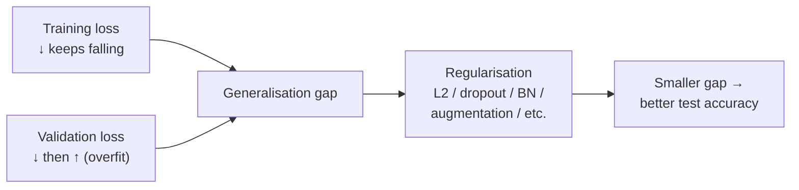
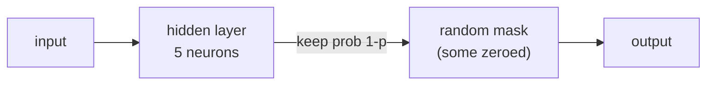

## Deep Regularization — Dropout, BatchNorm, Augmentation

Big picture (no jargon)

Deep nets have **enormous capacity** — millions to billions of parameters. With nothing to stop them, they will memorise the training set perfectly while generalising terribly. **Regularisation** is the bag of tricks that closes the train-test gap. The four big families:

1. **Weight penalties** — L1, L2 (weight decay).
2. **Stochastic regularisation** — dropout (zero out random neurons).
3. **Normalisation layers** — BatchNorm, LayerNorm, GroupNorm (act as regularisers as a side effect).
4. **Data augmentation** — synthetically grow the training set (flip, crop, Mixup, CutMix).

Plus: **label smoothing**, **early stopping**, and **ensembling**.

You almost never use just one — modern training recipes stack 4-6 of these simultaneously. The "secret sauce" of state-of-the-art ImageNet/Transformer training is mostly the regularisation cocktail, not new architectures.

**Real-world analogy.** Studying for an exam from a single textbook → memorising answers (overfitting). Regularisation is forcing yourself to learn from many sources, with random pages missing (dropout), with text rewritten in different fonts/sizes (normalisation), and with your friend constantly making up new practice problems (augmentation). You end up actually understanding the subject — not memorising it.

### Vocabulary — every term, defined plainly

- **Overfitting** — model fits training data well but generalises poorly to new data.
- **Capacity / model complexity** — number of effective parameters; how flexible the model is.
- **Generalisation gap** — train loss − test loss.
- **Regularisation** — any modification to the training procedure that *reduces* the generalisation gap.
- **L2 / weight decay** — add $\lambda \|\mathbf w\|_2^2$ to the loss; shrinks weights toward zero.
- **L1** — add $\lambda \|\mathbf w\|_1$ to the loss; encourages sparsity (many weights → exactly 0).
- **Dropout** — randomly zero out a fraction $p$ of neurons during training; rescale at inference.
- **Inverted dropout** — modern implementation: rescale during *training* by $1/(1-p)$ so inference is just identity.
- **DropConnect / Stochastic Depth** — drop weights / drop entire layers (instead of activations).
- **BatchNorm (BN)** — per-mini-batch normalisation along the channel axis (CNNs).
- **LayerNorm (LN)** — per-token normalisation along the feature axis (Transformers).
- **GroupNorm** — per-group normalisation (works for small batch sizes; default for object detection).
- **Internal covariate shift** — the original (and partly debunked) motivation for BN.
- **Data augmentation** — synthetic transformations applied to inputs to increase effective dataset size.
- **Mixup** — convex combination of two training examples (and labels).
- **CutMix** — paste a random patch from one image into another.
- **Label smoothing** — replace one-hot labels with $(1-\varepsilon)$ on the true class, $\varepsilon / (K-1)$ elsewhere.
- **Early stopping** — stop training when validation loss plateaus / starts rising.
- **Ensembling** — train several models and average predictions; almost always reduces variance.

### Picture it — overfitting and the regularisation toolbox

### Build the idea — L1 and L2 weight penalties

L2 regularisation (a.k.a. **weight decay** in deep learning) adds a quadratic penalty:

$$
L_\text{reg}(\theta) \;=\; L(\theta) + \lambda \|\theta\|_2^2.
$$

Gradient: $\nabla L_\text{reg} = \nabla L + 2\lambda \theta$. The update shrinks $\theta$ toward zero each step. Typical $\lambda = 10^{-4}$ to $10^{-2}$.

L1 adds $\lambda \|\theta\|_1$ → soft-threshold gradient → drives many weights to exactly 0 → **sparse model**.

In Adam, prefer **AdamW** which decouples weight decay from the gradient (see module 14).

### Build the idea — dropout

**Training time.** For each mini-batch, multiply each neuron's activation by an independent Bernoulli$(1-p)$ mask. With probability $p$, the neuron is zeroed out for this batch.

**Inference time** (inverted dropout, the standard modern implementation): no dropout; activations are taken as-is. The training-time activations were already rescaled by $1/(1-p)$ so the expected output matches at inference.

Typical $p$:
- **Fully-connected layers**: $p \approx 0.5$.
- **Convolutional layers**: $p \approx 0.1$ - $0.3$ (channels share spatial structure → dropping isolated activations does little; better to drop entire channels — *Spatial Dropout*).
- **Transformers**: $p \approx 0.1$ on attention scores and FFN output.

**Why dropout works (intuition).** Forces redundancy — no single neuron can become indispensable, since it might be missing on the next batch. Approximates training an exponential ensemble of sub-networks (one per dropout mask) and averaging at test time.

### Build the idea — BatchNorm (CNNs)

For each mini-batch, normalise each channel's activations to mean 0, variance 1; then apply learnable scale $\gamma$ and shift $\beta$ per channel:

$$
\hat x_i \;=\; \frac{x_i - \mu_B}{\sqrt{\sigma_B^2 + \varepsilon}}, \qquad y_i \;=\; \gamma \hat x_i + \beta.
$$

$\mu_B, \sigma_B^2$ are computed over the mini-batch (and spatial dims, for CNNs). At inference, use *running averages* of $\mu, \sigma^2$ accumulated during training.

**Effects:**
1. Allows much higher learning rates (smoother loss landscape).
2. Reduces sensitivity to initialisation.
3. Acts as a regulariser (the per-batch noise in $\mu_B, \sigma_B$ is stochastic regularisation) — often you need *less* dropout when using BN.

**Catch.** Performance degrades for tiny batch sizes ($B = 1, 2$) — $\mu_B, \sigma_B$ become noisy. For object detection / segmentation, use **GroupNorm** instead.

### Build the idea — LayerNorm (Transformers)

Same equations as BN but normalise across the *feature* dimension *per sample*, not across the batch:

$$
\mu \;=\; \tfrac{1}{d}\sum_{i=1}^d x_i, \qquad \sigma^2 \;=\; \tfrac{1}{d}\sum_{i=1}^d (x_i - \mu)^2.
$$

No batch dependence → works with any batch size, including 1. Standard for Transformers (and most NLP) because batch sizes vary and sequence-length varies between batches.

| Norm | Normalises over | Use |
|---|---|---|
| **BatchNorm** | batch + spatial dims | CNNs (large batch) |
| **LayerNorm** | feature dim per sample | Transformers, RNNs |
| **GroupNorm** | groups of channels per sample | Detection, small-batch |
| **InstanceNorm** | per-channel per-sample (single instance) | Style transfer |

### Build the idea — data augmentation

The cheapest regulariser of all. **Augment the training set with label-preserving transformations.**

**Image augmentations:** random crop, horizontal flip, colour jitter, random erasing, Cutout, AutoAugment, RandAugment, AugMix.

**Mixup.** Train on convex combinations of two examples:

$$
\tilde {\mathbf x} \;=\; \lambda \mathbf x_i + (1-\lambda) \mathbf x_j, \qquad \tilde {\mathbf y} \;=\; \lambda \mathbf y_i + (1-\lambda) \mathbf y_j,
$$

with $\lambda \sim \text{Beta}(\alpha, \alpha)$. Forces the model to behave linearly between training points; reduces overconfidence.

**CutMix.** Cut a random rectangle from image $\mathbf x_j$ and paste it onto $\mathbf x_i$; mix the labels in proportion to the area ratio. Often beats Mixup on ImageNet.

**Text augmentations:** synonym replacement, back-translation, EDA, dropout on tokens.

**Speech augmentations:** SpecAugment (mask time and frequency bands).

### Build the idea — label smoothing

Standard one-hot target: $y = (0, \dots, 0, 1, 0, \dots, 0)$. Label smoothing replaces this with:

$$
y_k^\text{LS} \;=\; (1 - \varepsilon)\, y_k + \varepsilon / K,
$$

where $K$ is the number of classes and $\varepsilon \approx 0.1$. The model is no longer pushed to put 100 % probability on the correct class → **less overconfident**, often calibrates better, and improves generalisation.

### Build the idea — early stopping & ensembling

**Early stopping.** Track validation loss; stop when it plateaus or rises for $k$ epochs (patience). Save the best checkpoint. Free regularisation.

**Ensembling.** Train $M$ models (different seeds / different architectures); average predictions. Almost always improves accuracy by 1-2 %. Expensive at inference. Cheap variant: **snapshot ensembles** — save checkpoints from a single training run with cyclic LR.

<dl class="symbols">
  <dt>$\lambda$</dt><dd>regularisation strength (weight-decay coef, or Mixup mixing ratio)</dd>
  <dt>$p$</dt><dd>dropout probability (fraction of neurons zeroed)</dd>
  <dt>$\gamma, \beta$</dt><dd>learnable scale and shift in normalisation layers</dd>
  <dt>$\mu_B, \sigma_B^2$</dt><dd>per-batch mean and variance</dd>
  <dt>$\varepsilon$</dt><dd>label-smoothing strength (or numerical $\varepsilon$ in normaliser)</dd>
  <dt>$K$</dt><dd>number of classes</dd>
</dl>

### Worked example — fully expanded

Worked example: a modern ResNet-50 ImageNet recipe

**Goal.** Train ResNet-50 from scratch on ImageNet (1.3M images, 1000 classes) to ~78 % top-1 accuracy.

**The full regularisation cocktail used in modern recipes (e.g. timm "A1"):**

1. **L2 weight decay** $\lambda = 10^{-4}$ on conv and FC weights (not on BN params or biases).
2. **BatchNorm** in every residual block.
3. **Data augmentation:**
   - Random resized crop to $224 \times 224$.
   - Horizontal flip with $p = 0.5$.
   - Colour jitter (brightness, contrast, saturation).
   - RandAugment ($N = 2$ ops, $M = 7$ magnitude).
   - Random erasing $p = 0.25$.
4. **Mixup** $\alpha = 0.2$ (sample $\lambda$ from Beta(0.2, 0.2)).
5. **CutMix** $\alpha = 1.0$ applied with 50 % probability per batch (alternated with Mixup).
6. **Label smoothing** $\varepsilon = 0.1$.
7. **Stochastic Depth** (drop entire residual blocks) with linearly increasing rate from 0 to 0.05.
8. **Optimizer:** SGD + Nesterov momentum (β = 0.9), batch 1024.
9. **LR schedule:** linear warmup for 5 epochs to peak LR 0.5; cosine decay over 300 epochs to 0.
10. **EMA** of model weights (Polyak averaging) — uses an exponential moving average of weights at inference.

**Without any regularisation:** training loss → 0 in ~30 epochs, validation accuracy plateaus around 60 % (badly overfit).

**With this cocktail:** training loss never quite reaches 0; validation accuracy climbs steadily to ~78–80 %.

**Take-away.** Modern SOTA on ImageNet is *less* about architecture (the same ResNet-50 from 2015) and *more* about the regularisation recipe. The "He et al. ResNet-50 = 76 % top-1" of 2015 has become "ResNet-50 = 80 % top-1" by 2022 with no architectural change — purely better training.

**Numerical sanity check on label smoothing.** For $K = 1000$ classes, $\varepsilon = 0.1$: target probability on correct class is $1 - 0.1 = 0.9$; on each wrong class, $0.1 / 999 \approx 10^{-4}$. The model is no longer pushed to output exactly 1.0 → less overconfident, better calibrated, slight accuracy gain.

### How to think about it

Mental model — bias / variance, and the art of stacking

Recall the bias-variance decomposition (math-foundations module 9):

- **High bias** = underfit, model too simple → don't add regularisation; add capacity instead.
- **High variance** = overfit, model too flexible → add regularisation.

Deep nets almost always start in the high-variance regime → regularisation is critical.

The **art** is in the **stacking**:
- Always: weight decay + BN/LN + standard augmentation.
- Often add: dropout (especially in FC heads and Transformers), label smoothing, Mixup/CutMix.
- Sometimes add: stochastic depth (very deep nets), EMA weights, ensembles.

Each item helps a little. Together, they close the train-test gap dramatically.

**When this comes up in ML.** Every modern training recipe. PyTorch's `timm` library is essentially a curated collection of regularisation tricks. If your model overfits — start with augmentation, then weight decay, then dropout. If it underfits — remove regularisation, add capacity, train longer.

**Architecture choice and regularisation interact.** ViT needs *more* regularisation than ResNet at the same scale because it has fewer inductive biases (module 13). Pretraining + fine-tuning is itself a form of regularisation — the pretrained weights act as a strong prior.

Watch out — common traps

- **Don't apply weight decay to BN/LN parameters or biases** — they have small magnitudes by design; decaying them hurts.
- **Don't use BN with batch size 1 or 2** — statistics are too noisy. Use GroupNorm or LayerNorm.
- **Don't use BN in RNNs** — sequence-length variability + recurrence interact badly. Use LayerNorm instead.
- **Dropout + BN can fight each other** — BN's per-batch noise can be partially cancelled by dropout's noise, and BN's training-vs-inference gap differs from dropout's. Often, BN alone is enough; or use a small dropout (0.1) on top.
- **Beware Mixup with one-hot loss bugs.** Use the soft-label cross-entropy form, not nearest-neighbour rounding.
- **Augmentation must be *label-preserving*** — flipping a digit "6" upside-down to make it look like a "9" is not augmentation, it's mislabelling.
- **Early stopping ≠ free.** It introduces dataset leakage if you use the val set for both early stopping AND hyperparameter tuning. Use a held-out test set.
- **Ensembling improves accuracy but at $M$× inference cost.** Distillation can compress the ensemble back into a single model.
- **Don't tune regularisation by training accuracy.** Always look at validation. Training loss alone tells you nothing about generalisation.

Exam tip

Three guaranteed sub-questions: **(a) describe dropout** — randomly zero out neurons with probability $p$ during training; rescale by $1/(1-p)$ in inverted dropout; acts as approximate ensembling; **(b) state the BatchNorm equations** $\hat x = (x - \mu_B) / \sqrt{\sigma_B^2 + \varepsilon}$ → $y = \gamma \hat x + \beta$, and contrast BN (CNNs, batch-axis) vs LN (Transformers, feature-axis); **(c) name at least four regularisers** in a modern training recipe (e.g. weight decay $\lambda = 10^{-4}$, dropout $p = 0.5$, label smoothing $\varepsilon = 0.1$, Mixup, augmentation, EMA). Bonus: state why GroupNorm is used for object detection (small batch sizes) and explain why label smoothing improves calibration.

