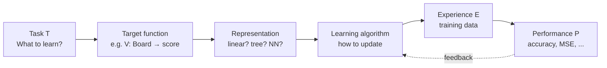

## Introduction to ML & Designing a Learning System

Big picture (no jargon)

**Machine learning is the opposite of classical programming.** In classical programming, *you* write the rules and the computer applies them to data. In ML, you give the computer **data and the desired outputs**, and the computer figures out the rules itself. The art of "designing a learning system" is choosing **what** to learn, **how** to represent the knowledge, and **how** to update it from experience.

Tom Mitchell's classic three-part definition pins this down: a program *learns* from experience $E$ with respect to task $T$ and performance measure $P$ if its performance at $T$, as measured by $P$, **improves** as $E$ accumulates.

**Real-world analogy.** Teaching a child to recognise dogs vs cats is ML. You don't list rules ("triangular ears, retractable claws"); you point at hundreds of pictures and label them. The child's brain (the *learner*) gradually figures out the rules. The "performance measure" is whether they correctly identify the next dog.

### Vocabulary — every term, defined plainly

- **Task $T$** — what the system needs to do (classify emails, recommend movies, drive a car).
- **Performance measure $P$** — how we score success (accuracy, MSE, $F_1$, BLEU, return).
- **Experience $E$** — the data the learner sees (labelled examples, demonstrations, reward signals).
- **Target function $f$** — the *true* mapping from inputs to outputs we wish we knew.
- **Hypothesis space $H$** — the family of functions the learner is willing to consider (e.g. all linear functions, all depth-$d$ trees, all neural nets of a given architecture).
- **Inductive bias** — the assumptions the learner makes that allow it to generalise from finite data to *unseen* inputs. Without bias, no generalisation is possible.
- **Supervised learning** — data is $(x_i, y_i)$ pairs; goal is to learn $f: x \to y$.
- **Unsupervised learning** — data is $\{x_i\}$ only; goal is to find structure (clusters, low-d embedding, density).
- **Reinforcement learning** — agent acts, observes a reward signal, learns a policy to maximise long-run return.
- **Generalisation** — accurate predictions on data not seen during training; the only thing that ultimately matters.
- **Overfitting / underfitting** — fitting noise (too complex) vs missing signal (too simple).
- **Bias–variance trade-off** — fundamental tension: simpler models systematically miss the truth; complex ones swing wildly with the training set.

### Picture it — designing a learning system (Mitchell's framework)

### Build the idea — the three flavours of learning

| Type | Data | Goal | Examples |
|---|---|---|---|
| **Supervised** | $(x_i, y_i)$ pairs | Learn $f: x \to y$ | Regression, classification |
| **Unsupervised** | Just $x_i$ | Discover structure | Clustering, PCA, GMM, density estimation |
| **Reinforcement** | States + rewards | Policy maximising long-run return | Game-playing, robotics, recommendation |

### Build the idea — Mitchell's five design choices (checkers example)

1. **Choose the target function** — what to predict. For checkers: $V(\text{board}) = $ a score whose maximum corresponds to winning.
2. **Choose the representation** — function class. E.g. $V$ as a linear combination of 6 hand-crafted board features.
3. **Choose the training experience** — direct (a teacher labels good moves) or indirect (we just observe game outcomes).
4. **Choose the learning algorithm** — how to update $V$. E.g. an LMS-style update on each board state seen during self-play.
5. **Performance system** — how predictions get *used*. The move-chooser plays the move whose resulting board has highest $\hat V$.

### Build the idea — bias–variance decomposition (preview)

For a regression target $y = f(x) + \varepsilon$ with $\varepsilon$ noise of variance $\sigma^2$, the expected squared error of an estimator $\hat f$ at point $x$ decomposes as:

$$
\mathbb E\!\left[(\hat f(x) - y)^2\right] \;=\; \underbrace{(\mathbb E\hat f(x) - f(x))^2}_{\text{bias}^2} \;+\; \underbrace{\operatorname{Var}(\hat f(x))}_{\text{variance}} \;+\; \underbrace{\sigma^2}_{\text{irreducible noise}}.
$$

- **Simple models** → high bias, low variance → underfit.
- **Complex models** → low bias, high variance → overfit.
- **Sweet spot** in the middle → minimum total error.

### Build the idea — inductive bias

Inductive bias

The set of assumptions a learner uses to predict outputs for inputs *it has not seen*. Examples:
- Linear regression assumes the relationship is linear.
- k-NN assumes nearby points have similar labels (smoothness).
- CNNs assume translation invariance — a cat is a cat wherever it sits in the image.
- Lasso assumes most features are irrelevant (sparsity).

The **No Free Lunch theorem** says that, averaged over *all* possible target functions, every learner performs equally well. So bias is not optional — it's what makes one learner better than another *on the problems we actually care about*.

<dl class="symbols">
  <dt>$T, P, E$</dt><dd>task, performance measure, experience (Mitchell's triple)</dd>
  <dt>$f$</dt><dd>true target function</dd>
  <dt>$\hat f$</dt><dd>learner's hypothesis (estimate of $f$)</dd>
  <dt>$H$</dt><dd>hypothesis space (function class)</dd>
  <dt>$\sigma^2$</dt><dd>irreducible noise variance</dd>
</dl>

### Worked example — fully expanded

Worked example: spam classifier as a Mitchell-style design

**Task ($T$)** — classify each incoming email as **spam** or **ham**.

**Performance ($P$)** — $F_1$ score on a held-out set of 2 000 labelled emails (we care about both precision *and* recall, because both false alarms and missed spam are costly).

**Experience ($E$)** — 10 000 labelled emails (8 000 ham + 2 000 spam) drawn from real user inboxes.

**Representation** — bag-of-words feature vector + linear logistic regression. Each email becomes a sparse vector $\mathbf x \in \{0, 1\}^V$ where $V$ is the vocabulary.

**Algorithm** — stochastic gradient descent on binary cross-entropy loss with $\ell_2$ regularisation.

**Inductive bias** — spam-indicating words add up *linearly* toward the spam decision (no complex word interactions modelled).

**Performance system** — at inference time, compute $\sigma(\mathbf w^\top \mathbf x + b)$; flag as spam if $\ge 0.5$. Threshold can be tuned to favour precision or recall.

**Bias-variance lens.** Logistic regression is on the high-bias, low-variance end. A deep neural net would have lower bias (could capture word interactions) but higher variance (might overfit on 10 k examples). Cross-validation will tell us which side of the trade-off wins for our budget of training data.

### How to think about it

Mental model — the program writes itself

Classical programming: **Data + Program → Output**. ML: **Data + Output → Program**. The "program" the ML system produces is the trained model — a function whose weights came from data, not from a programmer typing rules.

The hypothesis space $H$ is the *menu* of programs the learner can produce. The learning algorithm is the *waiter* picking one from the menu. Inductive bias is *which menu* you chose — that decision is half the design problem.

**When this comes up in ML.** Every project starts here: writing down $T$, $P$, $E$, choosing a model class (representation), and committing to a learning algorithm. Get $P$ wrong (e.g. accuracy on imbalanced data) and you'll optimise the wrong thing for months. Get $E$ wrong (biased data) and your model inherits that bias.

Watch out — common traps

- **A learner that memorises perfectly but fails on new data has zero generalisation** — and generalisation is the only thing that matters.
- **No Free Lunch.** No algorithm is universally best. The right learner depends on the structure of *your* problem.
- **Choosing $P$ matters more than choosing the algorithm.** Optimising the wrong metric is the most expensive mistake in industrial ML.
- **Training-set distribution should match deployment.** A model trained on lab images may fail on smartphone photos — that's a covariate shift, not a model bug.
- **"More data" doesn't always help** — it helps with variance (overfitting), not bias (wrong model class).

Exam tip

Memorise Mitchell's $\langle T, P, E \rangle$ definition and his **five design choices** for a learning system — this almost always appears as the opening short-answer. Be ready to apply the framework to a novel scenario (medical diagnosis, recommendation, robotics) by stating each piece in one sentence.

