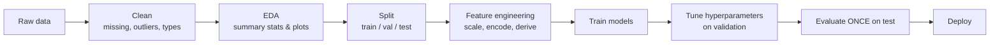

## Math Preliminaries & ML Workflow

<div class="callout intuition"><span class="callout-title">Big picture (no jargon)</span>

Before any clever algorithm, you need a **clean dataset** and a **disciplined workflow**: split the data, scale the features, train on one part, tune on another, and evaluate **once** on a third part you've never touched. This module is the engineering scaffolding that makes everything else in the course possible — get this wrong and even the best algorithm gives meaningless numbers.

The single most important rule: **the test set is a one-time exam, not a development tool**. Every time you peek at it during model development, your reported numbers become slightly more dishonest.

**Real-world analogy.** Studying for an exam: practice problems = training set; a mock test you take to gauge your weak spots = validation; the real exam = test. If you saw the real exam before the day, your "score" would be inflated and useless as a measure of your true ability.

</div>

### Vocabulary — every term, defined plainly

- **Training set** — data used to fit model parameters (weights).
- **Validation set** — held-out data used to tune **hyperparameters** (regularisation strength, depth, learning rate, $K$ in k-NN, etc.) and select among candidate models.
- **Test set** — held-out data used **once at the very end** to give an unbiased estimate of generalisation error.
- **Hyperparameter** — a knob set *before* training (vs parameters that are learned during training).
- **k-fold cross-validation** — split training data into $k$ folds; train on $k - 1$, validate on the held-out fold; rotate $k$ times; average the scores.
- **Stratified split** — preserves the class proportions in every split (essential for imbalanced data).
- **Standardisation (z-score)** — $x' = (x - \mu) / \sigma$. Default scaling for distance- or gradient-based methods.
- **Min–max normalisation** — $x' = (x - \min) / (\max - \min)$ → bounded to $[0, 1]$.
- **Robust scaling** — uses median and IQR instead of mean and std; resistant to outliers.
- **One-hot encoding** — represent a categorical feature with $k$ distinct values as $k$ binary indicator columns.
- **Ordinal encoding** — assign integers $0, 1, 2, \dots$ to ordered categories. Implies equal spacing.
- **Target / mean encoding** — replace a category with the average target value seen for it (high cardinality). Risk of leakage.
- **Imputation** — filling in missing values (mean / median / mode / kNN / MICE).
- **Data leakage** — when information from the test (or future) set sneaks into training. Silent killer of ML projects.

### Picture it — the workflow



### Build the idea — math you must know

| Area | Why you need it |
|---|---|
| **Linear algebra** (vectors, matrices, dot product, rank, eigen, SVD) | Every model is a matrix multiplication somewhere. |
| **Calculus** (gradient, partial derivatives, chain rule) | Every gradient-based learner uses the chain rule (backprop). |
| **Probability** (random variables, expectation, variance, joint/conditional, Bayes) | Loss functions are expectations; classifiers output probabilities. |
| **Optimisation** (convex vs non-convex, gradient descent) | Training is optimisation; convergence properties depend on convexity. |

### Build the idea — splitting strategy

| Split | Typical share | Purpose |
|---|---|---|
| **Training** | 60–80 % | Fit model parameters |
| **Validation** | 10–20 % | Tune hyperparameters, model selection |
| **Test** | 10–20 % | **Final** unbiased performance — *touch once* |

**$k$-fold cross-validation** (use when data is scarce):

1. Shuffle and split training data into $k$ equal folds.
2. For $i = 1, \dots, k$: train on the other $k - 1$ folds, validate on fold $i$.
3. Average the $k$ validation scores → CV score.

Common choices: $k = 5$ or $k = 10$. Stratified $k$-fold for classification.

### Build the idea — feature scaling

| Method | Formula | When |
|---|---|---|
| Standardisation (z-score) | $x' = (x - \mu)/\sigma$ | Default, especially for distance/gradient methods |
| Min–max normalisation | $x' = (x - \min)/(\max - \min)$ | Bounded $[0, 1]$, image pixels |
| Robust scaling | $x' = (x - \text{median})/\text{IQR}$ | Outliers present |

**Critical rule:** *fit the scaler on the training set only*, then apply that *same* fitted scaler to validation and test. Otherwise you've leaked info from val/test into training.

### Build the idea — encoding categorical features

| Type | Method | Pitfall |
|---|---|---|
| Nominal (no order) | One-hot | Dimensionality blow-up if too many categories |
| Ordinal (order matters) | Integer encoding | Implies equal spacing between levels |
| High cardinality | Target / frequency encoding | Risk of leakage; use cross-fold target encoding |

### Build the idea — handling missing data

1. **Deletion** (drop rows or columns) — only when missingness is small and random.
2. **Imputation** — mean/median/mode (simple), kNN imputation, or MICE (multivariate iterative).
3. **Indicator variable** — add a 0/1 "was-missing" column so the model can learn the pattern.

<dl class="symbols">
  <dt>$N$</dt><dd>total number of samples</dd>
  <dt>$d$</dt><dd>number of features</dd>
  <dt>$k$ (in CV)</dt><dd>number of folds</dd>
  <dt>$\mu, \sigma$</dt><dd>mean and standard deviation of a feature (computed on TRAIN only)</dd>
  <dt>IQR</dt><dd>Inter-Quartile Range = $Q_3 - Q_1$</dd>
</dl>

### Worked example — fully expanded

<div class="callout example"><span class="callout-title">Worked example: Iris classification pipeline</span>

**Data.** Iris, $N = 150$, 3 classes (50 each), 4 numeric features.

**Step 1 — Stratified split.** 80 / 10 / 10 stratified by species:

- Train: 120 samples (40 of each class)
- Validation: 15 (5 of each)
- Test: 15 (5 of each)

**Step 2 — Standardise the features.**
```
scaler = StandardScaler().fit(X_train)   # FIT on train only
X_train_s = scaler.transform(X_train)
X_val_s   = scaler.transform(X_val)      # SAME scaler on val
X_test_s  = scaler.transform(X_test)     # SAME scaler on test
```

**Step 3 — Train logistic regression** with several values of $C$ (inverse regularisation strength) on $X_{\text{train}_s}$:

- $C = 0.01$: train acc 0.83, val acc 0.80
- $C = 0.1$: train acc 0.94, val acc 0.93
- $C = 1$: train acc 0.97, val acc 0.93 ← tied best
- $C = 10$: train acc 1.00, val acc 0.87 ← over-fitting

**Step 4 — Pick model.** $C = 0.1$ (slightly simpler, ties on val) — refit on (train ∪ val).

**Step 5 — Final test.** Evaluate the chosen model **once** on $X_{\text{test}_s}$. Report this number — *don't* go back and tweak.

**Step 6 — Sanity check for leakage.**
- Did we fit the scaler on the full dataset before splitting? **No.** ✓
- Did we tune hyperparameters using the test set? **No.** ✓
- Did we use stratified split for the imbalanced (or balanced!) classification? **Yes.** ✓

</div>

### How to think about it

<div class="callout intuition"><span class="callout-title">Mental model — three different roles</span>

The validation set is the *training-time judge* — it tells you how well the model would do on unseen data, so you can iterate on architecture and hyperparameters. The test set is the *final exam* — it gives the boss an honest report. If you peek at the test set even once during development, your iterations slowly bake test-set knowledge into your model and your "final" number is biased upward.

Cross-validation is just "split → train → score" run $k$ times to average out the noise of any single split. It costs more compute but gives more reliable model selection on small data.

**When this comes up in ML.** Every Kaggle competition, every research paper, every production model. The most common cause of "my model worked great in dev but flopped in production" is leakage during preprocessing or evaluation.

</div>

<div class="callout warn"><span class="callout-title">Watch out — common traps</span>

- **Data leakage** is the #1 silent killer. Examples: scaler fit on full data; encoding target into features; future info available in time-series train; duplicate rows leaking across splits.
- **Class imbalance.** Always stratify splits. Use weighted losses or resampling (SMOTE) if very imbalanced. Accuracy on a 99 / 1 dataset is meaningless.
- **Time-series data.** *Never* random-split. Use forward-chaining: train on past, validate on a strict future window. Random splits leak future into past.
- **One-hot blowup.** A column with 1 000 distinct categories becomes 1 000 features → memory + curse of dimensionality. Use target / frequency encoding or hashing trick.
- **Imputing with the mean changes your data's variance.** Often safer to add a "was-missing" indicator and impute with median.
- **The test-set should never be touched twice.** If you find yourself running test eval more than once, you're treating it as a validation set — and you no longer have a real test.

</div>

<div class="callout tip"><span class="callout-title">Exam tip</span>

Be ready to (a) explain in one or two sentences the role of each split, (b) identify a leakage scenario in a code snippet (look for `fit_transform(X)` *before* splitting!), and (c) describe $k$-fold cross-validation and when to use stratified vs forward-chaining. These conceptual questions are bread and butter on any ML exam.

</div>
