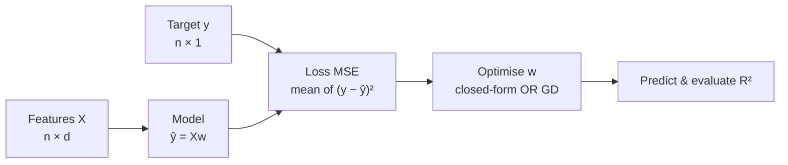

## Linear Regression

Big picture (no jargon)

**Linear regression assumes the target is a weighted sum of the features, plus noise.** Pick the weights so that the sum of squared errors on the training data is as small as possible. Despite (or because of) its simplicity, it is the most-interpretable, most-fundamental ML algorithm — every other regressor (trees, neural nets, gradient boosting) is, in some sense, trying to beat it.

**Real-world analogy.** Predicting house price from size, bedrooms, location-score: assume `price ≈ a·size + b·bedrooms + c·loc + intercept`. Find the four numbers $(a, b, c, \text{intercept})$ that make the predicted prices closest to actual ones across all training houses. Done — that's linear regression.

### Vocabulary — every term, defined plainly

- **Feature / regressor / independent variable** — input column $x_j$.
- **Target / response / dependent variable** — output we predict, $y$.
- **Design matrix $X$** — $n \times d$ matrix; rows are samples, columns are features.
- **Weights / coefficients $\mathbf w$** — the numbers we learn, one per feature.
- **Intercept / bias $w_0$** — constant term, often absorbed by adding a column of 1s to $X$.
- **Residual** — $r_i = y_i - \hat y_i$ (what's left after the model's prediction).
- **MSE (Mean Squared Error)** — $\tfrac1n \sum r_i^2$ (sometimes with a $\tfrac12$ for clean derivatives).
- **OLS (Ordinary Least Squares)** — minimise sum of squared residuals; the classic linear regression solution.
- **Normal equation** — closed-form formula for the OLS optimum: $\hat{\mathbf w} = (X^\top X)^{-1} X^\top \mathbf y$.
- **Gradient descent** — iterative alternative when $X^\top X$ is too big to invert.
- **Ridge regression** — OLS + $\ell_2$ penalty $\lambda \|\mathbf w\|_2^2$.
- **Lasso regression** — OLS + $\ell_1$ penalty $\lambda \|\mathbf w\|_1$ (drives some weights *exactly* to 0).
- **Elastic net** — both $\ell_1$ and $\ell_2$ penalties together.
- **$R^2$** — proportion of variance in $y$ explained by the model; 1.0 is perfect, 0 is no better than predicting the mean, negative means worse than the mean.
- **Multicollinearity** — features highly correlated with each other; makes $X^\top X$ near-singular and weights unstable.
- **Gauss–Markov theorem** — under linearity / independence / homoscedasticity / no-multicollinearity, OLS is **BLUE** (Best Linear Unbiased Estimator).

### Picture it

### Build the idea — the model

$$
\hat y \;=\; w_0 + w_1 x_1 + \dots + w_d x_d \;=\; \mathbf w^\top \mathbf x + w_0.
$$

In matrix form (with $w_0$ absorbed by adding a leading column of 1s to $X$):

$$
\hat{\mathbf y} \;=\; X\,\mathbf w.
$$

### Build the idea — loss (MSE)

$$
J(\mathbf w) \;=\; \frac{1}{2n}\sum_{i=1}^n \big(y_i - \hat y_i\big)^2 \;=\; \frac{1}{2n}\,\big\|\mathbf y - X\mathbf w\big\|_2^2.
$$

The factor $\tfrac1{2n}$ is cosmetic — it makes the gradient cleaner and the average error scale-stable.

### Build the idea — closed-form (Normal Equation)

Set $\nabla_{\mathbf w} J = 0$:

$$
\nabla_{\mathbf w} J \;=\; -\frac{1}{n} X^\top (\mathbf y - X\mathbf w) \;=\; 0
\;\;\Longrightarrow\;\; X^\top X\,\mathbf w \;=\; X^\top \mathbf y.
$$

If $X^\top X$ is invertible:

$$
\boxed{\;\hat{\mathbf w} \;=\; (X^\top X)^{-1} X^\top \mathbf y\;}.
$$

**Cost.** $\mathcal O(nd^2)$ to form $X^\top X$ + $\mathcal O(d^3)$ for the inverse. Fine for $d \lesssim 10^4$; otherwise use GD.

### Build the idea — gradient descent

When the closed form is too costly:

$$
\mathbf w \;\leftarrow\; \mathbf w \;-\; \frac{\eta}{n}\, X^\top (X\mathbf w - \mathbf y).
$$

Choose learning rate $\eta$ small enough not to oscillate. Scales to huge $n$, $d$.

### Build the idea — regularisation

| Variant | Loss | Effect | Closed form |
|---|---|---|---|
| **Ridge** ($\ell_2$) | $J + \lambda\|\mathbf w\|_2^2$ | Shrinks weights toward 0; *all* features kept | $\hat{\mathbf w} = (X^\top X + \lambda I)^{-1} X^\top \mathbf y$ |
| **Lasso** ($\ell_1$) | $J + \lambda\|\mathbf w\|_1$ | Drives some weights *exactly* to 0 → feature selection | No closed form; coordinate descent / LARS |
| **Elastic Net** | $J + \lambda_1\|\mathbf w\|_1 + \lambda_2\|\mathbf w\|_2^2$ | Combines: stable + sparse | No closed form |

Ridge always has a unique solution because $X^\top X + \lambda I$ is **always** invertible for $\lambda > 0$ — even when $X^\top X$ is rank-deficient.

### Build the idea — Gauss–Markov assumptions

1. **Linearity** of the relationship.
2. **Independence** of the errors $\varepsilon_i$.
3. **Homoscedasticity** — constant variance of errors $\operatorname{Var}(\varepsilon_i) = \sigma^2$.
4. **No (perfect) multicollinearity** among features.
5. **Normality of errors** — *only* needed for confidence intervals / hypothesis tests, *not* for point estimates.

Under (1)–(4), OLS is the **Best Linear Unbiased Estimator (BLUE)**: smallest variance among all linear unbiased estimators.

<dl class="symbols">
  <dt>$X$</dt><dd>$n \times d$ design matrix (with leading 1s column for intercept)</dd>
  <dt>$\mathbf w$</dt><dd>weight vector, $d$-dimensional</dd>
  <dt>$\mathbf y$</dt><dd>target vector, $n$-dimensional</dd>
  <dt>$\hat{\mathbf y}$</dt><dd>predictions, $n$-dimensional</dd>
  <dt>$X^\top X$</dt><dd>$d \times d$ Gram matrix; invertible iff features linearly independent</dd>
  <dt>$\lambda$</dt><dd>regularisation strength: bigger = more shrinkage</dd>
  <dt>$\eta$</dt><dd>learning rate for gradient descent</dd>
</dl>

### Worked example — fully expanded

Worked example: 5 houses, predict price from size

**Data.** Sizes (sq.ft) $x = (500, 800, 1000, 1200, 1500)$; prices (lakh ₹) $y = (40, 65, 80, 95, 120)$.

**Step 1 — means.** $\bar x = (500 + 800 + 1000 + 1200 + 1500)/5 = 5000/5 = 1000$. $\bar y = (40+65+80+95+120)/5 = 400/5 = 80$.

**Step 2 — deviations.**

| $x_i - \bar x$ | $y_i - \bar y$ | $(x_i - \bar x)(y_i - \bar y)$ | $(x_i - \bar x)^2$ |
|---|---|---|---|
| $-500$ | $-40$ | $20\,000$ | $250\,000$ |
| $-200$ | $-15$ | $3\,000$ | $40\,000$ |
| $0$ | $0$ | $0$ | $0$ |
| $200$ | $15$ | $3\,000$ | $40\,000$ |
| $500$ | $40$ | $20\,000$ | $250\,000$ |
| **Sum** | | **$46\,000$** | **$580\,000$** |

(Wait — let me recompute carefully: $-500 \cdot -40 = 20\,000$; $-200 \cdot -15 = 3\,000$; $200 \cdot 15 = 3\,000$; $500 \cdot 40 = 20\,000$. Total $= 20\,000 + 3\,000 + 0 + 3\,000 + 20\,000 = 46\,000$. ✓)

**Step 3 — slope.**

$$
\hat w_1 \;=\; \frac{\sum (x_i - \bar x)(y_i - \bar y)}{\sum (x_i - \bar x)^2} \;=\; \frac{46\,000}{580\,000} \;\approx\; 0.0793.
$$

**Step 4 — intercept.**

$$
\hat w_0 \;=\; \bar y - \hat w_1 \bar x \;=\; 80 - 0.0793 \cdot 1000 \;\approx\; 80 - 79.3 \;=\; 0.7.
$$

**Step 5 — model.** $\hat y \approx 0.0793\,x + 0.7$ (lakh ₹).

**Step 6 — sanity-check predictions.**

| $x$ | $\hat y$ | $y$ | residual |
|---|---|---|---|
| $500$ | $40.4$ | $40$ | $-0.4$ |
| $800$ | $64.1$ | $65$ | $0.9$ |
| $1000$ | $80.0$ | $80$ | $0.0$ |
| $1200$ | $95.9$ | $95$ | $-0.9$ |
| $1500$ | $119.7$ | $120$ | $0.3$ |

Residuals are tiny and roughly balanced — model fits well.

**Step 7 — $R^2$.** $\text{SS}_\text{tot} = \sum (y_i - \bar y)^2 = 1600 + 225 + 0 + 225 + 1600 = 3650$. $\text{SS}_\text{res} = (-0.4)^2 + 0.9^2 + 0 + (-0.9)^2 + 0.3^2 = 0.16 + 0.81 + 0 + 0.81 + 0.09 = 1.87$. $R^2 = 1 - 1.87 / 3650 \approx 0.9995$ — essentially perfect linear fit.

### How to think about it

Mental model — projection onto the column space

The normal equation has a beautiful geometric interpretation: $\hat{\mathbf y} = X\hat{\mathbf w}$ is the **orthogonal projection of $\mathbf y$ onto the column space of $X$**. Among all vectors reachable as a linear combination of the feature columns, $\hat{\mathbf y}$ is the closest one to $\mathbf y$ in Euclidean distance.

The residual vector $\mathbf y - \hat{\mathbf y}$ is therefore *perpendicular* to every column of $X$ — that's literally what $X^\top(\mathbf y - X\mathbf w) = 0$ says.

Ridge changes this to a *shrunken* projection — pull weights toward zero, accepting a little bias in exchange for much lower variance. Lasso adds a *corner* in the constraint set that makes some weights snap to exactly zero — automatic feature selection.

**When this comes up in ML.** Linear / ridge regression is everywhere as a baseline. The bias term in any neural net's last layer **is** linear regression. Logistic regression's "score" before the sigmoid is linear regression. Knowing this geometry transfers to PCA (also a projection), to least-squares system identification, and to Gaussian-process regression (the kernel-trick generalisation).

Watch out — common traps

- **Multicollinearity** ($X^\top X$ near-singular) makes $\hat{\mathbf w}$ wildly unstable — small data perturbations swing weights by huge amounts. Diagnose with VIF or condition number; fix with ridge regression.
- **Don't trust $R^2$ alone.** A high $R^2$ can hide a terrible fit if residuals show structure (curve, trumpet shape). Always plot residuals vs predictions.
- **Linear regression gives unbounded points, not probabilities.** For classification, use **logistic regression** (next module).
- **Outliers** dominate squared loss — one point can swing the fit. Use Huber loss, RANSAC, or robust regression.
- **Feature scaling matters for ridge / lasso.** $\lambda \|\mathbf w\|_2^2$ penalises a feature in metres differently from the same feature in km.
- **Extrapolation.** Predictions outside the training range of $x$ are fundamentally unreliable — the model has no evidence there.

Exam tip

Be able to (a) **derive the normal equation from scratch** by setting $\nabla_{\mathbf w} J = 0$, (b) explain why **ridge always has a unique solution** even when $X^\top X$ is singular ($\lambda I > 0$ makes the matrix positive-definite hence invertible), and (c) write out the geometric "projection onto column space" interpretation. Numerical calculation of the slope $\hat w_1 = \sum(x-\bar x)(y-\bar y) / \sum(x-\bar x)^2$ for a 4–5 point dataset is also a guaranteed sub-question.

