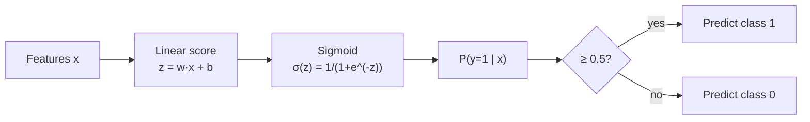

## Logistic Regression & Linear Classification

Big picture (no jargon)

Linear regression outputs unbounded numbers — useless for "is this email spam?". **Logistic regression** wraps a linear score in a smooth S-shaped function called a **sigmoid** that squashes the score into $[0, 1]$, which we read as a **probability**. The decision boundary is still a hyperplane (linear), but the output is now a calibrated class probability.

**Real-world analogy.** A doctor scores a patient's risk on dozens of factors, sums them weighted by importance, and passes the total through a "how worried should I be?" curve that maxes out at 1 (definitely sick) and bottoms at 0 (definitely healthy). Logistic regression is the mathematical version of exactly that.

### Vocabulary — every term, defined plainly

- **Logit** — the linear score $z = \mathbf w^\top \mathbf x + b$. It is the **log-odds** of the positive class.
- **Sigmoid (logistic) function** — $\sigma(z) = 1 / (1 + e^{-z})$; smoothly maps $\mathbb R$ to $(0, 1)$.
- **Odds** — $\mathrm{odds} = p / (1 - p)$. Logit $= \log(\mathrm{odds})$.
- **Decision boundary** — the surface where $\hat p = 0.5$, equivalently $z = 0$. For logistic regression: a hyperplane.
- **Bernoulli likelihood** — for a single sample with label $y \in \{0, 1\}$: $\hat p^{y}(1 - \hat p)^{1-y}$.
- **Cross-entropy / log-loss / negative log-likelihood (NLL)** — the loss obtained by taking $-\log$ of the Bernoulli likelihood and averaging.
- **Softmax** — the multi-class generalisation of sigmoid: $\mathrm{softmax}(\mathbf z)_k = e^{z_k} / \sum_j e^{z_j}$.
- **Categorical cross-entropy** — multi-class loss using softmax outputs.
- **MLE (Maximum Likelihood Estimation)** — fitting $\mathbf w$ to make the observed labels most probable. Equivalent to minimising NLL.
- **IRLS (Iteratively Reweighted Least Squares)** — Newton's method specialised to logistic regression.
- **Convex** — bowl-shaped loss; gradient descent finds the global minimum (no local-minima trap).
- **Regularisation strength $C$** — sklearn's parameter; $C = 1/\lambda$. Larger $C$ → less regularisation.

### Picture it

### Build the idea — the binary model

$$
P(y = 1 \mid \mathbf x) \;=\; \sigma\!\left(\mathbf w^\top \mathbf x + b\right), \qquad \sigma(z) \;=\; \frac{1}{1 + e^{-z}}.
$$

Useful identities:

$$
\sigma(0) = \tfrac12, \qquad \sigma(-z) = 1 - \sigma(z), \qquad \sigma'(z) \;=\; \sigma(z)\,\big(1 - \sigma(z)\big).
$$

The last identity is *essential* for backpropagation through sigmoid units — derivative is computable from the activation alone.

### Build the idea — log-odds interpretation

$$
\log \frac{P(y=1)}{P(y=0)} \;=\; \mathbf w^\top \mathbf x + b.
$$

So $\mathbf w^\top \mathbf x + b$ is literally the **log-odds** of the positive class. Each weight $w_j$ is "how much an increase of one unit in feature $j$ adds to the log-odds". Exponentiating gives the **odds ratio** $e^{w_j}$.

### Build the idea — loss derivation (Bernoulli → cross-entropy)

For label $y_i \in \{0, 1\}$ and prediction $\hat p_i = \sigma(\mathbf w^\top \mathbf x_i + b)$, the Bernoulli likelihood of one sample is

$$
P(y_i \mid \mathbf x_i, \mathbf w) \;=\; \hat p_i^{\,y_i}\,(1 - \hat p_i)^{1 - y_i}.
$$

Assuming i.i.d. samples, the joint likelihood is the product. Take $-\log$ and divide by $n$:

$$
J(\mathbf w) \;=\; -\frac{1}{n}\sum_{i=1}^n \Big[\,y_i\,\log \hat p_i \;+\; (1 - y_i)\,\log(1 - \hat p_i)\,\Big].
$$

This is **binary cross-entropy** (a.k.a. log-loss / NLL). It is **convex** in $\mathbf w$ → gradient descent finds the global optimum.

### Build the idea — gradient (clean form)

$$
\nabla_{\mathbf w} J \;=\; \frac{1}{n}\,X^\top\,(\hat{\mathbf p} - \mathbf y).
$$

Update rule: $\mathbf w \leftarrow \mathbf w - \eta\, \nabla_{\mathbf w} J$. There is **no closed form** (unlike linear regression) — the sigmoid breaks the linearity needed for the normal-equation trick. Use GD, Newton, or IRLS.

### Build the idea — multiclass (softmax) regression

For $K$ classes, replace sigmoid with **softmax**:

$$
P(y = k \mid \mathbf x) \;=\; \frac{\exp(\mathbf w_k^\top \mathbf x)}{\sum_{j=1}^K \exp(\mathbf w_j^\top \mathbf x)}.
$$

Loss = **categorical cross-entropy**:

$$
J \;=\; -\frac{1}{n}\sum_{i=1}^n \sum_{k=1}^K \mathbf 1\{y_i = k\}\,\log P(y_i = k \mid \mathbf x_i).
$$

### Build the idea — decision boundary

A point lies on the boundary when $\sigma(\mathbf w^\top \mathbf x + b) = 0.5$, i.e. $\mathbf w^\top \mathbf x + b = 0$ — a **hyperplane**. So logistic regression is fundamentally a **linear classifier**, despite the nonlinear sigmoid output.

### Build the idea — regularisation

Same recipe as linear regression: add a penalty term to $J$.

| Penalty | Effect |
|---|---|
| $\ell_2$ (ridge) | $J + \lambda \|\mathbf w\|_2^2$ — shrinks weights, prevents divergence on separable data |
| $\ell_1$ (lasso) | $J + \lambda \|\mathbf w\|_1$ — drives weights to 0 (feature selection) |
| Elastic net | Both |

Sklearn parameterises this as $C = 1/\lambda$ (so larger $C$ = less regularisation).

<dl class="symbols">
  <dt>$\sigma(z)$</dt><dd>sigmoid: $1/(1+e^{-z})$, with $\sigma'(z) = \sigma(z)(1-\sigma(z))$</dd>
  <dt>$z = \mathbf w^\top\mathbf x + b$</dt><dd>logit / log-odds</dd>
  <dt>$\hat p_i$</dt><dd>$\sigma(z_i)$, predicted probability of class 1 for sample $i$</dd>
  <dt>$y_i \in \{0,1\}$</dt><dd>true binary label</dd>
  <dt>$C$</dt><dd>sklearn's $1/\lambda$; smaller $C$ = stronger regularisation</dd>
</dl>

### Worked example — fully expanded

Worked example: predict from a 2-feature input

**Setup.** After training, $\mathbf w = (2, -1)$, $b = -1$. Query point $\mathbf x = (1, 2)$.

**Step 1 — compute the logit.**

$$
z \;=\; w_1 x_1 + w_2 x_2 + b \;=\; 2(1) + (-1)(2) + (-1) \;=\; 2 - 2 - 1 \;=\; -1.
$$

**Step 2 — apply sigmoid.**

$$
\hat p \;=\; \sigma(-1) \;=\; \frac{1}{1 + e^{1}} \;=\; \frac{1}{1 + 2.7183} \;=\; \frac{1}{3.7183} \;\approx\; 0.269.
$$

**Step 3 — decide.** $\hat p \approx 0.269 < 0.5$, so predict **class 0**.

**Step 4 — interpret as log-odds.** $z = -1$ means $\log(\mathrm{odds}) = -1$, so $\mathrm{odds} = e^{-1} \approx 0.368$. That is, class 1 is 0.368 times as likely as class 0 → class 1 has probability $0.368 / (1 + 0.368) \approx 0.269$ ✓ (matches the sigmoid).

**Step 5 — gradient sanity check.** Suppose this sample's true label is $y = 1$. The contribution to $\nabla_{\mathbf w} J$ from this one sample is $(\hat p - y) \mathbf x = (0.269 - 1)(1, 2) = (-0.731, -1.462)$. So GD moves $\mathbf w$ in the direction $(0.731, 1.462)$ — increasing $w_1$ and increasing $w_2$ (less negative). After the update, $z$ at this point goes up, $\hat p$ goes up — closer to the true label of 1. ✓

### How to think about it

Mental model — sigmoid as a smooth step

Sigmoid is a smooth, differentiable approximation of a step function:
- Far to the left ($z \ll 0$): $\hat p \approx 0$ — very confident class 0.
- At $z = 0$: $\hat p = 0.5$ — pure indecision.
- Far to the right ($z \gg 0$): $\hat p \approx 1$ — very confident class 1.

The further $\mathbf x$ is from the decision hyperplane (in the direction of $\mathbf w$), the more confident the prediction. The hyperplane itself is the locus of $\hat p = 0.5$.

**When this comes up in ML.** Logistic regression is the *first* layer of every binary-classification neural net (the last layer is sigmoid + cross-entropy). Softmax + cross-entropy is the standard multi-class output of essentially every classifier from MNIST to GPT. Once you understand the gradient $X^\top(\hat{\mathbf p} - \mathbf y)/n$, you understand the gradient of the output layer of every modern neural network.

Watch out — common traps

- **"Logistic regression" is classification, not regression.** The name is historical — it regresses the *log-odds* but the *output* is a class.
- **Perfectly separable data.** Without regularisation, weights diverge to $\pm\infty$ (perfect classification ↔ infinite confidence). $\ell_2$ regularisation prevents this and is essential.
- **Convexity.** Cross-entropy + linear model is convex → unique global minimum. (This is **not** true once you add hidden layers — neural-net losses are non-convex.)
- **Calibration.** Logistic regression outputs are reasonably well-calibrated probabilities *if* your model class is correct. But poorly calibrated under model mis-specification — check with reliability diagrams.
- **Class imbalance.** Naive cross-entropy on a 99 / 1 split predicts the majority class. Use class weights, focal loss, or resampling.
- **Don't use MSE on classification.** It's non-convex with sigmoid outputs and gradients vanish for confidently wrong predictions. Always use cross-entropy.

Exam tip

Three sub-questions appear over and over: **(a) derive cross-entropy from the Bernoulli likelihood**, **(b) prove $\sigma'(z) = \sigma(z)(1 - \sigma(z))$**, and **(c) explain why the decision boundary is linear**. Practice each one until you can do them in under two minutes. Bonus: compute $\hat p$ for a 2-feature numerical example by hand using $\sigma(z) = 1 / (1 + e^{-z})$.

