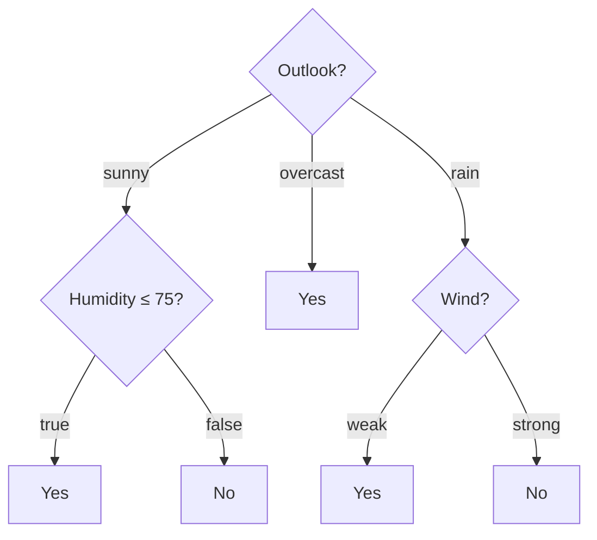

## Decision Trees

Big picture (no jargon)

A **decision tree** asks a sequence of yes/no questions about the features and routes each example down to a **leaf** containing a prediction. You build the tree **greedily, top-down**: at each node, look at every possible split (feature + threshold) and pick the one that **most reduces impurity** in the resulting children. Trees are highly interpretable, handle mixed numeric/categorical features, and require no scaling — but they overfit easily, so we **prune** them.

**Real-world analogy.** A doctor's flowchart: "Fever > 38°? → Yes: cough? → Yes: chest pain? → Yes: probably pneumonia." Each question splits the patient population into smaller, purer groups. The tree just automates choosing *which questions in which order*.

### Vocabulary — every term, defined plainly

- **Node** — a decision point in the tree (asks one question of one feature).
- **Root** — the top node; all data starts here.
- **Branch / edge** — outcome of a node's question routing data to a child.
- **Leaf** — terminal node holding a prediction (class label or numeric value).
- **Depth** — number of edges from root to a node. Tree depth = max leaf depth.
- **Impurity** — how mixed the class labels are in a node. Pure node = all one class.
- **Entropy** — Shannon's information-theoretic impurity, $H = -\sum p_k \log_2 p_k$ (in bits).
- **Gini index** — alternative impurity, $G = 1 - \sum p_k^2$. Faster (no log).
- **Information Gain (IG)** — drop in impurity from parent to weighted children.
- **Gain ratio** — IG normalised by the entropy of the *split itself* (penalises many-valued attributes). Used by C4.5.
- **ID3** — original tree algorithm (Quinlan); uses entropy + IG, multi-way splits, no pruning.
- **C4.5** — successor of ID3; uses gain ratio, handles continuous + missing data, supports pruning.
- **CART** — Classification And Regression Trees; uses Gini (class) or MSE (regression), strictly **binary** splits, post-pruning by cost-complexity.
- **Pre-pruning** — stop growing early (max depth, min samples, IG threshold).
- **Post-pruning** — grow fully, then prune back subtrees that hurt validation accuracy.
- **Cost-complexity pruning** — minimise $R(T) + \alpha |T|$ where $|T|$ = number of leaves, $\alpha$ tunes complexity.

### Picture it — example tree

### Build the idea — impurity measures

For a node containing samples whose class proportions are $p_1, \dots, p_K$:

$$
\text{Entropy: } H \;=\; -\sum_{k=1}^K p_k \log_2 p_k, \qquad \text{Gini: } G \;=\; 1 - \sum_{k=1}^K p_k^2.
$$

Both are 0 for a pure node (one class) and maximised at uniform $p_k = 1/K$.

### Build the idea — Information Gain

Splitting set $S$ on attribute $A$ produces children $S_v$ (one per attribute value $v$):

$$
\text{IG}(S, A) \;=\; H(S) \;-\; \sum_{v \in \text{values}(A)} \frac{|S_v|}{|S|}\,H(S_v).
$$

ID3 picks $A^* = \arg\max_A \text{IG}(S, A)$ at each node.

**Gain ratio** (C4.5) normalises by the *split-information* (entropy of the partition itself):

$$
\text{GR}(S, A) \;=\; \frac{\text{IG}(S, A)}{\text{SplitInfo}(S, A)}, \qquad \text{SplitInfo}(S, A) = -\sum_v \frac{|S_v|}{|S|}\log_2\frac{|S_v|}{|S|}.
$$

This avoids ID3's bias toward attributes with many distinct values (e.g. unique-IDs).

### Build the idea — three classic algorithms

| Algorithm | Splits | Impurity | Pruning | Continuous? |
|---|---|---|---|---|
| **ID3** | Multi-way categorical | Information gain | None | No |
| **C4.5** | Multi-way + binary | Gain ratio | Yes (rule post-pruning) | Yes |
| **CART** | **Binary only** | Gini (class) / MSE (reg) | Cost-complexity | Yes |

### Build the idea — continuous attributes

Sort the values; for each consecutive pair $(v_i, v_{i+1})$ try threshold $t = (v_i + v_{i+1})/2$. Pick the threshold that maximises IG (or minimises Gini / MSE). At most $n - 1$ candidate thresholds per feature.

### Build the idea — pruning

| Method | Idea |
|---|---|
| **Pre-pruning** | Stop splitting when IG below threshold, depth max, leaf size minimum |
| **Post-pruning (reduced-error)** | Build full tree, then prune any subtree whose removal *doesn't hurt* validation accuracy |
| **Cost-complexity (CART)** | Minimise $R(T) + \alpha|T|$; tune $\alpha$ by cross-validation |

### Build the idea — regression trees

Replace impurity with **variance reduction**. At a candidate split, compute

$$
\Delta = \operatorname{Var}(S) - \frac{|S_L|}{|S|}\operatorname{Var}(S_L) - \frac{|S_R|}{|S|}\operatorname{Var}(S_R),
$$

and pick the split that maximises $\Delta$. Leaf prediction = mean of $y$ in the leaf.

<dl class="symbols">
  <dt>$p_k$</dt><dd>fraction of samples of class $k$ in the node</dd>
  <dt>$H(S)$</dt><dd>entropy of the parent (in bits if $\log_2$)</dd>
  <dt>$|S_v|/|S|$</dt><dd>weight of child branch $v$</dd>
  <dt>$|T|$</dt><dd>number of leaves in tree $T$</dd>
  <dt>$\alpha$</dt><dd>complexity penalty in cost-complexity pruning</dd>
</dl>

### Worked example — fully expanded

Worked example: PlayTennis split on "Wind"

**Setup.** 14 samples: 9 yes, 5 no. Candidate split on attribute "Wind" with two values: weak and strong.

**Step 1 — parent entropy.**

$$
H(S) = -\tfrac{9}{14}\log_2\tfrac{9}{14} - \tfrac{5}{14}\log_2\tfrac{5}{14}.
$$

Compute each piece: $\tfrac{9}{14} \approx 0.6429$, $\log_2(0.6429) \approx -0.6374$, product $\approx -0.4097$, negated $= 0.4097$. $\tfrac{5}{14} \approx 0.3571$, $\log_2(0.3571) \approx -1.4854$, product $\approx -0.5305$, negated $= 0.5305$. Sum: $H(S) \approx 0.4097 + 0.5305 = 0.940$ bits.

**Step 2 — child counts.** Weak (8 samples: 6 yes, 2 no). Strong (6 samples: 3 yes, 3 no).

**Step 3 — child entropies.**

Weak: $H_w = -\tfrac{6}{8}\log_2\tfrac{6}{8} - \tfrac{2}{8}\log_2\tfrac{2}{8} = -0.75 \cdot (-0.4150) - 0.25 \cdot (-2) = 0.3113 + 0.5 = 0.811$ bits.

Strong: $H_s = -\tfrac{3}{6}\log_2\tfrac{3}{6} - \tfrac{3}{6}\log_2\tfrac{3}{6} = -0.5 \cdot (-1) - 0.5 \cdot (-1) = 1.000$ bits (perfectly mixed).

**Step 4 — weighted average of child entropies.**

$$
\frac{8}{14}(0.811) + \frac{6}{14}(1.000) \;=\; 0.5714 \cdot 0.811 + 0.4286 \cdot 1.000 \;\approx\; 0.4634 + 0.4286 \;=\; 0.892 \text{ bits}.
$$

**Step 5 — Information Gain.**

$$
\text{IG}(S, \text{Wind}) = 0.940 - 0.892 = 0.048 \text{ bits}.
$$

**Interpretation.** Splitting on Wind reduces uncertainty by only 0.048 bits — a small but positive gain. Other attributes (e.g. Outlook) usually win at the root because they carve out a much purer subset.

**Compare to Gini for the same split.** Parent Gini $= 1 - (9/14)^2 - (5/14)^2 = 1 - 0.413 - 0.128 = 0.459$. Weak Gini $= 1 - (6/8)^2 - (2/8)^2 = 1 - 0.5625 - 0.0625 = 0.375$. Strong Gini $= 1 - 0.25 - 0.25 = 0.5$. Weighted child Gini $= (8/14)(0.375) + (6/14)(0.5) = 0.214 + 0.214 = 0.428$. Gini reduction = $0.459 - 0.428 = 0.031$. Same *ranking* tendency as IG but different absolute scale.

### How to think about it

Mental model — slicing space into rectangles

Each split slices the feature space along an axis-aligned hyperplane. Stack enough slices and you can carve out arbitrarily complex regions of rectangles. This makes trees a **non-linear, non-parametric** model — but with no implicit smoothness prior, they overfit unless you stop or prune.

The greedy top-down algorithm is **myopic** — it picks the locally best split, not the globally best tree (finding the optimal tree is NP-hard). The trick to robust trees in practice is *not* finding the perfect tree but combining many imperfect ones (ensembles — next two modules).

**When this comes up in ML.** Trees are the workhorse of tabular ML. Random Forest and Gradient Boosting (XGBoost, LightGBM, CatBoost) are tree ensembles and dominate Kaggle leaderboards on tabular data. Understanding entropy / IG / Gini is also foundational for information theory, mutual information, and many feature-selection methods.

Watch out — common traps

- **ID3's bias toward many-valued attributes.** A unique-ID column has perfect IG (one sample per leaf!) but useless prediction. Use **gain ratio** or just don't include high-cardinality nuisance features.
- **Trees are unstable.** Small data perturbations can produce wildly different trees. This instability is exactly what bagging / Random Forest exploit.
- **A fully grown tree has zero training error but huge variance.** Always prune (pre or post) or limit depth.
- **Numerical features need sorted thresholds.** Don't try arbitrary cuts — use midpoints between consecutive observed values.
- **Categorical features with many levels** explode multi-way splits. CART handles this by using binary splits ("$\in$ subset" vs "not in subset").
- **Class imbalance.** Tree splits favour the majority class; use class weights or `class_weight='balanced'`.

Exam tip

The **IG calculation** is a guaranteed sub-question. Lay it out as a tidy table: parent entropy → child entropies → weighted sum → subtraction. Show each $-p \log_2 p$ term; examiners give partial credit for each line. Also be ready to (a) state the bias of ID3 and explain how gain ratio fixes it, and (b) describe one pre-pruning and one post-pruning strategy.

