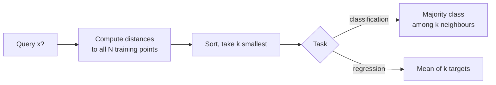

## Instance-Based Learning (k-Nearest Neighbours)

Big picture (no jargon)

Instance-based learners **don't build a model at all**. They just **store the training data** and answer each new query by **looking up the most similar examples** in memory. The canonical example is **k-Nearest Neighbours (k-NN)**: to predict for a new point, find the $k$ closest training points by some distance metric, then **vote** (classification) or **average** (regression) over their labels.

This is "lazy learning": no training phase, all the work happens at query time. It's a non-parametric universal approximator — give it infinite data and it converges to Bayes-optimal accuracy. The catch: in high dimensions, "close" stops meaning anything useful.

**Real-world analogy.** "How should I price this house?" → look at the 5 most similar recently-sold houses in the same neighbourhood (size, age, beds), average their sale prices. That's k-NN regression in real-estate appraisal — exactly how comparative market analysis works.

### Vocabulary — every term, defined plainly

- **Instance-based / memory-based / lazy learning** — store all training data, defer computation to query time.
- **Eager learning** (the opposite) — front-load all training, then discard data and just keep the model. Linear regression, trees, NNs are eager.
- **k-Nearest Neighbours (k-NN)** — predict by majority vote / mean of the $k$ closest training points.
- **Distance metric** — function $d(\mathbf x, \mathbf x')$ measuring dissimilarity.
- **Euclidean distance** ($\ell_2$) — straight-line distance, $\sqrt{\sum (x_j - x'_j)^2}$.
- **Manhattan distance** ($\ell_1$) — sum of absolute differences along axes.
- **Minkowski-$p$** — $\big(\sum |x_j - x'_j|^p\big)^{1/p}$. Generalises $\ell_1, \ell_2, \ell_\infty$.
- **Cosine distance** — $1 - \mathbf x \cdot \mathbf x' / (\|\mathbf x\|\|\mathbf x'\|)$. Common for text and embeddings.
- **Hamming distance** — number of positions where two binary/categorical vectors differ.
- **Distance-weighted k-NN** — closer neighbours count more in the vote / average.
- **Decision boundary** — for k-NN it is piecewise linear (Voronoi cells stitched together).
- **Curse of dimensionality** — in high $d$, all points become roughly equidistant, so "nearest" loses meaning.
- **KD-tree / Ball-tree** — data structures speeding up nearest-neighbour search to $\mathcal O(\log N)$ average per query (in moderate dimensions).
- **Approximate Nearest Neighbours (ANN)** — algorithms (FAISS, HNSW, LSH) that give good-enough neighbours in sub-linear time at high scale.

### Picture it

### Build the idea — distance metrics

| Metric | Formula | When |
|---|---|---|
| Euclidean ($\ell_2$) | $\sqrt{\sum_j (x_j - x'_j)^2}$ | Default; scale-sensitive |
| Manhattan ($\ell_1$) | $\sum_j \|x_j - x'_j\|$ | Grid / city-block; robust to outliers |
| Minkowski-$p$ | $(\sum_j \|x_j - x'_j\|^p)^{1/p}$ | Generalises both ($p=1$: Manhattan, $p=2$: Euclidean) |
| Cosine | $1 - (\mathbf x \cdot \mathbf x') / (\|\mathbf x\|\,\|\mathbf x'\|)$ | Direction matters more than magnitude (text, embeddings) |
| Hamming | $\sum_j \mathbf 1\{x_j \ne x'_j\}$ | Categorical / binary features |

### Build the idea — the algorithm

1. **Choose** $k$ (usually odd, to break ties for binary classification) and a distance metric.
2. **For each query** $\mathbf x$:
   1. Compute distance from $\mathbf x$ to every training point.
   2. Sort and pick the $k$ closest.
   3. **Classification:** majority vote over their labels (with random tie-break).
      **Regression:** mean (or median) of their targets.

### Build the idea — distance-weighted k-NN

Closer neighbours contribute more:

$$
\hat y(\mathbf x) \;=\; \frac{\sum_{i \in N_k(\mathbf x)} w_i\, y_i}{\sum_{i \in N_k(\mathbf x)} w_i}, \qquad w_i \;=\; \frac{1}{d(\mathbf x, \mathbf x_i)^2 + \varepsilon}.
$$

The $\varepsilon$ avoids division by zero when the query coincides with a training point.

### Build the idea — choosing $k$

- **$k = 1$**: zero training error, very high variance, jagged decision boundary, sensitive to label noise.
- **Large $k$**: smoother boundary, higher bias, may smear out small but real local structure.
- **Best $k$**: chosen by cross-validation. Rule of thumb: $k \approx \sqrt N$ as a starting guess.

This is a textbook **bias–variance trade-off** controlled by a single hyperparameter.

### Build the idea — curse of dimensionality

In high $d$, the volume of a unit hyper-cube is concentrated near its boundary, and distances between random points concentrate around their mean — the ratio of the **farthest** to the **nearest** training point approaches 1. So "nearest neighbour" is no longer especially close, and k-NN degenerates.

**Mitigations:** feature selection, PCA / autoencoder embeddings to reduce $d$ before nearest-neighbour search, learned distance metrics (LMNN), or task-specific embeddings (deep features).

<dl class="symbols">
  <dt>$k$</dt><dd>number of neighbours considered</dd>
  <dt>$d(\mathbf x, \mathbf x')$</dt><dd>distance between query and a training point</dd>
  <dt>$N_k(\mathbf x)$</dt><dd>set of indices of the $k$ closest training points to $\mathbf x$</dd>
  <dt>$w_i$</dt><dd>weight assigned to neighbour $i$ in distance-weighted k-NN</dd>
  <dt>$\varepsilon$</dt><dd>small constant to prevent division by zero</dd>
</dl>

### Worked example — fully expanded

Worked example: k-NN classification, k=3

**Training data.**
- $A = (1, 1)$, class $+$
- $B = (2, 2)$, class $+$
- $C = (3, 3)$, class $-$
- $D = (6, 6)$, class $-$

**Query.** $\mathbf x = (2.5, 2.5)$.

**Step 1 — Euclidean distance to each training point.**

$d(\mathbf x, A) = \sqrt{(2.5 - 1)^2 + (2.5 - 1)^2} = \sqrt{1.5^2 + 1.5^2} = \sqrt{2.25 + 2.25} = \sqrt{4.5} \approx 2.121$.

$d(\mathbf x, B) = \sqrt{(2.5 - 2)^2 + (2.5 - 2)^2} = \sqrt{0.25 + 0.25} = \sqrt{0.5} \approx 0.707$.

$d(\mathbf x, C) = \sqrt{(2.5 - 3)^2 + (2.5 - 3)^2} = \sqrt{0.25 + 0.25} = \sqrt{0.5} \approx 0.707$.

$d(\mathbf x, D) = \sqrt{(2.5 - 6)^2 + (2.5 - 6)^2} = \sqrt{12.25 + 12.25} = \sqrt{24.5} \approx 4.950$.

**Step 2 — sort.** $B (0.707, +), C (0.707, -), A (2.121, +), D (4.950, -)$.

**Step 3 — pick $k = 3$.** Neighbours: $B (+), C (-), A (+)$. Two $+$, one $-$.

**Step 4 — majority vote.** Predict $+$.

**Step 5 — try distance-weighted variant.** Weights $w_B = 1/(0.5 + \varepsilon) \approx 2$, $w_C \approx 2$, $w_A = 1/(4.5 + \varepsilon) \approx 0.22$. Weighted vote: $+$ gets $w_B + w_A = 2.22$; $-$ gets $w_C = 2$. Still predict $+$ — but only by a hair, because $B$ and $C$ are equidistant from the query.

**Step 6 — try $k = 1$.** $B$ and $C$ are tied at distance $0.707$ — random tie-break. With $k = 1$, this query is genuinely ambiguous; that's a sign you're sitting on a decision boundary.

### How to think about it

Mental model — universal approximator that pays at query time

k-NN is the simplest possible "lazy" learner: no training, just a giant lookup table. Surprisingly, in the limit of infinite data, $1$-NN's error rate is at most twice the Bayes-optimal error, and as $k$ grows ($k \to \infty$, $k/N \to 0$), it converges to Bayes-optimal. So with enough data, k-NN can match *anything*.

The trade-off: storage and query cost grow with $N$, and the metric must be meaningful. With learned representations (e.g. embeddings from a neural net), modern "vector search" systems are essentially industrial-scale k-NN.

**When this comes up in ML.** Recommendation systems ("users like you watched..."), face recognition (k-NN over face embeddings), retrieval-augmented generation (k-NN over document embeddings to feed an LLM), anomaly detection (k-NN distance as outlier score), and as the textbook example for the bias–variance trade-off.

Watch out — common traps

- **Always scale features.** Without scaling, a feature in metres dominates one in millimetres purely because of unit choice. Use z-score or min-max.
- **Categorical features need a sensible distance** (Hamming, Jaccard) or an embedding — Euclidean on raw integer encodings is meaningless.
- **High dimensions break k-NN** because of distance concentration. Reduce dimensionality first (PCA, learned embeddings, feature selection).
- **Naive $\mathcal O(N)$ per query** is too slow for large $N$. Use KD-tree / ball-tree (low-d) or approximate methods like FAISS / HNSW (high-d).
- **Imbalanced classes** bias the majority vote. Use distance-weighting, class-weighted voting, or resampling.
- **Outliers in training** become permanent bad neighbours — clean your data.
- **Even $k$** in binary classification can produce ties — prefer odd $k$.

Exam tip

Be able to (a) **compute Euclidean distances by hand** for a small dataset and walk through the vote, (b) **explain the bias-variance tradeoff** in $k$ (small $k$: low bias, high variance; large $k$: opposite), and (c) **explain the curse of dimensionality** — distances concentrate, so "nearest" loses meaning. The third question is asked almost every exam.

