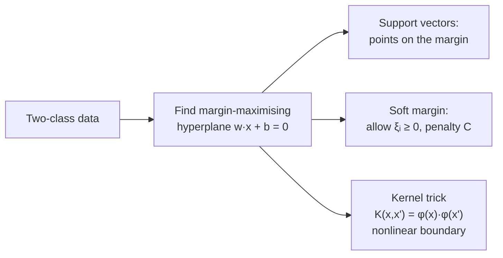

## Support Vector Machines

Big picture (no jargon)

A **Support Vector Machine** finds the hyperplane that separates two classes with the **widest possible margin** — the broadest "no-man's-land" between them. The points sitting *exactly on* the margin (the **support vectors**) are the only ones that determine the boundary; deleting any other point doesn't change the classifier.

The cleverest trick is **kernels**. By replacing the dot product $\mathbf x^\top \mathbf x'$ with a kernel function $K(\mathbf x, \mathbf x')$, an SVM can draw curvy boundaries in the original space — by implicitly working in a much higher-dimensional space, **without ever computing the new coordinates**.

**Real-world analogy.** Imagine drawing the widest possible straight road between two towns of differently-coloured houses. The "support vectors" are the houses right at the kerb on either side. If you bulldozed any house *not* on the kerb, the road would stay exactly where it is.

### Vocabulary — every term, defined plainly

- **Hyperplane** — a flat $(d-1)$-dimensional surface in $d$-dimensional space, $\{\mathbf x : \mathbf w^\top \mathbf x + b = 0\}$.
- **Margin** — perpendicular distance from the hyperplane to the nearest data point. Geometric margin = $2 / \|\mathbf w\|$.
- **Support vector** — a training point lying *on* the margin (or inside it for soft-margin); these are the only points that affect $\mathbf w, b$.
- **Hard-margin SVM** — assumes data is linearly separable; demands perfect classification with margin $\ge 1$.
- **Soft-margin SVM** — allows some misclassifications via slack variables; needed for real, noisy data.
- **Slack variable $\xi_i \ge 0$** — measures how far point $i$ violates its margin. $\xi_i = 0$: clean. $0 < \xi_i < 1$: inside margin but correct side. $\xi_i \ge 1$: misclassified.
- **Hyperparameter $C$** — penalty on slack. Large $C$ = punish violations heavily (low bias, high variance); small $C$ = tolerate more violations (smoother boundary).
- **Hinge loss** — $\max(0, 1 - y_i(\mathbf w^\top \mathbf x_i + b))$; zero for correctly-classified points beyond the margin.
- **Dual formulation** — restate the optimisation in terms of Lagrange multipliers $\alpha_i$; this is where the kernel trick lives.
- **Kernel $K(\mathbf x, \mathbf x')$** — a function equal to $\phi(\mathbf x)^\top \phi(\mathbf x')$ for some (possibly infinite-dim) feature map $\phi$. Lets us compute dot products in feature space without ever evaluating $\phi$.
- **Kernel trick** — replacing every dot product in an algorithm with a kernel call.
- **RBF (Gaussian) kernel** — $\exp(-\gamma \|\mathbf x - \mathbf x'\|^2)$; corresponds to an infinite-dim feature space.
- **KKT conditions** — the optimality conditions of the constrained problem; tell us $\alpha_i > 0$ iff $i$ is a support vector.

### Picture it

### Build the idea — hard-margin SVM (linearly separable)

Encode labels as $y_i \in \{-1, +1\}$. We want every point on the correct side, at least 1 unit of margin away:

$$
y_i(\mathbf w^\top \mathbf x_i + b) \ge 1 \quad \forall i.
$$

The geometric margin is $2 / \|\mathbf w\|$, so maximising margin ⇔ minimising $\|\mathbf w\|$ ⇔ minimising $\tfrac12 \|\mathbf w\|^2$ (smooth, convex):

$$
\min_{\mathbf w, b} \;\tfrac12 \|\mathbf w\|^2 \quad \text{s.t. } y_i(\mathbf w^\top \mathbf x_i + b) \ge 1\;\;\forall i.
$$

### Build the idea — soft-margin SVM (real data)

Add slack variables $\xi_i \ge 0$ to allow some violations, with a penalty $C$:

$$
\min_{\mathbf w, b, \boldsymbol\xi} \;\tfrac12 \|\mathbf w\|^2 + C \sum_i \xi_i \quad \text{s.t. } y_i(\mathbf w^\top \mathbf x_i + b) \ge 1 - \xi_i,\;\;\xi_i \ge 0.
$$

- **Large $C$**: heavy penalty on slack → tighter fit, low bias, high variance (risk of overfit).
- **Small $C$**: soft penalty → smoother boundary, high bias, low variance.

### Build the idea — equivalent hinge-loss form

The same problem can be written without explicit slack variables:

$$
J(\mathbf w, b) \;=\; \tfrac12 \|\mathbf w\|^2 \;+\; C \sum_i \max\!\big(0,\; 1 - y_i(\mathbf w^\top \mathbf x_i + b)\big).
$$

The **hinge loss** $\max(0, 1 - y\,z)$ is zero whenever $yz \ge 1$ (correctly classified beyond the margin) and grows linearly otherwise. Cf. logistic loss, which penalises *all* points smoothly, not just violators.

### Build the idea — dual formulation (where the kernel trick lives)

Using Lagrange multipliers $\alpha_i \ge 0$, the dual is:

$$
\max_{\boldsymbol\alpha} \;\sum_{i=1}^n \alpha_i \;-\; \tfrac12 \sum_{i,j=1}^n \alpha_i \alpha_j\, y_i y_j\, K(\mathbf x_i, \mathbf x_j)
\quad \text{s.t. } 0 \le \alpha_i \le C,\;\sum_i \alpha_i y_i = 0.
$$

The data appear *only* through the kernel matrix $K(\mathbf x_i, \mathbf x_j)$ — never as raw coordinates. After solving, most $\alpha_i = 0$; the rest correspond to **support vectors**. Prediction:

$$
\hat y(\mathbf x) \;=\; \operatorname{sign}\!\Big(\sum_i \alpha_i y_i K(\mathbf x_i, \mathbf x) + b\Big).
$$

### Build the idea — common kernels

| Kernel | $K(\mathbf x, \mathbf x')$ | Notes |
|---|---|---|
| Linear | $\mathbf x^\top \mathbf x'$ | Equivalent to the primal linear SVM |
| Polynomial | $(\mathbf x^\top \mathbf x' + c)^d$ | Captures interactions of degree $d$ |
| RBF (Gaussian) | $\exp(-\gamma \|\mathbf x - \mathbf x'\|^2)$ | Infinite-dim feature space; most popular |
| Sigmoid | $\tanh(\kappa\,\mathbf x^\top \mathbf x' + c)$ | Mimics a 1-layer NN; not always PSD |

### Build the idea — KKT optimality conditions

For each $i$:

$$
\alpha_i \big[\, y_i (\mathbf w^\top \mathbf x_i + b) - 1 + \xi_i \,\big] = 0.
$$

This forces: either $\alpha_i = 0$ (point is non-support) **or** $y_i(\mathbf w^\top \mathbf x_i + b) = 1 - \xi_i$ (point is on or inside the margin → support vector).

<dl class="symbols">
  <dt>$\mathbf w, b$</dt><dd>weight vector and bias defining the hyperplane</dd>
  <dt>$\xi_i$</dt><dd>slack: how far point $i$ violates its margin</dd>
  <dt>$C$</dt><dd>regularisation: penalty per unit of slack</dd>
  <dt>$\alpha_i$</dt><dd>Lagrange multiplier for sample $i$ in the dual; $\alpha_i &gt; 0$ iff support vector</dd>
  <dt>$K(\mathbf x_i, \mathbf x_j)$</dt><dd>kernel value; equals $\phi(\mathbf x_i)^\top \phi(\mathbf x_j)$</dd>
  <dt>$\gamma$</dt><dd>RBF width: large = sharp Gaussians (overfit), small = smooth (underfit)</dd>
</dl>

### Worked example — fully expanded

Worked example: XOR via polynomial kernel

**The XOR problem.** $(0, 0), (1, 1) \to -1$ and $(0, 1), (1, 0) \to +1$. **No straight line separates these classes** — try drawing one and you'll fail.

**Step 1 — pick a kernel.** Use polynomial $K(\mathbf x, \mathbf x') = (\mathbf x^\top \mathbf x' + 1)^2$.

**Step 2 — what feature space does this correspond to?** Expand for $\mathbf x = (x_1, x_2)$, $\mathbf x' = (x_1', x_2')$:

$K(\mathbf x, \mathbf x') = (x_1 x_1' + x_2 x_2' + 1)^2 = 1 + 2x_1 x_1' + 2x_2 x_2' + 2 x_1 x_2 x_1' x_2' + (x_1 x_1')^2 + (x_2 x_2')^2$.

So the implicit feature map is $\phi(\mathbf x) = (1, \sqrt 2 x_1, \sqrt 2 x_2, \sqrt 2 x_1 x_2, x_1^2, x_2^2)$.

**Step 3 — examine in feature space.** The $x_1 x_2$ coordinate distinguishes the classes:
- $(0, 0)$: $x_1 x_2 = 0$, label $-1$.
- $(1, 1)$: $x_1 x_2 = 1$, label $-1$.
- $(0, 1)$: $x_1 x_2 = 0$, label $+1$.
- $(1, 0)$: $x_1 x_2 = 0$, label $+1$.

Hmm — $x_1 x_2$ alone doesn't separate. But adding $x_1 + x_2$:
- $(0, 0)$: sum $= 0$, label $-1$.
- $(1, 1)$: sum $= 2$, label $-1$.
- $(0, 1)$: sum $= 1$, label $+1$.
- $(1, 0)$: sum $= 1$, label $+1$.

In the 2-d $(x_1 + x_2,\, x_1 x_2)$ subspace the four points are at $(0, 0), (2, 1), (1, 0), (1, 0)$. The two $+1$'s coincide at $(1, 0)$; the two $-1$'s sit at $(0, 0)$ and $(2, 1)$. A linear boundary in feature space separates them — for instance, the line $x_1 + x_2 = 1$ pulled into a quadratic in input space. The SVM finds this automatically through its dual + polynomial kernel, **without ever explicitly mapping to feature space**.

**Step 4 — back in input space.** The decision boundary becomes a *curve* (specifically: $x_1 + x_2 - 2 x_1 x_2 = $ const, i.e. an X-shape), perfectly separating the XOR pattern.

**Take-home.** Same SVM machinery; just swap the kernel — and a problem that was *impossible* with a straight line becomes trivial.

### How to think about it

Mental model — widest street between classes

The SVM is "the widest possible street between the two classes". The road's width is $2 / \|\mathbf w\|$, and the support vectors are the points pressed against the kerb on each side. Erasing any non-support-vector point does not move the road by a single inch. This is why SVMs generalise well: the model is fully described by a *small* subset of the data.

The **RBF kernel** has a beautiful interpretation: place a Gaussian bump on every training point; the prediction is a weighted (by class label and $\alpha_i$) sum of those bumps evaluated at the query. Large $\gamma$ → sharp narrow bumps → wiggly boundary. Small $\gamma$ → wide smooth bumps → almost-linear boundary.

**When this comes up in ML.** SVMs were the dominant classifier from the late 1990s until deep learning took over around 2012. They're still the go-to for small datasets, text classification, and bioinformatics — anywhere $N \lesssim 10^5$ and you need a strong baseline that "just works". The kernel trick also generalises: kernel ridge regression, kernel PCA, Gaussian processes, and the inner machinery of many modern algorithms.

Watch out — common traps

- **Always scale features** — SVMs are distance-based, just like k-NN. Use z-score or min-max.
- **RBF $\gamma$ matters a lot.** Large $\gamma$ → sharp Gaussians → overfit. Small $\gamma$ → smooth → underfit. Tune $\gamma$ and $C$ jointly via grid search.
- **Soft-margin SVM ≠ logistic regression.** SVM uses *hinge* loss (zero for non-violators, linear for violators); logistic uses *log* loss (smooth, penalises everyone).
- **Multiclass.** SVMs are binary at heart. For $K$ classes, use one-vs-rest ($K$ binary models) or one-vs-one ($K(K-1)/2$ models). Sklearn's default is OvO for `SVC`.
- **Doesn't scale to huge $N$** — the dual is $\mathcal O(N^2)$ memory and $\mathcal O(N^2)$–$\mathcal O(N^3)$ time. Above $\sim 10^5$ samples, prefer linear SVMs (LIBLINEAR), trees, or NNs.
- **Probability outputs.** SVMs don't natively output probabilities. Sklearn fits Platt scaling on top, which is a separate logistic regression — slow and sometimes poorly calibrated.

Exam tip

Be able to (a) **derive the geometric margin** $2 / \|\mathbf w\|$ from the canonical hyperplane equations, (b) **state the soft-margin primal** with slack variables, (c) **state the dual** and point out that data appear only through $K(\mathbf x_i, \mathbf x_j)$ (this is the kernel trick), and (d) **state the KKT condition** $\alpha_i [y_i (\mathbf w^\top \mathbf x_i + b) - 1 + \xi_i] = 0$ which says $\alpha_i > 0 \Leftrightarrow$ point is a support vector. The XOR-via-polynomial-kernel example is a classic.

