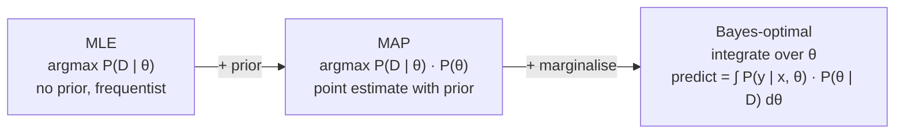

## Bayesian Learning — MLE, MAP, Bayes Rule, Optimal Bayes

Big picture (no jargon)

In the Bayesian view, the parameters $\boldsymbol\theta$ themselves are **random variables** with a **prior** distribution that encodes your beliefs *before* seeing the data. After seeing data $D$, you update to a **posterior** $P(\boldsymbol\theta \mid D)$ via Bayes' rule. Three estimation strategies sit on a spectrum:

- **MLE** — pick the $\boldsymbol\theta$ that makes $D$ most likely. No prior.
- **MAP** — pick the $\boldsymbol\theta$ with the highest posterior. Uses the prior, but still a single point.
- **Bayes-optimal** — don't pick a single $\boldsymbol\theta$ at all; **average** predictions over all $\boldsymbol\theta$ weighted by the posterior.

**Real-world analogy.** A weather forecaster wakes up to a sunny morning. **MLE**: "Today's data is sunny → tomorrow will probably be sunny." **MAP**: "It's sunny *but* I know we're in the monsoon season → I bet on cloudy." **Bayes-optimal**: "Average predictions across all possible weather models, weighted by how much yesterday's evidence supports each."

### Vocabulary — every term, defined plainly

- **Prior $P(\boldsymbol\theta)$** — your belief about the parameter values *before* seeing any data.
- **Likelihood $P(D \mid \boldsymbol\theta)$** — how plausible the observed data is *if* the parameter were $\boldsymbol\theta$.
- **Posterior $P(\boldsymbol\theta \mid D)$** — updated belief about $\boldsymbol\theta$ *after* seeing $D$.
- **Evidence / marginal likelihood $P(D)$** — total probability of the data, integrating over all $\boldsymbol\theta$. Acts as a normalising constant; usually intractable but constant in $\boldsymbol\theta$.
- **MLE (Maximum Likelihood Estimation)** — $\hat{\boldsymbol\theta}_{\text{MLE}} = \arg\max_{\boldsymbol\theta} P(D \mid \boldsymbol\theta)$. Frequentist; no prior used.
- **MAP (Maximum A Posteriori)** — $\hat{\boldsymbol\theta}_{\text{MAP}} = \arg\max_{\boldsymbol\theta} P(\boldsymbol\theta \mid D)$. Equivalent to maximising likelihood × prior.
- **Bayes-optimal classifier** — for each new $\mathbf x$, average $P(y \mid \mathbf x, \boldsymbol\theta)$ over the posterior $P(\boldsymbol\theta \mid D)$.
- **Conjugate prior** — a prior whose family stays the same after multiplication by the likelihood (e.g. Beta is conjugate to Bernoulli; Gaussian is self-conjugate).
- **Beta distribution** — natural prior for a probability $p \in [0, 1]$; parameters $\alpha, \beta$ act like "pseudo-counts".
- **Hyperparameter** — parameter of the prior (e.g. $\alpha, \beta$ in Beta).
- **Regulariser** — penalty added to a loss; for log-posterior maximisation, the prior **is** the regulariser.

### Picture it — the spectrum

### Build the idea — Bayes' rule

$$
\underbrace{P(\boldsymbol\theta \mid D)}_{\text{posterior}}
\;=\;
\frac{\overbrace{P(D \mid \boldsymbol\theta)}^{\text{likelihood}}\;\overbrace{P(\boldsymbol\theta)}^{\text{prior}}}{\underbrace{P(D)}_{\text{evidence}}}
$$

The evidence is the integral $P(D) = \int P(D \mid \boldsymbol\theta)\,P(\boldsymbol\theta)\,d\boldsymbol\theta$ — usually intractable, but it is a **constant in $\boldsymbol\theta$** so it does not affect $\arg\max$.

### Build the idea — MLE vs MAP

$$
\hat{\boldsymbol\theta}_{\text{MLE}} \;=\; \arg\max_{\boldsymbol\theta} P(D \mid \boldsymbol\theta), \qquad
\hat{\boldsymbol\theta}_{\text{MAP}} \;=\; \arg\max_{\boldsymbol\theta} P(D \mid \boldsymbol\theta)\,P(\boldsymbol\theta).
$$

Take $\log$:

$$
\hat{\boldsymbol\theta}_{\text{MAP}} \;=\; \arg\max_{\boldsymbol\theta} \Big[\log P(D \mid \boldsymbol\theta) + \log P(\boldsymbol\theta)\Big].
$$

So **the prior acts as a regulariser** added to the log-likelihood:

| Prior on $\boldsymbol\theta$ | Equivalent regulariser term |
|---|---|
| Gaussian $\mathcal N(\mathbf 0, \sigma^2 I)$ | $-\tfrac{1}{2\sigma^2}\|\boldsymbol\theta\|_2^2$ → $\ell_2$ ridge |
| Laplace $\propto e^{-\|\boldsymbol\theta\|/b}$ | $-\tfrac1b \|\boldsymbol\theta\|_1$ → $\ell_1$ lasso |
| Uniform | constant → no regularisation, MAP $=$ MLE |

### Build the idea — Bayes-optimal classifier

Instead of picking one $\boldsymbol\theta$, average the predictions over the posterior:

$$
\hat y \;=\; \arg\max_{c}\;\sum_{h \in H} P(c \mid \mathbf x, h)\,P(h \mid D).
$$

(For continuous $h$, replace the sum with an integral.) This is the **theoretically optimal** classifier under squared-error or 0-1 loss — no other classifier achieves lower expected risk. The catch: the sum / integral is rarely tractable, so we approximate it (with MAP, MCMC, variational inference, ensembles, etc.).

### Build the idea — Beta–Bernoulli conjugacy (a worked formula)

If $p \sim \text{Beta}(\alpha, \beta)$ a priori, and we observe $h$ heads in $n$ flips, the posterior is

$$
p \mid D \;\sim\; \text{Beta}(\alpha + h, \;\beta + n - h).
$$

Posterior mode (MAP) is $(\alpha + h - 1) / (\alpha + \beta + n - 2)$ (when both shapes $\ge 1$). Posterior mean is $(\alpha + h) / (\alpha + \beta + n)$. Predictive next-flip probability $= $ posterior mean.

<dl class="symbols">
  <dt>$\boldsymbol\theta$</dt><dd>parameter(s) being estimated</dd>
  <dt>$D$</dt><dd>observed data</dd>
  <dt>$P(\boldsymbol\theta)$</dt><dd>prior</dd>
  <dt>$P(D \mid \boldsymbol\theta)$</dt><dd>likelihood</dd>
  <dt>$P(\boldsymbol\theta \mid D)$</dt><dd>posterior</dd>
  <dt>$\alpha, \beta$</dt><dd>shape hyperparameters of a Beta prior</dd>
</dl>

### Worked example — fully expanded

Worked example: a biased coin, 7 heads in 10 tosses

**Step 1 — MLE.** With no prior, $\hat p_{\text{MLE}} = h/n = 7/10 = 0.70$.

**Step 2 — choose a prior.** A mild prior belief that the coin is roughly fair: $\text{Beta}(2, 2)$. (Beta$(1, 1)$ = uniform = no prior info; bigger shapes = stronger prior.)

**Step 3 — posterior.** By Beta-Bernoulli conjugacy, the posterior is $\text{Beta}(2 + 7, 2 + 3) = \text{Beta}(9, 5)$.

**Step 4 — MAP.** With shape $\ge 1$ in both, MAP = mode of Beta:

$$
\hat p_{\text{MAP}} \;=\; \frac{\alpha + h - 1}{\alpha + \beta + n - 2} \;=\; \frac{9 - 1}{9 + 5 - 2} \;=\; \frac{8}{12} \;=\; 0.667.
$$

The prior pulled the estimate from 0.70 toward 0.50 (the prior's mode) — a regularising effect.

**Step 5 — full Bayesian predictive.** Probability the next toss is heads = posterior mean = $9 / (9 + 5) = 9/14 \approx 0.643$. Slightly different from MAP because the posterior is skewed.

**Step 6 — what if we had a stronger prior?** Try Beta(20, 20) — equivalent to "I've seen 40 imaginary tosses, half heads". Posterior: Beta(27, 23). MAP = $26 / 48 \approx 0.542$. Predictive = $27 / 50 = 0.54$. The prior dominates because it carries more "pseudo-data" than the actual sample of 10.

**Step 7 — what if we had way more data?** Suppose 70 heads in 100 tosses with the original Beta(2, 2) prior. Posterior Beta(72, 32). MAP $= 71 / 102 \approx 0.696$. Predictive $= 72 / 104 \approx 0.692$. As $n \to \infty$, MAP $\to$ MLE — the prior fades.

### How to think about it

Mental model — three flavours of "best parameter"

- **MLE** answers: "what makes the data most likely?" — purely data-driven, ignores any prior knowledge.
- **MAP** answers: "what's the most likely $\boldsymbol\theta$ given data AND my prior beliefs?" — single best guess that combines both.
- **Bayes-optimal** answers: "don't pick *one* $\boldsymbol\theta$ — *average* over all of them, weighted by how plausible each one is given the data."

As $|D| \to \infty$, the prior becomes negligible (the likelihood overwhelms it), and MAP $\to$ MLE. With small data, the prior matters a lot — and choosing it wisely is how you avoid overfitting.

**When this comes up in ML.** Every regularised loss is implicitly MAP. $\ell_2$ weight decay = Gaussian prior. $\ell_1$ lasso = Laplace prior. Bayesian deep learning approximates the Bayes-optimal predictor by averaging over weight posteriors (MC dropout, deep ensembles, variational NNs). Naive Bayes is the next module — it *uses* this same Bayes' rule with a simplifying assumption.

Watch out — common traps

- **MLE overfits on small data.** A prior is essentially free regularisation — use one when $n$ is small.
- **"Bayes-optimal" averages over hypotheses.** It can outperform *every individual* hypothesis in $H$ — surprising but true.
- **MAP is not the posterior mean.** They coincide for symmetric posteriors (e.g. Gaussian) but differ for skewed ones. Predictions usually use the mean, not the mode.
- **The evidence $P(D)$ is constant in $\boldsymbol\theta$.** Don't worry about computing it for $\arg\max$, but you do need it for model comparison (Bayes factors).
- **Conjugate priors are convenient but limiting.** Real-world priors may not have closed-form posteriors → use MCMC or variational inference.
- **Bayesian doesn't mean "right".** A bad prior produces a confidently bad posterior. Always check sensitivity.

Exam tip

Three guaranteed sub-questions: **(a) state Bayes' rule and identify each piece** (prior, likelihood, posterior, evidence); **(b) prove that a Gaussian prior on weights ⇔ $\ell_2$ regularisation** by writing out $\log P(\boldsymbol\theta \mid D)$ and noting $\log \mathcal N(\mathbf 0, \sigma^2 I)(\boldsymbol\theta) = -\tfrac{1}{2\sigma^2}\|\boldsymbol\theta\|^2 + \text{const}$; **(c) explain when MLE and MAP agree** (uniform prior, or $n \to \infty$). The Beta-Bernoulli numerical example is also classic.

