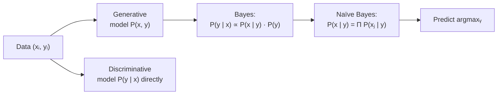

## Naïve Bayes & Generative Classifiers

Big picture (no jargon)

A **generative** classifier learns what each class **looks like** — the joint distribution $P(\mathbf x, y)$ — and then asks Bayes' rule "which class does this new point most resemble?". A **discriminative** classifier (logistic regression, SVM, neural net) skips the joint and directly models the **boundary** $P(y \mid \mathbf x)$.

**Naïve Bayes** is the canonical generative classifier with one bold simplifying assumption: **features are conditionally independent given the class**. This is almost never literally true (in spam, "free" and "money" are correlated), but the assumption makes the math trivial and — surprisingly — the *ranking* of classes often stays correct, which is all classification needs.

**Real-world analogy.** Suppose two photo collections: "cats" and "dogs". A *generative* approach learns what cats and dogs typically look like (fur length, ear shape, size). For a new photo, ask: "is this more catlike or doglike?" A *discriminative* approach skips description and just learns the line that separates the two — never modelling either class internally.

### Vocabulary — every term, defined plainly

- **Generative model** — models the joint $P(\mathbf x, y)$ (or equivalently $P(\mathbf x \mid y)$ + $P(y)$); can sample new $(\mathbf x, y)$ pairs.
- **Discriminative model** — directly models $P(y \mid \mathbf x)$; cannot sample new $\mathbf x$.
- **Class prior $P(y)$** — overall fraction of each class in training data.
- **Class-conditional likelihood $P(\mathbf x \mid y)$** — distribution of features within each class.
- **Naïve Bayes assumption** — $P(\mathbf x \mid y) = \prod_j P(x_j \mid y)$ (features conditionally independent given the class).
- **Gaussian Naïve Bayes** — $P(x_j \mid y) = \mathcal N(\mu_{jy}, \sigma_{jy}^2)$; for continuous features.
- **Multinomial Naïve Bayes** — for *count* features (e.g. word frequencies); class-conditional is multinomial.
- **Bernoulli Naïve Bayes** — for *binary* (present/absent) features.
- **Laplace (additive) smoothing** — add $\alpha$ to every count to avoid zero probabilities; $\alpha = 1$ is classical Laplace, $\alpha < 1$ is Lidstone.
- **Log-space evaluation** — sum log-probabilities instead of multiplying tiny probabilities to avoid numerical underflow.
- **Calibration** — how well predicted probabilities match empirical frequencies. NB is famously *miscalibrated* but ranks well.

### Picture it

### Build the idea — generative vs discriminative

| | Generative | Discriminative |
|---|---|---|
| Models | $P(\mathbf x, y)$ | $P(y \mid \mathbf x)$ |
| Examples | Naïve Bayes, GMM, GDA, HMM | Logistic regression, SVM, neural net |
| Can sample new $\mathbf x$? | Yes | No |
| Small-data performance | Often better (strong prior in model form) | Often worse |
| Asymptotic accuracy ($n \to \infty$) | Lower (assumption bias) | Higher |
| Training speed | Very fast (counts/MLE) | Slower (gradient descent) |

### Build the idea — Naïve Bayes derivation

By Bayes' rule:

$$
P(y \mid \mathbf x) \;\propto\; P(\mathbf x \mid y)\,P(y).
$$

Apply the Naïve Bayes (conditional independence) assumption:

$$
P(\mathbf x \mid y) \;=\; \prod_{j=1}^d P(x_j \mid y).
$$

So:

$$
P(y \mid \mathbf x) \;\propto\; P(y)\,\prod_{j=1}^d P(x_j \mid y).
$$

Predict:

$$
\hat y \;=\; \arg\max_y \;\Bigg[\log P(y) + \sum_{j=1}^d \log P(x_j \mid y)\Bigg].
$$

(We sum logs to avoid underflow when multiplying many small probabilities.)

### Build the idea — three NB flavours

| Variant | $x_j$ type | Likelihood model |
|---|---|---|
| **Gaussian** NB | Continuous | $P(x_j \mid y) = \mathcal N(x_j;\, \mu_{jy}, \sigma_{jy}^2)$ |
| **Multinomial** NB | Counts (word frequencies) | $\propto \prod_j p_{jy}^{x_j}$ |
| **Bernoulli** NB | Binary present/absent | $\prod_j p_{jy}^{x_j}\,(1 - p_{jy})^{1 - x_j}$ |

Estimating parameters is just **counting + averaging**:
- $\hat P(y) = \text{count}(y) / n$.
- For Gaussian NB: $\hat\mu_{jy}$, $\hat\sigma_{jy}^2$ are sample mean / variance of feature $j$ within class $y$.
- For multinomial / Bernoulli: $\hat p_{jy}$ = relative frequency of feature $j$ within class $y$.

### Build the idea — Laplace (additive) smoothing

If a feature value never appeared with a class in training, MLE assigns it probability 0 — and one zero kills the entire product. Smoothing fixes this by adding $\alpha > 0$ pseudo-counts:

$$
P(x_j = v \mid y) \;=\; \frac{\text{count}(x_j = v, y) + \alpha}{\text{count}(y) + \alpha\, |V_j|},
$$

where $|V_j|$ is the number of distinct values feature $j$ can take. $\alpha = 1$ is Laplace; $\alpha < 1$ is Lidstone.

<dl class="symbols">
  <dt>$P(y)$</dt><dd>class prior</dd>
  <dt>$P(\mathbf x \mid y)$</dt><dd>class-conditional likelihood</dd>
  <dt>$P(x_j \mid y)$</dt><dd>per-feature class-conditional</dd>
  <dt>$\alpha$</dt><dd>smoothing pseudo-count</dd>
  <dt>$|V_j|$</dt><dd>number of distinct values feature $j$ can take</dd>
</dl>

### Worked example — fully expanded

Worked example: a tiny spam filter

**Setup.** Two classes, spam and ham. Priors $P(\text{spam}) = 0.4$, $P(\text{ham}) = 0.6$.

Word likelihoods (already trained / smoothed):
- $P(\text{free} \mid \text{spam}) = 0.7$, $P(\text{free} \mid \text{ham}) = 0.05$.
- $P(\text{meeting} \mid \text{spam}) = 0.05$, $P(\text{meeting} \mid \text{ham}) = 0.4$.

**Email under test.** "free meeting" — both words present.

**Step 1 — score each class (unnormalised).**

$\text{spam-score} = P(\text{spam}) \cdot P(\text{free} \mid \text{spam}) \cdot P(\text{meeting} \mid \text{spam}) = 0.4 \cdot 0.7 \cdot 0.05 = 0.014$.

$\text{ham-score} = P(\text{ham}) \cdot P(\text{free} \mid \text{ham}) \cdot P(\text{meeting} \mid \text{ham}) = 0.6 \cdot 0.05 \cdot 0.4 = 0.012$.

**Step 2 — normalise to a posterior.**

Marginal $P(\text{email}) = 0.014 + 0.012 = 0.026$.

$P(\text{spam} \mid \text{email}) = 0.014 / 0.026 \approx 0.538$.
$P(\text{ham} \mid \text{email}) = 0.012 / 0.026 \approx 0.462$.

**Step 3 — decide.** Spam wins (just barely). Classify as **spam**.

**Step 4 — log-space sanity check.** Log-scores:
- spam: $\log(0.4) + \log(0.7) + \log(0.05) = -0.916 + (-0.357) + (-2.996) = -4.269$.
- ham: $\log(0.6) + \log(0.05) + \log(0.4) = -0.511 + (-2.996) + (-0.916) = -4.423$.

spam − ham $= -4.269 - (-4.423) = 0.154 > 0$ → spam. Same decision, no underflow risk.

**Step 5 — what if "meeting" never co-occurred with spam in training?** $P(\text{meeting} \mid \text{spam}) = 0$ → spam-score = 0 → classifier *can never* predict spam for any email containing "meeting". Catastrophic. **This is exactly why we always smooth.**

### How to think about it

Mental model — model each class, then compare

Generative classifiers ≈ "I learn what each class typically looks like, then ask which class this new point most resembles." Discriminative classifiers ≈ "I learn the boundary directly, never modelling each class internally."

The Naïve Bayes assumption is almost always literally false — words *are* correlated, so are pixels, so are sensor readings. But the *relative ranking* of class scores often survives the wrong-but-useful independence assumption. NB is therefore a great **fast, cheap baseline**, especially for text.

**When this comes up in ML.** Spam filters historically (still works astonishingly well). Document classification. Sentiment analysis baselines. Disease diagnosis from symptoms (each symptom is a feature; class is disease). Any time you need a fast, interpretable baseline that trains in the time it takes to read the data once.

Watch out — common traps

- **Always smooth.** Without Laplace smoothing, one unseen feature value zeroes out an entire class score.
- **For text classification, multinomial NB > Bernoulli NB** when document length matters; Bernoulli ignores how many times a word appears.
- **NB posterior probabilities are poorly calibrated.** They're usually pushed toward 0 or 1 because of the false independence assumption (the product of dependent terms looks more extreme than reality). Useful for ranking, not for "true probability".
- **Discriminative usually wins with lots of data;** generative often wins with little data because the model form acts as a strong prior.
- **Continuous features need a distributional assumption.** Gaussian NB assumes per-class normality — visualise histograms first or transform skewed features.
- **Class imbalance** flows into the priors; works automatically *if* the training data is representative — but fails badly if not.

Exam tip

Three guaranteed sub-questions: **(a) state the conditional independence assumption mathematically** ($P(\mathbf x \mid y) = \prod_j P(x_j \mid y)$); **(b) classify a 2- or 3-feature example by hand** using priors and per-feature likelihoods, showing the Bayes-rule normalisation; **(c) explain why we work in log-space** (avoids numerical underflow when multiplying many small probabilities). Bonus: justify Laplace smoothing.

