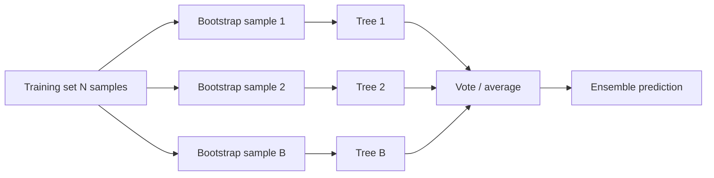

## Ensemble Learning — Bagging & Random Forest

Big picture (no jargon)

A single noisy model is a "weak learner". An **ensemble** combines many weak learners — each trained on a slightly different view of the data — and **votes** to get a much stronger predictor. The key statistical insight: averaging the predictions of *independent* mistakes cancels out the noise.

**Bagging** (Bootstrap AGGregatING) is the simplest ensemble: train each model on a random bootstrap sample of the training data. **Random Forest** = bagging + extra randomness at each tree split (random feature subsets), to further decorrelate the trees.

**Real-world analogy.** A panel of imperfect doctors, each making different (independent) errors, collectively reaches the right diagnosis more often than any single doctor. The trick: their mistakes must be **uncorrelated**. If all the doctors trained at the same school and share the same blind spots, voting doesn't help.

### Vocabulary — every term, defined plainly

- **Ensemble** — a model made by combining the predictions of multiple base models.
- **Weak learner** — a single model with modest accuracy (a shallow tree, a stump). Usually high-variance for bagging.
- **Bootstrap sample** — a random sample of size $N$ drawn **with replacement** from the training data. Some points appear multiple times; about 36.8 % of unique points are *not* drawn.
- **Out-of-bag (OOB) sample** — the points *not* in a particular bootstrap sample. They serve as a free validation set for that bag.
- **Bagging** — train one base model per bootstrap sample, then aggregate (majority vote / mean).
- **Aggregation** — combining predictions: majority vote (classification), mean (regression), or weighted average.
- **Random Forest (RF)** — bagging applied to decision trees + random feature subset at each split.
- **Feature subsampling** — at each split, only consider a random subset of features (typically $\sqrt d$ for classification, $d/3$ for regression).
- **Decorrelation** — making the base models' errors as independent as possible (so averaging actually helps).
- **Feature importance** — a per-feature score for how useful that feature was across all trees, computed by impurity decrease or by permutation.
- **Extra Trees** (Extremely Randomised Trees) — Random Forest variant with random thresholds (no greedy optimal split) and no bootstrap.

### Picture it

### Build the idea — why averaging helps (variance argument)

Suppose $B$ models each have variance $\sigma^2$ and pairwise correlation $\rho$ between predictions. The variance of their average is:

$$
\operatorname{Var}\!\left(\frac{1}{B}\sum_{b=1}^B \hat f_b\right) \;=\; \rho\,\sigma^2 \;+\; \frac{1 - \rho}{B}\,\sigma^2.
$$

The second term shrinks with more models ($\to 0$ as $B \to \infty$), but the first term **does not**. So:

- Reducing $\rho$ (decorrelating) is more important than just adding more models.
- Bagging decorrelates by training on different bootstrap samples.
- Random Forest decorrelates further by also randomising feature subsets at each split.

### Build the idea — bagging algorithm

1. Draw $B$ bootstrap samples (size $N$, with replacement) from the training set.
2. Train one base model $\hat f_b$ on each bootstrap sample.
3. **Aggregate**:
   - Classification: majority vote, $\hat y = \text{mode}\{\hat f_1(\mathbf x), \dots, \hat f_B(\mathbf x)\}$.
   - Regression: mean, $\hat y = \tfrac1B \sum_b \hat f_b(\mathbf x)$.

About $1 - 1/e \approx 63.2\%$ of unique training points appear in any given bootstrap; the remaining ~36.8% are **OOB**. Use OOB samples as a free validation set per tree → an internal estimate of generalisation error without needing a held-out set.

### Build the idea — Random Forest = bagging + feature subsampling

At each node split, instead of considering all $d$ features, consider only a random subset of size $m$:
- $m = \sqrt d$ (rounded) — classification default.
- $m = d/3$ — regression default.

This prevents any single strong feature from being chosen at the root of *every* tree (which would make trees correlated). Smaller $m$ → more decorrelation → lower variance, slightly higher bias.

| Hyperparameter | Effect |
|---|---|
| `n_estimators` ($B$) | More trees → more stable, slower. Diminishing returns after ~100–500. |
| `max_features` ($m$) | Smaller → more decorrelation, higher bias |
| `max_depth` / `min_samples_leaf` | Tree complexity. RF usually grows trees deep (low individual bias). |
| `bootstrap=True` | Default; turning it off becomes "Extra Trees" |

### Build the idea — feature importance

**Mean Decrease in Impurity (MDI / Gini importance).** For each feature $j$, sum the impurity decrease at every split using $j$, weighted by the number of samples reaching the node. Sum across all trees, normalise so total = 1. Fast but biased toward continuous and high-cardinality features.

**Permutation importance** (preferred). For each feature $j$, randomly shuffle column $j$ in the OOB data; the drop in OOB accuracy = importance of $j$. Slower but unbiased.

<dl class="symbols">
  <dt>$B$</dt><dd>number of trees in the ensemble</dd>
  <dt>OOB</dt><dd>out-of-bag samples — free validation set per bag</dd>
  <dt>$\rho$</dt><dd>pairwise correlation between predictions of any two ensemble members</dd>
  <dt>$\sigma^2$</dt><dd>variance of an individual base learner's prediction</dd>
  <dt>$m$</dt><dd>number of features sampled at each split (`max_features`)</dd>
</dl>

### Worked example — fully expanded

Worked example: 3-tree Random Forest predictions

**Setup.** A trained RF with $B = 3$ trees on a binary classification task.

**Classification.** Three trees predict $(+, +, -)$ for query $\mathbf x$. Majority vote → **+**. Probability estimate $\hat P(+) = 2/3 \approx 0.667$.

**Regression.** Same 3 trees predict $(2.1, 1.8, 2.4)$ for query $\mathbf x$. Mean $= (2.1 + 1.8 + 2.4) / 3 = 6.3 / 3 = 2.1$. Variance across trees = $((2.1-2.1)^2 + (1.8-2.1)^2 + (2.4-2.1)^2)/3 = (0 + 0.09 + 0.09)/3 = 0.06$ — useful as an uncertainty estimate.

**OOB error walk-through.** Suppose training point $i = 7$ was OOB for trees 1 and 4 (only). Predictions from trees 1 and 4 on point 7: both $+$. True label: $+$. Point 7 is correctly classified by its OOB prediction. Repeat for every training point and average → OOB error.

**Variance-reduction sanity check.** If the 3 trees had $\sigma^2 = 0.1$ and pairwise correlation $\rho = 0.3$:

$$
\operatorname{Var}\!\big(\tfrac13(\hat f_1 + \hat f_2 + \hat f_3)\big) = 0.3 \cdot 0.1 + \frac{1 - 0.3}{3} \cdot 0.1 = 0.03 + 0.0233 = 0.0533.
$$

So averaging 3 trees with $\rho = 0.3$ cuts variance from $0.10$ to $0.053$ — about 47% reduction. If $\rho$ were 0 (perfectly independent trees): variance $= 0.10/3 \approx 0.033$, much better. If $\rho = 1$ (identical trees): variance stays at $0.10$, no benefit at all. This is *why* RF adds feature subsampling on top of bagging.

### How to think about it

Mental model — a jury of imperfect jurors

A jury of imperfect jurors — each making *independent* mistakes — collectively reaches the right verdict more often than any single juror. Bagging adds **data** randomness (bootstrap); Random Forest adds **split** randomness on top. Both work by attacking the same enemy: correlation between base learners.

This is why bagging works *best* on **high-variance, low-bias** base learners (deep trees) and barely helps for naturally stable, high-bias models (linear regression, naïve Bayes). The base learner needs to actually have variance to reduce.

**When this comes up in ML.** Random Forest is one of the strongest off-the-shelf classifiers, especially for tabular data. It's the standard baseline against which everything else is compared. Combined with feature importance, it doubles as an exploratory tool. Bagging also underlies methods like extra-trees, isolation forests (anomaly detection), and quantile regression forests.

Watch out — common traps

- **Bagging works best with high-variance, low-bias base learners.** It barely helps stable models like linear regression.
- **More trees never hurts accuracy** (only compute), but more trees doesn't fix bias — RF can underfit if trees are too shallow.
- **MDI feature importance is biased** toward continuous and high-cardinality features. Prefer **permutation importance** for honest scores.
- **Correlated features.** RF spreads importance across them; a single MDI score may understate any one feature's true relevance.
- **OOB error is a generous estimate** when bootstrap samples are small or trees are too few — use a real held-out set for high-stakes evaluation.
- **RF doesn't extrapolate** (no prediction outside training range); models like splines / linear regression can.
- **Memory.** A 1000-tree RF on millions of samples can be huge. Limit `max_depth` or use `extra-trees`.

Exam tip

Two guaranteed sub-questions: **(a) derive the variance-reduction formula** $\rho \sigma^2 + (1-\rho)\sigma^2/B$ and explain *why* the $\rho$ term doesn't shrink with $B$ — that's the key insight motivating random feature subsetting in RF; **(b) explain the difference between bagging (data randomness only) and Random Forest (data + feature randomness)**. Bonus: explain OOB error and Bootstrap's $1 - 1/e \approx 63.2\%$ coverage.

