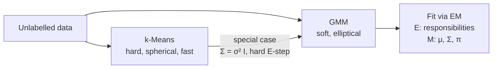

## Unsupervised Learning — k-Means, GMM, EM

Big picture (no jargon)

**Unsupervised** = no labels, just $\mathbf x_i$. **Clustering** finds groups of similar points without ever being told what the groups are. Two cornerstone algorithms:

- **k-Means** — hard assignment, spherical clusters, fast and dead simple. The default first thing to try.
- **Gaussian Mixture Models (GMM)** — a probabilistic generalisation: each cluster is a Gaussian with its own mean, covariance, and weight. Soft assignments via "responsibilities".

Both are fitted by alternating between two steps — that pattern is captured by the **Expectation-Maximisation (EM)** algorithm, which is the workhorse for any latent-variable model (HMMs, topic models, missing-data problems, etc.).

**Real-world analogy.** You walk into a crowded party and try to spot the natural friend-groups. **k-Means**: assign each person to *one* group based on who they're standing closest to. **GMM**: notice that people drift between conversations — assign each person a *probability* of belonging to each group. **EM**: keep refining your group-centres and the people-to-group assignments until nothing changes.

### Vocabulary — every term, defined plainly

- **Unsupervised learning** — no labels; learn structure from features alone.
- **Clustering** — partition data into groups of similar points.
- **k-Means** — partition into $k$ clusters by minimising within-cluster squared distance.
- **Centroid** — the mean of all points in a cluster; cluster representative.
- **Hard assignment** — each point belongs to exactly one cluster.
- **Soft assignment** — each point has a probability of belonging to every cluster.
- **k-Means++ initialisation** — smart seeding: pick centroids that are spread out, dramatically improving convergence quality.
- **Gaussian Mixture Model (GMM)** — density modelled as a weighted sum of Gaussians.
- **Mixing weight $\pi_j$** — prior probability that a point came from cluster $j$; $\sum_j \pi_j = 1$.
- **Responsibility $\gamma_{ij}$** — soft assignment: posterior probability that point $i$ came from cluster $j$.
- **Covariance matrix $\Sigma_j$** — controls the *shape* of cluster $j$ (spherical / diagonal / full).
- **Expectation-Maximisation (EM)** — iterative algorithm that alternates an **E-step** (compute responsibilities) and an **M-step** (re-fit parameters from those responsibilities).
- **Log-likelihood** — quality score for a probabilistic clustering; EM provably increases it each iteration.
- **Elbow plot / Silhouette / Gap statistic** — heuristics to choose $k$.
- **Local optimum** — both k-Means and GMM converge to a local optimum that depends on initialisation; run multiple restarts.

### Picture it

### Build the idea — k-Means algorithm

1. **Initialise** $k$ centroids $\boldsymbol\mu_1, \dots, \boldsymbol\mu_k$ (k-means++ recommended).
2. **Assign** each point to its nearest centroid: $z_i = \arg\min_j \|\mathbf x_i - \boldsymbol\mu_j\|^2$.
3. **Update** each centroid as the mean of its assigned points: $\boldsymbol\mu_j = \tfrac{1}{|C_j|} \sum_{i \in C_j} \mathbf x_i$.
4. Repeat 2–3 until assignments stop changing.

**Objective** (within-cluster sum of squares, WCSS):

$$
J \;=\; \sum_{i=1}^N \sum_{j=1}^k \mathbf 1\{z_i = j\}\,\|\mathbf x_i - \boldsymbol\mu_j\|^2.
$$

Each step **never increases** $J$ → converges to a **local** minimum.

### Build the idea — choosing $k$

| Method | Idea |
|---|---|
| **Elbow plot** | Plot $J$ vs $k$; pick the $k$ at the bend ("elbow") where adding more clusters stops paying off. |
| **Silhouette** | For each point, $s = (b - a)/\max(a, b)$ where $a$ = avg distance to own cluster, $b$ = avg distance to nearest *other* cluster. Closer to 1 = better. Average across all points. |
| **Gap statistic** | Compare $J$ to $J$ on uniform random data of the same shape; pick the $k$ that maximises the gap. |

### Build the idea — Gaussian Mixture Model

$$
p(\mathbf x) \;=\; \sum_{j=1}^k \pi_j\,\mathcal N(\mathbf x;\, \boldsymbol\mu_j, \Sigma_j), \qquad \sum_{j=1}^k \pi_j = 1, \;\pi_j \ge 0.
$$

Allows **ellipsoidal** clusters (because of the per-cluster $\Sigma_j$) and **soft** assignments via responsibilities. The model is *generative*: you can sample new points by first picking a component $j \sim \pi$, then drawing $\mathbf x \sim \mathcal N(\boldsymbol\mu_j, \Sigma_j)$.

### Build the idea — EM algorithm for GMM

Initialise $\pi_j, \boldsymbol\mu_j, \Sigma_j$ (often via k-means++ on the means). Repeat:

**E-step — compute responsibilities** for every point–component pair:

$$
\gamma_{ij} \;=\; \frac{\pi_j\,\mathcal N(\mathbf x_i;\, \boldsymbol\mu_j, \Sigma_j)}{\sum_{k=1}^K \pi_k\,\mathcal N(\mathbf x_i;\, \boldsymbol\mu_k, \Sigma_k)}.
$$

(This is just Bayes' rule: posterior over the latent component given the point.)

**M-step — update parameters** as weighted MLE:

$$
N_j \;=\; \sum_{i=1}^N \gamma_{ij}, \qquad
\pi_j \;=\; \frac{N_j}{N},
$$

$$
\boldsymbol\mu_j \;=\; \frac{1}{N_j}\sum_{i=1}^N \gamma_{ij}\,\mathbf x_i, \qquad
\Sigma_j \;=\; \frac{1}{N_j}\sum_{i=1}^N \gamma_{ij}\,(\mathbf x_i - \boldsymbol\mu_j)(\mathbf x_i - \boldsymbol\mu_j)^\top.
$$

Iterate until log-likelihood $\sum_i \log p(\mathbf x_i)$ converges. EM provably **never decreases** log-likelihood.

### Build the idea — k-Means vs GMM

| | k-Means | GMM |
|---|---|---|
| Assignment | Hard (one cluster) | Soft (probability per cluster) |
| Cluster shape | Spherical | Elliptical (any $\Sigma_j$) |
| Distance | Euclidean | Mahalanobis (via $\Sigma^{-1}$) |
| Output | Just label | Probability per cluster |
| Special case | GMM with $\Sigma_j = \sigma^2 I$ + hard E-step | — |
| Speed | Very fast | Slower (more parameters) |

<dl class="symbols">
  <dt>$k$</dt><dd>number of clusters (chosen by user)</dd>
  <dt>$\boldsymbol\mu_j$</dt><dd>centre / mean of cluster $j$</dd>
  <dt>$\Sigma_j$</dt><dd>covariance of cluster $j$ (controls shape)</dd>
  <dt>$\pi_j$</dt><dd>mixing weight (prior probability) of cluster $j$</dd>
  <dt>$\gamma_{ij}$</dt><dd>responsibility: posterior prob that point $i$ came from cluster $j$</dd>
  <dt>$z_i$</dt><dd>hard cluster assignment for point $i$ (k-means)</dd>
  <dt>$N_j = \sum_i \gamma_{ij}$</dt><dd>"effective" number of points assigned to cluster $j$</dd>
</dl>

### Worked example — fully expanded

Worked example: k-Means on 3 points, k=2

**Data.** 3 points in 2D: $\mathbf x_1 = (0, 0)$, $\mathbf x_2 = (1, 1)$, $\mathbf x_3 = (10, 10)$. We seek $k = 2$ clusters.

**Step 0 — initialise centroids.** Random init: $\boldsymbol\mu_1 = (0, 0)$, $\boldsymbol\mu_2 = (10, 10)$ (e.g. via k-means++ which picked the two extreme points).

**Step 1 — assign each point to nearest centroid.**

- $\mathbf x_1 = (0, 0)$: $\|x_1 - \mu_1\| = 0$, $\|x_1 - \mu_2\| = \sqrt{200} \approx 14.14$. → cluster 1.
- $\mathbf x_2 = (1, 1)$: $\|x_2 - \mu_1\| = \sqrt 2 \approx 1.41$, $\|x_2 - \mu_2\| = \sqrt{162} \approx 12.73$. → cluster 1.
- $\mathbf x_3 = (10, 10)$: $\|x_3 - \mu_1\| = \sqrt{200} \approx 14.14$, $\|x_3 - \mu_2\| = 0$. → cluster 2.

Assignments: $C_1 = \{x_1, x_2\}$, $C_2 = \{x_3\}$.

**Step 2 — update centroids.**

$\boldsymbol\mu_1^{\text{new}} = \tfrac12 ((0, 0) + (1, 1)) = (0.5, 0.5)$.

$\boldsymbol\mu_2^{\text{new}} = (10, 10)$ (unchanged, only one point assigned).

**Step 3 — re-assign.**

- $\mathbf x_1 = (0, 0)$: $\|x_1 - (0.5, 0.5)\| = \sqrt{0.5} \approx 0.71$ vs $14.14$ → cluster 1. Same.
- $\mathbf x_2 = (1, 1)$: $\|x_2 - (0.5, 0.5)\| = \sqrt{0.5} \approx 0.71$ vs $12.73$ → cluster 1. Same.
- $\mathbf x_3$: cluster 2. Same.

**Step 4 — converged** (no assignments changed). Final clusters: $\{x_1, x_2\}$ with centroid $(0.5, 0.5)$ and $\{x_3\}$ with centroid $(10, 10)$.

**Final WCSS:** $\|x_1 - (0.5, 0.5)\|^2 + \|x_2 - (0.5, 0.5)\|^2 + 0 = 0.5 + 0.5 + 0 = 1.0$.

**One-step EM peek (GMM treatment of the same data).** Initialise $\pi = (0.5, 0.5)$, $\boldsymbol\mu_1 = (0, 0)$, $\boldsymbol\mu_2 = (10, 10)$, $\Sigma_1 = \Sigma_2 = I$. E-step responsibility $\gamma_{i1}$ for $\mathbf x_2 = (1, 1)$:

Numerator: $0.5 \cdot \mathcal N((1,1); (0,0), I) \propto 0.5 \cdot \exp(-\|x - \mu_1\|^2/2) = 0.5 \cdot \exp(-1) = 0.184$.

Denominator's second term: $0.5 \cdot \exp(-\|x - \mu_2\|^2/2) = 0.5 \cdot \exp(-81) \approx 0$.

$\gamma_{2,1} \approx 1$, $\gamma_{2,2} \approx 0$ — soft assignment is essentially hard here because clusters are far apart. With closer clusters, GMM would give intermediate $\gamma$'s.

### How to think about it

Mental model — fill-in-then-fit

EM is "fill-in-then-fit". You don't know the latent labels (hidden cluster assignments), so:
- **E-step**: guess them softly (compute the posterior over labels under current parameters).
- **M-step**: fit parameters as if those soft guesses were labels (weighted MLE).
- **Repeat**.

The beautiful theorem: this provably increases the data log-likelihood at every iteration, until convergence to a local maximum.

k-Means is the **hard-assignment, equal-spherical-covariance limit** of EM-on-GMM. So they're the same family of algorithm — k-Means is just a special case where the E-step picks the single most likely cluster instead of weighting all of them.

**When this comes up in ML.** Customer segmentation (k-Means is universal for marketing analytics). Image compression (cluster pixel colours). Anomaly detection (low responsibility = outlier). Topic modelling (LDA is a generalised EM model). Speech recognition (GMM-HMMs were state-of-the-art for decades). Initialisation of any deep generative model. Whenever you have hidden categorical labels you wish you knew, EM is the answer.

Watch out — common traps

- **Random initialisation matters.** Both k-Means and GMM converge to *local* optima — the result depends on starting points. Run multiple restarts; use k-means++.
- **k-Means assumes spherical, equal-size clusters.** Fails on elongated, unequal, or curved clusters → use GMM, DBSCAN, or spectral clustering.
- **GMM with full $\Sigma$ has $kd(d+1)/2 + kd + k$ parameters** — overfits with small $N$. Use diagonal or tied covariances.
- **Singularity hazard.** A Gaussian on one point with $\Sigma \to 0$ has likelihood $\to \infty$ — EM can blow up. Add a small $\epsilon I$ regulariser to every $\Sigma_j$.
- **Choosing $k$ is genuinely hard.** Elbow is heuristic, silhouette is better but slow. For GMM, use BIC.
- **Always scale features** — distance-based, just like k-NN and SVM.
- **High dimensions.** Both algorithms suffer from curse of dimensionality (distance concentration). Reduce via PCA / autoencoders first.

Exam tip

Three guaranteed sub-questions: **(a) trace one full pass of k-Means by hand on 4–5 points** (assign → update → reassign → check convergence); **(b) write down the E-step and M-step formulas for GMM** ($\gamma_{ij}$, $\pi_j$, $\mu_j$, $\Sigma_j$); **(c) explain why k-Means is the hard-assignment limit of GMM** (set $\Sigma_j = \sigma^2 I$ as $\sigma \to 0$; the responsibilities collapse to indicators of the nearest cluster).

