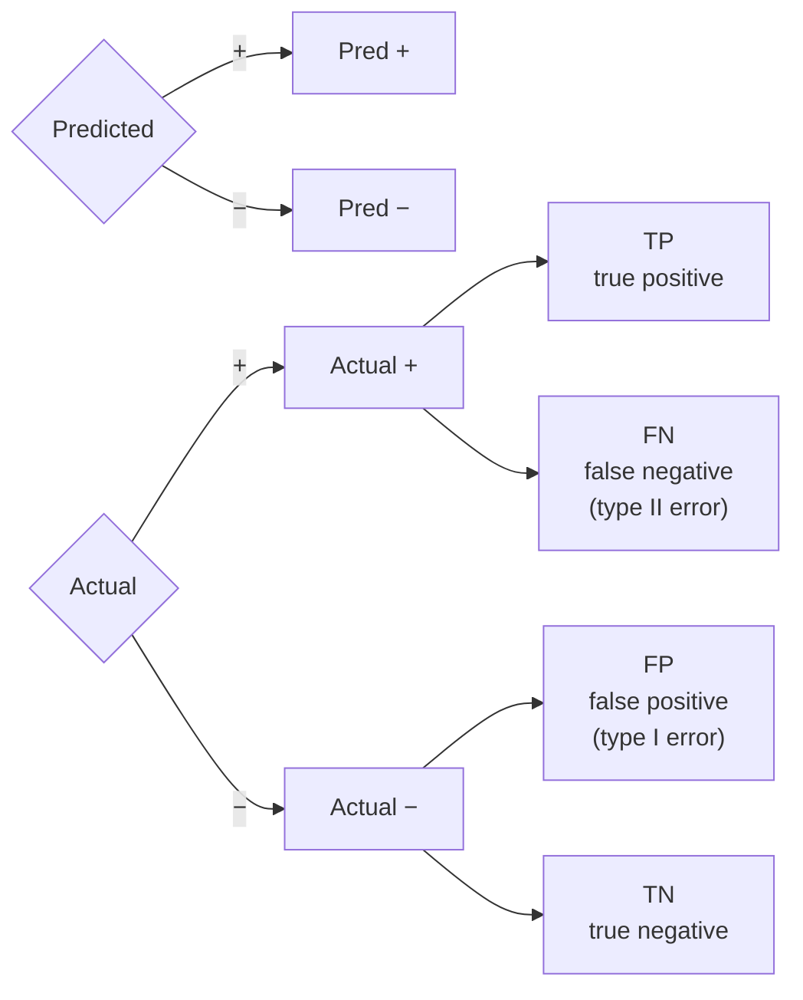

## Model Evaluation, Comparison, Fairness, Interpretability

Big picture (no jargon)

A trained model is only as good as the **metric** you used to evaluate it. Picking the wrong metric is one of the most common — and most expensive — mistakes in ML. Beyond raw accuracy, modern ML demands **fair** behaviour across subgroups (gender, race, age) and **interpretable** predictions for trust, debugging, and regulation.

This module is the toolbox for answering "is this model actually good?" responsibly.

**Real-world analogy.** A school could measure "exam-pass rate" or "students learning to think". Both are quantifiable but they reward very different teaching. Pick the wrong metric, and the school optimises for the wrong outcome — students learn to memorise but not to think. Same in ML: pick the wrong metric and your model optimises for the wrong outcome.

### Vocabulary — every term, defined plainly

- **Confusion matrix** — 2×2 table of predicted vs actual classes (binary case). Generalises to $K \times K$.
- **TP / FP / TN / FN** — true positive / false positive / true negative / false negative.
- **Type I error** — false positive (rejecting null when null is true).
- **Type II error** — false negative (failing to reject null when null is false).
- **Accuracy** — fraction of correct predictions; misleading on imbalanced data.
- **Precision** — of those predicted positive, how many actually are. $TP / (TP + FP)$.
- **Recall (Sensitivity, TPR)** — of actual positives, how many we caught. $TP / (TP + FN)$.
- **Specificity** — of actual negatives, how many we correctly rejected. $TN / (TN + FP)$.
- **F₁ score** — harmonic mean of precision and recall.
- **ROC curve** — TPR vs FPR as the decision threshold sweeps.
- **AUC (Area Under ROC Curve)** — single-number summary; 1.0 perfect, 0.5 random.
- **PR curve** — precision vs recall; preferred for imbalanced classes.
- **MAE / MSE / RMSE / R² / MAPE** — regression metrics.
- **Calibration** — predicted probabilities matching empirical frequencies.
- **McNemar's test** — paired test for comparing two classifiers on the same data.
- **Demographic parity** — equal positive rate across protected groups.
- **Equal opportunity** — equal true-positive rate across protected groups.
- **Equalised odds** — equal TPR *and* FPR across protected groups.
- **SHAP** — SHapley Additive exPlanations; per-prediction feature contribution scores from cooperative game theory.
- **LIME** — Local Interpretable Model-agnostic Explanations; fit a simple local model around each prediction.
- **Partial Dependence Plot (PDP)** — average effect of one feature on prediction, marginalising the rest.

### Picture it — the confusion matrix

### Build the idea — classification metrics

$$
\text{Accuracy} \;=\; \frac{TP + TN}{TP + TN + FP + FN}.
$$

$$
\text{Precision} \;=\; \frac{TP}{TP + FP}, \qquad
\text{Recall (TPR)} \;=\; \frac{TP}{TP + FN}, \qquad
F_1 \;=\; 2 \cdot \frac{\text{Precision} \cdot \text{Recall}}{\text{Precision} + \text{Recall}}.
$$

$$
\text{Specificity} \;=\; \frac{TN}{TN + FP}, \qquad
\text{FPR} \;=\; \frac{FP}{FP + TN} \;=\; 1 - \text{Specificity}.
$$

### Build the idea — ROC vs PR curves

- **ROC**: plot TPR vs FPR as you sweep the classification threshold from 1 to 0. Area under = **AUC** ∈ [0, 1]; 1.0 = perfect, 0.5 = random.
- **PR**: plot precision vs recall under the same sweep. Preferred when classes are **imbalanced** (rare positives) — ROC can look misleadingly good when negatives dominate.

### Build the idea — regression metrics

| Metric | Formula | Property |
|---|---|---|
| **MAE** | $\tfrac1n \sum |y_i - \hat y_i|$ | Robust to outliers; same units as $y$ |
| **MSE** | $\tfrac1n \sum (y_i - \hat y_i)^2$ | Penalises large errors heavily |
| **RMSE** | $\sqrt{\text{MSE}}$ | Same units as $y$, comparable to mean |
| **R²** | $1 - \text{SS}_{\text{res}}/\text{SS}_{\text{tot}}$ | Proportion of variance explained; can be negative |
| **MAPE** | $\tfrac1n \sum |y_i - \hat y_i|/|y_i| \cdot 100\%$ | Scale-free percentage; undefined at $y_i = 0$ |

### Build the idea — statistical model comparison

When comparing two models on the same data:

- **Paired tests** — paired $t$-test on per-fold scores, or **McNemar's test** on per-sample agreement.
- **Cross-validation** with the *same folds* for both models (so the noise cancels).
- **Multiple comparisons correction** (Bonferroni / Holm) when comparing many models — without it, you'll find spurious "winners" by chance.

### Build the idea — fairness criteria

Let $A$ be a sensitive attribute (gender, race). Common fairness criteria:

| Criterion | Requires |
|---|---|
| **Demographic parity** | $P(\hat y = 1 \mid A = a)$ same across $a$ |
| **Equal opportunity** | $P(\hat y = 1 \mid Y = 1, A = a)$ same across $a$ (equal TPR) |
| **Equalised odds** | Equal TPR **and** FPR across groups |
| **Calibration** | $P(Y = 1 \mid \hat p = p, A = a) = p$ for all $a$ |

**Impossibility result** (Chouldechova / Kleinberg): when base rates differ across groups, you generally **cannot** satisfy all of these simultaneously. Choosing which fairness definition to enforce is a values question, not a math question.

### Build the idea — interpretability methods

| Method | Granularity | Model |
|---|---|---|
| Coefficient inspection | Global | Linear / logistic |
| Tree-importance / Gini importance | Global | Trees / RF / GBM |
| **Permutation importance** | Global | Any |
| **SHAP** values | Per-prediction | Any (model-agnostic) |
| **LIME** | Per-prediction | Any |
| **Partial Dependence Plot (PDP)** | Global, one feature at a time | Any |
| **ICE** plot (Individual Conditional Expectation) | Per-sample, one feature | Any |

<dl class="symbols">
  <dt>$TP, FP, TN, FN$</dt><dd>cells of the binary confusion matrix</dd>
  <dt>TPR / FPR</dt><dd>true / false positive rate</dd>
  <dt>$F_1$</dt><dd>harmonic mean of precision and recall</dd>
  <dt>AUC</dt><dd>area under the ROC curve, $\in [0, 1]$</dd>
  <dt>$A$</dt><dd>protected (sensitive) attribute</dd>
  <dt>$\hat y, Y$</dt><dd>predicted vs true label</dd>
</dl>

### Worked example — fully expanded

Worked example: cancer screening — accuracy is not enough

**Setup.** A screening test on 1 000 people. Real ground truth: 10 are sick (positive class), 990 are healthy.

**Model performance.** Of the 10 sick: 8 correctly flagged, 2 missed. Of the 990 healthy: 50 falsely flagged, 940 correctly cleared.

**Confusion matrix:**

|  | Pred + | Pred − |
|---|---|---|
| **Actual +** | TP = 8 | FN = 2 |
| **Actual −** | FP = 50 | TN = 940 |

**Step 1 — Accuracy.**

$$
\text{Acc} = \frac{8 + 940}{1000} = \frac{948}{1000} = 94.8\%.
$$

Looks great! But...

**Step 2 — Recall (sensitivity).**

$$
\text{Recall} = \frac{8}{8 + 2} = \frac{8}{10} = 0.80 = 80\%.
$$

We caught 80% of real cases — but missed 20% (2 sick people sent home).

**Step 3 — Precision.**

$$
\text{Precision} = \frac{8}{8 + 50} = \frac{8}{58} \approx 0.138 = 13.8\%.
$$

Of everyone we flagged as sick, only 14% actually are. **86% are false alarms.**

**Step 4 — F₁.**

$$
F_1 = 2 \cdot \frac{0.138 \cdot 0.80}{0.138 + 0.80} = 2 \cdot \frac{0.110}{0.938} \approx 0.235.
$$

A low F₁ — the model is **not** doing well, despite 94.8% accuracy.

**Step 5 — Specificity & FPR.**

$$
\text{Specificity} = \frac{940}{940 + 50} = \frac{940}{990} \approx 0.949, \qquad \text{FPR} = 50/990 \approx 0.051.
$$

**Step 6 — interpretation.** Accuracy is **misleading on imbalanced data**: a "always predict negative" baseline would get $990/1000 = 99\%$ accuracy and zero recall. For cancer screening, **recall (don't miss tumours)** matters more than precision (false alarms can be confirmed by a follow-up biopsy). For a spam filter, the priorities flip.

**Step 7 — what metric to optimise?** Cost-weighted: assume missing cancer costs 100× as much as a false alarm. Expected cost = $100 \cdot \text{FN} + 1 \cdot \text{FP} = 100 \cdot 2 + 50 = 250$. A more aggressive threshold might reduce FN to 0 at the cost of FP rising to 200 — total cost $200$ — *better*, despite worse "accuracy".

### How to think about it

Mental model — pick the metric that matches the cost of errors

- **Precision** = "of the things I flagged, how many are real?" Matters when false alarms are costly (spam filter, fraud alert that interrupts a customer).
- **Recall** = "of the real things, how many did I catch?" Matters when misses are catastrophic (cancer, predator detection, security).
- **F₁** = harmonic mean → both must be high to score well; useful when you care about both equally.
- **AUC** = ranking quality independent of any specific threshold; useful when you'll choose threshold downstream.
- **PR-AUC** > ROC-AUC when positives are very rare.

The single most important question to ask before training: **what is the cost of a false positive vs a false negative in this domain?** Encode that into the metric (or into a class-weighted loss) — don't just default to accuracy.

**When this comes up in ML.** Every project. Every model deployment. Every Kaggle competition picks a metric that defines "winning". Modern ML adds **fairness** evaluation (across demographic groups) and **interpretability** (SHAP / LIME) as standard practice for high-stakes systems (lending, hiring, criminal justice, healthcare).

Watch out — common traps

- **Accuracy on imbalanced data is meaningless.** A "always negative" predictor on 99% negatives gets 99% accuracy.
- **Calibration vs discrimination are different goals.** A model can rank perfectly (AUC = 1) but produce wildly miscalibrated probabilities. Check with reliability diagrams; calibrate with Platt scaling or isotonic regression.
- **Macro vs micro vs weighted averaging** for multi-class metrics — pick deliberately. Macro = unweighted across classes (penalises poor minority performance); micro = pooled (dominated by majority); weighted = by class frequency.
- **Multiple-comparisons inflation.** Test 20 models against each other and you'll find a "significant winner" by chance with $p < 0.05$. Use Bonferroni.
- **Fair-by-design models trade off some accuracy.** Discuss the trade-off explicitly with stakeholders.
- **SHAP and LIME explain *the model*, not the world.** A wrong model gives plausible-sounding explanations.
- **R² can be negative** when the model is worse than predicting the mean.
- **MAPE is undefined at $y_i = 0$** and explodes near zero. Use sMAPE or log-error metrics.

Exam tip

Three guaranteed sub-questions: **(a) memorise precision / recall / F₁ formulas** and **draw the confusion matrix from scratch**; **(b) compute all metrics for a small example** (often the cancer-screen scenario); **(c) argue *which* metric is appropriate for a given scenario** (spam, fraud, cancer, recommendation) — this is a favourite long-answer. Bonus: state at least two fairness criteria and the impossibility result.

