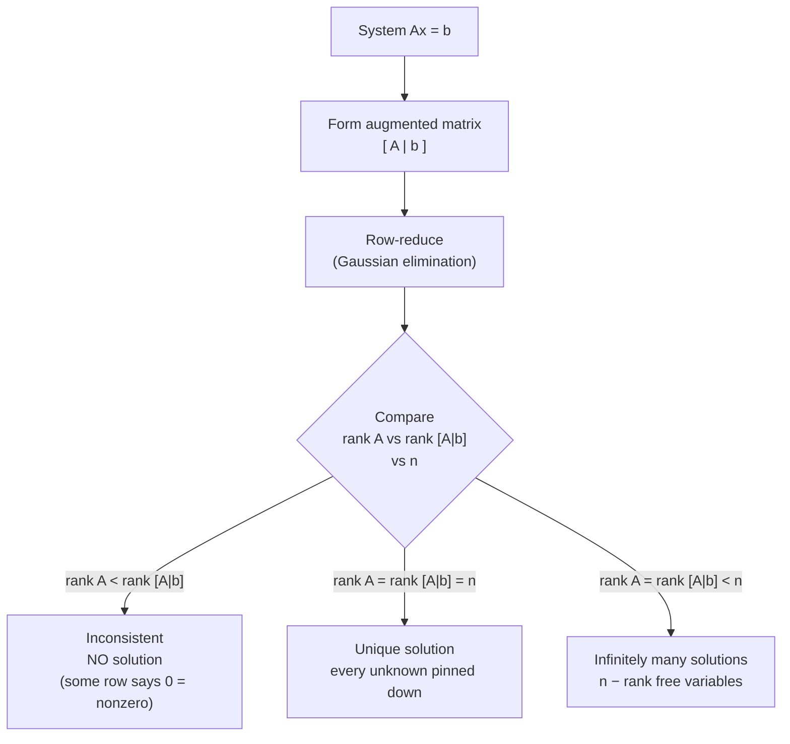

## Solution of Linear Systems

Big picture (no jargon)

You have several recipes (equations) that all share the same ingredients (unknowns), and you want to find the *one* set of ingredient amounts that satisfies every recipe at once. **Linear** means the unknowns appear only multiplied by numbers — never squared, never inside `sin` or `log`. The whole subject is just systematic bookkeeping for "find the unknowns that make all the equations true at the same time."

**Real-world analogy.** A coffee shop sells lattes ($x$) and muffins ($y$). Yesterday it sold 10 items for ₹500. Today, with the same prices, it sold 6 items for ₹360. Two equations, two unknowns. Solving the system tells you the price of one latte and one muffin.

### Vocabulary — every term, defined plainly

- **Linear equation** — one whose unknowns appear only as $a_1 x_1 + a_2 x_2 + \dots + a_n x_n = b$. No $x^2$, no $\sin x$, no $x \cdot y$.
- **System of linear equations** — a stack of $m$ such equations sharing the same $n$ unknowns.
- **Coefficient matrix $A$** — the grid of *just the numbers in front of the unknowns*. Shape $m \times n$.
- **Right-hand side vector $\mathbf{b}$** — the column of constants on the right of the equals signs. Length $m$.
- **Augmented matrix $[A \mid \mathbf{b}]$** — $A$ with $\mathbf{b}$ stuck on as one extra column, separated by a vertical bar. We do row operations on this whole grid.
- **Pivot** — the first non-zero entry in a row after row-reduction. Each pivot anchors one independent equation.
- **Rank (rank A)** — the number of *truly independent* rows of $A$ — i.e. how many pivots you get after row-reduction. If two rows say the same thing, the rank is less than the row count.
- **Free variable** — an unknown that isn't pinned down by the equations; it can take any value, and the others adjust around it.
- **Consistent system** — has at least one solution. **Inconsistent** = no solution at all.
- **Gaussian elimination** — the algorithm of swapping/scaling/adding rows to drive $A$ toward upper-triangular form. Each operation is reversible, so the solution set is unchanged.

### The three row operations (the only moves you're allowed)

1. **Swap** two rows.
2. **Scale** a row by a non-zero constant.
3. **Add** a multiple of one row to another.

These are reversible — they don't add or destroy solutions.

### Picture it — the verdict from comparing two ranks

### Build the idea

Stack $m$ equations:

$$
A\mathbf{x} = \mathbf{b}, \qquad A \in \mathbb{R}^{m\times n},\; \mathbf{x} \in \mathbb{R}^n,\; \mathbf{b} \in \mathbb{R}^m.
$$

We never touch $\mathbf{x}$ during the solve — we manipulate the rows of $[A \mid \mathbf{b}]$ until each pivot row says "this unknown equals this number" or "this row is redundant" or "this row is impossible."

<dl class="symbols">
  <dt>$m$</dt><dd>number of equations (rows of $A$)</dd>
  <dt>$n$</dt><dd>number of unknowns (columns of $A$)</dd>
  <dt>$r = \operatorname{rank}(A)$</dt><dd>number of independent equations after elimination — the number of pivots</dd>
</dl>

### Worked example — fully expanded, no skipped arithmetic

Worked example: two recipes, same secret

**Solve** the system

$$
\begin{aligned}
x + y &= 3 \\
2x + 2y &= 6
\end{aligned}
$$

**Step 1 — Form the augmented matrix.** Coefficients on the left of the bar, constants on the right:

$$
[A \mid \mathbf{b}] = \left[\begin{array}{cc|c}
1 & 1 & 3 \\
2 & 2 & 6
\end{array}\right]
$$

**Step 2 — Eliminate $x$ from row 2.** We want a 0 where the bottom-left $2$ is. The operation is $R_2 \leftarrow R_2 - 2R_1$, applied to *every column* of row 2 including the right-hand side:

- Position (2,1): $2 - 2 \cdot 1 = 0$
- Position (2,2): $2 - 2 \cdot 1 = 0$
- Position (2,3): $6 - 2 \cdot 3 = 0$

Result:

$$
\left[\begin{array}{cc|c}
1 & 1 & 3 \\
0 & 0 & 0
\end{array}\right]
$$

**Step 3 — Read off the ranks.**

- $\operatorname{rank}(A) = 1$. The left side has exactly one non-zero row.
- $\operatorname{rank}([A \mid \mathbf{b}]) = 1$. The right side also has exactly one non-zero row (the bottom row collapsed to all zeros, including the RHS).
- $n = 2$ unknowns.

**Step 4 — Apply the verdict.** Since $\operatorname{rank}(A) = \operatorname{rank}([A \mid \mathbf{b}]) = 1 < n = 2$, the system is **consistent with infinitely many solutions**, with $n - r = 2 - 1 = 1$ free variable.

**Step 5 — Write the solution set.** From row 1: $x + y = 3$. Let $y = t$ (the free variable, taking any real value). Then $x = 3 - t$. Solution set:

$$
(x, y) = (3 - t,\; t), \quad t \in \mathbb{R}.
$$

**Geometric picture.** The two original equations describe the *same* line $x + y = 3$ — equation 2 is just equation 1 multiplied by 2. So every point on that line satisfies both equations. That's why we got infinitely many solutions and one free parameter (a line in the plane is parameterised by one number).

### How to think about it

Mental model — slices of space

Each linear equation is a flat slice of $\mathbb{R}^n$ (a line in 2D, a plane in 3D, a hyperplane in higher dims). The solution set is the **intersection** of all those slices.

- Slices meet at one point → unique solution.
- Slices coincide / overlap on a line or plane → infinite solutions.
- Slices are parallel and never meet → no solution.

The rank comparison just formalises which of these three things is happening, *without* needing a picture.

**When this comes up in ML.** Solving $A\mathbf{x} = \mathbf{b}$ is the inner step of linear regression's normal equations, of Gaussian-elimination–style preconditioners, and of every "find the $\mathbf{w}$ that satisfies these constraints" problem.

Watch out — common traps

- **"Consistent" only means *some* solution exists** — it can still be infinitely many. Always check whether $\operatorname{rank}(A) = n$ to claim *unique*.
- Comparing only $\operatorname{rank}(A)$ vs $n$ misses inconsistency. The right-hand side can independently push the rank of $[A \mid \mathbf{b}]$ above $\operatorname{rank}(A)$.
- A row like `[ 0 0 0 | 5 ]` after elimination means $0 = 5$ → inconsistent. A row of all zeros (including RHS) just means "redundant equation, throw it away."
- Don't forget to apply each row operation to *every* column of the row, including the augmented column.

Exam tip

Almost every linear-systems exam question reduces to: write the augmented matrix → row-reduce → compute three numbers $\operatorname{rank}(A),\; \operatorname{rank}([A \mid \mathbf{b}]),\; n$ → state the verdict in one English sentence. Practise until that pipeline is automatic.

