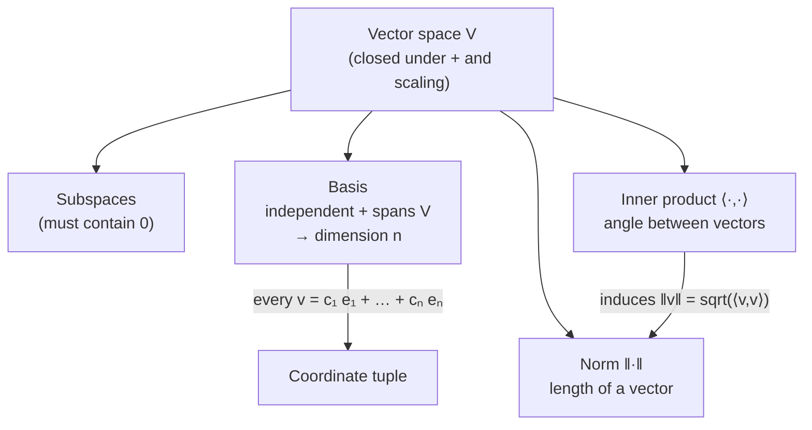

## Vector Spaces, Bases, Norms, Inner Products

Big picture (no jargon)

A **vector space** is a playground where the only two moves you're allowed are *adding two things* and *scaling one thing by a number* — and crucially, the result of either move is still in the playground. Once you have such a playground you automatically get a notion of **directions** (basis), **lengths** (norm), and **angles** (inner product). Every piece of ML geometry — distances between points, similarity scores, projections, gradient steps — lives on top of this trio.

**Real-world analogy.** Think of GPS coordinates. *East–West* and *North–South* are two basis directions; any place on a flat map is "3 km East and 2 km North". The norm gives you "how far from origin", and the inner product tells you whether two journeys are heading the same way or opposite ways.

### Vocabulary — every term, defined plainly

- **Vector** — a tuple of numbers $\mathbf{v} = (v_1, \dots, v_n)$. Visually, an arrow from origin to a point in $n$-dimensional space.
- **Vector space ($V$)** — a set of vectors that's *closed* under addition and scalar multiplication. "Closed" = "the result is still in the set."
- **Subspace** — a vector space sitting inside a bigger one. Must contain the zero vector.
- **Linear combination** — any expression $c_1 \mathbf{v}_1 + c_2 \mathbf{v}_2 + \dots + c_k \mathbf{v}_k$ with real numbers $c_i$.
- **Span of a set of vectors** — the set of *all* possible linear combinations of them. "Everywhere you can reach by mixing them."
- **Linearly independent** — none of the vectors in the set can be built as a linear combination of the others. Formally: $\sum c_i \mathbf{v}_i = \mathbf{0}$ forces every $c_i = 0$.
- **Basis** — a linearly independent set whose span is the whole space. The smallest "alphabet" of directions you need to describe everything.
- **Dimension** — the size of any basis. Same number no matter which basis you pick.
- **Norm ($\|\mathbf{v}\|$)** — a number that measures the "length" of a vector. Three rules: positivity, scaling under $\alpha\mathbf{v}$, triangle inequality.
- **Inner product ($\langle\mathbf{u}, \mathbf{v}\rangle$ or $\mathbf{u}^\top \mathbf{v}$)** — a number that measures alignment of two vectors. Positive = same general direction, zero = perpendicular, negative = opposite.
- **Orthogonal** — perpendicular. $\langle\mathbf{u}, \mathbf{v}\rangle = 0$.
- **Orthonormal** — orthogonal *and* each vector has length 1.
- **Gram–Schmidt** — a recipe for converting any basis into an orthonormal one.

### Picture it

### Build the idea — three layers in order

**Layer 1. Vector space (closure).** A set $V$ of vectors over $\mathbb{R}$ is a vector space if for all $\mathbf{u}, \mathbf{v} \in V$ and $\alpha \in \mathbb{R}$:

$$
\mathbf{u} + \mathbf{v} \in V, \qquad \alpha \mathbf{u} \in V.
$$

(There are eight axioms in total — associativity, identity, distributivity, etc. — but closure is the one that does real work in proofs.)

**Layer 2. Basis (a coordinate system).** Pick $n$ linearly independent vectors $\mathbf{e}_1, \dots, \mathbf{e}_n$ that span $V$. Now *every* $\mathbf{v} \in V$ has a unique representation

$$
\mathbf{v} = c_1 \mathbf{e}_1 + c_2 \mathbf{e}_2 + \dots + c_n \mathbf{e}_n,
$$

and the tuple $(c_1, \dots, c_n)$ is the *coordinate vector* of $\mathbf{v}$ in that basis. The dimension $n$ is the same no matter which basis you choose.

**Layer 3. Geometry (norm + inner product).** A norm gives lengths, an inner product gives angles. The famous Euclidean (i.e. $\ell_2$) inner product:

$$
\langle \mathbf{u}, \mathbf{v}\rangle = \mathbf{u}^\top \mathbf{v} = \sum_{i=1}^n u_i v_i,
$$

and the angle between them comes from

$$
\cos\theta = \frac{\langle \mathbf{u}, \mathbf{v}\rangle}{\|\mathbf{u}\|\,\|\mathbf{v}\|}.
$$

The inner product *induces* a norm via $\|\mathbf{v}\|^2 = \langle\mathbf{v}, \mathbf{v}\rangle$.

### Norms used in ML

| Name | Formula | Where it shows up |
|---|---|---|
| $\ell_1$ | $\sum_i \lvert v_i \rvert$ | Lasso regression — promotes *sparsity* (many coordinates exactly zero) |
| $\ell_2$ (Euclidean) | $\sqrt{\sum_i v_i^2}$ | Default. Ridge regression, weight decay, distance in k-NN |
| $\ell_\infty$ | $\max_i \lvert v_i \rvert$ | Adversarial robustness — bounds the *worst* coordinate |

<dl class="symbols">
  <dt>$V$</dt><dd>vector space</dd>
  <dt>$\mathbf{e}_i$</dt><dd>$i$-th basis vector</dd>
  <dt>$c_i$</dt><dd>$i$-th coordinate (a real number)</dd>
  <dt>$\|\mathbf{v}\|$</dt><dd>norm (length) of $\mathbf{v}$</dd>
  <dt>$\langle\mathbf{u},\mathbf{v}\rangle$</dt><dd>inner product (dot product when over $\mathbb{R}^n$)</dd>
</dl>

### Worked example — fully expanded, no skipped arithmetic

Worked example: is this a basis of ℝ³?

**Question.** Are the three vectors $\mathbf{v}_1 = (1, 0, 0)$, $\mathbf{v}_2 = (1, 1, 0)$, $\mathbf{v}_3 = (1, 1, 1)$ a basis of $\mathbb{R}^3$?

**Strategy.** Three vectors in a 3-D space form a basis exactly when they are linearly independent. So we just need to check independence.

**Step 1 — Stack them as the columns of a matrix.**

$$
M = \left[\begin{array}{ccc}
1 & 1 & 1 \\
0 & 1 & 1 \\
0 & 0 & 1
\end{array}\right]
$$

**Step 2 — Compute $\det M$.** $M$ is upper-triangular, so the determinant is just the product of diagonal entries:

$$
\det M = 1 \cdot 1 \cdot 1 = 1.
$$

**Step 3 — Apply the test.** $\det M = 1 \ne 0$, so the columns are linearly independent. Three independent vectors in $\mathbb{R}^3$ automatically span it. So **yes, they form a basis.**

**Bonus: compute coordinates.** What are the coordinates of $\mathbf{w} = (5, 3, 2)$ in this basis? We need $c_1, c_2, c_3$ with $c_1\mathbf{v}_1 + c_2\mathbf{v}_2 + c_3\mathbf{v}_3 = \mathbf{w}$. That's the system:

$$
\begin{aligned}
c_1 + c_2 + c_3 &= 5 \\
\phantom{c_1 +\;} c_2 + c_3 &= 3 \\
\phantom{c_1 + c_2 +\;} c_3 &= 2
\end{aligned}
$$

Back-substitute from the bottom: $c_3 = 2$, then $c_2 = 3 - c_3 = 3 - 2 = 1$, then $c_1 = 5 - c_2 - c_3 = 5 - 1 - 2 = 2$. So in this basis, $\mathbf{w}$ has coordinates $(2, 1, 2)$.

### How to think about it

Mental model — basis = coordinate system

A basis is just a chosen *language* for describing vectors. The same arrow in space gets different coordinate tuples depending on which basis you use — like the same place on Earth has different coordinates in different map projections. **Norms** measure how far an arrow's tip is from origin (a single number); **inner products** measure how aligned two arrows are (positive = same way, zero = perpendicular, negative = opposite).

When you change basis you're rotating/reshaping the coordinate system, not the actual vectors. Independence/dimension/span are intrinsic; coordinates are not.

**When this comes up in ML.** Embeddings (word2vec, BERT) are vectors in a learned space, and "similarity" between two words is an inner product. Regularisation penalties ($\ell_1$, $\ell_2$) are norms applied to the weight vector. PCA picks a new basis aligned with the variance directions.

Watch out — common traps

- A subspace **must contain $\mathbf{0}$**. The line $x + y = 1$ is *not* a subspace of $\mathbb{R}^2$ because $(0, 0)$ doesn't satisfy it (closure under addition fails too).
- Independence is global: $\{(1,0), (0,1), (1,1)\}$ is a *dependent* set even though every pair within it is independent — because $(1,0) + (0,1) - (1,1) = \mathbf{0}$.
- Inner product = 0 means **perpendicular**, not "no relation." Perpendicular vectors are the most uncorrelated they can be in a Euclidean sense.
- Be careful with norms: $\|\mathbf{u} + \mathbf{v}\| \le \|\mathbf{u}\| + \|\mathbf{v}\|$ (triangle inequality), with equality only when they're parallel.

Exam tip

To test independence of $k$ vectors in $\mathbb{R}^n$: stack them as columns of a matrix and compute its rank (or determinant if $k = n$). Full rank → independent. To extract a basis from a redundant set: row-reduce, identify the pivot columns, and pick the *original* vectors at those column positions.

