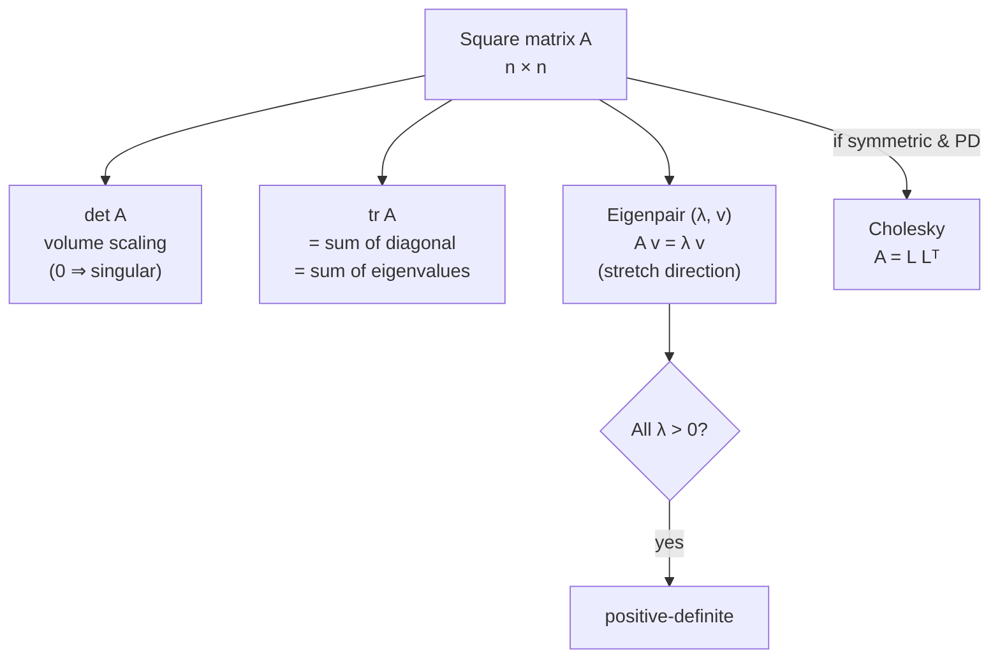

## Matrix Decomposition I — Determinant, Trace, Eigen, Cholesky

Big picture (no jargon)

A square matrix $A$ is best understood as a **transformation** that takes any vector and stretches/squishes/rotates it. To understand a transformation, find its **invariants** — numbers about it that don't change no matter what coordinate system you use.

- **Determinant** = how much the transformation *scales volumes*. Zero = it squishes everything down to a lower dimension.
- **Trace** = the sum of the diagonal entries — equals the *total stretch* across all directions (sum of eigenvalues).
- **Eigenvalues / eigenvectors** = the *special directions* the transformation only stretches (doesn't rotate), and the stretch factors along them.
- **Cholesky** = a fast way to take the "square root" of a *nice* matrix (symmetric and always-positive). Used everywhere from least-squares solving to sampling Gaussians.

**Real-world analogy.** Imagine $A$ as a printing press that takes a square sheet of paper and produces a parallelogram. Determinant = area of the new parallelogram. Eigenvectors = the directions on the original sheet that come out *parallel* to themselves on the printed sheet (just longer or shorter), and eigenvalues = how much they were stretched.

### Vocabulary — every term, defined plainly

- **Square matrix** — same number of rows and columns ($n \times n$). Only square matrices have eigenvalues, determinants, and traces.
- **Determinant ($\det A$)** — a single number capturing the *signed volume scaling factor* of the transformation $A$. Negative means $A$ flips orientation (like a mirror).
- **Singular matrix** — one with $\det A = 0$. It crushes some direction to zero, so it has no inverse.
- **Trace ($\operatorname{tr} A$)** — sum of the diagonal entries. Equals the sum of the eigenvalues.
- **Eigenvalue ($\lambda$)** and **eigenvector ($\mathbf{v}$)** — a non-zero vector $\mathbf{v}$ that $A$ only stretches by a factor $\lambda$, without rotating: $A\mathbf{v} = \lambda \mathbf{v}$.
- **Characteristic polynomial** — $\det(A - \lambda I) = 0$. The polynomial in $\lambda$ whose roots are the eigenvalues.
- **Symmetric matrix** — $A = A^\top$ (entries are mirror-symmetric across the diagonal). Has all-real eigenvalues and orthogonal eigenvectors.
- **Positive-definite (PD)** — symmetric *and* $\mathbf{x}^\top A \mathbf{x} > 0$ for every non-zero $\mathbf{x}$. Geometrically: it stretches every direction (no flips, no zero-direction).
- **Cholesky factor ($L$)** — for a positive-definite $A$, the unique lower-triangular matrix with positive diagonal such that $A = LL^\top$. Like a "square root" of $A$.
- **$I$** — the identity matrix (1's on the diagonal, 0's elsewhere). Acts as "do nothing".

### Picture it

### Build the idea

**Determinant — what it measures.** For a $2 \times 2$ matrix $A = \begin{bmatrix}a & b \\ c & d\end{bmatrix}$ the unit square gets transformed into a parallelogram with area $\lvert ad - bc \rvert = \lvert \det A \rvert$. Determinant zero ⇒ the parallelogram has collapsed to a line ⇒ $A$ kills a direction ⇒ no inverse.

Useful identities:

$$
\det(AB) = \det A \cdot \det B, \qquad \det(A^{-1}) = \frac{1}{\det A}, \qquad \det(A^\top) = \det A.
$$

**Trace — what it measures.** $\operatorname{tr}(A) = \sum_i A_{ii}$. Properties:

$$
\operatorname{tr}(A + B) = \operatorname{tr}(A) + \operatorname{tr}(B), \qquad \operatorname{tr}(AB) = \operatorname{tr}(BA), \qquad \operatorname{tr}(A) = \sum_i \lambda_i.
$$

The cyclic property $\operatorname{tr}(ABC) = \operatorname{tr}(BCA) = \operatorname{tr}(CAB)$ is a workhorse in matrix calculus.

**Eigenvalues — what they are.** Find them by demanding that $(A - \lambda I)$ have a non-trivial null vector:

$$
\det(A - \lambda I) = 0.
$$

This is a degree-$n$ polynomial in $\lambda$ (the characteristic polynomial). Its roots are the eigenvalues. Then for each $\lambda_i$, solve the homogeneous system

$$
(A - \lambda_i I)\mathbf{v} = \mathbf{0}
$$

to find the eigenvector(s).

**Three quick sanity checks:**

$$
\sum_i \lambda_i = \operatorname{tr}(A), \qquad \prod_i \lambda_i = \det(A), \qquad A\;\text{invertible} \iff \text{no}\;\lambda_i = 0.
$$

**Cholesky.** If $A$ is symmetric positive-definite, there is a *unique* lower-triangular $L$ with positive diagonal such that

$$
A = L L^\top.
$$

It costs $\mathcal{O}(n^3 / 3)$ — about half the cost of LU — and is the standard tool for: solving $A\mathbf{x} = \mathbf{b}$ when $A$ is SPD, sampling from a multivariate Gaussian, and *checking* whether $A$ is SPD (the Cholesky algorithm succeeds iff $A$ is SPD).

<dl class="symbols">
  <dt>$A$</dt><dd>square $n \times n$ matrix</dd>
  <dt>$\lambda$</dt><dd>eigenvalue (a scalar)</dd>
  <dt>$\mathbf{v}$</dt><dd>eigenvector (a non-zero vector)</dd>
  <dt>$I$</dt><dd>identity matrix of the right size</dd>
  <dt>$L$</dt><dd>Cholesky factor — lower-triangular with positive diagonal</dd>
</dl>

### Worked example — fully expanded, no skipped arithmetic

Worked example: eigenvalues and eigenvectors of a 2×2

**Given.** $A = \begin{bmatrix} 4 & 1 \\ 2 & 3 \end{bmatrix}$.

**Step 1 — Set up the characteristic equation.**

$$
A - \lambda I = \begin{bmatrix} 4 - \lambda & 1 \\ 2 & 3 - \lambda \end{bmatrix}
$$

**Step 2 — Compute its determinant and set to zero.** For a 2×2: $\det = (\text{top-left})(\text{bottom-right}) - (\text{top-right})(\text{bottom-left})$.

$$
\det(A - \lambda I) = (4 - \lambda)(3 - \lambda) - (1)(2)
$$

Expand $(4 - \lambda)(3 - \lambda)$ step-by-step:

$$
(4 - \lambda)(3 - \lambda) = 12 - 4\lambda - 3\lambda + \lambda^2 = \lambda^2 - 7\lambda + 12.
$$

Subtract $2$:

$$
\det(A - \lambda I) = \lambda^2 - 7\lambda + 12 - 2 = \lambda^2 - 7\lambda + 10.
$$

Set to zero: $\lambda^2 - 7\lambda + 10 = 0$.

**Step 3 — Solve the quadratic.** Either factor or use the formula. Factoring:

$$
\lambda^2 - 7\lambda + 10 = (\lambda - 5)(\lambda - 2) = 0.
$$

So $\lambda_1 = 5$ and $\lambda_2 = 2$.

**Step 4 — Sanity check.**

- $\lambda_1 + \lambda_2 = 5 + 2 = 7$. Compare $\operatorname{tr}(A) = 4 + 3 = 7$. ✓
- $\lambda_1 \cdot \lambda_2 = 5 \cdot 2 = 10$. Compare $\det(A) = 4 \cdot 3 - 1 \cdot 2 = 12 - 2 = 10$. ✓

**Step 5 — Find the eigenvector for $\lambda_1 = 5$.** Solve $(A - 5I)\mathbf{v} = \mathbf{0}$:

$$
A - 5I = \begin{bmatrix} 4 - 5 & 1 \\ 2 & 3 - 5 \end{bmatrix} = \begin{bmatrix} -1 & 1 \\ 2 & -2 \end{bmatrix}
$$

Row 2 is $-2 \times$ row 1, so the system reduces to a single equation: $-v_1 + v_2 = 0$, i.e. $v_2 = v_1$. Pick the simplest non-zero solution: $\mathbf{v}_1 = \begin{bmatrix} 1 \\ 1 \end{bmatrix}$.

**Step 6 — Find the eigenvector for $\lambda_2 = 2$.** Same procedure:

$$
A - 2I = \begin{bmatrix} 2 & 1 \\ 2 & 1 \end{bmatrix}
$$

Both rows give $2v_1 + v_2 = 0$, so $v_2 = -2v_1$. Pick $\mathbf{v}_2 = \begin{bmatrix} 1 \\ -2 \end{bmatrix}$.

**Step 7 — Verify.** Check $A\mathbf{v}_1 = 5\mathbf{v}_1$:

$$
A\mathbf{v}_1 = \begin{bmatrix} 4 & 1 \\ 2 & 3 \end{bmatrix}\begin{bmatrix} 1 \\ 1 \end{bmatrix} = \begin{bmatrix} 4 + 1 \\ 2 + 3 \end{bmatrix} = \begin{bmatrix} 5 \\ 5 \end{bmatrix} = 5 \begin{bmatrix} 1 \\ 1 \end{bmatrix}. \quad ✓
$$

### How to think about it

Mental model — eigenvectors are the matrix's "natural axes"

For most directions, applying $A$ rotates the vector and stretches it — messy. But along an eigenvector, $A$ *only* stretches (by a factor $\lambda$). If you re-pick your coordinate axes to be the eigenvectors, the matrix becomes diagonal in that basis — and a diagonal matrix is the simplest possible transformation: scale each axis independently. Diagonalisation is "find the natural axes."

The determinant is the *product* of the stretches (eigenvalues) — total volume change. The trace is their *sum* — average stretch.

**When this comes up in ML.** Covariance matrices in PCA are symmetric positive-semidefinite, so they have real non-negative eigenvalues; the eigenvectors are the *principal components*. Cholesky shows up in solving normal equations and in sampling correlated noise. Eigenvalue decay tells you the *intrinsic dimension* of your data.

Watch out — common traps

- Eigenvalues of a *general* matrix can be **complex** (rotations have complex eigenvalues). Real eigenvalues are guaranteed only for *symmetric* matrices.
- An eigenvector is only defined *up to scaling* — if $\mathbf{v}$ is an eigenvector, so is $5\mathbf{v}$, so is $-\mathbf{v}$. Numerical libraries usually normalise to $\|\mathbf{v}\| = 1$.
- $\det A = 0$ doesn't mean "$A$ has no eigenvalues" — it means *one of the eigenvalues is zero*.
- $\operatorname{tr}(AB) = \operatorname{tr}(BA)$ but $\operatorname{tr}(AB) \ne \operatorname{tr}(A)\operatorname{tr}(B)$ in general.
- Cholesky **fails** (you'll get a negative number under a square root) iff $A$ is not positive-definite — that's actually the cheapest known test for SPD-ness.

Exam tip

For a $2 \times 2$ matrix, skip the explicit characteristic polynomial and use the shortcut

$$
\lambda^2 - \operatorname{tr}(A)\,\lambda + \det(A) = 0.
$$

Always sanity-check eigenvalues by verifying $\sum\lambda_i = \operatorname{tr}(A)$ and $\prod \lambda_i = \det(A)$.

