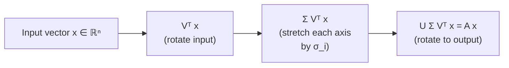

## Matrix Decomposition II — SVD & Low-Rank Approximation

Big picture (no jargon)

The **Singular Value Decomposition (SVD)** is the most useful matrix factorisation in all of data science. It says: *any* matrix — square or not, full-rank or not — can be written as **rotate, then stretch each axis by a different amount, then rotate again**. The "stretch amounts" are the **singular values**, sorted from largest to smallest, and they tell you which directions in the data carry signal vs noise.

Keeping only the few biggest stretches gives you the **low-rank approximation** — the best possible compression of the matrix in a precise mathematical sense. That's how image compression, recommender systems, latent semantic analysis, PCA, and noise-removal all secretly work.

**Real-world analogy.** A grayscale photo is just a matrix of brightness values. Its SVD finds the few dominant "patterns" (a horizon line, a face shape, a texture). Keeping the top 50 patterns out of 1000 still looks like the photo — that's image compression via SVD.

### Vocabulary — every term, defined plainly

- **SVD** — for any $A \in \mathbb{R}^{m \times n}$ (any shape!), the factorisation $A = U \Sigma V^\top$ that always exists.
- **$U$ (left singular vectors)** — orthonormal columns; these are directions in the *output* space ($\mathbb{R}^m$).
- **$V$ (right singular vectors)** — orthonormal columns; these are directions in the *input* space ($\mathbb{R}^n$).
- **$\Sigma$** — a diagonal $m \times n$ matrix with non-negative entries $\sigma_1 \ge \sigma_2 \ge \dots \ge 0$ on the diagonal.
- **Singular values ($\sigma_i$)** — the diagonal entries of $\Sigma$. Always $\ge 0$, sorted in decreasing order. They measure how much $A$ stretches the $i$-th input direction.
- **Rank of $A$** — the number of *non-zero* singular values. (Equivalent to all earlier definitions of rank, but easier to read off SVD.)
- **Frobenius norm $\|A\|_F$** — the matrix analogue of the Euclidean length of a vector: $\sqrt{\sum_{i,j} A_{ij}^2}$. Also equals $\sqrt{\sum_i \sigma_i^2}$.
- **Spectral norm $\|A\|_2$** — equals $\sigma_1$, the largest singular value. The biggest stretch $A$ does to any unit vector.
- **Rank-$k$ approximation $A_k$** — keep only the top $k$ singular values, zero out the rest. The best rank-$k$ matrix approximating $A$.
- **Eckart–Young theorem** — the formal statement that "the rank-$k$ approximation from SVD is the best possible rank-$k$ approximation, in both Frobenius and spectral norms."
- **Energy / explained variance** — $\sigma_i^2$ measures the "energy" along direction $i$. Sum of all $\sigma_i^2$ = total energy in the matrix.

### Picture it

### Build the idea

**The factorisation.**

$$
A = U\,\Sigma\,V^\top, \qquad U \in \mathbb{R}^{m \times m},\; \Sigma \in \mathbb{R}^{m \times n},\; V \in \mathbb{R}^{n \times n}.
$$

- $U^\top U = I_m$ (columns of $U$ are orthonormal).
- $V^\top V = I_n$ (columns of $V$ are orthonormal).
- $\Sigma$ is "diagonal" in the rectangular sense: $\Sigma_{ii} = \sigma_i$, all other entries zero.

So $A$ does three operations on a vector: rotate (by $V^\top$) → stretch coordinate-wise (by $\Sigma$) → rotate again (by $U$). That's it.

**Connection to eigen-things.** The singular values of $A$ are the *square roots* of the (non-negative) eigenvalues of $A^\top A$, and the columns of $V$ are the corresponding eigenvectors:

$$
A^\top A\, \mathbf{v}_i = \sigma_i^2\, \mathbf{v}_i.
$$

This is one way to compute SVD by hand for small matrices.

**Low-rank approximation (truncated SVD).** Keep only the top $k$ singular values:

$$
A_k = \sum_{i=1}^{k} \sigma_i\, \mathbf{u}_i\, \mathbf{v}_i^\top.
$$

This costs $k(m + n + 1)$ numbers to store instead of $m \cdot n$ — huge savings if $k \ll \min(m, n)$.

**Eckart–Young — why this is the *best* approximation.** Among all matrices $B$ of rank at most $k$:

$$
\|A - A_k\|_F \le \|A - B\|_F, \qquad \|A - A_k\|_F^2 = \sum_{i=k+1}^{r} \sigma_i^2.
$$

Translation: the error you incur by truncation is exactly the energy you threw away. There is no smarter rank-$k$ approximation.

<dl class="symbols">
  <dt>$\sigma_i$</dt><dd>$i$-th singular value, $\sigma_1 \ge \sigma_2 \ge \dots \ge 0$</dd>
  <dt>$\mathbf{u}_i, \mathbf{v}_i$</dt><dd>$i$-th left/right singular vector — columns of $U$ / $V$</dd>
  <dt>$r$</dt><dd>rank of $A$ = number of non-zero $\sigma_i$</dd>
  <dt>$k$</dt><dd>chosen truncation level for low-rank approximation</dd>
  <dt>$\|A\|_F$</dt><dd>Frobenius norm — Euclidean length of the matrix viewed as one long vector</dd>
</dl>

### Worked example — fully expanded, no skipped arithmetic

Worked example: SVD of a 2×2 matrix

**Given.** $A = \begin{bmatrix} 3 & 0 \\ 4 & 5 \end{bmatrix}$.

**Step 1 — Form $A^\top A$.**

$$
A^\top A = \begin{bmatrix} 3 & 4 \\ 0 & 5 \end{bmatrix} \begin{bmatrix} 3 & 0 \\ 4 & 5 \end{bmatrix} = \begin{bmatrix} 3 \cdot 3 + 4 \cdot 4 & 3 \cdot 0 + 4 \cdot 5 \\ 0 \cdot 3 + 5 \cdot 4 & 0 \cdot 0 + 5 \cdot 5 \end{bmatrix} = \begin{bmatrix} 25 & 20 \\ 20 & 25 \end{bmatrix}
$$

**Step 2 — Find eigenvalues of $A^\top A$.** Use the 2×2 shortcut $\lambda^2 - \operatorname{tr}\lambda + \det = 0$.

- $\operatorname{tr}(A^\top A) = 25 + 25 = 50$.
- $\det(A^\top A) = 25 \cdot 25 - 20 \cdot 20 = 625 - 400 = 225$.

So $\lambda^2 - 50\lambda + 225 = 0$. Quadratic formula:

$$
\lambda = \frac{50 \pm \sqrt{50^2 - 4 \cdot 225}}{2} = \frac{50 \pm \sqrt{2500 - 900}}{2} = \frac{50 \pm \sqrt{1600}}{2} = \frac{50 \pm 40}{2}.
$$

So $\lambda_1 = 45$ and $\lambda_2 = 5$.

**Step 3 — Singular values.** Take the positive square roots, sorted descending:

$$
\sigma_1 = \sqrt{45} = 3\sqrt{5} \approx 6.708, \qquad \sigma_2 = \sqrt{5} \approx 2.236.
$$

**Step 4 — Rank.** Both singular values are non-zero, so $\operatorname{rank}(A) = 2$.

**Step 5 — Spectral norm and Frobenius norm.**

- $\|A\|_2 = \sigma_1 = 3\sqrt{5} \approx 6.708$.
- $\|A\|_F = \sqrt{\sigma_1^2 + \sigma_2^2} = \sqrt{45 + 5} = \sqrt{50} = 5\sqrt{2} \approx 7.071$. *Sanity check:* directly from entries, $\sqrt{3^2 + 0^2 + 4^2 + 5^2} = \sqrt{9 + 0 + 16 + 25} = \sqrt{50}$. ✓

**Step 6 — Best rank-1 approximation $A_1$.** We'd need $\mathbf{u}_1, \mathbf{v}_1$ to write it explicitly, but we can already say:

$$
\|A - A_1\|_F^2 = \sigma_2^2 = 5,
$$

so the rank-1 approximation has reconstruction error $\sqrt{5} \approx 2.236$ in Frobenius norm. The fraction of "energy" preserved is $\sigma_1^2 / (\sigma_1^2 + \sigma_2^2) = 45/50 = 0.9$ — keeping just the top component preserves 90% of the matrix.

### How to think about it

Mental model — "rotate, stretch, rotate"

Every matrix is, geometrically, just three things glued together: rotate the input to a special set of axes, stretch each axis by a different amount, rotate to a different set of axes for output. The singular values are the *only* part that does any "real work" — the $U$ and $V$ are just choosing nice coordinate systems.

A matrix with one huge $\sigma_1$ and many tiny $\sigma_i$'s is *intrinsically rank-1-ish*: almost all its action is along one direction. That's why low-rank approximation works on real data — rows and columns of real matrices are usually highly correlated.

**When this comes up in ML.**

- **PCA** is SVD applied to the centred data matrix. Singular values squared = explained variance.
- **Recommender systems** factor the (huge, sparse) user-by-item rating matrix as $A \approx U_k \Sigma_k V_k^\top$ — users and items are placed in a shared $k$-dimensional "taste space."
- **Latent Semantic Analysis** is SVD on a term-by-document count matrix.
- **Pseudoinverse / least-squares** uses SVD to solve $A\mathbf{x} = \mathbf{b}$ even when $A$ is rectangular or singular: $A^+ = V \Sigma^+ U^\top$.
- **Compression** of weight matrices in deep nets: a $1000 \times 1000$ layer becomes $1000 \times 50$ then $50 \times 1000$ — 20× fewer parameters with little accuracy loss.

Watch out — common traps

- Singular values are **always non-negative and sorted**. Don't confuse them with eigenvalues, which can be negative or complex.
- $U$ and $V$ are orthogonal *square* matrices; only $\Sigma$ has $A$'s rectangular shape.
- Many software packages return SVD in **economy form**: if $m > n$, $U$ is $m \times n$ and $\Sigma$ is $n \times n$. Same factorisation, just trimmed of the columns of $U$ that get multiplied by zero anyway.
- The truncated $A_k$ is **dense** even if $A$ is sparse — be careful with memory.
- For PCA, **centre your data first**. Otherwise the leading singular direction will just be "the mean."

Exam tip

To compute SVD by hand for a small matrix: form $A^\top A$, find its eigenvalues (these are $\sigma_i^2$), find its eigenvectors (these are columns of $V$), then compute $\mathbf{u}_i = A \mathbf{v}_i / \sigma_i$ to recover columns of $U$. Practise with a $2 \times 2$ until the steps are automatic. Always sanity-check $\sum \sigma_i^2 = \|A\|_F^2$ by computing the Frobenius norm directly.

