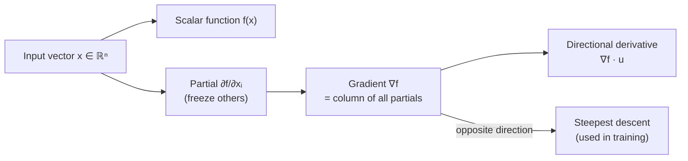

## Vector Calculus I — Partial Derivatives & the Chain Rule

Big picture (no jargon)

In single-variable calculus a derivative answers "if I nudge $x$, how much does $f(x)$ change?" — one input, one output, one slope. In ML, every loss function depends on *thousands* of weights. The natural generalisation is the **partial derivative**: pretend all inputs are frozen *except one*, and ask the same question. Stack all those partial derivatives into a vector — the **gradient** — and you have a *direction* that points where $f$ rises fastest. The training algorithm then walks the *opposite* way (downhill).

The other essential tool is the **chain rule**. Neural nets are deeply nested compositions $f(g(h(\mathbf{x})))$, and the chain rule is the mechanical recipe for computing the gradient of such a composition — that's literally what backpropagation is.

**Real-world analogy.** Standing on a hill in fog: a partial derivative is "if I step *only* east-ish, do I go up or down, and how fast?" The gradient is the local arrow telling you "the steepest uphill is *that* way." To descend the hill, walk opposite the arrow.

### Vocabulary — every term, defined plainly

- **Scalar field $f: \mathbb{R}^n \to \mathbb{R}$** — a function that takes a vector and returns one number (e.g. a loss).
- **Vector field $\mathbf{F}: \mathbb{R}^n \to \mathbb{R}^m$** — a function that takes a vector and returns another vector (e.g. one layer of a neural net).
- **Partial derivative $\partial f / \partial x_i$** — the rate of change of $f$ if you wiggle *only* $x_i$ and freeze every other input.
- **Gradient $\nabla f$** — the column vector of all partial derivatives. Points in the direction of *steepest ascent*.
- **Directional derivative** — rate of change of $f$ in an arbitrary direction $\mathbf{u}$ (with $\|\mathbf{u}\|=1$). Equals $\nabla f \cdot \mathbf{u}$.
- **Jacobian $J$** — for a vector-valued function $\mathbf{F}: \mathbb{R}^n \to \mathbb{R}^m$, the $m \times n$ matrix of *all* partial derivatives. Row $i$ = gradient of the $i$-th output.
- **Chain rule (multivariate)** — to differentiate $f \circ g$, multiply the Jacobian of $f$ by the Jacobian of $g$.
- **Total derivative** — the linear approximation $df = \nabla f \cdot d\mathbf{x}$, capturing the change in $f$ when *all* inputs nudge a tiny bit.
- **$\nabla$ ("nabla" / "del")** — the symbol used for the gradient operator.

### Picture it

### Build the idea

**Partial derivative — definition.**

$$
\frac{\partial f}{\partial x_i}(\mathbf{x}) = \lim_{h \to 0} \frac{f(x_1, \dots, x_i + h, \dots, x_n) - f(x_1, \dots, x_n)}{h}.
$$

In practice you just differentiate $f$ with respect to $x_i$ and *treat every other variable as a constant*.

**Gradient.**

$$
\nabla f(\mathbf{x}) = \begin{bmatrix} \partial f / \partial x_1 \\ \partial f / \partial x_2 \\ \vdots \\ \partial f / \partial x_n \end{bmatrix}.
$$

Two big facts about $\nabla f$:

1. It points in the direction of steepest *increase* of $f$.
2. Its magnitude $\|\nabla f\|$ is *how steep* that increase is.

So the rule "step against the gradient" gives the locally fastest way to *decrease* $f$ — that's gradient descent.

**Directional derivative.** If $\mathbf{u}$ is a unit vector (a chosen direction), the rate of change of $f$ along $\mathbf{u}$ is

$$
D_\mathbf{u} f = \nabla f \cdot \mathbf{u} = \|\nabla f\|\,\cos\theta,
$$

where $\theta$ is the angle between $\nabla f$ and $\mathbf{u}$. Maximised at $\theta = 0$ (along the gradient), zero at $\theta = 90°$ (perpendicular — moving along a level set), most-negative at $\theta = 180°$ (steepest descent).

**Jacobian.** For $\mathbf{F}(\mathbf{x}) = (F_1(\mathbf{x}), \dots, F_m(\mathbf{x}))$:

$$
J_{\mathbf{F}}(\mathbf{x}) = \begin{bmatrix}
\partial F_1/\partial x_1 & \dots & \partial F_1/\partial x_n \\
\vdots & \ddots & \vdots \\
\partial F_m/\partial x_1 & \dots & \partial F_m/\partial x_n
\end{bmatrix} \in \mathbb{R}^{m \times n}.
$$

If $m = 1$, the Jacobian is just the gradient (transposed to a row).

**Multivariate chain rule.** If $f: \mathbb{R}^p \to \mathbb{R}^m$ and $g: \mathbb{R}^n \to \mathbb{R}^p$, the composition $h(\mathbf{x}) = f(g(\mathbf{x}))$ has Jacobian

$$
J_h(\mathbf{x}) = J_f(g(\mathbf{x})) \cdot J_g(\mathbf{x}).
$$

Two Jacobians multiplied — that's it. Backpropagation in deep nets is just this rule applied layer by layer, computed *right-to-left* for efficiency.

<dl class="symbols">
  <dt>$\partial f / \partial x_i$</dt><dd>partial derivative — slope of $f$ along axis $i$</dd>
  <dt>$\nabla f$</dt><dd>gradient — vector of all partials</dd>
  <dt>$\mathbf{u}$</dt><dd>unit-length direction (a vector with $\|\mathbf{u}\| = 1$)</dd>
  <dt>$J_{\mathbf{F}}$</dt><dd>Jacobian — matrix of all partial derivatives of a vector-valued function</dd>
  <dt>$\nabla$</dt><dd>"nabla" — gradient operator</dd>
</dl>

### Worked example — fully expanded, no skipped arithmetic

Worked example: gradient and directional derivative of a quadratic

**Given.** $f(x, y) = x^2 + 3xy + y^2$. Compute the gradient at $(1, 2)$, then the directional derivative there in the direction of $\mathbf{w} = (3, 4)$.

**Step 1 — Compute $\partial f / \partial x$.** Treat $y$ as a constant.

$$
\frac{\partial f}{\partial x} = \frac{\partial}{\partial x}(x^2) + \frac{\partial}{\partial x}(3xy) + \frac{\partial}{\partial x}(y^2) = 2x + 3y + 0 = 2x + 3y.
$$

**Step 2 — Compute $\partial f / \partial y$.** Treat $x$ as a constant.

$$
\frac{\partial f}{\partial y} = 0 + 3x + 2y = 3x + 2y.
$$

**Step 3 — Assemble the gradient.**

$$
\nabla f(x, y) = \begin{bmatrix} 2x + 3y \\ 3x + 2y \end{bmatrix}.
$$

**Step 4 — Evaluate at $(1, 2)$.**

$$
\nabla f(1, 2) = \begin{bmatrix} 2(1) + 3(2) \\ 3(1) + 2(2) \end{bmatrix} = \begin{bmatrix} 2 + 6 \\ 3 + 4 \end{bmatrix} = \begin{bmatrix} 8 \\ 7 \end{bmatrix}.
$$

**Step 5 — Normalise the direction $\mathbf{w} = (3, 4)$.** The directional-derivative formula needs a *unit* direction.

$$
\|\mathbf{w}\| = \sqrt{3^2 + 4^2} = \sqrt{9 + 16} = \sqrt{25} = 5,
$$

so $\mathbf{u} = \mathbf{w} / \|\mathbf{w}\| = (3/5, 4/5)$.

**Step 6 — Compute the directional derivative.**

$$
D_\mathbf{u} f(1, 2) = \nabla f(1, 2) \cdot \mathbf{u} = (8)(3/5) + (7)(4/5) = 24/5 + 28/5 = 52/5 = 10.4.
$$

**Step 7 — Sanity-check the steepest-descent direction.** The largest possible value of $D_\mathbf{u} f$ over all unit $\mathbf{u}$ equals $\|\nabla f\|$:

$$
\|\nabla f(1,2)\| = \sqrt{8^2 + 7^2} = \sqrt{64 + 49} = \sqrt{113} \approx 10.63.
$$

We got $10.4$, slightly less — because $\mathbf{u} = (3/5, 4/5)$ isn't perfectly aligned with $\nabla f = (8, 7)$. ✓ (consistent with the bound)

### How to think about it

Mental model — gradient = "uphill arrow"

At every point of a multivariate function, imagine a tiny arrow stuck on the surface pointing in the direction of steepest climb. That arrow is $\nabla f$. Its length tells you *how steep* it is. Walk against it and you descend. Walk *perpendicular* to it and you stay at the same altitude (you're moving along a contour line).

A partial derivative is "the slope along axis $i$" — one component of the gradient. A directional derivative is "the slope along an arbitrary direction $\mathbf{u}$" — projected from the gradient onto $\mathbf{u}$.

**When this comes up in ML.** The loss function is a scalar field $\mathcal{L}: \mathbb{R}^n \to \mathbb{R}$ where $n$ = number of weights (millions to billions). Training computes $\nabla_\theta \mathcal{L}$ and steps against it. The chain rule is the *only* reason backpropagation works — it's how we compute that gradient layer by layer.

Watch out — common traps

- The directional-derivative formula $D_\mathbf{u} f = \nabla f \cdot \mathbf{u}$ requires $\mathbf{u}$ to be **unit length**. If you forget to normalise, you get a number that's off by the factor $\|\mathbf{w}\|$.
- A function with a non-zero gradient at a point cannot have a min/max there. Critical points (where $\nabla f = \mathbf{0}$) are *candidates*; you still need a second-derivative test to classify them as min/max/saddle.
- For non-differentiable points (like $|x|$ at $0$, or ReLU at $0$) you use **subgradients** — convention in deep learning is "ReLU's derivative at 0 is 0" (or sometimes 1 — pick one and be consistent).
- The chain rule order matters: it's $J_f \cdot J_g$, not $J_g \cdot J_f$ in general. Matrix multiplication isn't commutative.

Exam tip

For a polynomial loss, the gradient is *also* a polynomial — compute each partial mechanically. Always state the dimension of the gradient ("$\nabla f \in \mathbb{R}^n$") to avoid sign/index confusion. For a quadratic $f(\mathbf{x}) = \tfrac{1}{2} \mathbf{x}^\top A \mathbf{x} - \mathbf{b}^\top \mathbf{x}$, memorise $\nabla f = A\mathbf{x} - \mathbf{b}$ — saves time on every other problem.

