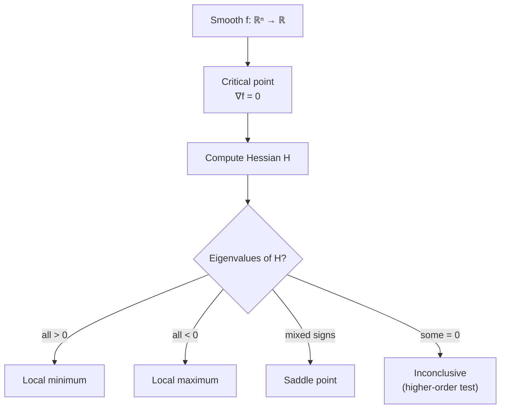

## Vector Calculus II — Hessian, Taylor Series, Convexity

Big picture (no jargon)

The gradient tells you *which way* a function rises. The **Hessian** tells you *how the rise itself is changing* — i.e. the *curvature*. Together they form a local quadratic model of any smooth function (the **second-order Taylor expansion**), which is the geometric basis for almost every optimiser.

A function is **convex** if its surface bowl-shapes upward everywhere — and in that case any local minimum is automatically a *global* minimum, so optimisation is much easier. The Hessian is the formal tool for checking convexity: a function is convex iff its Hessian is positive-semidefinite *everywhere*.

**Real-world analogy.** Driving on a hilly road, the gradient is "is the road sloped up or down right now?" The Hessian is "is the slope getting steeper or flattening out?" The Taylor expansion is "given the current slope and how it's changing, predict where I'll be in 100 m." Convexity is "the road is shaped like a single valley — keep going downhill and you'll definitely reach the bottom."

### Vocabulary — every term, defined plainly

- **Hessian $H$** — for $f: \mathbb{R}^n \to \mathbb{R}$, the $n \times n$ matrix of second-order partial derivatives. $H_{ij} = \partial^2 f / \partial x_i \partial x_j$.
- **Symmetry of $H$** — for any twice-continuously-differentiable $f$, mixed partials are equal: $\partial^2 f / \partial x_i \partial x_j = \partial^2 f / \partial x_j \partial x_i$. So $H$ is symmetric.
- **Positive-definite Hessian** — $\mathbf{v}^\top H \mathbf{v} > 0$ for every non-zero $\mathbf{v}$. Means: surface curves *up* in every direction (local minimum).
- **Negative-definite Hessian** — $\mathbf{v}^\top H \mathbf{v} < 0$ everywhere. Means: surface curves *down* in every direction (local maximum).
- **Indefinite Hessian** — $\mathbf{v}^\top H \mathbf{v}$ takes both signs. Means: saddle point — up in some directions, down in others.
- **Taylor series (multivariate, 2nd order)** — local quadratic approximation of $f$ around a point.
- **Critical point** — a point where $\nabla f = \mathbf{0}$. Could be min, max, or saddle.
- **Convex function** — for any two points $\mathbf{x}_1, \mathbf{x}_2$ and $\lambda \in [0,1]$: $f(\lambda \mathbf{x}_1 + (1-\lambda)\mathbf{x}_2) \le \lambda f(\mathbf{x}_1) + (1-\lambda) f(\mathbf{x}_2)$. Visually: every chord lies above the graph.
- **Strictly convex** — same with strict inequality (and $\lambda \in (0,1)$). Has a unique minimum if it exists.
- **Concave** — negative of a convex function (chords lie *below* the graph).
- **PSD / PD** — positive-semidefinite ($\mathbf{v}^\top H \mathbf{v} \ge 0$) / positive-definite ($> 0$).

### Picture it

### Build the idea

**Hessian.** For $f(\mathbf{x})$ with $\mathbf{x} \in \mathbb{R}^n$:

$$
H(\mathbf{x}) = \begin{bmatrix}
\dfrac{\partial^2 f}{\partial x_1^2} & \dfrac{\partial^2 f}{\partial x_1 \partial x_2} & \cdots \\
\dfrac{\partial^2 f}{\partial x_2 \partial x_1} & \dfrac{\partial^2 f}{\partial x_2^2} & \cdots \\
\vdots & \vdots & \ddots
\end{bmatrix}.
$$

Diagonal entries: pure second derivatives along each axis. Off-diagonals: how fast the slope along axis $i$ changes when you move along axis $j$.

**Second-order Taylor expansion** (the local quadratic model around $\mathbf{x}_0$):

$$
f(\mathbf{x}_0 + \mathbf{p}) \;\approx\; f(\mathbf{x}_0) + \nabla f(\mathbf{x}_0)^\top \mathbf{p} + \tfrac{1}{2}\, \mathbf{p}^\top H(\mathbf{x}_0)\, \mathbf{p}.
$$

Three pieces: the value at $\mathbf{x}_0$ (constant), the linear correction (slope times step), the quadratic correction (curvature times step squared).

**Second-derivative test for $\nabla f(\mathbf{x}^*) = \mathbf{0}$.**

| Hessian at $\mathbf{x}^*$ | Verdict |
|---|---|
| All eigenvalues $> 0$ (PD) | Strict local **minimum** |
| All eigenvalues $< 0$ (ND) | Strict local **maximum** |
| Mixed signs (indefinite) | **Saddle point** |
| Some zero (semidefinite) | Inconclusive — need higher-order test |

**Convexity criteria.**

- **First-order:** $f$ is convex iff $f(\mathbf{y}) \ge f(\mathbf{x}) + \nabla f(\mathbf{x})^\top (\mathbf{y} - \mathbf{x})$ for all $\mathbf{x}, \mathbf{y}$ — every tangent plane lies *below* the graph.
- **Second-order:** for twice-differentiable $f$, $f$ is convex iff $H(\mathbf{x})$ is positive-semidefinite *everywhere*. Strictly convex if $H \succ 0$ everywhere.

**Why convexity matters.** For a convex $f$:

- Every local minimum is a global minimum.
- Gradient descent (with a small enough step) will converge to that global minimum.
- Strict convexity guarantees the minimum is *unique*.

<dl class="symbols">
  <dt>$H$</dt><dd>Hessian — symmetric $n \times n$ matrix of second partials</dd>
  <dt>$\mathbf{p}$</dt><dd>step vector (a small displacement from $\mathbf{x}_0$)</dd>
  <dt>$\mathbf{x}^*$</dt><dd>candidate critical point (where $\nabla f = \mathbf{0}$)</dd>
  <dt>$\succeq 0$ / $\succ 0$</dt><dd>"is positive-semidefinite" / "is positive-definite"</dd>
</dl>

### Worked example — fully expanded, no skipped arithmetic

Worked example: classify a critical point

**Given.** $f(x, y) = x^2 + 4xy + y^2$. Find all critical points and classify them.

**Step 1 — Compute the gradient.**

$$
\frac{\partial f}{\partial x} = 2x + 4y, \qquad \frac{\partial f}{\partial y} = 4x + 2y.
$$

**Step 2 — Solve $\nabla f = \mathbf{0}$.**

$$
\begin{aligned}
2x + 4y &= 0 \\
4x + 2y &= 0
\end{aligned}
$$

From row 1: $x = -2y$. Substitute into row 2: $4(-2y) + 2y = -8y + 2y = -6y = 0 \Rightarrow y = 0$, then $x = -2(0) = 0$. Single critical point: $(x^*, y^*) = (0, 0)$.

**Step 3 — Compute the Hessian.**

$$
\frac{\partial^2 f}{\partial x^2} = 2, \quad \frac{\partial^2 f}{\partial y^2} = 2, \quad \frac{\partial^2 f}{\partial x \partial y} = \frac{\partial^2 f}{\partial y \partial x} = 4.
$$

So

$$
H = \begin{bmatrix} 2 & 4 \\ 4 & 2 \end{bmatrix}.
$$

(The Hessian is constant here because $f$ is purely quadratic — no $\mathbf{x}$ inside.)

**Step 4 — Find eigenvalues of $H$.** Use the 2×2 shortcut $\lambda^2 - \operatorname{tr} \lambda + \det = 0$.

- $\operatorname{tr}(H) = 2 + 2 = 4$.
- $\det(H) = 2 \cdot 2 - 4 \cdot 4 = 4 - 16 = -12$.

So $\lambda^2 - 4\lambda - 12 = 0$. Quadratic formula:

$$
\lambda = \frac{4 \pm \sqrt{16 + 48}}{2} = \frac{4 \pm \sqrt{64}}{2} = \frac{4 \pm 8}{2}.
$$

So $\lambda_1 = 6$ and $\lambda_2 = -2$.

**Step 5 — Classify.** Eigenvalues have **mixed signs**, so $H$ is **indefinite**, so $(0,0)$ is a **saddle point**.

**Step 6 — Sanity check by direct evaluation.** Move from origin in direction $(1, 1)$: $f(1, 1) = 1 + 4 + 1 = 6 > 0$ — function went *up*. Move in direction $(1, -1)$: $f(1, -1) = 1 - 4 + 1 = -2 < 0$ — function went *down*. Up in one direction and down in another ⇒ saddle. ✓

### How to think about it

Mental model — Taylor expansion = "local quadratic"

Zoom in close enough to any smooth surface and it looks quadratic — a paraboloid (bowl, dome, or saddle, depending on the Hessian's eigenvalue signs). Optimisers exploit this: Newton's method literally jumps to the minimum of the local quadratic in one step. Gradient descent uses only the linear part and ignores the curvature — robust but slow.

A convex function looks like a single bowl globally, not just locally. That's why convex optimisation is "easy" — there are no traps. Most ML losses are *not* fully convex (deep nets are highly non-convex), but many classical methods (linear regression's MSE, logistic regression's cross-entropy, SVM's hinge loss with $\ell_2$) are convex, which is why their training is so reliable.

**When this comes up in ML.** Newton's method uses $H^{-1} \nabla f$ as its step. Quasi-Newton methods (BFGS, L-BFGS) approximate $H^{-1}$. Saddle points are the *real* obstacle in deep-learning optimisation (not local minima — those are rare in high dimensions); SGD with momentum escapes them. Convex losses + convex regularisers ⇒ guaranteed unique solution.

Watch out — common traps

- The Hessian is symmetric *only if* mixed partials are equal — true for nearly all functions you'll see, but technically requires continuity of second derivatives (Schwarz's theorem).
- $\det(H) > 0$ alone does **not** imply PD — both eigenvalues could be negative. Always check the sign of the trace too, or compute eigenvalues directly.
- A function with one positive eigenvalue and one zero eigenvalue at a critical point is **inconclusive** by the second-derivative test — could be min, max, or saddle (e.g. $f = x^2 + y^4$ has a min, $f = x^2 - y^4$ has a saddle, both have the same Hessian at origin).
- Convexity is a *global* property — checking the Hessian at one point isn't enough; you need PSD *everywhere*.
- Sums of convex functions are convex (handy when designing loss + regulariser). But products generally aren't.

Exam tip

For a quadratic $f(\mathbf{x}) = \tfrac{1}{2} \mathbf{x}^\top A \mathbf{x} - \mathbf{b}^\top \mathbf{x} + c$ with $A$ symmetric, memorise:

$$
\nabla f = A\mathbf{x} - \mathbf{b}, \qquad H = A.
$$

Critical point: $\mathbf{x}^* = A^{-1} \mathbf{b}$. The function is convex iff $A \succeq 0$. Most exam Hessian questions are this case in disguise — recognise the pattern and skip straight to the answer.

