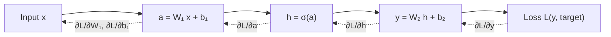

## Vector Calculus III — Matrix Calculus & Backpropagation

Big picture (no jargon)

In ML, the parameters of a model are usually arranged as a *matrix* (a layer of weights), and the loss depends on those weights through layer after layer of matrix multiplication and non-linear functions. To train, you need the gradient of the (scalar) loss with respect to the (matrix-shaped) weights.

**Matrix calculus** is the bookkeeping system that lets you write derivatives like $\partial \mathcal{L} / \partial W$ where $W$ is a matrix — it generalises "the derivative is a number" to "the derivative is a matrix of the same shape as the variable." **Backpropagation** is just the multivariate chain rule applied right-to-left through a computation graph, with each step expressed in matrix calculus.

**Real-world analogy.** Imagine a factory with conveyor belts: raw material (input $\mathbf{x}$) goes in, gets transformed by station 1, station 2, …, until the final product (loss $\mathcal{L}$) drops out. Backpropagation is the quality-control engineer walking *backwards* through the line, asking each station: "if you had nudged your settings slightly, how much would the final product score change?" Each station only needs (a) the local effect of its own settings and (b) the answer the next station already worked out — no need to recompute the whole line.

### Vocabulary — every term, defined plainly

- **Matrix calculus** — the rules for differentiating expressions where some variables are matrices or vectors. The derivative of a scalar w.r.t. a matrix is a matrix of the same shape.
- **Layout convention** — a choice of how to *arrange* the partial derivatives in a matrix. Two common ones: **numerator layout** (rows match the output) and **denominator layout** (rows match the input). We use **denominator layout** here so $\partial \mathcal{L}/\partial W$ has the same shape as $W$.
- **Computation graph** — a directed graph where each node is an operation and each edge is a variable flowing from one operation into the next. Forward pass = evaluate left-to-right; backward pass = differentiate right-to-left.
- **Forward pass** — compute the output (and store every intermediate value) given current parameters.
- **Backward pass / backpropagation** — compute gradients by traversing the graph in reverse, applying the chain rule.
- **Local gradient** — the Jacobian of *one* operation w.r.t. its immediate inputs.
- **Upstream gradient** — the gradient of the loss w.r.t. the operation's *output*, passed in from the next layer.
- **Downstream gradient** — local × upstream — the gradient passed back to earlier layers.
- **Reverse-mode automatic differentiation (autodiff)** — the algorithmic name for backprop. Cost is roughly the same as one forward pass, regardless of how many parameters there are.
- **Hadamard product $\odot$** — element-wise multiplication of two equal-shape matrices/vectors.

### Picture it

### Build the idea

**Notation, denominator layout.** For a scalar loss $\mathcal{L}$ and a parameter matrix $W \in \mathbb{R}^{m \times n}$:

$$
\frac{\partial \mathcal{L}}{\partial W} \in \mathbb{R}^{m \times n}, \qquad \left[\frac{\partial \mathcal{L}}{\partial W}\right]_{ij} = \frac{\partial \mathcal{L}}{\partial W_{ij}}.
$$

Same shape as $W$. That's the whole point of denominator layout — you can do `W -= η * grad` straightforwardly.

**Five identities you'll use constantly.**

| Expression | Derivative w.r.t. $\mathbf{x}$ | Notes |
|---|---|---|
| $\mathbf{a}^\top \mathbf{x}$ | $\mathbf{a}$ | linear in $\mathbf{x}$ |
| $\mathbf{x}^\top A \mathbf{x}$ | $(A + A^\top)\mathbf{x}$, equals $2A\mathbf{x}$ if $A$ symmetric | quadratic |
| $\|\mathbf{x}\|^2 = \mathbf{x}^\top \mathbf{x}$ | $2\mathbf{x}$ | special case above |
| $\|A\mathbf{x} - \mathbf{b}\|^2$ | $2 A^\top (A\mathbf{x} - \mathbf{b})$ | least-squares loss |
| $\operatorname{tr}(A^\top X)$ | $A$ (w.r.t. matrix $X$) | useful for matrix variables |

**Matrix product.** If $\mathbf{y} = W\mathbf{x}$ (so $W \in \mathbb{R}^{m \times n}$, $\mathbf{x} \in \mathbb{R}^n$, $\mathbf{y} \in \mathbb{R}^m$) and $\mathcal{L}$ is a downstream scalar with known $\partial \mathcal{L}/\partial \mathbf{y}$:

$$
\frac{\partial \mathcal{L}}{\partial W} = \frac{\partial \mathcal{L}}{\partial \mathbf{y}} \, \mathbf{x}^\top, \qquad \frac{\partial \mathcal{L}}{\partial \mathbf{x}} = W^\top \, \frac{\partial \mathcal{L}}{\partial \mathbf{y}}.
$$

Two facts worth memorising — they're 90% of backprop arithmetic.

**Element-wise non-linearity.** If $\mathbf{h} = \sigma(\mathbf{a})$ where $\sigma$ is applied element-wise (sigmoid, ReLU, tanh):

$$
\frac{\partial \mathcal{L}}{\partial \mathbf{a}} = \frac{\partial \mathcal{L}}{\partial \mathbf{h}} \odot \sigma'(\mathbf{a}).
$$

Hadamard product because each $h_i$ depends only on $a_i$ — the Jacobian is diagonal.

**Backprop = chain rule, applied right-to-left.** Given a chain of operations forward, you reverse-traverse and multiply (or rather, *contract*) Jacobians from right to left. The reason this is fast: every backward step is one matrix-vector product, no $n^2$ Jacobian to ever materialise.

<dl class="symbols">
  <dt>$\mathcal{L}$</dt><dd>scalar loss</dd>
  <dt>$W, \mathbf{b}$</dt><dd>weight matrix, bias vector — the things we differentiate w.r.t.</dd>
  <dt>$\mathbf{a}$</dt><dd>pre-activation: $\mathbf{a} = W\mathbf{x} + \mathbf{b}$</dd>
  <dt>$\mathbf{h}$</dt><dd>post-activation: $\mathbf{h} = \sigma(\mathbf{a})$</dd>
  <dt>$\sigma$</dt><dd>element-wise activation function (sigmoid, ReLU, tanh, …)</dd>
  <dt>$\odot$</dt><dd>Hadamard (element-wise) product</dd>
</dl>

### Worked example — fully expanded, no skipped arithmetic

Worked example: backprop through one linear layer + MSE

**Setup.** Single linear layer: $\hat y = w_1 x_1 + w_2 x_2 + b$ (a scalar prediction). Loss: $\mathcal{L} = \tfrac{1}{2}(\hat y - t)^2$ where $t$ is the target. Concrete values: $\mathbf{w} = (0.5, -1)$, $b = 0.1$, $\mathbf{x} = (2, 3)$, $t = 1$.

**Forward pass.**

- $\hat y = 0.5 \cdot 2 + (-1) \cdot 3 + 0.1 = 1.0 - 3.0 + 0.1 = -1.9$.
- Residual: $r = \hat y - t = -1.9 - 1 = -2.9$.
- Loss: $\mathcal{L} = \tfrac{1}{2}(-2.9)^2 = \tfrac{1}{2}(8.41) = 4.205$.

**Backward pass — work right to left.**

**Step 1 — $\partial \mathcal{L} / \partial \hat y$.** Differentiate $\tfrac{1}{2}(\hat y - t)^2$ w.r.t. $\hat y$:

$$
\frac{\partial \mathcal{L}}{\partial \hat y} = \hat y - t = -2.9.
$$

**Step 2 — $\partial \mathcal{L} / \partial b$.** Since $\hat y = \dots + b$, $\partial \hat y / \partial b = 1$:

$$
\frac{\partial \mathcal{L}}{\partial b} = \frac{\partial \mathcal{L}}{\partial \hat y} \cdot \frac{\partial \hat y}{\partial b} = -2.9 \cdot 1 = -2.9.
$$

**Step 3 — $\partial \mathcal{L} / \partial w_i$.** Since $\hat y$ contains $w_i x_i$, $\partial \hat y / \partial w_i = x_i$:

$$
\frac{\partial \mathcal{L}}{\partial w_1} = -2.9 \cdot x_1 = -2.9 \cdot 2 = -5.8, \qquad \frac{\partial \mathcal{L}}{\partial w_2} = -2.9 \cdot x_2 = -2.9 \cdot 3 = -8.7.
$$

In vector form: $\partial \mathcal{L}/\partial \mathbf{w} = (\hat y - t)\, \mathbf{x} = -2.9 \cdot (2, 3) = (-5.8, -8.7)$.

**Step 4 — Apply one gradient-descent step**, learning rate $\eta = 0.01$:

$$
\mathbf{w}_\text{new} = \mathbf{w} - \eta\, \frac{\partial \mathcal{L}}{\partial \mathbf{w}} = (0.5, -1) - 0.01 \cdot (-5.8, -8.7) = (0.5 + 0.058,\; -1 + 0.087) = (0.558,\; -0.913).
$$

$$
b_\text{new} = b - \eta\, \frac{\partial \mathcal{L}}{\partial b} = 0.1 - 0.01 \cdot (-2.9) = 0.1 + 0.029 = 0.129.
$$

**Step 5 — Verify the loss decreased.** Recompute forward:

$$
\hat y_\text{new} = 0.558 \cdot 2 + (-0.913) \cdot 3 + 0.129 = 1.116 - 2.739 + 0.129 = -1.494.
$$

$$
\mathcal{L}_\text{new} = \tfrac{1}{2}(-1.494 - 1)^2 = \tfrac{1}{2}(2.494)^2 = \tfrac{1}{2}(6.220) = 3.110.
$$

Loss went from $4.205 \to 3.110$. Gradient descent worked. ✓

### How to think about it

Mental model — "shape-check everything"

When deriving a matrix-calculus expression, the **single best debugging trick** is shape-checking. If $\mathcal{L}$ is a scalar and $W \in \mathbb{R}^{m \times n}$, then $\partial \mathcal{L}/\partial W$ must be $m \times n$. There's almost always exactly one way to multiply the available pieces to land on the right shape. Use that to double-check sign and transpose decisions.

Backprop is doing the chain rule the *smart* way: never compute and store the full Jacobian (which can be huge), just compute Jacobian-vector products. That's what makes deep learning at scale possible.

**When this comes up in ML.** Every neural net trains via backprop. The five identities above appear directly in: linear regression's normal equations, logistic regression's gradient, attention's QKV gradients, every weight update in PyTorch / TensorFlow under the hood.

Watch out — common traps

- Layout convention matters: numerator vs denominator layout differ by a transpose. Pick one and stick to it. We used **denominator** here so gradients have the same shape as parameters.
- Element-wise activation gives a Hadamard product ($\odot$), not a matrix product. Confusing the two is the #1 backprop bug.
- $\partial \mathcal{L}/\partial W = (\partial \mathcal{L}/\partial \mathbf{y})\, \mathbf{x}^\top$ is an *outer product* — column vector times row vector — yielding a matrix. Don't write it as $\mathbf{x}^\top (\partial \mathcal{L}/\partial \mathbf{y})$, which is a scalar.
- For a *batch* of $B$ examples, gradients are usually *summed* (or averaged) over the batch — don't forget the factor of $B$ when comparing to per-sample gradients.
- ReLU's derivative is 0 for $a < 0$ and 1 for $a > 0$ — so dead neurons receive *no gradient signal* and never recover. (That's the "dying ReLU" phenomenon.)

Exam tip

For any one-layer linear-plus-MSE problem, the gradient is always $(\hat y - t)\, \mathbf{x}$ for weights and $(\hat y - t)$ for bias — memorise it. For a softmax-cross-entropy classification head, the gradient w.r.t. the logits is the famously clean $\hat{\mathbf{p}} - \mathbf{y}_\text{onehot}$ — also worth memorising. Both come up in nearly every applied ML question.

