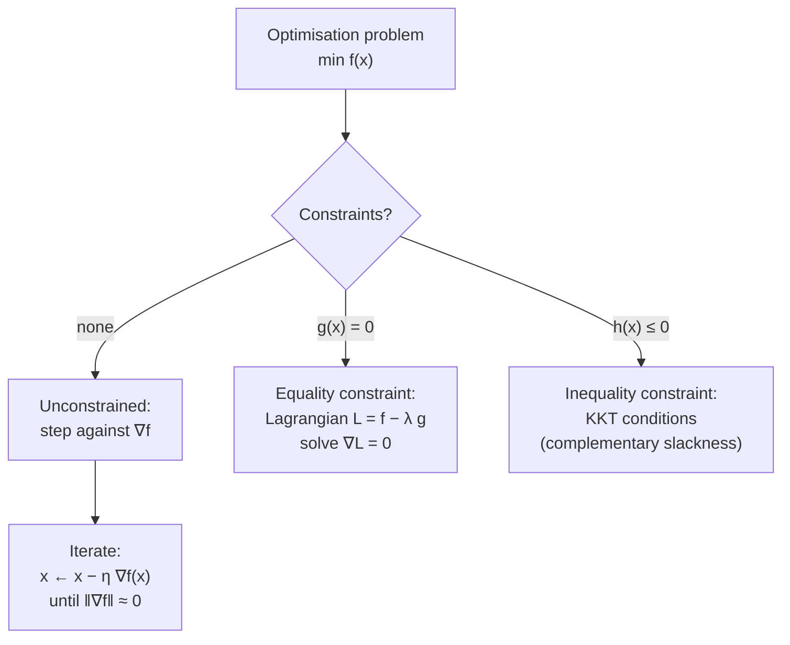

## Continuous Optimization — Gradient Descent & Constrained Optimisation

Big picture (no jargon)

**Optimisation** is the art of finding the input that makes some output as small (or as large) as possible. In ML, it's "find the weights that minimise the loss." When all the variables are real numbers and the loss is smooth, the workhorse is **gradient descent**: stand at a point, look at the slope ($\nabla f$), step downhill. Repeat. Eventually you reach a flat spot — hopefully the bottom.

When the problem comes with **constraints** ("don't let the weights leave this region", "the prediction probabilities must sum to 1"), you can't just walk freely downhill — you have to stay on the allowed surface. The trick is **Lagrange multipliers**: introduce one extra variable per constraint, fold the constraints *into* the objective, and then look for stationary points of the bigger function.

**Real-world analogy.** Unconstrained: descending a hill in any direction you like. Constrained: the same hill, but you're forced to walk along a fence — you can only move along the fence, not perpendicular to it. At your lowest point on the fence, the slope of the hill must be entirely *across* the fence (no remaining downhill component along the fence). That perpendicularity condition is what Lagrange multipliers detect.

### Vocabulary — every term, defined plainly

- **Objective function** — the function you want to minimise (or maximise). In ML it's the loss.
- **Decision variables** — the inputs you're allowed to choose (in ML: the parameters $\boldsymbol\theta$).
- **Unconstrained optimisation** — no restrictions on where the variables can live.
- **Constrained optimisation** — the variables must satisfy equations or inequalities.
- **Equality constraint** — $g(\mathbf{x}) = 0$. The solution must lie on a surface.
- **Inequality constraint** — $h(\mathbf{x}) \le 0$. The solution must lie on the right side of a surface.
- **Feasible region** — the set of all $\mathbf{x}$ satisfying every constraint.
- **Step size / learning rate ($\eta$)** — how big a step gradient descent takes.
- **Stationary point** — where $\nabla f = \mathbf{0}$. Could be min, max, or saddle.
- **Lagrange multiplier ($\lambda$)** — an extra variable per equality constraint, weighting how much the constraint "pushes" on the objective.
- **Lagrangian** — the combined function $\mathcal{L}(\mathbf{x}, \lambda) = f(\mathbf{x}) - \lambda g(\mathbf{x})$.
- **KKT conditions** — Karush–Kuhn–Tucker conditions; the generalisation of Lagrange multipliers to inequality constraints.
- **Convergence** — gradient descent converges if $\nabla f$ shrinks to zero (or steps stop making progress).

### Picture it

### Build the idea

**Gradient descent (the algorithm).**

$$
\boldsymbol\theta_{t+1} = \boldsymbol\theta_t - \eta\, \nabla f(\boldsymbol\theta_t).
$$

Pick a starting point $\boldsymbol\theta_0$, choose a step size $\eta > 0$, and apply the update repeatedly. Stop when $\|\nabla f\|$ is below a tolerance, or when you've used up your iteration budget.

**Choice of $\eta$ matters.**

- $\eta$ too small → tiny steps, very slow convergence.
- $\eta$ too large → overshoots the minimum, *diverges* (loss climbs to infinity).
- Sweet spot: depends on the curvature. For a quadratic with largest eigenvalue $L$ (Lipschitz constant of the gradient), the safe choice is $\eta < 2/L$, optimal $\eta = 1/L$.

**Equality-constrained optimisation (Lagrange multipliers).** Problem:

$$
\min_\mathbf{x} f(\mathbf{x}) \quad \text{subject to}\quad g(\mathbf{x}) = 0.
$$

Form the Lagrangian and find its critical points:

$$
\mathcal{L}(\mathbf{x}, \lambda) = f(\mathbf{x}) - \lambda\, g(\mathbf{x}), \qquad \nabla_\mathbf{x} \mathcal{L} = \mathbf{0},\; \nabla_\lambda \mathcal{L} = 0.
$$

The first equation gives $\nabla f = \lambda\, \nabla g$ — the gradients of $f$ and $g$ are *parallel* at the optimum. Geometrically: at the best point on the constraint surface, the downhill direction has no component along the surface.

**Inequality-constrained optimisation (KKT conditions).** Problem:

$$
\min_\mathbf{x} f(\mathbf{x}) \quad \text{subject to}\quad h(\mathbf{x}) \le 0.
$$

At an optimum $\mathbf{x}^*$ there exists $\mu \ge 0$ such that:

1. **Stationarity:** $\nabla f(\mathbf{x}^*) + \mu\, \nabla h(\mathbf{x}^*) = \mathbf{0}$.
2. **Primal feasibility:** $h(\mathbf{x}^*) \le 0$.
3. **Dual feasibility:** $\mu \ge 0$.
4. **Complementary slackness:** $\mu \cdot h(\mathbf{x}^*) = 0$ — either the constraint is *active* ($h = 0$) or it doesn't matter ($\mu = 0$).

Complementary slackness is the cleverest part: it says "either the constraint is binding, or it doesn't influence the solution." That's exactly the dichotomy you'd expect intuitively.

<dl class="symbols">
  <dt>$f$</dt><dd>objective function — the thing being minimised</dd>
  <dt>$g, h$</dt><dd>equality and inequality constraint functions</dd>
  <dt>$\eta$</dt><dd>learning rate / step size</dd>
  <dt>$\lambda, \mu$</dt><dd>Lagrange / KKT multipliers (one per constraint)</dd>
  <dt>$\boldsymbol\theta$</dt><dd>generic parameter / decision variable</dd>
</dl>

### Worked example — fully expanded, no skipped arithmetic

Worked example: minimise on a circle (Lagrange)

**Problem.** Minimise $f(x, y) = x + 2y$ subject to $g(x, y) = x^2 + y^2 - 5 = 0$ (i.e. on the circle of radius $\sqrt{5}$).

**Step 1 — Form the Lagrangian.**

$$
\mathcal{L}(x, y, \lambda) = (x + 2y) - \lambda(x^2 + y^2 - 5).
$$

**Step 2 — Set its partial derivatives to zero.**

$$
\frac{\partial \mathcal{L}}{\partial x} = 1 - 2\lambda x = 0 \;\Rightarrow\; x = \frac{1}{2\lambda},
$$

$$
\frac{\partial \mathcal{L}}{\partial y} = 2 - 2\lambda y = 0 \;\Rightarrow\; y = \frac{1}{\lambda},
$$

$$
\frac{\partial \mathcal{L}}{\partial \lambda} = -(x^2 + y^2 - 5) = 0 \;\Rightarrow\; x^2 + y^2 = 5.
$$

**Step 3 — Substitute $x, y$ from the first two equations into the third.**

$$
\left(\frac{1}{2\lambda}\right)^2 + \left(\frac{1}{\lambda}\right)^2 = 5,
$$

$$
\frac{1}{4\lambda^2} + \frac{1}{\lambda^2} = 5.
$$

Combine over a common denominator $4\lambda^2$:

$$
\frac{1 + 4}{4\lambda^2} = 5 \;\Rightarrow\; \frac{5}{4\lambda^2} = 5 \;\Rightarrow\; 4\lambda^2 = 1 \;\Rightarrow\; \lambda^2 = \tfrac{1}{4} \;\Rightarrow\; \lambda = \pm\tfrac{1}{2}.
$$

**Step 4 — Recover both candidate points.**

- For $\lambda = +\tfrac{1}{2}$: $x = 1/(2 \cdot 0.5) = 1$, $y = 1/0.5 = 2$. Point $(1, 2)$. Check on the circle: $1 + 4 = 5$. ✓
- For $\lambda = -\tfrac{1}{2}$: $x = 1/(-1) = -1$, $y = 1/(-0.5) = -2$. Point $(-1, -2)$. Check: $1 + 4 = 5$. ✓

**Step 5 — Evaluate $f$ at both candidates.**

- $f(1, 2) = 1 + 4 = 5$.
- $f(-1, -2) = -1 + (-4) = -5$.

**Conclusion.** Minimum is $f^* = -5$ at $(-1, -2)$; maximum is $5$ at $(1, 2)$.

**Geometric sanity check.** $\nabla f = (1, 2)$ is constant. $\nabla g = (2x, 2y)$. At $(-1, -2)$, $\nabla g = (-2, -4) = -2 \cdot (1, 2)$ — parallel to $\nabla f$, as Lagrange demanded. ✓

### How to think about it

Mental model — "level sets meeting tangentially"

Picture the level sets of $f$ (contour lines: $f = 0, f = 1, f = 2, \dots$) and the constraint surface $g = 0$. As you sweep the level sets across the constraint, they typically cut through it. **The optimum is where the moving level set first becomes *tangent* to the constraint** — at that point, the gradient of $f$ is perpendicular to the constraint surface, which is exactly $\nabla f \parallel \nabla g$.

Gradient descent is the simplest possible optimisation engine — it uses only first derivatives, has one hyperparameter ($\eta$), and works on essentially any smooth problem. Its main weakness: it ignores curvature, so it zigzags through narrow valleys (ill-conditioned problems). Newton's method and Adam patch this in different ways.

**When this comes up in ML.** Lagrangians are the foundation of SVMs (constrained quadratic programs), regularisation can be derived from constrained optimisation (ridge ↔ "minimise loss s.t. $\|\mathbf{w}\|^2 \le t$"), and KKT conditions characterise *every* optimum of any constrained ML problem.

Watch out — common traps

- Lagrange multipliers find *all* stationary points (mins, maxes, and saddles on the constraint surface). Always evaluate $f$ at each candidate to pick the actual min.
- Lagrange multipliers can be **negative** (or any sign) for *equality* constraints. Only KKT multipliers $\mu$ for *inequality* constraints must be $\ge 0$.
- The sign convention $\mathcal{L} = f - \lambda g$ vs $\mathcal{L} = f + \lambda g$ flips $\lambda$'s sign — both are fine, just be consistent.
- Gradient descent on a non-convex landscape can get stuck in local minima or saddle points — random restarts and momentum help.
- A constraint like $h(\mathbf{x}) \le 0$ that's *not active* at the optimum has $\mu = 0$ — it's "ignored." Active constraints have $\mu > 0$ — they're "binding."

Exam tip

For a Lagrange problem with one equality constraint, you'll always end up with $n + 1$ equations in $n + 1$ unknowns ($\mathbf{x}$ and $\lambda$). The trick is to solve the first $n$ equations for $\mathbf{x}$ in terms of $\lambda$, then plug into the constraint to get a single equation in $\lambda$. Practise this elimination step — it's the make-or-break manoeuvre on every Lagrange exam question.

