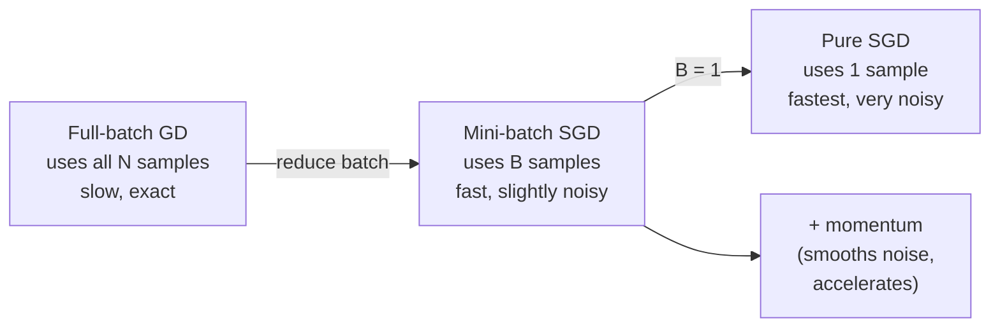

## Nonlinear Optimization I — SGD, Mini-Batches & Momentum

Big picture (no jargon)

Standard gradient descent computes the loss gradient by averaging over **all** training examples — accurate but slow. With a million examples, every single update needs a million function evaluations.

**Stochastic Gradient Descent (SGD)** uses a much cheaper estimate: pick *one* example (or a small **mini-batch**) at random and compute the gradient using only those. The estimate is *noisy* — it bounces around the true gradient — but on average it points the right way. The noise even turns out to be helpful: it kicks the optimiser out of bad local minima and saddle points.

**Momentum** adds memory: instead of stepping purely in the current noisy direction, blend in a fraction of the previous step. The result smooths out the noise (consistent directions accumulate; random wobble cancels) and accelerates progress on long, gentle slopes.

**Real-world analogy.** Full-batch GD is like surveying the whole countryside before each step — exact but exhausting. SGD is sprinting downhill based on what's right under your feet — wobbly but fast. Momentum is rolling a heavy ball: it picks up speed in consistent downhill directions and ignores tiny bumps.

### Vocabulary — every term, defined plainly

- **Batch** — the set of training examples used in one gradient computation.
- **Full-batch GD** — uses all $N$ training examples for every update.
- **SGD (pure stochastic)** — uses *one* example per update (batch size $B = 1$).
- **Mini-batch SGD** — uses $B$ examples per update, where $B$ is small (typical: 32, 64, 128, 256).
- **Epoch** — one full pass over the training data. With $N$ examples and batch $B$, one epoch = $\lceil N/B \rceil$ updates.
- **Iteration / step** — one parameter update.
- **Learning rate ($\eta$)** — step size; how far to move in the (negative) gradient direction.
- **Velocity ($\mathbf{v}$)** — the running momentum vector; an exponentially-weighted average of past gradients.
- **Momentum coefficient ($\beta$)** — what fraction of past velocity to keep, typically $0.9$.
- **Nesterov accelerated gradient (NAG)** — a "look-ahead" variant: evaluate the gradient at the *predicted* next position, not the current one.
- **Learning-rate schedule** — a rule for shrinking $\eta$ over time so the optimiser settles down near the minimum.
- **Variance of the stochastic gradient** — how noisy the mini-batch estimate is. Smaller batch → higher variance.

### Picture it

### Build the idea

**The three flavours.**

| Variant | Batch size $B$ | Per-step cost | Noise level | Typical use |
|---|---|---|---|---|
| Full-batch GD | $N$ | $\mathcal{O}(N)$ | none | Convex problems, small $N$ |
| Mini-batch SGD | $32$ – $512$ | $\mathcal{O}(B)$ | moderate | **Default for deep learning** |
| Pure SGD | $1$ | $\mathcal{O}(1)$ | high | Online / streaming |

**Update rule (same shape for all).** Let $\tilde{\nabla} f$ be the gradient computed on the current batch:

$$
\boldsymbol\theta_{t+1} = \boldsymbol\theta_t - \eta\, \tilde{\nabla} f(\boldsymbol\theta_t).
$$

The expectation $\mathbb{E}[\tilde\nabla f] = \nabla f$ — so on average we're doing true gradient descent, just with noise.

**Momentum.** Add a velocity vector $\mathbf{v}$ that exponentially averages past gradients:

$$
\mathbf{v}_{t+1} = \beta\, \mathbf{v}_t + \nabla f(\boldsymbol\theta_t), \qquad \boldsymbol\theta_{t+1} = \boldsymbol\theta_t - \eta\, \mathbf{v}_{t+1}.
$$

With $\beta = 0.9$, the velocity is roughly an average over the last $1/(1-\beta) = 10$ gradients. This (a) cancels noise that points in random directions and (b) accelerates motion in directions where successive gradients agree.

**Nesterov (NAG).** Look ahead first — evaluate $\nabla f$ at the position you're *about to be at* (using the current velocity), not where you are:

$$
\mathbf{v}_{t+1} = \beta\, \mathbf{v}_t + \nabla f(\boldsymbol\theta_t - \eta\beta\,\mathbf{v}_t), \qquad \boldsymbol\theta_{t+1} = \boldsymbol\theta_t - \eta\, \mathbf{v}_{t+1}.
$$

Often a small but free win — same per-step cost, slightly faster convergence.

**Learning-rate schedules.** A constant $\eta$ never lets pure SGD settle to the exact minimum (it hovers in a noise ball). Decay $\eta$ over time:

| Schedule | Formula | Notes |
|---|---|---|
| Step decay | $\eta_t = \eta_0 / 2^{\lfloor t/k \rfloor}$ | Halve every $k$ epochs — classic |
| Exponential | $\eta_t = \eta_0 \cdot e^{-kt}$ | Smooth decay |
| Cosine | $\eta_t = \tfrac{1}{2}\eta_0 (1 + \cos(\pi t / T))$ | Modern default for deep nets |
| Warm-up + decay | Linear ramp then cosine | Big batches / Transformers |

<dl class="symbols">
  <dt>$N$</dt><dd>total number of training examples</dd>
  <dt>$B$</dt><dd>mini-batch size</dd>
  <dt>$\eta$</dt><dd>learning rate</dd>
  <dt>$\beta$</dt><dd>momentum coefficient (typically $0.9$)</dd>
  <dt>$\mathbf{v}$</dt><dd>velocity vector — exponentially weighted average of past gradients</dd>
  <dt>$\tilde\nabla f$</dt><dd>stochastic (mini-batch) gradient estimate</dd>
</dl>

### Worked example — fully expanded, no skipped arithmetic

Worked example: SGD step with momentum

**Setup.** Optimise $f(\theta) = \tfrac{1}{2}\theta^2$ (a 1-D quadratic, minimum at $\theta = 0$). Start at $\theta_0 = 4.0$, learning rate $\eta = 0.1$, momentum $\beta = 0.9$, initial velocity $v_0 = 0$. The exact gradient is $\nabla f(\theta) = \theta$.

**Vanilla SGD (no momentum) — first 3 steps.**

- Step 1: gradient $= \theta_0 = 4.0$, update $\theta_1 = 4.0 - 0.1 \cdot 4.0 = 4.0 - 0.4 = 3.6$.
- Step 2: gradient $= 3.6$, update $\theta_2 = 3.6 - 0.1 \cdot 3.6 = 3.6 - 0.36 = 3.24$.
- Step 3: gradient $= 3.24$, update $\theta_3 = 3.24 - 0.324 = 2.916$.

Each step shrinks $\theta$ by factor $0.9$ — slow geometric decay.

**SGD with momentum — first 3 steps.**

- Step 1: $g_1 = 4.0$. $v_1 = 0.9 \cdot 0 + 4.0 = 4.0$. $\theta_1 = 4.0 - 0.1 \cdot 4.0 = 3.6$.
- Step 2: $g_2 = 3.6$. $v_2 = 0.9 \cdot 4.0 + 3.6 = 3.6 + 3.6 = 7.2$. $\theta_2 = 3.6 - 0.1 \cdot 7.2 = 3.6 - 0.72 = 2.88$.
- Step 3: $g_3 = 2.88$. $v_3 = 0.9 \cdot 7.2 + 2.88 = 6.48 + 2.88 = 9.36$. $\theta_3 = 2.88 - 0.1 \cdot 9.36 = 2.88 - 0.936 = 1.944$.

After 3 steps: vanilla SGD reached $\theta = 2.916$; momentum SGD reached $\theta = 1.944$. Momentum is **faster** because successive gradients all point the same way (toward 0), so velocity keeps building.

**Cost comparison for a real problem.** $N = 10000$ training examples.

- Full-batch GD: $10000$ gradient evaluations per update. To do 100 updates needs $10^6$ evals.
- Mini-batch SGD with $B = 32$: $\lceil 10000/32 \rceil = 313$ updates per epoch, each costing $32$ evals = $10000$ evals per epoch. 30 epochs needs $\approx 3 \times 10^5$ evals — *3× cheaper* than full-batch — and it usually converges to similar accuracy because the frequent updates compound.

### How to think about it

Mental model — noise as a feature, not a bug

Pure stochastic gradient descent is mathematically *worse* than full-batch GD at any given step (its gradient is noisier). But it's so much cheaper per step that you can afford to take many more steps in the same wall-clock time, which more than compensates. And the noise has a side benefit: it gives the optimiser enough randomness to *escape* shallow local minima and saddle points — the same noise that hurts in the steady state helps during exploration.

Momentum is just a low-pass filter on the gradient stream. Random wobble averages to zero; consistent direction accumulates. Think of a ball rolling down a noisy hillside — the inertia smooths over the bumps.

**When this comes up in ML.** Mini-batch SGD with momentum is the *de facto* training algorithm for image models (ResNet, ViT) before Adam took over. Every modern optimiser builds on this — Adam adds adaptive per-parameter LR on top of momentum. Choice of batch size, $\eta$, and $\beta$ are the three knobs you'll always tune.

Watch out — common traps

- **Constant LR + pure SGD does not converge to the minimum** — it hovers in a noise cloud whose size scales with $\eta$. You *must* decay $\eta$ to actually settle.
- $\eta$ too large diverges silently — loss climbs to NaN. If your loss explodes in the first few steps, halve $\eta$.
- **Linear scaling rule:** if you increase batch size by $k$, you can usually increase $\eta$ by $k$ too. But not indefinitely — past a critical batch size, generalisation suffers.
- Momentum with $\beta \ge 1$ is unstable (velocity grows without bound). Stay below $1$, typically $0.9$ or $0.99$.
- Don't confuse Nesterov with classical momentum — they use different "what gradient to evaluate where" — implementations sometimes silently swap conventions.

Exam tip

Be ready to **derive the SGD update** for a single mini-batch from the loss definition, and to **explain why momentum helps** in two sentences: "(a) it cancels noise that points in random directions by averaging across steps; (b) it accelerates progress in directions where successive gradients agree." These are favourite short-answer questions.

