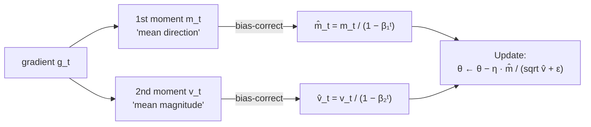

## Nonlinear Optimization II — Adam Family & Difficult Landscapes

Big picture (no jargon)

In a deep network, the loss surface looks very different along different parameters: some weights live in steep canyons (gradients are huge — a single step would overshoot), others on flat plateaus (gradients are tiny — vanilla SGD barely moves). One global learning rate can't be right for both.

**Adaptive optimisers** (AdaGrad, RMSProp, Adam) keep a *per-parameter* learning rate based on the historical magnitude of that parameter's gradient. Loud parameters get *quieter* effective steps; silent parameters get *louder* ones. **Adam** combines this idea (RMSProp) with momentum and adds a small correction for early-iteration bias — and is the default workhorse of deep learning.

**Real-world analogy.** Tuning a graphic-equaliser one band at a time. SGD moves all sliders together by the same amount. Adam watches each band: bands that have been jumping around get *fine* control; bands that have been stuck get *bold* moves.

### Vocabulary — every term, defined plainly

- **Adaptive learning rate** — a per-parameter step size that gets smaller for parameters with historically large gradients.
- **AdaGrad** — accumulates the *sum* of squared gradients; LR shrinks monotonically.
- **RMSProp** — uses an *exponential moving average* of squared gradients instead of a sum, so LR can recover.
- **Adam** — Adaptive Moment estimation. Combines momentum (1st moment) + RMSProp (2nd moment) + bias correction.
- **First moment ($m_t$)** — exponentially-weighted *mean* of the gradient. Like momentum's velocity.
- **Second moment ($v_t$)** — exponentially-weighted *mean of the square* of the gradient. Estimates the gradient's magnitude.
- **Bias correction ($\hat m, \hat v$)** — a small rescaling that fixes the under-estimation caused by initialising $m_0 = v_0 = 0$.
- **$\beta_1, \beta_2$** — decay rates for the two moments. Defaults: $\beta_1 = 0.9$, $\beta_2 = 0.999$.
- **$\epsilon$** — tiny constant ($10^{-8}$) preventing division by zero.
- **AdamW** — Adam with weight decay *decoupled* from the gradient. Usually preferred over plain Adam + $\ell_2$.
- **Saddle point** — a critical point that's a min in some directions and a max in others. Most of the "stuck spots" in deep learning are saddle points, not local minima.
- **Plateau** — a region of the loss surface where the gradient is uniformly tiny.
- **Cliff** — a region where the loss suddenly spikes — gradients jump to huge magnitudes.
- **Gradient clipping** — clamping $\|\mathbf{g}\| \le c$ before the update, so a cliff doesn't blast you across the loss landscape.
- **Vanishing / exploding gradients** — in deep networks, the gradient signal can shrink or grow exponentially with depth.

### Picture it

### Build the idea

**AdaGrad.** Accumulate the *sum* of squared gradients per parameter. Each parameter gets its own LR proportional to $1/\sqrt{\text{accumulated gradient energy}}$:

$$
G_t = G_{t-1} + g_t \odot g_t, \qquad \theta_{t+1} = \theta_t - \frac{\eta}{\sqrt{G_t} + \epsilon} \odot g_t.
$$

Pros: parameter-adaptive, great for sparse features (rare features get big steps when they fire). Cons: $G_t$ only grows ⇒ effective LR monotonically shrinks ⇒ training stalls in long runs.

**RMSProp.** Replace the *sum* with an *exponential moving average*:

$$
v_t = \rho\, v_{t-1} + (1 - \rho)\, g_t^2, \qquad \theta_{t+1} = \theta_t - \frac{\eta}{\sqrt{v_t} + \epsilon} \odot g_t.
$$

Now LR doesn't monotonically die — it adapts to *recent* gradient activity.

**Adam = momentum + RMSProp + bias correction.**

$$
\begin{aligned}
m_t &= \beta_1 m_{t-1} + (1 - \beta_1)\, g_t \quad\text{(1st moment)}\\
v_t &= \beta_2 v_{t-1} + (1 - \beta_2)\, g_t^2 \quad\text{(2nd moment)}\\
\hat m_t &= m_t / (1 - \beta_1^t) \quad\text{(bias correction)}\\
\hat v_t &= v_t / (1 - \beta_2^t)\\
\theta_{t+1} &= \theta_t - \eta\, \frac{\hat m_t}{\sqrt{\hat v_t} + \epsilon}
\end{aligned}
$$

**Why bias correction?** $m_0 = v_0 = 0$, so for small $t$ the moments under-estimate the truth (they haven't had time to "warm up"). Dividing by $(1 - \beta_1^t)$ exactly cancels this bias.

**Why $\sqrt{\hat v_t}$ in the denominator?** It normalises across parameters so each parameter takes a step of *comparable effective size*, regardless of whether its gradient is large or small. Notice $\hat m_t / \sqrt{\hat v_t} \approx \operatorname{sign}(g_t)$ early on — the *initial* per-parameter step size is roughly $\eta$, no matter what the raw gradient magnitude is.

**Difficult landscapes — what hurts and how to fix it.**

| Hazard | Symptom | Fix |
|---|---|---|
| **Saddle points** | $\nabla \approx 0$ but it's not a min | Momentum, SGD noise, second-order info |
| **Plateaus** | tiny gradients, slow progress | Warm restarts, larger LR, normalisation |
| **Cliffs** | sudden huge gradient | Gradient clipping ($\|\mathbf{g}\| \le c$) |
| **Vanishing gradients** | early layers stop learning | BatchNorm/LayerNorm, residual connections, careful init |
| **Exploding gradients** | NaN losses | Clipping, smaller LR, weight init scaling |
| **Ill-conditioning** ($\kappa$ large) | zigzag descent | Adam, preconditioning, batch normalisation |

<dl class="symbols">
  <dt>$g_t$</dt><dd>gradient at step $t$ (a vector or matrix the size of $\theta$)</dd>
  <dt>$m_t, v_t$</dt><dd>1st and 2nd moments — running averages of $g$ and $g^2$</dd>
  <dt>$\hat m_t, \hat v_t$</dt><dd>bias-corrected moments</dd>
  <dt>$\beta_1, \beta_2$</dt><dd>decay rates (0.9 and 0.999)</dd>
  <dt>$\epsilon$</dt><dd>tiny constant ($10^{-8}$) — prevents division by zero</dd>
  <dt>$\odot$</dt><dd>element-wise product / division (Hadamard)</dd>
</dl>

### Worked example — fully expanded, no skipped arithmetic

Worked example: Adam's first step

**Setup.** A single parameter $\theta_0 = 5.0$. Gradient at step 1: $g_1 = 0.4$. Default Adam: $\eta = 0.001$, $\beta_1 = 0.9$, $\beta_2 = 0.999$, $\epsilon = 10^{-8}$. Initial $m_0 = v_0 = 0$.

**Step 1 — Update first moment.**

$$
m_1 = 0.9 \cdot 0 + (1 - 0.9) \cdot 0.4 = 0 + 0.1 \cdot 0.4 = 0.04.
$$

**Step 2 — Update second moment.** Square the gradient first: $g_1^2 = 0.4^2 = 0.16$.

$$
v_1 = 0.999 \cdot 0 + (1 - 0.999) \cdot 0.16 = 0 + 0.001 \cdot 0.16 = 0.00016.
$$

**Step 3 — Bias correction.** At $t = 1$:

$$
\hat m_1 = \frac{m_1}{1 - \beta_1^1} = \frac{0.04}{1 - 0.9} = \frac{0.04}{0.1} = 0.4.
$$

$$
\hat v_1 = \frac{v_1}{1 - \beta_2^1} = \frac{0.00016}{1 - 0.999} = \frac{0.00016}{0.001} = 0.16.
$$

**Notice:** $\hat m_1 = g_1$ and $\hat v_1 = g_1^2$ — bias correction exactly recovers the raw gradient on the first step. That's by design.

**Step 4 — Compute the update.**

$$
\Delta\theta = -\eta \cdot \frac{\hat m_1}{\sqrt{\hat v_1} + \epsilon} = -0.001 \cdot \frac{0.4}{\sqrt{0.16} + 10^{-8}} = -0.001 \cdot \frac{0.4}{0.4 + 10^{-8}} \approx -0.001 \cdot 1.0 = -0.001.
$$

So $\theta_1 = 5.0 + (-0.001) = 4.999$.

**Key observation.** The step size is essentially $\eta \cdot \operatorname{sign}(g_1) = 0.001$ — *not* $\eta \cdot g_1 = 0.0004$. Adam normalises away the gradient's magnitude, taking roughly an $\eta$-sized step in the gradient's direction. This is why Adam is so robust to gradient scale and why $\eta = 10^{-3}$ is a sensible default for almost any problem.

**What if step 2 has a wildly different gradient $g_2 = 4.0$?** $m_2$ and $v_2$ both update toward this larger value, and $\hat m_2 / \sqrt{\hat v_2}$ stays around $1$ in magnitude — Adam *self-rescales*. The update is *still* about $\eta$ in size, even though the raw gradient grew 10×.

### How to think about it

Mental model — "where am I going" vs "how loud have I been"

$m_t$ tracks "where am I going on average" — direction-with-momentum. $v_t$ tracks "how loud has my gradient been recently" — magnitude-RMS. The Adam update divides one by the other, so the *effective* step size is roughly normalised: a parameter that's been jumping around gets damped, a parameter that's been quiet gets boosted.

That's why Adam often "just works" without much LR tuning — it auto-adjusts to the local landscape per parameter. Its big tradeoff: the adaptive LRs can hurt generalisation in some regimes (image classification famously prefers SGD+momentum), so it's not a universal upgrade.

**When this comes up in ML.** Adam (or AdamW) is the default optimiser for Transformers, BERT, GPT, ViT, and most non-vision deep models. Knowing the four-line update by heart and being able to explain bias correction is mandatory for any deep-learning interview/exam.

Watch out — common traps

- Adam with $\ell_2$ regularisation (added to the loss) is **not** the same as Adam with weight decay (subtracted from the parameters). The adaptive scaling distorts the $\ell_2$ penalty. **AdamW** decouples weight decay from the gradient — usually the better default.
- Adam's $\epsilon$ matters more than you'd think. Too small ($10^{-16}$) can cause numerical issues; the default $10^{-8}$ is fine almost always.
- For very early steps, $1 - \beta_2^t$ is *tiny* (like $0.001$ at $t=1$), so $\hat v_t$ is huge — bias correction is essential. Without it, your first ~100 updates would be way too big.
- Adam can *fail to converge* on certain convex problems (the "AMSGrad" paper showed this). Practical fix: use a learning-rate schedule.
- Big gradients near a cliff can NaN out training. **Always clip** when training RNNs/Transformers from scratch.

Exam tip

Be able to write **all four lines of Adam from memory**, and to explain in one sentence each: (a) why bias correction is needed, (b) why $\sqrt{\hat v}$ appears in the denominator, (c) why $\beta_2 = 0.999$ vs $\beta_1 = 0.9$ (the second moment changes more slowly because we want a stable magnitude estimate). These are guaranteed long-answer territory.

