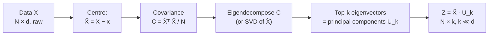

## Dimensionality Reduction & PCA

Big picture (no jargon)

Real-world data has many features but most of the *variation* lives along a few directions. **Principal Component Analysis (PCA)** finds those directions — the **principal components** — and projects the data onto them. Same data, fewer numbers per sample, almost no information lost.

Two equivalent ways to think about what PCA is doing:

1. **Variance maximisation.** Find the direction along which the data varies the most, then the second-most (perpendicular to the first), and so on.
2. **Reconstruction-error minimisation.** Find a low-dimensional subspace such that projecting the data onto it loses as little as possible (in the sense of squared distance).

These two views are mathematically the same problem. PCA solves it in closed form using eigendecomposition (or SVD).

**Real-world analogy.** A pancake-shaped cloud of points in 3D. PCA finds the long axis of the pancake (PC1) — that's where most of the spread lives. Then the second-longest axis (PC2), perpendicular to it. The thin "thickness" direction (PC3) carries hardly any spread, so dropping it loses almost nothing — we've squashed 3D → 2D losslessly-ish.

### Vocabulary — every term, defined plainly

- **Feature** — one column of the data matrix (e.g. `height`, `weight`).
- **Sample** — one row of the data matrix (one student's measurements).
- **Centred data** — data with the mean of each column subtracted, so each feature has mean 0.
- **Covariance matrix $C$** — a $d \times d$ matrix; entry $C_{ij}$ measures how feature $i$ and feature $j$ co-vary. Diagonal entries = variances.
- **Principal Component (PC)** — a unit-length direction vector in feature space. PC1 is the highest-variance direction; PC2 is the highest-variance direction perpendicular to PC1; etc.
- **Eigenvector / eigenvalue of $C$** — PCs are eigenvectors of $C$. The corresponding eigenvalue $\lambda_i$ is the variance captured by that PC.
- **Score / projection $Z$** — the data expressed in the new (PC) coordinate system. $Z = \tilde X U_k$.
- **Loadings** — the columns of $U$ — coefficients telling you how each PC is built from original features.
- **Explained variance ratio** — $\lambda_i / \sum_j \lambda_j$ — fraction of the total variance captured by PC $i$.
- **Scree plot** — a bar chart of eigenvalues in decreasing order; the "elbow" suggests how many PCs to keep.
- **Standardisation** — subtracting the mean *and* dividing by the std-dev of each feature. Required when features have different units.
- **Reconstruction** — projecting back from $k$ PCs to $d$-dim feature space: $\hat X = Z U_k^\top$. The residual $X - \hat X$ is the information that was discarded.
- **Frobenius norm $\|\cdot\|_F$** — total squared error across all entries of the residual matrix.

### Picture it

### Build the idea

**Algorithm — five steps.**

1. **Centre.** $\tilde X = X - \bar{\mathbf{x}}$, so each column of $\tilde X$ has mean 0.
2. **Covariance.** $C = \tfrac{1}{N}\tilde X^\top \tilde X \in \mathbb{R}^{d \times d}$. Symmetric, positive-semidefinite.
3. **Eigendecompose.** $C = U \Lambda U^\top$ with eigenvalues $\lambda_1 \ge \lambda_2 \ge \dots \ge \lambda_d \ge 0$ and $U$'s columns orthonormal eigenvectors.
4. **Pick** the top $k$ eigenvectors: $U_k = [\mathbf{u}_1, \dots, \mathbf{u}_k]$.
5. **Project.** $Z = \tilde X U_k \in \mathbb{R}^{N \times k}$.

**Equivalently via SVD.** $\tilde X = U_\text{svd} \Sigma V^\top$. Then PCs are columns of $V$, and scores are $U_\text{svd} \Sigma$. SVD is numerically more stable than forming $C$ explicitly.

**Two equivalent objectives PCA solves.**

$$
\underbrace{\max_{\mathbf{u},\,\|\mathbf{u}\|=1} \mathbf{u}^\top C\, \mathbf{u}}_{\text{maximise variance along }\mathbf{u}} \;\Leftrightarrow\; \underbrace{\min_{U_k} \big\|\tilde X - \tilde X U_k U_k^\top\big\|_F^2}_{\text{minimise reconstruction error}}.
$$

The Lagrangian for the variance-max problem (with constraint $\|\mathbf{u}\|^2 = 1$) immediately gives $C\mathbf{u} = \lambda \mathbf{u}$ — i.e. PCs are eigenvectors of $C$.

**How many components to keep.** Pick the smallest $k$ such that

$$
\text{Cumulative explained variance ratio} = \frac{\sum_{i=1}^{k} \lambda_i}{\sum_{i=1}^{d} \lambda_i} \ge \tau,
$$

where $\tau$ is your threshold (often $0.90$ or $0.95$). Or eyeball the **scree plot** for an elbow.

<dl class="symbols">
  <dt>$X$</dt><dd>raw data matrix, $N \times d$ (rows = samples, cols = features)</dd>
  <dt>$\tilde X$</dt><dd>centred data matrix</dd>
  <dt>$C$</dt><dd>covariance matrix, $d \times d$</dd>
  <dt>$\mathbf{u}_i$</dt><dd>$i$-th principal component (a unit vector in $\mathbb{R}^d$)</dd>
  <dt>$\lambda_i$</dt><dd>variance along $\mathbf{u}_i$</dd>
  <dt>$U_k U_k^\top$</dt><dd>projection matrix onto the top-$k$ subspace</dd>
  <dt>$Z$</dt><dd>score matrix — data in new (PC) coordinates</dd>
</dl>

### Worked example — fully expanded, no skipped arithmetic

Worked example: PCA of a tiny 2D dataset

**Given.** Four samples in 2D: $\mathbf{x}_1 = (2, 0)$, $\mathbf{x}_2 = (0, 2)$, $\mathbf{x}_3 = (-2, 0)$, $\mathbf{x}_4 = (0, -2)$.

**Step 1 — Compute the column means.**

$$
\bar x = \frac{2 + 0 + (-2) + 0}{4} = 0, \qquad \bar y = \frac{0 + 2 + 0 + (-2)}{4} = 0.
$$

Already centred — convenient.

**Step 2 — Compute the covariance matrix.** With $N = 4$:

$$
\tilde X = \begin{bmatrix} 2 & 0 \\ 0 & 2 \\ -2 & 0 \\ 0 & -2 \end{bmatrix}, \qquad \tilde X^\top \tilde X = \begin{bmatrix} 2 & 0 & -2 & 0 \\ 0 & 2 & 0 & -2 \end{bmatrix} \begin{bmatrix} 2 & 0 \\ 0 & 2 \\ -2 & 0 \\ 0 & -2 \end{bmatrix}.
$$

Compute each entry of $\tilde X^\top \tilde X$:

- $(1,1)$: $2 \cdot 2 + 0 \cdot 0 + (-2)(-2) + 0 \cdot 0 = 4 + 0 + 4 + 0 = 8$.
- $(1,2)$: $2 \cdot 0 + 0 \cdot 2 + (-2) \cdot 0 + 0 \cdot (-2) = 0$.
- $(2,1)$: $0 \cdot 2 + 2 \cdot 0 + 0 \cdot (-2) + (-2) \cdot 0 = 0$.
- $(2,2)$: $0 \cdot 0 + 2 \cdot 2 + 0 \cdot 0 + (-2)(-2) = 0 + 4 + 0 + 4 = 8$.

So $\tilde X^\top \tilde X = \begin{bmatrix} 8 & 0 \\ 0 & 8 \end{bmatrix}$, and

$$
C = \frac{1}{N}\,\tilde X^\top \tilde X = \frac{1}{4}\begin{bmatrix} 8 & 0 \\ 0 & 8 \end{bmatrix} = \begin{bmatrix} 2 & 0 \\ 0 & 2 \end{bmatrix}.
$$

**Step 3 — Eigendecompose $C$.** $C$ is already diagonal, so eigenvalues are the diagonal entries: $\lambda_1 = \lambda_2 = 2$. Eigenvectors are the standard basis: $\mathbf{u}_1 = (1, 0)$, $\mathbf{u}_2 = (0, 1)$.

**Step 4 — Interpret.** Variance along *every* direction is the same ($2$). Total variance $= 4$, and any pair of orthogonal directions captures $100\%$ of it. (This dataset is *isotropic* — perfectly symmetric — so PCA can't pick a "preferred" direction; it returns whatever orthonormal basis the eigensolver hands back.)

**A more interesting variant.** Same dataset but stretched along $x$: $\mathbf{x}_1 = (4, 0), \mathbf{x}_2 = (0, 1), \mathbf{x}_3 = (-4, 0), \mathbf{x}_4 = (0, -1)$.

- $\sum x^2 = 16 + 0 + 16 + 0 = 32$, so $C_{11} = 32/4 = 8$.
- $\sum y^2 = 0 + 1 + 0 + 1 = 2$, so $C_{22} = 2/4 = 0.5$.
- Cross terms still 0.

$C = \begin{bmatrix} 8 & 0 \\ 0 & 0.5 \end{bmatrix}$. Eigenvalues $\lambda_1 = 8$, $\lambda_2 = 0.5$. Eigenvectors $\mathbf{u}_1 = (1, 0)$, $\mathbf{u}_2 = (0, 1)$.

Explained variance ratio of PC1 = $8 / (8 + 0.5) = 8/8.5 \approx 0.941$ — keeping just PC1 (the $x$-axis) preserves 94% of the variance, as expected from a horizontally-stretched dataset.

### How to think about it

Mental model — "find the natural axes"

Imagine a tilted ellipsoid of points in 3D. PCA finds (a) the long axis of the ellipsoid (PC1), (b) the second-longest axis perpendicular to it (PC2), (c) the shortest axis perpendicular to both (PC3). Projecting onto PC1 + PC2 = looking at the cloud through its "fattest" plane — the view that shows the most spread.

PCA is a **change of basis** from the (often arbitrary) original feature axes to a new coordinate system aligned with the data's variance. After PCA, the features are uncorrelated (the new covariance matrix is diagonal).

**When this comes up in ML.** Visualisation (project to 2D for scatter plots), denoising (drop low-variance components), feature engineering (use scores as inputs to downstream models), preprocessing for ML (decorrelate inputs to speed up training), face recognition (eigenfaces), recommender systems (latent factor models — closely related to PCA / SVD).

Watch out — common traps

- **PCA is scale-sensitive.** A feature in metres dominates one in kilometres because variance scales with the square of the unit. **Always standardise** when features have different units.
- **PCs are uninterpretable in general** — they're linear combinations of original features. PC1 might be "0.7·height + 0.5·weight − 0.4·age" — what does that *mean*?
- **PCA is linear.** Curved manifolds (spirals, swiss rolls) need non-linear methods (kernel PCA, t-SNE, UMAP, autoencoders).
- **Centring matters.** Skipping the mean-subtraction makes PC1 just point at the data centroid — useless.
- **PCA assumes more variance = more information.** Not always true — a tiny but signal-bearing direction can get squashed if it's also low-variance.

Exam tip

Be ready to derive PC1 as the eigenvector of $C$ with **largest eigenvalue**, using the Rayleigh quotient: maximise $\mathbf{u}^\top C \mathbf{u}$ subject to $\|\mathbf{u}\|^2 = 1$. Lagrangian: $\mathcal{L} = \mathbf{u}^\top C \mathbf{u} - \lambda(\mathbf{u}^\top \mathbf{u} - 1)$. Setting $\nabla_\mathbf{u} \mathcal{L} = 0$ gives $C\mathbf{u} = \lambda \mathbf{u}$ — eigenvalue equation. The maximum value of $\mathbf{u}^\top C \mathbf{u}$ over unit vectors equals $\lambda_\max$.

