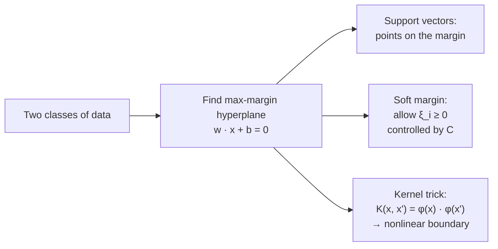

## Support Vector Machines — Primal/Dual & Kernels

Big picture (no jargon)

A linear classifier asks: "which side of a line/plane is this point on?" In 2D there are infinitely many lines that separate two classes — most of them sit weirdly close to one class or the other and would misclassify new points easily. **The Support Vector Machine (SVM)** picks the *best* line in a precise sense: the one with the **widest margin** (the biggest gap between the line and the nearest point of either class). The training points that *touch* the margin are the **support vectors** — and those are the *only* points that matter; everything else is irrelevant.

Real data isn't perfectly linearly separable, so SVM allows a controlled number of violations (the **soft margin**). And when the boundary needs to be curvy, the **kernel trick** lets SVM behave as if it had transformed the data into a much higher-dimensional space where the boundary *is* linear — without ever explicitly computing those high-dim coordinates.

**Real-world analogy.** You're laying a tarmac road between two villages. Many routes exist; you pick the one that stays as far as possible from the *closest* houses on both sides — maximum safety margin. Houses far from the road don't matter; only the few nearest ones constrain the route. Those nearest houses are the support vectors.

### Vocabulary — every term, defined plainly

- **Hyperplane** — the linear decision surface $\mathbf{w}^\top \mathbf{x} + b = 0$. A line in 2D, a plane in 3D, a $(d-1)$-dim object in $\mathbb{R}^d$.
- **Margin** — the perpendicular distance from the hyperplane to the nearest training point of either class. SVM maximises this.
- **Margin width** — equals $2/\|\mathbf{w}\|$. So minimising $\|\mathbf{w}\|$ widens the margin.
- **Support vectors** — training points that lie *on* the margin (or inside it for soft-margin). Only these contribute to the decision boundary; their $\alpha_i > 0$ in the dual.
- **Hard-margin SVM** — assumes the data is linearly separable; allows zero violations.
- **Soft-margin SVM** — allows points to violate the margin (or be misclassified) by paying a penalty.
- **Slack variable $\xi_i$** — how far point $i$ is on the wrong side of its margin. $\xi_i = 0$ means "perfectly on the right side."
- **Regularisation $C$** — controls the tradeoff between widening the margin and tolerating violations. Large $C$ = punish violations heavily (low bias, high variance). Small $C$ = wider margin, more tolerance (high bias, low variance).
- **Hinge loss** — the SVM's per-sample loss: $\max(0, 1 - y_i(\mathbf{w}^\top \mathbf{x}_i + b))$. Zero if classified correctly with margin $\ge 1$, linear penalty otherwise.
- **Primal problem** — the optimisation directly over $\mathbf{w}, b, \xi$.
- **Dual problem** — an equivalent reformulation in Lagrange multipliers $\alpha_i$, one per training example. Where the kernel trick lives.
- **Kernel function $K(\mathbf{x}, \mathbf{x}')$** — a function that computes inner products in some (possibly infinite-dimensional) feature space, *without ever computing the features explicitly*.
- **RBF (Gaussian) kernel** — $K(\mathbf{x}, \mathbf{x}') = \exp(-\gamma \|\mathbf{x} - \mathbf{x}'\|^2)$. The most popular kernel; corresponds to an infinite-dimensional feature space.
- **$\gamma$ (gamma)** — the RBF kernel's bandwidth parameter. Large $\gamma$ = narrow bumps = wiggly boundary = overfit.
- **KKT conditions** — characterise the optimum of any constrained problem (recall continuous-optimisation card). For SVM they pin down which points are support vectors.

### Picture it

### Build the idea

**Hard-margin primal.** Assume the classes are linearly separable, $y_i \in \{-1, +1\}$:

$$
\min_{\mathbf{w}, b}\; \tfrac{1}{2}\|\mathbf{w}\|^2 \quad \text{s.t.}\quad y_i (\mathbf{w}^\top \mathbf{x}_i + b) \ge 1 \;\; \forall i.
$$

The constraint says "every point is at least margin-1 away on its correct side." Margin width $= 2/\|\mathbf{w}\|$, so minimising $\|\mathbf{w}\|^2$ maximises the margin.

**Soft-margin primal (real data).** Add slacks $\xi_i \ge 0$ and pay a per-violation cost $C$:

$$
\min_{\mathbf{w}, b, \xi}\; \tfrac{1}{2}\|\mathbf{w}\|^2 + C \sum_{i=1}^{N} \xi_i \quad \text{s.t.}\quad y_i(\mathbf{w}^\top \mathbf{x}_i + b) \ge 1 - \xi_i,\; \xi_i \ge 0.
$$

- $\xi_i = 0$: point is on the right side, beyond the margin.
- $0 < \xi_i \le 1$: inside the margin but on the right side.
- $\xi_i > 1$: misclassified.

**Equivalent: hinge-loss view.** Eliminating $\xi_i = \max(0, 1 - y_i(\mathbf{w}^\top \mathbf{x}_i + b))$ gives

$$
\min_{\mathbf{w}, b}\; \tfrac{1}{2}\|\mathbf{w}\|^2 + C \sum_i \max\!\left(0,\, 1 - y_i(\mathbf{w}^\top \mathbf{x}_i + b)\right).
$$

This is "$\ell_2$ regularisation + hinge loss" — and it's how SVM is implemented in modern ML libraries.

**Dual problem (where the kernel trick lives).** Lagrangian gymnastics turn the primal into:

$$
\max_{\boldsymbol\alpha}\; \sum_i \alpha_i - \tfrac{1}{2}\sum_{i, j} \alpha_i \alpha_j y_i y_j\, K(\mathbf{x}_i, \mathbf{x}_j) \quad \text{s.t.}\quad 0 \le \alpha_i \le C,\; \sum_i \alpha_i y_i = 0.
$$

Decision function:

$$
f(\mathbf{x}) = \operatorname{sign}\!\left(\sum_i \alpha_i y_i\, K(\mathbf{x}_i, \mathbf{x}) + b\right).
$$

KKT complementary slackness implies most $\alpha_i = 0$. Only support vectors have $\alpha_i > 0$, and they're the only ones that contribute to the decision function. **The model is the support vectors.**

**Common kernels.**

| Kernel | $K(\mathbf{x}, \mathbf{x}')$ | Behaviour |
|---|---|---|
| Linear | $\mathbf{x}^\top \mathbf{x}'$ | No transformation; same as no kernel |
| Polynomial degree $d$ | $(\mathbf{x}^\top \mathbf{x}' + c)^d$ | Captures degree-$d$ feature interactions |
| RBF (Gaussian) | $\exp(-\gamma \|\mathbf{x} - \mathbf{x}'\|^2)$ | Most popular; infinite-dim feature space |
| Sigmoid | $\tanh(\kappa \mathbf{x}^\top \mathbf{x}' + c)$ | Mimics a 2-layer neural net |

<dl class="symbols">
  <dt>$\mathbf{w}, b$</dt><dd>weight vector and bias defining the hyperplane</dd>
  <dt>$y_i$</dt><dd>class label, $\pm 1$</dd>
  <dt>$\xi_i$</dt><dd>slack — how much point $i$ violates the margin</dd>
  <dt>$C$</dt><dd>regularisation knob — penalty per unit of total slack</dd>
  <dt>$\alpha_i$</dt><dd>Lagrange multiplier for point $i$ (dual variable)</dd>
  <dt>$K$</dt><dd>kernel function — implicit inner product</dd>
  <dt>$\gamma$</dt><dd>RBF bandwidth — width of each Gaussian "bump"</dd>
</dl>

### Worked example — fully expanded, no skipped arithmetic

Worked example: hard-margin SVM on 4 points

**Given.** Two classes in 2D:

- Positive class ($y = +1$): $\mathbf{x}_1 = (2, 2)$, $\mathbf{x}_2 = (3, 3)$.
- Negative class ($y = -1$): $\mathbf{x}_3 = (0, 0)$, $\mathbf{x}_4 = (1, 1)$.

**Step 1 — Eyeball the geometry.** All four points sit on the line $y = x$. Positive points are at the top-right; negatives at the bottom-left. The natural separator is perpendicular to $y = x$ — i.e. the line $x + y = c$ for some $c$ between $1+1 = 2$ (top of negatives) and $2+2 = 4$ (bottom of positives). The midpoint is $c = 3$.

**Step 2 — Try the hyperplane $\mathbf{w}^\top \mathbf{x} + b = 0$ with $\mathbf{w} = (1, 1)$, $b = -3$.** Check the margin condition $y_i(\mathbf{w}^\top \mathbf{x}_i + b) \ge 1$:

- $\mathbf{x}_1 = (2, 2)$: $(+1)\cdot(1\cdot 2 + 1\cdot 2 - 3) = (+1)(1) = 1$. ✓ (exactly on the margin)
- $\mathbf{x}_2 = (3, 3)$: $(+1)\cdot(3 + 3 - 3) = 3$. ✓ (outside margin)
- $\mathbf{x}_3 = (0, 0)$: $(-1)\cdot(0 + 0 - 3) = (-1)(-3) = 3$. ✓
- $\mathbf{x}_4 = (1, 1)$: $(-1)\cdot(1 + 1 - 3) = (-1)(-1) = 1$. ✓ (exactly on the margin)

All constraints satisfied, with two of them tight. So $\mathbf{w} = (1, 1), b = -3$ is feasible.

**Step 3 — Compute the margin width.**

$$
\|\mathbf{w}\| = \sqrt{1^2 + 1^2} = \sqrt{2}, \qquad \text{margin width} = \frac{2}{\|\mathbf{w}\|} = \frac{2}{\sqrt{2}} = \sqrt{2} \approx 1.414.
$$

**Step 4 — Could we do better?** Could a different $(\mathbf{w}, b)$ give a smaller $\|\mathbf{w}\|$ while still satisfying all constraints? The two tight constraints (from $\mathbf{x}_1$ and $\mathbf{x}_4$) say $\mathbf{w}^\top \mathbf{x}_1 + b = +1$ and $\mathbf{w}^\top \mathbf{x}_4 + b = -1$. Subtracting:

$$
\mathbf{w}^\top (\mathbf{x}_1 - \mathbf{x}_4) = 2, \qquad \mathbf{w}^\top (1, 1) = 2.
$$

By Cauchy–Schwarz, $|\mathbf{w}^\top (1,1)| \le \|\mathbf{w}\|\, \|(1,1)\| = \|\mathbf{w}\|\sqrt{2}$. So $\|\mathbf{w}\| \ge 2/\sqrt{2} = \sqrt{2}$, with equality only when $\mathbf{w}$ is parallel to $(1, 1)$. Our choice $\mathbf{w} = (1, 1)$ achieves this bound. So $\sqrt{2}$ is the *optimal* $\|\mathbf{w}\|$, and our hyperplane is optimal.

**Step 5 — Identify support vectors.** The points where the margin constraint is *tight* are the support vectors: $\mathbf{x}_1 = (2, 2)$ and $\mathbf{x}_4 = (1, 1)$. The other two ($\mathbf{x}_2, \mathbf{x}_3$) are not — moving them slightly would not change the optimal hyperplane.

**Step 6 — Decision rule.** Predict $\hat y = \operatorname{sign}(\mathbf{w}^\top \mathbf{x} + b) = \operatorname{sign}(x + y - 3)$. New point $(4, 0)$: $4 + 0 - 3 = 1 > 0 \Rightarrow$ class $+1$.

### How to think about it

Mental model — "the kernel = work in fancy space without going there"

For linearly separable data, SVM picks the "safest" boundary — far from both classes — by minimising $\|\mathbf{w}\|^2$ subject to margin constraints. The KKT conditions automatically discover which training points actually constrain the answer (the support vectors). It's a beautiful example of how convex optimisation gives a unique, principled answer.

The kernel trick is "compute inner products in a fancy space without going there." For RBF, every training point becomes a Gaussian bump, and the decision function is a weighted sum of bumps centred at the support vectors. That's why SVM with RBF can fit complex non-linear boundaries with a small effective number of "basis functions."

**When this comes up in ML.** SVM is the gold standard for small-to-medium tabular classification problems where you have $\sim 10^3$–$10^5$ samples. It dominates linear models when the boundary is non-linear, and it's more *interpretable* than a neural net (you can point at the support vectors and say "these are the cases the model worries about"). For huge datasets, it's been displaced by gradient boosting and deep nets — the $\mathcal{O}(N^2)$ kernel matrix doesn't scale.

Watch out — common traps

- Soft-margin SVM ≠ logistic regression. SVM uses **hinge loss** (zero penalty when margin $\ge 1$); logistic uses log loss (always non-zero). SVM doesn't naturally output probabilities.
- $C$ small → wide margin, possibly underfit. $C$ large → tight margin, possibly overfit. **Cross-validate $C$.**
- RBF $\gamma$ controls bump width: large $\gamma$ → sharp bumps → overfit; small $\gamma$ → wide bumps → underfit. **Cross-validate $\gamma$ jointly with $C$.**
- SVMs scale poorly to huge $N$: dual is $\mathcal{O}(N^2)$ memory, $\mathcal{O}(N^3)$ time in the worst case. Use linear SVM (LIBLINEAR) for big-data linear problems.
- Always **standardise** features before applying SVM with RBF — distances drive the kernel, and unequal scales distort everything.
- For multi-class, SVM is binary by nature. Common workarounds: one-vs-rest (one classifier per class) or one-vs-one (one classifier per pair).

Exam tip

Be ready to (a) **derive the dual** from the primal via the Lagrangian (write the Lagrangian, set partials of $\mathbf{w}, b$ to zero, substitute back), (b) **state the KKT conditions** for soft-margin SVM, and (c) **explain why $\alpha_i > 0 \Leftrightarrow$ point $i$ is a support vector** (complementary slackness: $\alpha_i [y_i(\mathbf{w}^\top \mathbf{x}_i + b) - 1 + \xi_i] = 0$). These derivations are guaranteed long-answer material.

