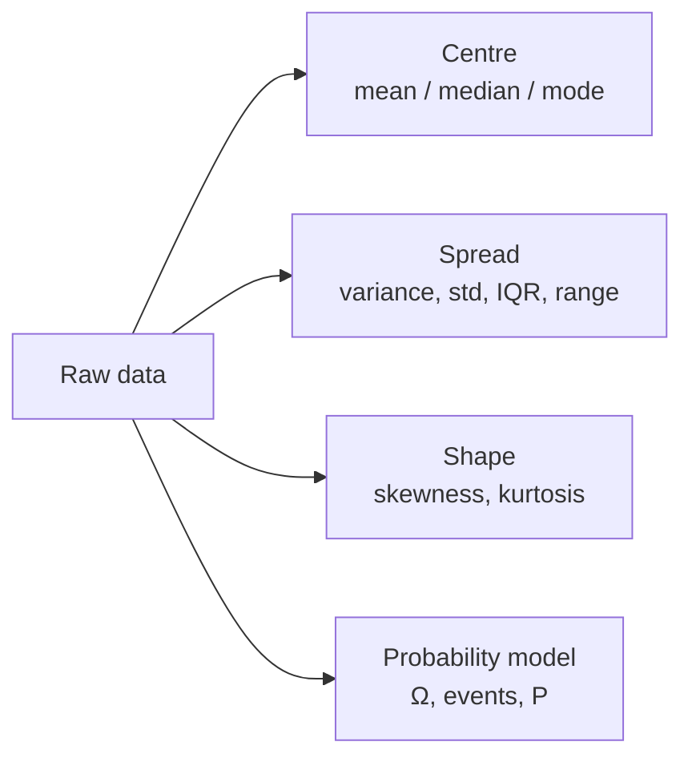

## Descriptive Statistics & Probability Basics

Big picture (no jargon)

Before you can model data, you have to **summarise** it. A column of 10000 numbers is impossible to "see"; three or four well-chosen summary numbers reveal its shape. **Descriptive statistics** give you those numbers — *centre* (where the data sits), *spread* (how scattered it is), and *shape* (symmetric or skewed). **Probability** is the formal language we use to reason about uncertainty — every statistical test in later cards is built on top of it.

**Real-world analogy.** A gym instructor taking 30 new members' weights doesn't memorise all 30 numbers — they note "average ~70 kg, range 55–100, mostly clustered near the average, a couple of heavy outliers." That's descriptive statistics. When they say "the next member is *probably* between 60 and 85 kg" — that's probability.

### Vocabulary — every term, defined plainly

- **Mean ($\bar x$)** — arithmetic average. Sensitive to outliers.
- **Median** — the middle value when data is sorted. Robust to outliers.
- **Mode** — the most frequent value. Useful for categorical data.
- **Variance ($s^2$)** — average squared distance from the mean. Always non-negative; units are squared.
- **Standard deviation ($s$)** — square root of variance. Same units as the data — easier to interpret.
- **Sample vs population** — the *sample* is what you measured; the *population* is everything you wish you could measure. Sample variance uses $n-1$ (Bessel's correction) so it's an *unbiased* estimate of population variance; population variance uses $n$.
- **Quartile / IQR** — $Q_1, Q_2, Q_3$ split sorted data into 4 equal parts. Inter-Quartile Range (IQR) $= Q_3 - Q_1$ — middle 50% of the data; robust to outliers; the basis of boxplots.
- **Skewness** — asymmetry. Positive (right) skew = a long tail on the right (e.g. income); negative (left) skew = long tail on the left.
- **Kurtosis** — tail heaviness. Normal distribution has kurtosis 3; "leptokurtic" (>3) = heavier tails than normal.
- **Sample space ($\Omega$)** — the set of all possible outcomes of a random experiment.
- **Event ($A$)** — a subset of $\Omega$. ("Rolled an even number" = $\{2, 4, 6\}$.)
- **Probability ($P$)** — a function assigning a number in $[0, 1]$ to each event, satisfying Kolmogorov's axioms (below).
- **Complement ($A^c$)** — "not $A$"; everything in $\Omega$ that isn't in $A$.
- **Union ($A \cup B$), Intersection ($A \cap B$)** — "$A$ or $B$"; "$A$ and $B$".

### Picture it

### Build the idea

**Centre.**

$$
\bar x = \frac{1}{n}\sum_{i=1}^{n} x_i, \qquad \text{median} = \text{middle value of sorted data}.
$$

**Spread.** Sample variance and standard deviation:

$$
s^2 = \frac{1}{n-1}\sum_{i=1}^{n} (x_i - \bar x)^2, \qquad s = \sqrt{s^2}.
$$

The $n - 1$ (instead of $n$) makes $s^2$ an unbiased estimate of the population variance — a small but important correction when $n$ is small.

**IQR.** Sort the data, find $Q_1$ (25th percentile) and $Q_3$ (75th percentile). $\text{IQR} = Q_3 - Q_1$.

**Shape — skewness comparison.**

| | Symmetric | Right-skew | Left-skew |
|---|---|---|---|
| Mean vs median | $\bar x \approx \text{med}$ | $\bar x > \text{med}$ | $\bar x < \text{med}$ |
| Skewness | $\approx 0$ | $> 0$ | $< 0$ |

**Kolmogorov's three axioms.** A probability $P$ on a sample space $\Omega$ satisfies:

1. $0 \le P(A) \le 1$ for every event $A$.
2. $P(\Omega) = 1$ (something always happens).
3. **Additivity:** if $A, B$ disjoint (no overlap), $P(A \cup B) = P(A) + P(B)$.

Useful derived rules:

$$
P(A^c) = 1 - P(A), \qquad P(A \cup B) = P(A) + P(B) - P(A \cap B).
$$

The second is the **inclusion–exclusion** formula — needed whenever events can overlap.

<dl class="symbols">
  <dt>$n$</dt><dd>sample size</dd>
  <dt>$\bar x$</dt><dd>sample mean</dd>
  <dt>$s, s^2$</dt><dd>sample standard deviation, sample variance</dd>
  <dt>$\Omega$</dt><dd>sample space — set of all possible outcomes</dd>
  <dt>$A^c$</dt><dd>complement of event $A$</dd>
</dl>

### Worked example — fully expanded, no skipped arithmetic

Worked example: 5 students' marks

**Data.** $\{40, 60, 70, 80, 250\}$. ($n = 5$.)

**Step 1 — Mean.**

$$
\bar x = \frac{40 + 60 + 70 + 80 + 250}{5} = \frac{500}{5} = 100.
$$

**Step 2 — Median.** Sorted data: $40, 60, 70, 80, 250$. Middle value: $70$.

**Notice.** Mean $= 100$, median $= 70$. The mean is wildly inflated by the outlier $250$. **Median is the better summary** for skewed data.

**Step 3 — Variance.** Compute deviations from the mean:

$$
\begin{aligned}
40 - 100 &= -60, & (-60)^2 &= 3600 \\
60 - 100 &= -40, & (-40)^2 &= 1600 \\
70 - 100 &= -30, & (-30)^2 &= 900 \\
80 - 100 &= -20, & (-20)^2 &= 400 \\
250 - 100 &= 150, & 150^2 &= 22500 \\
\end{aligned}
$$

Sum of squared deviations $= 3600 + 1600 + 900 + 400 + 22500 = 29000$.

$$
s^2 = \frac{29000}{n - 1} = \frac{29000}{4} = 7250.
$$

**Step 4 — Standard deviation.**

$$
s = \sqrt{7250} \approx 85.15.
$$

**Step 5 — Sanity check.** $\sum (x_i - \bar x) = -60 - 40 - 30 - 20 + 150 = 0$. ✓ (Always true — that's why we square the deviations to measure spread.)

**Probability mini-example.** Roll a fair die. $\Omega = \{1, 2, 3, 4, 5, 6\}$. $A$ = "even" $= \{2, 4, 6\}$, $B$ = "$\ge 4$" $= \{4, 5, 6\}$. Then $A \cap B = \{4, 6\}$, so by inclusion–exclusion:

$$
P(A \cup B) = \tfrac{3}{6} + \tfrac{3}{6} - \tfrac{2}{6} = \tfrac{4}{6} = \tfrac{2}{3}.
$$

Direct check: $A \cup B = \{2, 4, 5, 6\}$, four out of six outcomes. ✓

### How to think about it

Mental model

**Mean answers "what's typical on average?"** — it includes the influence of every value, including extremes. **Median answers "what's typical for a random member?"** — half the members are above, half below, and outliers don't drag it.

Use the median (and IQR) when data is skewed or has outliers — incomes, latencies, response times. Use the mean (and standard deviation) when data is roughly symmetric.

Probability is just a *measure* on subsets of $\Omega$ — like an "area" function for events. The three axioms make sure it behaves like a measure: non-negative, total mass 1, additive over disjoint pieces.

**When this comes up in ML.** Every preprocessing step uses descriptive stats: standardisation needs $\bar x$ and $s$; outlier detection uses IQR; class imbalance is detected by mode frequencies. Probability is the foundation of every classifier (Naïve Bayes, logistic regression, anything that outputs `predict_proba`).

Watch out — common traps

- $\sum(x_i - \bar x) = 0$ always — that's the *defining property* of the mean. Don't try to "average" raw deviations — they cancel.
- **Variance has squared units.** Always report standard deviation in the original units.
- Sample variance ($n-1$ denominator) and population variance ($n$ denominator) differ by a factor of $n / (n-1)$ — small for large $n$, sizeable for $n < 30$.
- Inclusion–exclusion **must** subtract the intersection — adding probabilities of overlapping events double-counts the overlap.
- $P(A) = 0$ does *not* mean $A$ is impossible (in continuous distributions every single point has probability 0).

Exam tip

Memorise the inclusion–exclusion formula and the boxplot quartiles. For "is this data symmetric?" type questions, **compare mean and median** — much faster than computing skewness by hand. For "what's $P(\text{at least one})$?" — always rewrite as $1 - P(\text{none})$.

