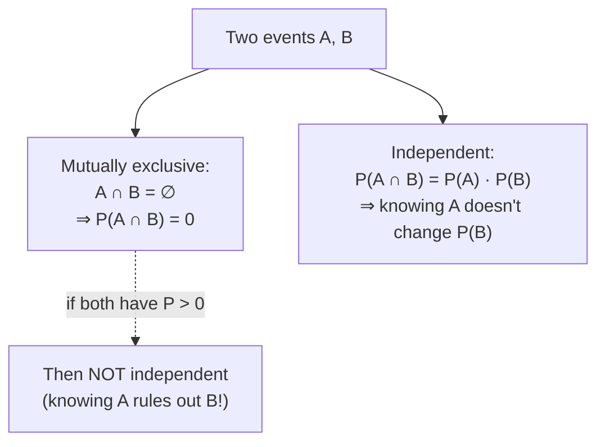

## Mutually Exclusive vs Independent Events

Big picture (no jargon)

These are the **two most-confused concepts** in beginner probability — and getting them wrong is the most common exam mistake. They are *not* the same thing.

- **Mutually exclusive** = "these two events *can't both happen at once*." (Like "Monday" and "Tuesday".)
- **Independent** = "knowing one happened tells you *nothing* about the other." (Like "rain in Tokyo" and "I had toast for breakfast".)

In fact, two events that both have positive probability and are mutually exclusive are *automatically dependent* — because as soon as you learn one happened, you instantly know the other *didn't*. That's a huge chunk of information!

**Real-world analogy.** "Mon vs Tue" — exclusive. "Day-of-week vs whether it rained" — independent (in temperate climates). Confusing them is like saying "two people who never meet can't possibly know each other" — irrelevant categories.

### Vocabulary — every term, defined plainly

- **Mutually exclusive (disjoint) events** — $A \cap B = \varnothing$, equivalently $P(A \cap B) = 0$. They share no outcomes; cannot both occur.
- **Independent events** — $P(A \cap B) = P(A) \cdot P(B)$. Knowing one event happened doesn't change the probability of the other.
- **Joint probability ($P(A \cap B)$)** — probability that both $A$ and $B$ occur.
- **Pairwise vs mutually independent** — three events are *pairwise* independent if every pair is independent, but they're *mutually* (jointly) independent only if also $P(A \cap B \cap C) = P(A) P(B) P(C)$. Pairwise does *not* imply mutual.
- **Permutation $P(n, k) = n!/(n-k)!$** — number of ways to arrange $k$ items chosen from $n$, *order matters*.
- **Combination $\binom{n}{k} = n! / [k!(n-k)!]$** — number of ways to choose $k$ items from $n$, *order doesn't matter*.
- **Complement rule** — $P(A^c) = 1 - P(A)$. Often the fastest way to compute "at least one" probabilities.

### Picture it

### Build the idea

**Definitions in one place.**

$$
\text{Mutually exclusive: } A \cap B = \varnothing.
$$

$$
\text{Independent: } P(A \cap B) = P(A)\, P(B), \;\text{equivalently}\; P(A \mid B) = P(A) \;\text{(when } P(B) > 0\text{)}.
$$

**Why exclusive ⇒ dependent (when both have positive probability).** If $A \cap B = \varnothing$, then $P(A \cap B) = 0$. For independence we'd need $0 = P(A) P(B)$, but both are positive — contradiction. So they're dependent.

**Key formulas.**

$$
\begin{aligned}
P(A \cup B) &= P(A) + P(B) - P(A \cap B) &&\text{(general — inclusion–exclusion)}\\
P(A \cup B) &= P(A) + P(B) &&\text{(only if mutually exclusive)}\\
P(A \cap B) &= P(A) \cdot P(B) &&\text{(only if independent)}
\end{aligned}
$$

For $n$ mutually independent events: $P(A_1 \cap A_2 \cap \dots \cap A_n) = \prod_i P(A_i)$.

**Comparison table — burn this into memory.**

| Property | Mutually exclusive | Independent |
|---|---|---|
| $P(A \cap B)$ | $0$ | $P(A) \cdot P(B)$ |
| $P(A \cup B)$ | $P(A) + P(B)$ | $P(A) + P(B) - P(A) P(B)$ |
| $P(A \mid B)$ | $0$ | $P(A)$ |
| Venn diagram | Non-overlapping circles | Overlapping in a "rectangle" pattern |

**Problem-solving toolbox.**

1. Draw a Venn diagram or a probability tree.
2. Identify any independence/exclusivity claims explicitly.
3. For "at least one" or "at least $k$", **complement first**: $P(\text{at least one}) = 1 - P(\text{none})$.
4. Counting problems: distinguish ordered (permutations) vs unordered (combinations).

<dl class="symbols">
  <dt>$\varnothing$</dt><dd>empty set — no outcomes</dd>
  <dt>$P(A \mid B)$</dt><dd>conditional probability of $A$ given $B$ (next card)</dd>
  <dt>$\binom{n}{k}$</dt><dd>"$n$ choose $k$" — number of unordered selections</dd>
</dl>

### Worked example — fully expanded, no skipped arithmetic

Worked example: two coin tosses

Toss a fair coin twice. Sample space: $\Omega = \{HH, HT, TH, TT\}$, each outcome with probability $1/4$.

**Scenario 1.** $A$ = "head on toss 1" $= \{HH, HT\}$. $B$ = "head on toss 2" $= \{HH, TH\}$. Compute:

- $P(A) = 2/4 = 0.5$.
- $P(B) = 2/4 = 0.5$.
- $A \cap B = \{HH\}$, so $P(A \cap B) = 1/4 = 0.25$.

**Test mutually exclusive?** $P(A \cap B) = 0.25 \ne 0$ → **not** mutually exclusive (both can happen — $HH$).

**Test independent?** Compare $P(A \cap B) = 0.25$ with $P(A) \cdot P(B) = 0.5 \cdot 0.5 = 0.25$. Equal → **independent**. ✓

**Scenario 2.** $A$ = "exactly 0 heads" $= \{TT\}$. $B$ = "exactly 1 head" $= \{HT, TH\}$.

- $P(A) = 1/4 = 0.25$.
- $P(B) = 2/4 = 0.5$.
- $A \cap B = \varnothing$ (you can't have both 0 heads and 1 head), so $P(A \cap B) = 0$.

**Test mutually exclusive?** $P(A \cap B) = 0$ → **yes**, mutually exclusive.

**Test independent?** Compare $P(A \cap B) = 0$ with $P(A) \cdot P(B) = 0.25 \cdot 0.5 = 0.125$. Not equal → **not independent**. (Knowing 0 heads happened tells you 1 head *didn't* — huge information.)

**Bonus — "at least one head in 5 tosses".** Use the complement:

$$
P(\text{at least one H}) = 1 - P(\text{no H}) = 1 - (1/2)^5 = 1 - 1/32 = 31/32 \approx 0.969.
$$

Direct enumeration would require listing all $2^5 - 1 = 31$ favourable outcomes — much slower.

### How to think about it

Mental model — different categories of relationship

Mutually exclusive vs independent are **different categories of relationship between events**, not different points on a sliding scale.

- *Mutually exclusive* is about **overlap of outcomes** — does the Venn intersection contain anything?
- *Independent* is about **information content** — does knowing one outcome change the probability of the other?

Two events with positive probability **cannot be both** mutually exclusive *and* independent — that's the most common student mix-up.

**When this comes up in ML.** "Are these two features independent given the class?" is the core assumption of Naïve Bayes (next cards). "Are these test errors mutually exclusive failure modes?" is a question of error analysis. "Is the next coin toss independent of the previous one?" — fundamental for i.i.d. assumption underlying every train/test split.

Watch out — common traps

- The two concepts are sometimes phrased identically in casual English ("they're separate / unrelated"). In a math context, *always disambiguate* which one is meant.
- **Pairwise independence ≠ mutual independence.** Three events can be pairwise independent yet have $P(A \cap B \cap C) \ne P(A) P(B) P(C)$. Classic counterexample: roll two dice; let $A$ = "first die odd", $B$ = "second die odd", $C$ = "sum even". Each pair is independent but the triple isn't.
- "Disjoint" and "mutually exclusive" mean the same thing — different textbooks use different words.
- For **conditional** independence, "given $C$" matters: $A, B$ might be independent unconditionally but dependent given $C$ (or vice versa). This is the engine behind Simpson's paradox.

Exam tip

For "at least one" and "at least $k$" questions, **almost always compute the complement first** — it's usually a single product and saves enormous time. For "are these independent?" questions, the *only* reliable test is to compute $P(A \cap B)$ and compare to $P(A) P(B)$ — don't try to argue from intuition.

