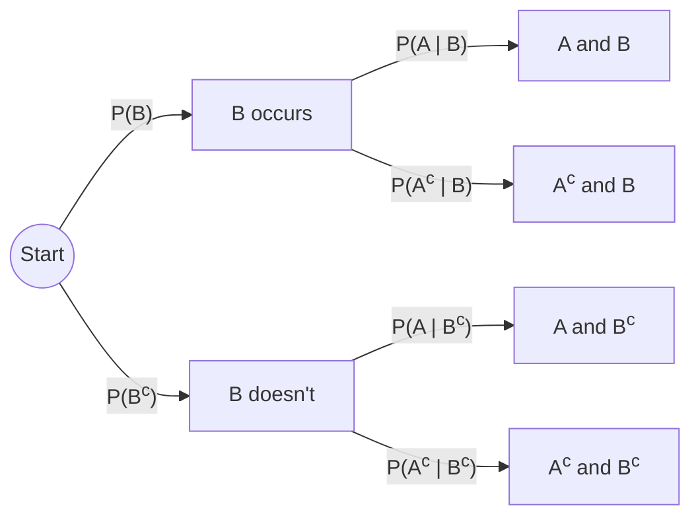

## Conditional Probability & Law of Total Probability

Big picture (no jargon)

**Conditional probability** is "probability after you learn something". You start with some uncertainty about an event $A$. Then someone tells you "by the way, $B$ happened". You should now *update* your belief about $A$ to reflect that new information. The conditional probability $P(A \mid B)$ is exactly that updated belief.

The **law of total probability** is the dual idea: if the world can be split into a few mutually exclusive scenarios $B_1, B_2, \dots$, the probability of $A$ overall is a *weighted average* of the conditional probabilities under each scenario.

**Real-world analogy.** "What's the probability of rain today?" gets one answer. "Given that the sky is dark and humid, what's the probability of rain?" gets a higher one. That update is conditional probability. The forecaster gets the *overall* probability of rain by averaging "P(rain | dark sky) × P(dark sky) + P(rain | clear sky) × P(clear sky)" — that's the law of total probability.

### Vocabulary — every term, defined plainly

- **Conditional probability $P(A \mid B)$** — probability of $A$ given that $B$ has occurred. Read "$A$ given $B$".
- **Multiplication / product rule** — $P(A \cap B) = P(A \mid B)\,P(B)$. Algebraic rearrangement of the conditional definition.
- **Chain rule** — generalisation to many events: $P(A_1 \cap A_2 \cap \dots \cap A_n) = P(A_1)\,P(A_2 \mid A_1)\,\cdots\,P(A_n \mid A_1 \cap \dots \cap A_{n-1})$. Underlies most probabilistic models (HMMs, RNNs, language models).
- **Partition** — a set of events $B_1, \dots, B_n$ that are pairwise disjoint and whose union is $\Omega$ (covers all of sample space without overlap). E.g. {sunny, cloudy, rainy} partition "weather".
- **Law of total probability (LoTP)** — for a partition $\{B_i\}$, $P(A) = \sum_i P(A \mid B_i)\,P(B_i)$.
- **Tree diagram** — visual tool: each layer = one stage; branch probabilities are conditional given the path so far; multiply along a path to get the joint.
- **Prior, likelihood, posterior, evidence** — Bayes-language preview: prior $= P(B)$, likelihood $= P(A \mid B)$, posterior $= P(B \mid A)$, evidence $= P(A)$ (computed via LoTP). All formalised in the next card.

### Picture it — tree for "two-stage experiment"

Adding the two "$A$ and ..." leaves gives $P(A)$ — that *is* the law of total probability.

### Build the idea

**Definition of conditional probability.** When $P(B) > 0$:

$$
P(A \mid B) = \frac{P(A \cap B)}{P(B)}.
$$

Geometrically: shrink the universe down to "the world where $B$ happened" and ask what fraction of that world is also $A$.

**Multiplication rule** (just rearranged):

$$
P(A \cap B) = P(A \mid B)\,P(B) = P(B \mid A)\,P(A).
$$

**Chain rule** (apply repeatedly):

$$
P(A_1 \cap A_2 \cap A_3) = P(A_1)\,P(A_2 \mid A_1)\,P(A_3 \mid A_1 \cap A_2).
$$

**Independence revisited.** $A, B$ independent $\iff P(A \mid B) = P(A) \iff P(A \cap B) = P(A) P(B)$ — three equivalent ways to say the same thing.

**Law of Total Probability.** Suppose $B_1, B_2, \dots, B_n$ form a partition of $\Omega$ (mutually exclusive, exhaustive). Then for any event $A$:

$$
P(A) = \sum_{i=1}^{n} P(A \mid B_i)\,P(B_i).
$$

**Why it works.** Decompose $A$ along the partition: $A = (A \cap B_1) \cup (A \cap B_2) \cup \dots$, all disjoint. By Kolmogorov additivity, sum the joint probabilities; rewrite each via the multiplication rule.

<dl class="symbols">
  <dt>$P(A \mid B)$</dt><dd>conditional probability of $A$ given $B$</dd>
  <dt>$\{B_i\}$</dt><dd>partition: disjoint, exhaustive</dd>
  <dt>$P(B_i)$</dt><dd>"prior" weight of scenario $B_i$</dd>
  <dt>$P(A \mid B_i)$</dt><dd>"likelihood" of $A$ under scenario $B_i$</dd>
</dl>

### Worked example — fully expanded, no skipped arithmetic

Worked example: factory defect rate

A factory has three machines $M_1, M_2, M_3$ producing 30%, 50%, and 20% of all items. Their defect rates are 1%, 2%, 3% respectively. A randomly chosen item is defective. What is $P(\text{defective})$? And given it's defective, $P(M_1 \mid D)$?

**Step 1 — Identify the partition.** $\{M_1, M_2, M_3\}$ partition all items: $P(M_1) = 0.30, P(M_2) = 0.50, P(M_3) = 0.20$. Sum $= 1$. ✓

**Step 2 — List likelihoods.** $P(D \mid M_1) = 0.01, P(D \mid M_2) = 0.02, P(D \mid M_3) = 0.03$.

**Step 3 — Apply LoTP.**

$$
\begin{aligned}
P(D) &= P(D \mid M_1) P(M_1) + P(D \mid M_2) P(M_2) + P(D \mid M_3) P(M_3) \\
     &= (0.01)(0.30) + (0.02)(0.50) + (0.03)(0.20) \\
     &= 0.003 + 0.010 + 0.006 = 0.019.
\end{aligned}
$$

So $P(D) = 1.9\%$.

**Step 4 — Posterior $P(M_1 \mid D)$ via the multiplication rule (Bayes preview).**

$$
P(M_1 \mid D) = \frac{P(D \mid M_1)\,P(M_1)}{P(D)} = \frac{0.003}{0.019} \approx 0.158.
$$

So given that we observed a defect, there's only about a 16% chance it came from $M_1$ (much less than its 30% production share — because $M_1$ has the lowest defect rate).

**Sanity check.** Compute all three posteriors: $P(M_2 \mid D) = 0.010/0.019 \approx 0.526$; $P(M_3 \mid D) = 0.006/0.019 \approx 0.316$. Sum: $0.158 + 0.526 + 0.316 = 1.000$. ✓

**Tree-diagram check.** Multiply along each path: $0.30 \times 0.01 = 0.003$, $0.50 \times 0.02 = 0.010$, $0.20 \times 0.03 = 0.006$. Sum the "defective" leaves: $0.019$. ✓

### How to think about it

Mental model — "shrink the universe"

Conditional probability is **renormalisation**: when you condition on $B$, you throw away every outcome outside $B$ and *rescale* what's left so probabilities sum to 1 again. That's why you divide by $P(B)$.

Law of total probability is **case analysis** — split on a partition, compute under each case, weight by case probability, sum.

The pair *(LoTP for the denominator, multiplication rule for the numerator)* is what powers Bayes' theorem (next card).

**When this comes up in ML.** Every classifier with `predict_proba(x)` outputs a conditional probability. RNN/Transformer language models compute $P(w_t \mid w_1, \dots, w_{t-1})$ by chain rule. Train/test pipelines use LoTP implicitly: "expected accuracy = sum over classes of (per-class accuracy × class frequency)".

Watch out — common traps

- **$P(A \mid B) \ne P(B \mid A)$** in general. Confusing the two is the "prosecutor's fallacy" (and the source of countless miscarriages of justice).
- The partition must be **both** disjoint and exhaustive. Missing or overlapping cases give the wrong $P(A)$.
- "Conditional on something with probability 0" is undefined in elementary probability (you need measure theory).
- The chain rule's *order* doesn't matter for the joint, but the conditioning does — pick an order that's natural for the problem.
- Independence is *very* easy to lose under conditioning: $A \perp B$ does *not* imply $A \perp B \mid C$.

Exam tip

Draw a tree diagram for any two-stage problem — branch probabilities, multiply along paths, sum the leaves of interest. It practically eliminates LoTP errors. For Bayes-style "given the test is positive…" problems, **always compute $P(\text{evidence})$ via LoTP first**, then divide.

