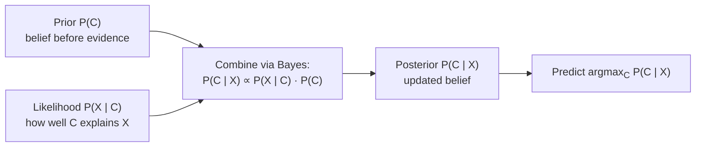

## Bayes' Theorem & Naïve Bayes Classifier

Big picture (no jargon)

**Bayes' theorem** is the math of *belief updating*. You start with a guess about how likely something is (the **prior**); you observe new evidence; you update your belief into the **posterior**. It is the single most important formula in machine learning — it's how spam filters, medical diagnosis tools, and modern probabilistic models all reason about uncertainty.

**Naïve Bayes** is a classifier that uses Bayes' theorem to predict a class label, plus one big simplifying assumption: *features are independent given the class*. That assumption is almost always false in reality, but the classifier still works astonishingly well — especially for text and high-dimensional data.

**Real-world analogy.** A doctor sees a patient with a sore throat. Before the test, they think there's maybe a 5% chance it's strep throat (prior). The rapid test comes back positive — but the test isn't perfect. Bayes' theorem combines (a) the prior probability of strep, (b) how often the test correctly flags strep, and (c) how often it falsely flags healthy people, into the actual updated probability the patient has strep (posterior).

### Vocabulary — every term, defined plainly

- **Prior $P(C)$** — your belief about class $C$ *before* seeing any features. Often the base rate in the training data.
- **Likelihood $P(X \mid C)$** — how probable the observed features $X$ are *if* the class is $C$.
- **Posterior $P(C \mid X)$** — your updated belief about class $C$ *after* observing features $X$. This is what you actually want for prediction.
- **Evidence $P(X)$** — the marginal probability of the features (computed via the law of total probability over classes). Acts as a normaliser.
- **Conditional independence given the class** — Naïve Bayes' core assumption: $P(x_1, \dots, x_n \mid C) = \prod_i P(x_i \mid C)$.
- **MAP (Maximum a Posteriori) prediction** — picks the class with the highest posterior: $\hat C = \arg\max_C P(C \mid X)$.
- **Laplace (add-$\alpha$) smoothing** — replaces a feature count $n_{ij}$ with $n_{ij} + \alpha$ to avoid the *zero-frequency* problem (a single unseen word killing the entire posterior).
- **Gaussian / Multinomial / Bernoulli NB** — three flavours, differing in how $P(x_i \mid C)$ is modelled (Gaussian PDF / count distribution / binary indicator).
- **Decision boundary** — the surface where $P(C_1 \mid X) = P(C_2 \mid X)$; on either side a different class wins.

### Picture it

### Build the idea — Bayes' theorem

Start from the multiplication rule applied two ways:

$$
P(C \cap X) = P(C \mid X)\,P(X) = P(X \mid C)\,P(C).
$$

Solve for $P(C \mid X)$:

$$
\boxed{\;P(C \mid X) = \frac{P(X \mid C)\,P(C)}{P(X)}\;}
$$

The denominator $P(X)$ is computed via the law of total probability:

$$
P(X) = \sum_{c} P(X \mid C = c)\,P(C = c).
$$

For *prediction* (argmax), we don't actually need $P(X)$ — it's the same constant for every candidate class. So:

$$
\hat C = \arg\max_{C} P(X \mid C)\,P(C).
$$

### The Naïve Bayes assumption

Features are **conditionally independent given the class**:

$$
P(x_1, x_2, \dots, x_n \mid C) = \prod_{i=1}^{n} P(x_i \mid C).
$$

So the prediction rule becomes:

$$
\hat C = \arg\max_{C} \;\;P(C) \prod_{i=1}^{n} P(x_i \mid C).
$$

Equivalently, in log-space (avoids underflow with many small probabilities):

$$
\hat C = \arg\max_{C} \;\;\log P(C) + \sum_{i=1}^{n} \log P(x_i \mid C).
$$

### Three flavours of Naïve Bayes

| Variant | Feature type | $P(x_i \mid C)$ model |
|---|---|---|
| **Gaussian NB** | Continuous | $\mathcal{N}(x_i;\, \mu_{iC}, \sigma^2_{iC})$ |
| **Multinomial NB** | Counts (e.g. word frequencies) | $\dfrac{n_{wC} + \alpha}{N_C + \alpha\,\lvert V\rvert}$ |
| **Bernoulli NB** | Binary (word present/absent) | Bernoulli($p_{iC}$) |

### Laplace smoothing — fixing the zero-frequency problem

Without smoothing, a *single* word that never appeared with class $C$ in training makes the entire $\prod P(x_i \mid C) = 0$ — the model would refuse to predict $C$ no matter what other evidence there is. Laplace smoothing pretends every word was seen $\alpha$ times more (typically $\alpha = 1$):

$$
P(w \mid C) = \frac{\text{count}(w, C) + \alpha}{N_C + \alpha\,\lvert V\rvert}
$$

where $N_C$ is the total word count for class $C$ and $\lvert V \rvert$ is the vocabulary size. Now every word has a non-zero probability under every class.

<dl class="symbols">
  <dt>$C$</dt><dd>class label</dd>
  <dt>$X = (x_1, \dots, x_n)$</dt><dd>feature vector</dd>
  <dt>$\alpha$</dt><dd>Laplace smoothing constant ($\alpha = 1$ is the most common default)</dd>
  <dt>$N_C$</dt><dd>total count of feature tokens in training docs of class $C$</dd>
  <dt>$\lvert V \rvert$</dt><dd>vocabulary size (number of distinct features)</dd>
</dl>

### Worked example — fully expanded, no skipped arithmetic

Worked example: spam vs ham

Tiny corpus, 5 emails. Vocabulary $V = \{\text{free}, \text{money}, \text{meeting}, \text{lunch}\}$, so $|V| = 4$.

| # | Words | Class |
|---|---|---|
| 1 | free, money | spam |
| 2 | free, meeting | spam |
| 3 | meeting, lunch | ham |
| 4 | lunch, free | ham |
| 5 | meeting, lunch | ham |

**Step 1 — Priors.** 2 spam, 3 ham:

$$
P(\text{spam}) = 2/5 = 0.4, \qquad P(\text{ham}) = 3/5 = 0.6.
$$

**Step 2 — Word counts per class.**

| Word | spam count | ham count |
|---|---|---|
| free | 2 | 1 |
| money | 1 | 0 |
| meeting | 1 | 2 |
| lunch | 0 | 2 |

Totals: $N_{\text{spam}} = 4$, $N_{\text{ham}} = 5$.

**Step 3 — Laplace-smoothed conditional probabilities** ($\alpha = 1$, $|V| = 4$, denominator $N_C + 4$):

For spam (denom $= 4 + 4 = 8$):
$P(\text{free} \mid s) = 3/8, P(\text{money} \mid s) = 2/8, P(\text{meeting} \mid s) = 2/8, P(\text{lunch} \mid s) = 1/8$.

For ham (denom $= 5 + 4 = 9$):
$P(\text{free} \mid h) = 2/9, P(\text{money} \mid h) = 1/9, P(\text{meeting} \mid h) = 3/9, P(\text{lunch} \mid h) = 3/9$.

**Step 4 — Classify the new email "free money".**

Score for spam:

$$
P(s)\,P(\text{free} \mid s)\,P(\text{money} \mid s) = 0.4 \cdot \tfrac{3}{8} \cdot \tfrac{2}{8} = 0.4 \cdot \tfrac{6}{64} = \tfrac{2.4}{64} = 0.0375.
$$

Score for ham:

$$
P(h)\,P(\text{free} \mid h)\,P(\text{money} \mid h) = 0.6 \cdot \tfrac{2}{9} \cdot \tfrac{1}{9} = 0.6 \cdot \tfrac{2}{81} = \tfrac{1.2}{81} \approx 0.01481.
$$

**Step 5 — Pick the larger.** $0.0375 > 0.01481$ → **predict spam**. ✓

**Step 6 — Optional: actual posterior** (normalise so they sum to 1):

$$
P(s \mid \text{free,money}) = \frac{0.0375}{0.0375 + 0.01481} \approx \frac{0.0375}{0.05231} \approx 0.717.
$$

So the model is ~72% confident the email is spam.

**Step 7 — Note the smoothing rescue.** Without Laplace smoothing, $P(\text{money} \mid h)$ would be $0/5 = 0$, killing the entire ham score. Smoothing kept it alive at $1/9$ — small but non-zero.

### How to think about it

Mental model — Bayes is "evidence weighing"

Start with prior odds: "$C$ is twice as likely as $\lnot C$". Each piece of evidence multiplies the odds by its **likelihood ratio** $P(X \mid C) / P(X \mid \lnot C)$. Combine all evidence multiplicatively to get the posterior odds.

Naïve Bayes formalises this: every feature contributes a multiplicative term to the score for each class, the conditional-independence assumption makes the product valid, and the argmax picks the winner. The "naïve" assumption is almost always wrong (words *do* co-occur in real language), but in practice it cancels out symmetrically across classes and the *ranking* still works.

**When this comes up in ML.** Naïve Bayes is the classic baseline for text classification (spam, sentiment, topic). Bayes' theorem itself underpins virtually every probabilistic model — Bayesian networks, Hidden Markov Models, variational autoencoders, Bayesian deep learning. "Posterior $\propto$ likelihood × prior" is something you'll write thousands of times.

Watch out — common traps

- **Don't confuse $P(X \mid C)$ and $P(C \mid X)$.** Likelihood and posterior live in opposite directions; that's exactly why we need Bayes' theorem.
- A **single** zero-probability feature destroys an entire product — always smooth.
- For numerical stability with many features, **work in log-space** ($\log P(C) + \sum \log P(x_i \mid C)$) — products of small probabilities underflow to 0 in floating point.
- Naïve Bayes gives **calibrated rankings** but **uncalibrated probabilities** (over-confident). Don't trust raw `predict_proba` values without recalibration.
- When the conditional-independence assumption is *wildly* violated (heavily correlated features), accuracy can suffer; consider feature selection or a different model.
- Class imbalance: the prior $P(C)$ is taken from training data. If real-world frequencies differ, override the prior manually.

Exam tip

Memorise $P(C \mid X) \propto P(X \mid C)\,P(C)$ — the proportionality form is enough for prediction (no need to compute $P(X)$). Always **list priors, list per-feature likelihoods (with smoothing), multiply, compare** in that order. Show the smoothing arithmetic explicitly: full marks for $(n + \alpha) / (N + \alpha |V|)$ form even if the final classification is wrong.

