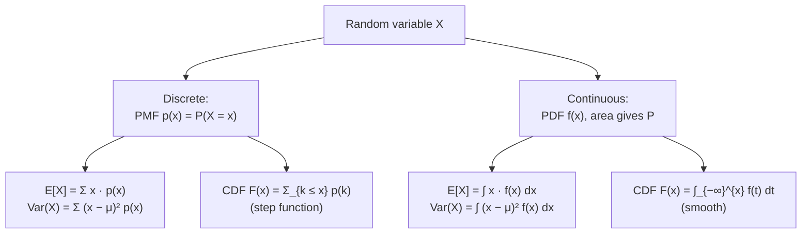

## Random Variables — PMF, PDF, CDF, Expectation, Variance

Big picture (no jargon)

A **random variable** is just a *number you don't know yet* that comes from a random experiment. "How many heads in 10 coin tosses?" — that's a random variable. "How long until the next bus arrives?" — also a random variable.

Every random variable has a **distribution** — a complete description of which numerical values it can take and how often. The distribution gives us two summary numbers: the **expectation** (average value in the long run) and the **variance** (how spread out the values are around the average). With these in hand, we can answer almost any probabilistic question about the variable.

**Real-world analogy.** A pizza shop's "number of orders in the next hour" is a random variable. The owner doesn't know the exact number, but knows the *distribution* — averages 25 orders/hour ± 5. That average and spread are what they use to decide staffing — not the unknowable exact value.

### Vocabulary — every term, defined plainly

- **Random variable (RV)** — a function $X : \Omega \to \mathbb{R}$ assigning a real number to each outcome of a random experiment.
- **Discrete RV** — takes values from a *countable* set (integers usually): coin flips, dice, counts, categorical labels.
- **Continuous RV** — takes values in an uncountable set (an interval of $\mathbb{R}$): height, time, temperature.
- **Probability Mass Function (PMF)** — for a discrete RV: $p(x) = P(X = x)$. Defined only at the values $X$ can actually take. Must be $\ge 0$ and sum to 1.
- **Probability Density Function (PDF)** — for a continuous RV: $f(x)$ such that $P(a \le X \le b) = \int_a^b f(x)\,dx$. Heights of $f$ are *not* probabilities (can exceed 1); only *areas* are.
- **Cumulative Distribution Function (CDF)** — $F(x) = P(X \le x)$. Always non-decreasing, $F(-\infty) = 0$, $F(+\infty) = 1$. Defined for both discrete and continuous RVs.
- **Expectation $E[X]$** — population mean; "long-run average" of $X$. Linear: $E[aX + b] = aE[X] + b$.
- **Variance $\operatorname{Var}(X)$** — average squared deviation from the mean. Always $\ge 0$.
- **Standard deviation $\sigma_X = \sqrt{\operatorname{Var}(X)}$** — same units as $X$.
- **Linearity of expectation** — $E[X + Y] = E[X] + E[Y]$ *always* (no independence required).
- **Variance of a sum** — $\operatorname{Var}(X + Y) = \operatorname{Var}(X) + \operatorname{Var}(Y) + 2\operatorname{Cov}(X, Y)$. Equals just the sum *only if* $X, Y$ uncorrelated/independent.
- **Covariance $\operatorname{Cov}(X, Y)$** — $E[(X - \mu_X)(Y - \mu_Y)]$. Measures linear co-movement.

### Picture it

### Build the idea

**Discrete case.** Let $X$ take values $x_1, x_2, \dots$ with PMF $p(x_i) \ge 0$ and $\sum_i p(x_i) = 1$.

$$
E[X] = \sum_i x_i\,p(x_i), \qquad
E[g(X)] = \sum_i g(x_i)\,p(x_i),
$$

$$
\operatorname{Var}(X) = E[(X - \mu)^2] = \sum_i (x_i - \mu)^2\,p(x_i) = E[X^2] - (E[X])^2.
$$

**Continuous case.** Let $X$ have PDF $f(x) \ge 0$ with $\int_{-\infty}^{\infty} f(x)\,dx = 1$.

$$
E[X] = \int_{-\infty}^{\infty} x\,f(x)\,dx, \qquad
\operatorname{Var}(X) = \int_{-\infty}^{\infty} (x - \mu)^2\,f(x)\,dx.
$$

For both: $P(a \le X \le b) = F(b) - F(a)$.

**The "computational" variance formula** (always faster):

$$
\operatorname{Var}(X) = E[X^2] - (E[X])^2.
$$

**Linearity & scaling.**

$$
E[aX + b] = aE[X] + b, \qquad \operatorname{Var}(aX + b) = a^2\,\operatorname{Var}(X).
$$

**Independence.** If $X \perp Y$:

$$
E[XY] = E[X]\,E[Y], \qquad \operatorname{Var}(X + Y) = \operatorname{Var}(X) + \operatorname{Var}(Y).
$$

**Covariance & correlation.**

$$
\operatorname{Cov}(X, Y) = E[XY] - E[X]\,E[Y], \qquad \rho_{XY} = \frac{\operatorname{Cov}(X, Y)}{\sigma_X\,\sigma_Y} \in [-1, 1].
$$

<dl class="symbols">
  <dt>$X, Y$</dt><dd>random variables</dd>
  <dt>$p(x), f(x)$</dt><dd>PMF (discrete), PDF (continuous)</dd>
  <dt>$F(x)$</dt><dd>CDF, $P(X \le x)$</dd>
  <dt>$\mu = E[X]$</dt><dd>mean / expectation</dd>
  <dt>$\sigma^2 = \operatorname{Var}(X)$</dt><dd>variance</dd>
  <dt>$\rho_{XY}$</dt><dd>Pearson correlation coefficient</dd>
</dl>

### Worked example — fully expanded, no skipped arithmetic

Worked example: fair die

Let $X$ = outcome of one roll of a fair six-sided die. PMF: $p(k) = 1/6$ for $k \in \{1, 2, 3, 4, 5, 6\}$.

**Expectation.**

$$
E[X] = \sum_{k=1}^{6} k \cdot \tfrac{1}{6} = \tfrac{1 + 2 + 3 + 4 + 5 + 6}{6} = \tfrac{21}{6} = 3.5.
$$

**Second moment.**

$$
E[X^2] = \sum_{k=1}^{6} k^2 \cdot \tfrac{1}{6} = \tfrac{1 + 4 + 9 + 16 + 25 + 36}{6} = \tfrac{91}{6} \approx 15.167.
$$

**Variance.**

$$
\operatorname{Var}(X) = E[X^2] - (E[X])^2 = \tfrac{91}{6} - 3.5^2 = 15.167 - 12.25 = 2.917 = \tfrac{35}{12}.
$$

**Standard deviation.** $\sigma = \sqrt{35/12} \approx 1.708$.

**Continuous example — uniform on [0, 1].** $f(x) = 1$ for $0 \le x \le 1$, else 0.

$$
E[X] = \int_0^1 x \cdot 1\,dx = \tfrac{x^2}{2}\Big|_0^1 = \tfrac{1}{2}.
$$

$$
E[X^2] = \int_0^1 x^2\,dx = \tfrac{x^3}{3}\Big|_0^1 = \tfrac{1}{3}.
$$

$$
\operatorname{Var}(X) = \tfrac{1}{3} - \left(\tfrac{1}{2}\right)^2 = \tfrac{1}{3} - \tfrac{1}{4} = \tfrac{1}{12} \approx 0.0833.
$$

CDF: $F(x) = x$ on $[0, 1]$. So $P(0.2 \le X \le 0.5) = F(0.5) - F(0.2) = 0.5 - 0.2 = 0.3$. ✓

**Linearity check.** Roll *two* dice independently; let $T = X_1 + X_2$.

$$
E[T] = E[X_1] + E[X_2] = 3.5 + 3.5 = 7. \quad \operatorname{Var}(T) = 2 \cdot 2.917 = 5.833.
$$

(Independence used for the variance; not needed for the mean.)

### How to think about it

Mental model — the distribution IS the variable

Don't think of a random variable as a single number that's "still being decided" — think of the **whole distribution** as the object you're working with. Once you have the PMF/PDF, every probabilistic question reduces to a sum or integral.

PMF and PDF look superficially different but play the same role: a *recipe* for computing $E[g(X)]$ for any function $g$. PMF uses sums (countable values); PDF uses integrals (uncountable values). The CDF unifies them — both have CDFs.

A continuous PDF can have heights $> 1$ (e.g. uniform on $[0, 0.5]$ has $f = 2$). It's only *area under the curve* that's a probability and must be in $[0, 1]$.

**When this comes up in ML.** Every loss function is an expectation: cross-entropy is $-E[\log p_{\text{model}}]$, MSE is $E[(y - \hat y)^2]$. Sampling from a generative model is sampling from a learned PDF. Variance shows up everywhere: bias-variance trade-off, gradient variance in SGD, prediction confidence intervals.

Watch out — common traps

- **PDF height ≠ probability.** $f(x)$ can be > 1; only $\int f$ over an interval gives probability.
- $\operatorname{Var}(X + Y) = \operatorname{Var}(X) + \operatorname{Var}(Y)$ **only when $X, Y$ are uncorrelated** (independence is sufficient, not necessary).
- $\operatorname{Var}(aX) = a^2 \operatorname{Var}(X)$, **not** $a \operatorname{Var}(X)$.
- For continuous $X$: $P(X = c) = 0$ for any single point. $P(a \le X \le b)$ and $P(a < X < b)$ are equal.
- Don't confuse "$X$ is independent of $Y$" with "$E[XY] = E[X] E[Y]$" — independence implies it; the converse fails (uncorrelated ≠ independent for non-Gaussian).
- The computational formula $E[X^2] - (E[X])^2$ is *always* non-negative when computed correctly; if you get a negative answer you made an arithmetic error.

Exam tip

For variance always use $\operatorname{Var}(X) = E[X^2] - (E[X])^2$ — much faster than the deviation-form sum. Set up a tidy table with columns $x_i$, $p(x_i)$, $x_i p(x_i)$, $x_i^2 p(x_i)$ and sum the last two columns. For "$P(X > c)$" questions, prefer the CDF-complement: $1 - F(c)$.

