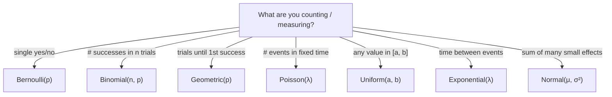

## Common Distributions — Discrete & Continuous

Big picture (no jargon)

A **named distribution** is a *standard recipe* for a random variable that arises so often we give it a name. Instead of describing the PMF or PDF from scratch every time, you say "it's Poisson with rate 4" and everyone knows the formulas for mean, variance, and probabilities.

Roughly six distributions account for 90% of practical statistics:

- **Bernoulli & Binomial** — yes/no trials.
- **Geometric** — "how long till the first success?"
- **Poisson** — "how many events in a fixed window?"
- **Uniform** — "anywhere in this range, equally likely".
- **Exponential** — "time between events".
- **Normal (Gaussian)** — "anything that's the sum of many small effects".

Knowing which to reach for is half the battle.

**Real-world analogy.** A binomial is "out of 100 customers, how many bought?" A Poisson is "how many people walk in during the next hour?" An exponential is "how long until the next person walks in?" A normal is "what's the average height of those 100 customers?"

### Vocabulary — every term, defined plainly

- **Bernoulli($p$)** — single yes/no trial. $X \in \{0, 1\}$, $P(X = 1) = p$.
- **Binomial($n, p$)** — number of successes in $n$ independent Bernoulli($p$) trials.
- **Geometric($p$)** — number of trials until (and including) the first success. (Some books count failures only — be careful.)
- **Poisson($\lambda$)** — number of events in a fixed interval when events occur at constant average rate $\lambda$, independently.
- **Uniform($a, b$)** — equally likely anywhere on the interval $[a, b]$.
- **Exponential($\lambda$)** — time between successive events of a Poisson process with rate $\lambda$. Memoryless.
- **Normal / Gaussian $\mathcal{N}(\mu, \sigma^2)$** — bell curve. Parameters are mean $\mu$ and variance $\sigma^2$ (sometimes std).
- **Standard normal $Z = (X - \mu)/\sigma \sim \mathcal{N}(0, 1)$** — z-score; lets you use one universal table.
- **Memoryless property** — $P(X > s + t \mid X > s) = P(X > t)$. Only Exponential (continuous) and Geometric (discrete) have it.
- **Support** — the set of values where the PMF/PDF is non-zero.

### Picture it — when to use which

### Build the idea — the cheat sheet

| Distribution | Support | PMF / PDF | Mean | Variance |
|---|---|---|---|---|
| Bernoulli($p$) | $\{0, 1\}$ | $p^x (1-p)^{1-x}$ | $p$ | $p(1-p)$ |
| Binomial($n, p$) | $\{0, 1, \dots, n\}$ | $\binom{n}{k}p^k(1-p)^{n-k}$ | $np$ | $np(1-p)$ |
| Geometric($p$) | $\{1, 2, 3, \dots\}$ | $(1-p)^{k-1}\,p$ | $1/p$ | $(1-p)/p^2$ |
| Poisson($\lambda$) | $\{0, 1, 2, \dots\}$ | $e^{-\lambda}\lambda^k / k!$ | $\lambda$ | $\lambda$ |
| Uniform($a, b$) | $[a, b]$ | $1/(b-a)$ | $(a+b)/2$ | $(b-a)^2/12$ |
| Exponential($\lambda$) | $[0, \infty)$ | $\lambda e^{-\lambda x}$ | $1/\lambda$ | $1/\lambda^2$ |
| Normal($\mu, \sigma^2$) | $(-\infty, \infty)$ | $\dfrac{1}{\sigma\sqrt{2\pi}}\exp\!\left(-\dfrac{(x-\mu)^2}{2\sigma^2}\right)$ | $\mu$ | $\sigma^2$ |

### Relationships between distributions — *very* useful

- Sum of $n$ iid Bernoulli($p$) $=$ Binomial($n, p$).
- Binomial($n, p$) with large $n$, small $p$, fixed $np = \lambda$ $\to$ Poisson($\lambda$).
- Binomial($n, p$) with large $n$ $\to \mathcal{N}(np, np(1-p))$ (CLT in action).
- Inter-arrival times of a Poisson($\lambda$) process are iid Exponential($\lambda$).
- Sum of $n$ iid Exponential($\lambda$) $=$ Gamma($n, \lambda$).
- Sum of two independent Normals: $\mathcal{N}(\mu_1, \sigma_1^2) + \mathcal{N}(\mu_2, \sigma_2^2) = \mathcal{N}(\mu_1 + \mu_2,\; \sigma_1^2 + \sigma_2^2)$.

### Standard normal & z-scores

$$
Z = \frac{X - \mu}{\sigma} \sim \mathcal{N}(0, 1).
$$

Use $\Phi(z) = P(Z \le z)$ from a standard normal table to compute *any* normal probability:

$$
P(a \le X \le b) = \Phi\!\left(\frac{b - \mu}{\sigma}\right) - \Phi\!\left(\frac{a - \mu}{\sigma}\right).
$$

Empirical "68–95–99.7" rule:

| Interval around $\mu$ | Probability |
|---|---|
| $\mu \pm 1\sigma$ | $\approx 68\%$ |
| $\mu \pm 2\sigma$ | $\approx 95\%$ |
| $\mu \pm 3\sigma$ | $\approx 99.7\%$ |

<dl class="symbols">
  <dt>$p$</dt><dd>Bernoulli/Binomial success probability</dd>
  <dt>$n$</dt><dd>number of trials (Binomial)</dd>
  <dt>$\lambda$</dt><dd>rate (Poisson, Exponential)</dd>
  <dt>$\mu, \sigma^2$</dt><dd>mean and variance (Normal)</dd>
  <dt>$\Phi(z)$</dt><dd>standard normal CDF</dd>
</dl>

### Worked example — fully expanded, no skipped arithmetic

Worked example: a busy call centre

A call centre receives an average of $\lambda = 4$ calls per minute, calls arriving independently.

**Q1: Probability of exactly 2 calls in the next minute.** Poisson($\lambda = 4$):

$$
P(X = 2) = \frac{e^{-4}\,4^2}{2!} = \frac{e^{-4} \cdot 16}{2} = 8 e^{-4} \approx 8 \cdot 0.01832 \approx 0.1465.
$$

**Q2: Probability of at most 1 call in the next minute.**

$$
P(X = 0) = e^{-4} \approx 0.01832, \qquad P(X = 1) = 4 e^{-4} \approx 0.0733.
$$

$$
P(X \le 1) = 0.01832 + 0.0733 \approx 0.0916.
$$

**Q3: Probability the next call takes more than 30 seconds.** Inter-arrival times are Exponential($\lambda = 4$/min). Convert: $0.5$ min.

$$
P(T > 0.5) = e^{-\lambda t} = e^{-4 \cdot 0.5} = e^{-2} \approx 0.1353.
$$

**Q4: Suppose call durations are $\mathcal{N}(\mu = 3, \sigma^2 = 1)$ minutes. Probability a call lasts between 2 and 5 minutes.**

$$
z_1 = (2 - 3)/1 = -1, \qquad z_2 = (5 - 3)/1 = 2.
$$

$$
P(2 \le X \le 5) = \Phi(2) - \Phi(-1) = 0.9772 - 0.1587 = 0.8185.
$$

**Q5: Out of 10 customers, what's the probability that exactly 3 are repeat callers if $p = 0.4$?** Binomial($n = 10, p = 0.4$):

$$
P(X = 3) = \binom{10}{3}(0.4)^3(0.6)^7 = 120 \cdot 0.064 \cdot 0.02799 \approx 120 \cdot 0.001792 \approx 0.2150.
$$

### How to think about it

Mental model — pick by what you're modelling

Three keywords drive distribution choice:

- **Counts** in a fixed sample → Binomial; in a fixed *time/space window* → Poisson.
- **Times** between events → Exponential; sum of times → Gamma.
- **Continuous measurements** that look like sums of many small effects → Normal (by the CLT).

The Poisson and Exponential are *the same process* viewed two ways: counting vs. waiting. The Binomial bridges to both — large $n$, small $p$ → Poisson; large $n$ → Normal.

**When this comes up in ML.** Logistic regression assumes Bernoulli labels. Naïve Bayes' Gaussian variant assumes Normal features per class. Poisson regression for count outcomes (clicks, defects). Variational autoencoders use Gaussians in latent space. Anything that says "noise" usually means Gaussian noise.

Watch out — common traps

- **Geometric**: two conventions exist — counting trials including the success ($\{1, 2, \dots\}$, mean $1/p$) vs counting only failures before the success ($\{0, 1, \dots\}$, mean $(1-p)/p$). Read the question carefully.
- **Poisson rate units must match the window.** $\lambda = 4$/min → use $\lambda t = 4 \cdot 0.5 = 2$ for a 30-second window.
- **Memoryless.** Only Exponential and Geometric. "If the bus hasn't come for 10 min, when's it coming?" — Exponential says "still expected to come in $1/\lambda$ minutes from now". Most real-world waits are *not* memoryless.
- **Normal($\mu, \sigma^2$) vs Normal($\mu, \sigma$).** Some sources parameterise by variance, others by std. Double-check.
- **Continuity correction** when approximating Binomial by Normal: $P(X = k) \approx \Phi((k + 0.5 - np)/\sigma) - \Phi((k - 0.5 - np)/\sigma)$.
- A high $P(X = k)$ for a continuous distribution is meaningless ($P = 0$ for any single value).

Exam tip

Keep the cheat-sheet table memorised — mean, variance, support, PMF/PDF for all six. For "exactly $k$ events" use Poisson; for "wait time" use Exponential; for "$z$-score" use Normal table. **Always sanity-check** units (per minute vs per hour) and parameterisation conventions.

