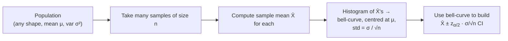

## Central Limit Theorem & Confidence Intervals

Big picture (no jargon)

The **Central Limit Theorem (CLT)** is the single most important theorem in statistics. It says: *no matter what shape your population has*, the **average of a large enough sample** is approximately Normally distributed. This is why the bell curve is everywhere — it's the universal shape of "averages of independent things".

Once we know the sample mean is roughly Normal, we can quantify how *uncertain* our estimate is. A **confidence interval (CI)** is a range that, with high probability (typically 95%), contains the true population parameter. Instead of saying "the average height is 170 cm", we say "the average height is $170 \pm 2$ cm with 95% confidence" — a much more honest claim.

**Real-world analogy.** Roll one die — outcome is uniform, no bell curve. Roll 30 dice and average them — you'll get a number near 3.5 almost every time, with a near-perfect bell-curve histogram. That's the CLT. The CI is then: "based on this one experiment of 30 rolls, I'm 95% sure the true population mean is between 3.3 and 3.7."

### Vocabulary — every term, defined plainly

- **Population** — the whole group you'd ideally measure. Has a true (usually unknown) mean $\mu$ and variance $\sigma^2$.
- **Sample** — what you actually measured. Has sample mean $\bar X$ and sample variance $s^2$.
- **Estimator** — a recipe (function of the sample) used to guess a population parameter. $\bar X$ estimates $\mu$.
- **Sampling distribution** — the distribution of an estimator across hypothetical *repeated* samples of size $n$. (Not the distribution of the data!)
- **Standard error (SE)** — the standard deviation of the *sampling distribution*. For $\bar X$: $\operatorname{SE}(\bar X) = \sigma / \sqrt{n}$ (or $s/\sqrt{n}$ when $\sigma$ is unknown).
- **CLT** — for iid $X_1, \dots, X_n$ with mean $\mu$ and finite variance $\sigma^2$, $\bar X \approx \mathcal{N}(\mu,\, \sigma^2/n)$ for "large enough" $n$ (usually $n \ge 30$).
- **Confidence interval (CI)** — random interval $[\bar X - m,\, \bar X + m]$ that captures $\mu$ in $(1 - \alpha)$ of repeated samples. $1 - \alpha$ is the **confidence level**.
- **Margin of error** $m = z_{\alpha/2}\cdot\operatorname{SE}$ — half-width of the CI.
- **Critical value $z_{\alpha/2}$** — the standard normal quantile leaving $\alpha/2$ in each tail. For 95%: $z = 1.96$.
- **t-distribution $t_{n-1}$** — heavier-tailed cousin of normal; replaces normal when $\sigma$ unknown and $n$ small. Has $n - 1$ **degrees of freedom (df)**.
- **Degrees of freedom (df)** — number of *independent* pieces of information left after constraints. Sample variance uses $n - 1$ df because $\sum(x_i - \bar x) = 0$ is one constraint.

### Picture it

### Build the idea

**Central Limit Theorem.** Let $X_1, X_2, \dots, X_n$ be iid with $E[X_i] = \mu$, $\operatorname{Var}(X_i) = \sigma^2 < \infty$. As $n \to \infty$:

$$
\bar X = \frac{1}{n}\sum_{i=1}^{n} X_i \;\xrightarrow{d}\; \mathcal{N}\!\left(\mu, \frac{\sigma^2}{n}\right).
$$

Equivalently, the standardised version converges to standard normal:

$$
Z_n = \frac{\bar X - \mu}{\sigma/\sqrt{n}} \;\xrightarrow{d}\; \mathcal{N}(0, 1).
$$

**Rule of thumb.** $n \ge 30$ is usually "large enough" for CLT to give a good approximation, *unless* the population is heavily skewed or has heavy tails — in that case, use a larger $n$.

**Point estimators.** A **point estimate** is a single best-guess value:

| Parameter | Estimator |
|---|---|
| Population mean $\mu$ | sample mean $\bar X = \frac{1}{n}\sum x_i$ |
| Population variance $\sigma^2$ | sample variance $s^2 = \frac{1}{n-1}\sum(x_i - \bar x)^2$ |
| Population proportion $p$ | sample proportion $\hat p = \frac{\text{successes}}{n}$ |

All three are **unbiased** ($E[\text{estimator}] = $ true parameter) under iid sampling.

**Confidence interval — general form.**

$$
\text{point estimate} \;\pm\; (\text{critical value}) \cdot (\text{standard error})
$$

**CI for the mean — known $\sigma$ (or $n$ large).**

$$
\bar X \pm z_{\alpha/2} \cdot \frac{\sigma}{\sqrt{n}}
$$

**CI for the mean — unknown $\sigma$ (small $n$).** Use $s$ in place of $\sigma$ and the **$t$-distribution** with $n - 1$ degrees of freedom:

$$
\bar X \pm t_{\alpha/2, n-1} \cdot \frac{s}{\sqrt{n}}
$$

**CI for a proportion** (large $n$, normal approximation):

$$
\hat p \pm z_{\alpha/2} \cdot \sqrt{\frac{\hat p(1 - \hat p)}{n}}
$$

**Critical-value cheat sheet.**

| Confidence | $z_{\alpha/2}$ |
|---|---|
| 90% | 1.645 |
| 95% | 1.96 |
| 99% | 2.576 |

**Required sample size for desired margin $E$ (mean):**

$$
n = \left\lceil \left(\frac{z_{\alpha/2}\,\sigma}{E}\right)^2 \right\rceil
$$

For a proportion, replace $\sigma^2$ with $\hat p(1-\hat p)$, and use $0.25$ if no prior estimate is available (worst case at $p = 0.5$).

<dl class="symbols">
  <dt>$\bar X$</dt><dd>sample mean (the estimator)</dd>
  <dt>$\mu, \sigma$</dt><dd>true population mean and std (often unknown)</dd>
  <dt>$s$</dt><dd>sample standard deviation (used when $\sigma$ unknown)</dd>
  <dt>$\operatorname{SE}(\bar X)$</dt><dd>standard error of the mean, $\sigma/\sqrt n$ or $s/\sqrt n$</dd>
  <dt>$z_{\alpha/2}, t_{\alpha/2, n-1}$</dt><dd>critical values from normal / $t_{n-1}$ tables</dd>
  <dt>$\alpha$</dt><dd>significance level; $1 - \alpha$ is the confidence</dd>
</dl>

### Worked example — fully expanded, no skipped arithmetic

Worked example: average commute time

A commuter records the duration of $n = 36$ randomly chosen commutes:

$$
\bar X = 42 \text{ minutes}, \qquad s = 9 \text{ minutes}.
$$

Build a 95% CI for the true average commute time $\mu$.

**Step 1 — Standard error.**

$$
\operatorname{SE} = \frac{s}{\sqrt{n}} = \frac{9}{\sqrt{36}} = \frac{9}{6} = 1.5 \text{ min}.
$$

**Step 2 — Critical value.** $n = 36$ is "large", so we can use $z$. For 95%: $z_{0.025} = 1.96$. (If we used $t_{35}$ instead, the value $\approx 2.030$ — only a tiny correction.)

**Step 3 — Margin of error.**

$$
m = 1.96 \cdot 1.5 = 2.94 \text{ min}.
$$

**Step 4 — CI.**

$$
\bar X \pm m = 42 \pm 2.94 \;\;\Rightarrow\;\; (39.06,\; 44.94) \text{ minutes}.
$$

**Interpretation.** "We are 95% confident that the true average commute time lies between 39.06 and 44.94 minutes." (NOT "there's a 95% chance $\mu$ is in this interval" — see traps.)

**Step 5 — Sample size to halve the margin.** We want $E = 1.47$. Treat $\sigma \approx 9$:

$$
n = \left(\frac{1.96 \cdot 9}{1.47}\right)^2 = \left(\frac{17.64}{1.47}\right)^2 = 12^2 = 144.
$$

So we'd need **144 observations** (4× the original) to halve the margin. Margin shrinks like $1/\sqrt n$ — diminishing returns.

**Proportion CI mini-example.** A poll of 400 voters: 220 say "yes". $\hat p = 220/400 = 0.55$.

$$
\operatorname{SE}(\hat p) = \sqrt{\frac{0.55 \cdot 0.45}{400}} = \sqrt{\frac{0.2475}{400}} = \sqrt{0.000619} \approx 0.0249.
$$

$$
\text{95\% CI} = 0.55 \pm 1.96 \cdot 0.0249 = 0.55 \pm 0.0488 \approx (0.501,\; 0.599).
$$

The interval just barely excludes 0.50 → "majority support" is statistically defensible, but only just.

### How to think about it

Mental model — two layers of randomness

There are *two distributions in play* — and confusing them is the #1 student mistake:

1. The **population** distribution (or data distribution) — what individual observations look like.
2. The **sampling distribution** of $\bar X$ — what averages of $n$ observations look like.

The CLT promises that **layer 2 is always Normal** (for large $n$), even when layer 1 is wildly non-Normal. That's why a CI for $\mu$ uses $\sigma/\sqrt n$, not $\sigma$ — we're describing the distribution of the *estimator*, not the data.

Why divide by $\sqrt n$? Variance of a sum scales by $n$; dividing by $n$ (averaging) scales variance by $1/n$. Take the square root to get standard deviation.

**When this comes up in ML.** Train/validation accuracy reporting uses CIs (or bootstrap CIs). Bayesian inference's "credible intervals" are the analogue. A/B testing decides launches by checking whether 0 lies in the CI for the difference. Whenever you cross-validate, the average score is approximately normal by CLT — confidence bands on learning curves use this.

Watch out — common traps

- **CI interpretation.** A 95% CI does *not* mean "$\mu$ has a 95% chance of being in this fixed interval". It means "if I repeated the procedure many times, 95% of the *intervals* I generate would contain the true $\mu$".
- **CLT is about the sampling distribution, not the data.** It does *not* say data is normally distributed.
- **Skewed populations need bigger $n$.** $n \ge 30$ is a rule of thumb, not a law. For very skewed data (incomes, response times), you may need $n \ge 100$ or more.
- **iid assumption.** If observations are correlated (time series, clusters), the CLT in this form fails — SE underestimates true uncertainty.
- **Use $t$, not $z$, when $\sigma$ unknown and $n$ small** ($< 30$). For large $n$ the difference vanishes.
- **Proportion CI breaks** when $n\hat p < 5$ or $n(1-\hat p) < 5$ — use exact (Clopper–Pearson) or Wilson interval instead.
- Margin of error shrinks as $1/\sqrt n$. To halve the margin, **quadruple the sample size**.

Exam tip

Always state the **interval form** explicitly: $\text{estimate} \pm \text{critical} \cdot \text{SE}$. Distinguish $z$ (known $\sigma$ or large $n$) from $t$ (unknown $\sigma$ and small $n$). For sample-size questions, isolate $n$: $n = (z\sigma/E)^2$. **Never** write "the parameter has 95% probability of being in the interval" — the parameter is fixed, the *interval* is random.

