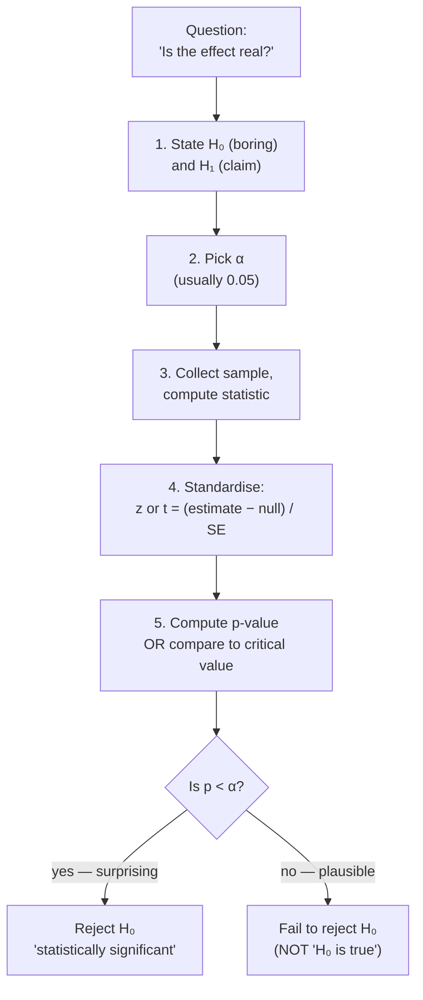
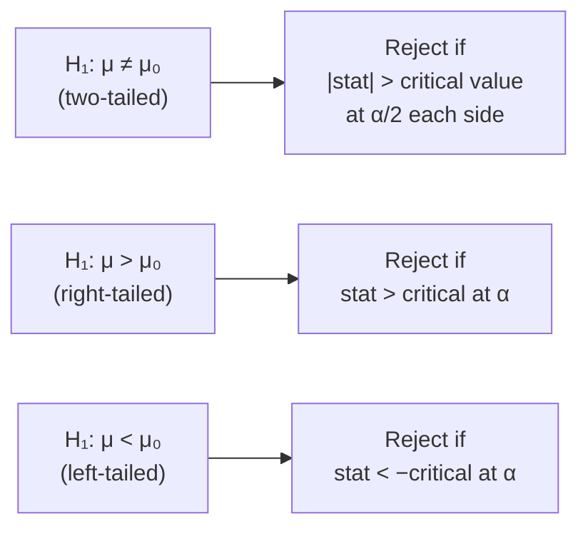

## Hypothesis Testing — Means & Proportions

Big picture (no jargon)

You ran a small experiment and got a number. The boss asks: *"Is this a real effect, or just luck?"* That's it — that's the whole subject. **Hypothesis testing** is a courtroom procedure for that question. The defendant ("the effect is fake / there's nothing going on") is **presumed innocent**. Your data is the evidence. We only convict (= reject the boring hypothesis) if the evidence would be *very surprising* under the assumption of innocence.

**Real-world analogy.** A coin flipped 10 times comes up heads 7 times. Is the coin biased, or did a fair coin just have a lucky run? Hypothesis testing gives a disciplined answer.

### Vocabulary — every acronym, defined plainly

- **H₀ (read "H-naught" or "H-zero") — the null hypothesis.** The *boring* assumption. "Nothing is happening." "The new drug is no better than placebo." "The coin is fair." We *assume H₀ is true* until the data shouts loudly enough to overturn it.
- **H₁ (or H_a) — the alternative hypothesis.** The *interesting* claim. "The new drug works." "The coin is biased." This is what we want evidence *for*.
- **α (alpha) — the significance level.** Our pre-chosen tolerance for *false alarms*. Typically 0.05, meaning: "I'm willing to wrongly convict an innocent H₀ at most 5% of the time, in the long run." Picked **before** seeing the data.
- **Test statistic** — a single number we compute from the sample that measures how far our data is from "what H₀ predicts." Think of it as a *standardised distance*.
- **p-value** — the probability of seeing data **at least as extreme** as ours, *if H₀ were actually true*. **NOT** "the probability H₀ is true" — that's the most common misreading. Small p = our data would be a freak event under H₀ = evidence against H₀.
- **SE (Standard Error)** — the standard deviation of our *estimator* (e.g. the sample mean), not of individual data points. It tells us "how jittery is this average if I repeated the experiment many times?" Formula for a mean: $SE = s/\sqrt{n}$ — averages of bigger samples wobble less.
- **Critical value** — the cut-off on the test-statistic axis beyond which we reject H₀. Determined by α and the chosen distribution.
- **Type I error** — convicting an innocent H₀ (rejecting a true H₀). Probability = α.
- **Type II error (β, beta)** — letting a guilty H₀ off the hook (failing to reject a false H₀).
- **Power = 1 − β** — probability we correctly catch a real effect.
- **CI (Confidence Interval)** — a range of plausible values for the true parameter, computed from the sample. A 95% CI means: "if I repeated this experiment many times, 95% of the intervals I build this way will contain the true value." (Covered fully in module 7.)
- **df (degrees of freedom)** — informally, the "amount of information" left after using some of it to estimate things. For one-sample t-test: $df = n - 1$.
- **σ (sigma) vs s** — σ is the *true* population standard deviation (usually unknown). $s$ is the *sample* standard deviation we compute from data.

### Picture it — the courtroom workflow

### Build the idea — why standardise?

Suppose the boring claim is "true mean exam score is μ₀ = 70." We sample 36 students and find $\bar{x} = 73$. Is a 3-point gap big or small?

It depends on **how jittery $\bar{x}$ is.** If the standard error of the mean is 1.5, then 3 points is *two standard errors away* — very surprising under H₀. If the SE were 5, then 3 points is well within the normal wobble — not surprising at all.

So we don't compare *raw* differences — we always compare differences *in units of standard error*. That's the test statistic:

$$
\text{test statistic} = \frac{\text{observed} - \text{H}_0\text{-predicted}}{\text{SE of the estimate}}
$$

This number lives on a known reference distribution (Normal or t). We can look up "how often would I see something this far out, by pure chance?" — that's the p-value.

<dl class="symbols">
  <dt>$\bar{x}$</dt><dd>sample mean (the number we computed)</dd>
  <dt>$\mu_0$</dt><dd>the value the boring hypothesis claims for the true mean</dd>
  <dt>$\sigma$</dt><dd>true population standard deviation (rarely known)</dd>
  <dt>$s$</dt><dd>sample standard deviation (estimated from data)</dd>
  <dt>$n$</dt><dd>sample size</dd>
  <dt>$SE$</dt><dd>standard error = $\sigma/\sqrt{n}$ if σ known, else $s/\sqrt{n}$</dd>
</dl>

### Core formulas — when to use which test

We pick the test statistic based on (a) what we're testing (mean? proportion?) and (b) what we know (σ known or not?).

| Scenario | Statistic | Distribution under H₀ |
|---|---|---|
| One mean, σ known | $z = \dfrac{\bar{x} - \mu_0}{\sigma/\sqrt{n}}$ | $\mathcal{N}(0,1)$ |
| One mean, σ unknown | $t = \dfrac{\bar{x} - \mu_0}{s/\sqrt{n}}$ | $t_{n-1}$ |
| Two means, independent | $t = \dfrac{\bar{x}_1 - \bar{x}_2}{\sqrt{s_1^2/n_1 + s_2^2/n_2}}$ | Welch's $t$ |
| Paired difference | $t = \dfrac{\bar{d}}{s_d/\sqrt{n}}$ | $t_{n-1}$ |
| One proportion | $z = \dfrac{\hat{p} - p_0}{\sqrt{p_0(1-p_0)/n}}$ | $\mathcal{N}(0,1)$ |
| Two proportions | $z = \dfrac{\hat{p}_1 - \hat{p}_2}{\sqrt{\hat{p}(1-\hat{p})\left(\frac{1}{n_1} + \frac{1}{n_2}\right)}}$ | $\mathcal{N}(0,1)$ |

Pooled estimate for two-proportion test: $\hat{p} = \dfrac{x_1 + x_2}{n_1 + n_2}$.

**Rule of thumb for "z vs t":** if you had to *estimate* σ from the same data (i.e. you're using $s$), you've added uncertainty — use t. If σ is genuinely known beforehand (rare), use z.

### One-tailed vs two-tailed — which side(s) count?

If you have no prior reason to expect direction, use two-tailed (the safe default). Pick a one-tailed test only if a difference in the *other* direction would be uninteresting or impossible.

### Worked example — fully expanded, no skipped arithmetic

Worked example: exam scores

**Claim** (the alternative): "Students this year scored *differently* from the historical average of 70."

**Data:** sample of $n = 36$ students, sample mean $\bar{x} = 73$, sample standard deviation $s = 9$. We don't know the true σ, so we'll use a t-test.

**Step 1 — State hypotheses (two-tailed because the claim is "different," not "higher").**

$$
H_0: \mu = 70 \qquad H_1: \mu \ne 70
$$

**Step 2 — Pick α.** $\alpha = 0.05$.

**Step 3 — Compute the standard error.**

$$
SE = \frac{s}{\sqrt{n}} = \frac{9}{\sqrt{36}}
$$

Now $\sqrt{36} = 6$, so:

$$
SE = \frac{9}{6} = 1.5
$$

**Step 4 — Compute the test statistic.**

$$
t = \frac{\bar{x} - \mu_0}{SE} = \frac{73 - 70}{1.5}
$$

Numerator: $73 - 70 = 3$. Then:

$$
t = \frac{3}{1.5} = 2.000
$$

**Step 5 — Find the critical value.** Degrees of freedom: $df = n - 1 = 36 - 1 = 35$. For a two-tailed test at $\alpha = 0.05$, we split α equally between the two tails (0.025 each). Looking up $t_{0.025,\, 35}$ in a t-table:

$$
t_\text{crit} \approx \pm 2.030
$$

**Step 6 — Decision.**

We compare: is $|t| = 2.000$ greater than $2.030$? No — $2.000 < 2.030$. So **we fail to reject H₀**. By a hair.

**Step 7 — p-value (alternative phrasing).** The p-value is the area in *both* tails of $t_{35}$ beyond $\pm 2.000$. Looking it up:

$$
p \approx 2 \times P(T_{35} > 2.000) \approx 2 \times 0.0265 = 0.053
$$

Since $p = 0.053 > \alpha = 0.05$, same conclusion: **fail to reject**.

**Step 8 — Plain-English conclusion.** "At the 5% significance level, the data do not provide sufficient evidence that this year's average score differs from 70 ($t = 2.00$, $df = 35$, $p = 0.053$, two-tailed)."

### How to think about it

Mental model

Imagine the bell curve of "what $\bar{x}$ would look like, sample after sample, if H₀ were true." Mark the cut-offs at $\pm 2.030 \cdot SE$ from $\mu_0 = 70$ — that's $70 \pm 3.045$, i.e. the *acceptance region* is roughly $(66.96,\, 73.04)$. Our observed $\bar{x} = 73$ lands *just inside* that region. That's exactly why we couldn't reject — we were 0.04 points shy of the cutoff. With $n = 100$ instead of 36, the SE would shrink to $9/10 = 0.9$, $t$ would jump to $3/0.9 \approx 3.33$, and we'd reject decisively. **Sample size matters enormously.**

When to reach for which test:
- **One mean, big sample, σ unknown:** one-sample t-test.
- **Comparing two groups:** independent two-sample t-test (if subjects differ) or paired t-test (if same subjects measured twice — e.g. before/after).
- **Comparing rates / fractions:** proportion z-tests.
- **Comparing more than two means:** ANOVA (module 9), not multiple t-tests.

Watch out — common mistakes

- "Failed to reject" does **not** mean "H₀ is true." It means "not enough evidence to overturn H₀." Innocent until proven guilty — but unproven guilt isn't proof of innocence.
- "p = 0.053" and "p = 0.049" are essentially the same evidence. Don't worship the 0.05 cliff.
- **Statistical significance ≠ practical significance.** With $n = 1{,}000{,}000$, a trivial half-point difference can be highly significant but useless in practice.
- **Multiple testing inflates Type I error.** If you run 20 independent tests at α = 0.05, you expect ~1 false positive. Apply Bonferroni ($\alpha / k$) or FDR control.
- p-value is **not** $P(H_0 \mid \text{data})$. It's $P(\text{data this extreme} \mid H_0)$. Direction matters.
- One-tailed tests **inflate power** by giving up the other tail. Choose the direction *before* peeking at data.

Exam tip — write the answer in one disciplined paragraph

Examiners look for this structure, in this order:

> "We test **H₀: ...** vs **H₁: ...** at **α = ...**. Using a **[name of test]** with **df = ...**, the test statistic is **... = (formula) = (number)**, with critical value **±... ** (or p-value **= ...**). Since **|stat| > critical** (or **p < α**), we **reject / fail to reject H₀** and conclude **(plain-English claim)**."

Always:
1. State both hypotheses *in symbols*.
2. Show the standard error computation as its own line.
3. Quote df explicitly.
4. End in one English sentence. No bare numbers as the conclusion.

