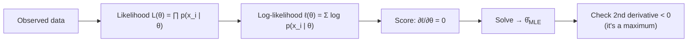

## Maximum Likelihood Estimation & ANOVA

Big picture (no jargon)

**Maximum Likelihood Estimation (MLE)** is the universal recipe for fitting parameters to data: *pick the parameter values that make the observed data most probable*. Almost every model you'll meet — linear regression, logistic regression, neural networks (with cross-entropy or MSE loss), Naïve Bayes — is secretly an MLE.

**ANOVA (Analysis of Variance)** answers a specific question: "do these *more than two* groups have the same mean, or do at least some of them differ?" It's the natural extension of the two-sample t-test to many groups. The trick is to compare *between-group* variance (signal) against *within-group* variance (noise) using an F-test.

**Real-world analogy.** MLE is like a detective: given a few clues (data), they pick the *story* (parameter values) that makes the clues most plausible. ANOVA is like a teacher comparing test scores across three classes — are the differences in averages real, or just normal student-to-student variation?

### Vocabulary — every term, defined plainly

- **Likelihood $L(\theta)$** — the probability (or PDF value) of the observed data, viewed as a *function of the parameter* $\theta$ with data fixed.
- **Log-likelihood $\ell(\theta) = \log L(\theta)$** — same thing in log space; turns products into sums and avoids underflow.
- **MLE $\hat\theta_{\text{MLE}}$** — the value of $\theta$ that maximises $L(\theta)$ (equivalently $\ell(\theta)$).
- **Score function** — $\partial \ell / \partial \theta$. Setting it to zero gives MLE candidates.
- **Fisher information $I(\theta)$** — $-E[\partial^2 \ell / \partial \theta^2]$; measures how "sharp" the likelihood peak is.
- **Cramér–Rao bound** — no unbiased estimator can have variance lower than $1/I(\theta)$. MLE often achieves it asymptotically.
- **Consistency** — as $n \to \infty$, $\hat\theta_{\text{MLE}} \to \theta_{\text{true}}$ in probability.
- **Asymptotic normality** — for large $n$, $\hat\theta_{\text{MLE}} \approx \mathcal{N}(\theta_{\text{true}},\, 1/[n\,I(\theta)])$.
- **One-way ANOVA** — tests $H_0$: all $k$ group means equal, $H_1$: at least one differs.
- **SS_B (between-group sum of squares)** — variation explained by group differences.
- **SS_W (within-group sum of squares)** — variation *inside* groups (noise).
- **SS_T (total sum of squares)** — total variation; SS_T = SS_B + SS_W.
- **MS_B, MS_W (mean squares)** — sums of squares divided by their degrees of freedom.
- **F-statistic** — $F = \text{MS}_B / \text{MS}_W$. Large $F$ ⇒ between-group dominates ⇒ reject $H_0$.
- **df_B = $k - 1$**, **df_W = $N - k$** — degrees of freedom for $k$ groups, total $N$ observations.

### Picture it

### Build the idea — MLE recipe

**The four-step recipe.** For iid data $x_1, \dots, x_n$ with assumed model $p(x \mid \theta)$:

1. **Likelihood.** $L(\theta) = \prod_{i=1}^{n} p(x_i \mid \theta)$.
2. **Log-likelihood.** $\ell(\theta) = \sum_{i=1}^{n} \log p(x_i \mid \theta)$.
3. **Score.** Compute $\partial \ell / \partial \theta$, set to 0, solve for $\theta$.
4. **Verify.** Check $\partial^2 \ell / \partial \theta^2 < 0$ at the solution (it's a max, not a min).

**Common closed-form MLEs to memorise.**

| Model | Parameter | MLE |
|---|---|---|
| Bernoulli($p$) on $n$ trials, $k$ successes | $p$ | $\hat p = k/n$ |
| Binomial($n, p$) | $p$ | $\hat p = k/n$ |
| Poisson($\lambda$) | $\lambda$ | $\hat\lambda = \bar x$ |
| Exponential($\lambda$) | $\lambda$ | $\hat\lambda = 1/\bar x$ |
| Normal($\mu, \sigma^2$), known $\sigma^2$ | $\mu$ | $\hat\mu = \bar x$ |
| Normal($\mu, \sigma^2$), both unknown | $\mu, \sigma^2$ | $\hat\mu = \bar x$, $\hat\sigma^2 = \tfrac{1}{n}\sum (x_i - \bar x)^2$ (note $n$, not $n-1$ — biased!) |

**MLE is invariant** under reparameterisation: if $g$ is one-to-one, $\widehat{g(\theta)}_{\text{MLE}} = g(\hat\theta_{\text{MLE}})$.

**Connection to common ML losses.** Maximising log-likelihood is *equivalent to minimising negative log-likelihood (NLL)*. So:

- Linear regression with Gaussian noise ⟺ MSE.
- Logistic regression ⟺ binary cross-entropy.
- Softmax classifier ⟺ categorical cross-entropy.

Each of these "losses" is just $-\ell(\theta)/n$.

### Build the idea — One-way ANOVA

**Setup.** $k$ groups, group $i$ has $n_i$ observations, total $N = \sum n_i$. Group mean $\bar x_i$, grand mean $\bar x = \frac{1}{N}\sum_{i,j} x_{ij}$.

**Sums of squares.**

$$
\text{SS}_B = \sum_{i=1}^{k} n_i (\bar x_i - \bar x)^2 \qquad \text{(between groups — signal)}
$$

$$
\text{SS}_W = \sum_{i=1}^{k} \sum_{j=1}^{n_i} (x_{ij} - \bar x_i)^2 \qquad \text{(within groups — noise)}
$$

$$
\text{SS}_T = \text{SS}_B + \text{SS}_W = \sum_{i,j} (x_{ij} - \bar x)^2.
$$

**Mean squares & F-statistic.**

$$
\text{MS}_B = \frac{\text{SS}_B}{k - 1}, \qquad \text{MS}_W = \frac{\text{SS}_W}{N - k}, \qquad F = \frac{\text{MS}_B}{\text{MS}_W} \;\sim\; F_{k-1,\, N-k} \text{ under } H_0.
$$

**Decision.** Reject $H_0$ if $F > F_{\alpha,\, k-1,\, N-k}$ (or equivalently if $p < \alpha$).

**ANOVA assumptions.** (1) Independent observations within and between groups. (2) Each group is approximately normally distributed. (3) Equal variances across groups (homoscedasticity).

**Standard ANOVA table.**

| Source | SS | df | MS | F |
|---|---|---|---|---|
| Between | SS_B | $k - 1$ | MS_B | MS_B/MS_W |
| Within | SS_W | $N - k$ | MS_W | — |
| Total | SS_T | $N - 1$ | — | — |

<dl class="symbols">
  <dt>$\theta$</dt><dd>parameter being estimated</dd>
  <dt>$L(\theta), \ell(\theta)$</dt><dd>likelihood and log-likelihood</dd>
  <dt>$I(\theta)$</dt><dd>Fisher information</dd>
  <dt>$k$</dt><dd>number of groups (ANOVA)</dd>
  <dt>$N$</dt><dd>total sample size across all groups</dd>
  <dt>$\bar x_i$</dt><dd>mean of group $i$</dd>
  <dt>$\bar x$</dt><dd>grand mean across all groups</dd>
</dl>

### Worked example — fully expanded, no skipped arithmetic

Worked example 1: MLE for Bernoulli

Observe $n = 10$ coin flips; $k = 7$ heads.

**Likelihood.** $L(p) = p^7 (1-p)^3$.

**Log-likelihood.** $\ell(p) = 7\log p + 3\log(1-p)$.

**Score.**

$$
\frac{d\ell}{dp} = \frac{7}{p} - \frac{3}{1-p} = 0 \implies 7(1-p) = 3p \implies 7 = 10p \implies \hat p = 0.7.
$$

**Second derivative.** $-7/p^2 - 3/(1-p)^2 < 0$ ✓. Confirmed maximum.

**Sanity.** Same as the obvious estimate $k/n = 7/10$.

Worked example 2: MLE for Poisson

Data: $\{2, 4, 5, 3, 6\}$, $n = 5$. PMF $p(x \mid \lambda) = e^{-\lambda}\lambda^x / x!$.

**Log-likelihood.**

$$
\ell(\lambda) = \sum_i \big[-\lambda + x_i \log\lambda - \log(x_i!)\big] = -n\lambda + (\sum x_i)\log\lambda - \text{const}.
$$

**Score.**

$$
\frac{d\ell}{d\lambda} = -n + \frac{\sum x_i}{\lambda} = 0 \implies \hat\lambda = \frac{\sum x_i}{n} = \bar x.
$$

For our data: $\hat\lambda = (2+4+5+3+6)/5 = 20/5 = 4$.

Worked example 3: One-way ANOVA

Three teaching methods $A, B, C$, scores:

| Method | Scores | $n_i$ | $\bar x_i$ |
|---|---|---|---|
| $A$ | 80, 85, 90 | 3 | 85 |
| $B$ | 70, 75, 80 | 3 | 75 |
| $C$ | 60, 65, 70 | 3 | 65 |

$N = 9$, $k = 3$. Grand mean $\bar x = (85 + 75 + 65)/3 = 75$.

**SS_B.**

$$
\text{SS}_B = 3(85-75)^2 + 3(75-75)^2 + 3(65-75)^2 = 3(100) + 0 + 3(100) = 600.
$$

**SS_W.** For each group, compute $\sum (x_{ij} - \bar x_i)^2$:

- Method $A$: $(80-85)^2 + (85-85)^2 + (90-85)^2 = 25 + 0 + 25 = 50$.
- Method $B$: $(70-75)^2 + (75-75)^2 + (80-75)^2 = 25 + 0 + 25 = 50$.
- Method $C$: $(60-65)^2 + (65-65)^2 + (70-65)^2 = 25 + 0 + 25 = 50$.

$\text{SS}_W = 50 + 50 + 50 = 150$.

**Mean squares.** $\text{MS}_B = 600/(3-1) = 300$. $\text{MS}_W = 150/(9-3) = 25$.

**F-statistic.** $F = 300/25 = 12$.

**Critical value.** $F_{0.05,\,2,\,6} \approx 5.14$.

**Decision.** $12 > 5.14$ → **reject $H_0$**. At least one method's mean differs from the others.

**ANOVA table.**

| Source | SS | df | MS | F |
|---|---|---|---|---|
| Between | 600 | 2 | 300 | 12 |
| Within | 150 | 6 | 25 | — |
| Total | 750 | 8 | — | — |

### How to think about it

Mental model

**MLE = "tune the dial that makes the data feel most natural".** Imagine sliding $\theta$ along a number line and watching $L(\theta)$ rise and fall — pick the $\theta$ at the peak. Log-transforming doesn't change the peak's *location*, only its scale, so we always work with $\ell$.

**ANOVA = "is the spread between group means bigger than what we'd expect from in-group noise alone?"** $\text{MS}_W$ estimates the noise floor. If $\text{MS}_B$ is much larger than $\text{MS}_W$ (large $F$), the differences in group means must reflect a real effect, not chance.

**When this comes up in ML.** MLE is the foundation: cross-entropy loss is NLL for categorical outputs; MSE is NLL for Gaussian outputs. Modern probabilistic models (VAEs, normalising flows) maximise (variational) log-likelihood. ANOVA is the textbook test in A/B/n experiments and feature significance for one-hot categorical predictors.

Watch out — common traps

- **MLE for Normal $\sigma^2$ uses $n$, not $n-1$** — it's biased! The $s^2$ formula in stats classes uses $n-1$ for unbiasedness, not for MLE.
- **MLE may not exist or may not be unique** if the likelihood is not strictly concave (e.g. mixture models).
- **Always log-transform** before differentiating — avoids product rule and underflow.
- ANOVA only tells you "at least one differs"; it does **not** tell you *which*. Follow up with post-hoc tests (Tukey HSD, Bonferroni-corrected pairwise t-tests).
- ANOVA assumes **equal variances**. If wildly unequal, use Welch's ANOVA. Test with Levene's test.
- ANOVA also assumes **normality** within groups; for heavily non-normal data use Kruskal–Wallis (non-parametric).
- A *significant* $F$ is not the same as a *practically meaningful* difference — always look at effect size (e.g. $\eta^2 = \text{SS}_B/\text{SS}_T$).

Exam tip

For MLE: write likelihood → take log → differentiate → set to 0 → solve. Show every step. For ANOVA: build the SS_B / SS_W / SS_T table; if $F > F_{\alpha,\, k-1,\, N-k}$, reject. Memorise: degrees of freedom are $k - 1$ (between) and $N - k$ (within); they sum to $N - 1$ (total).

