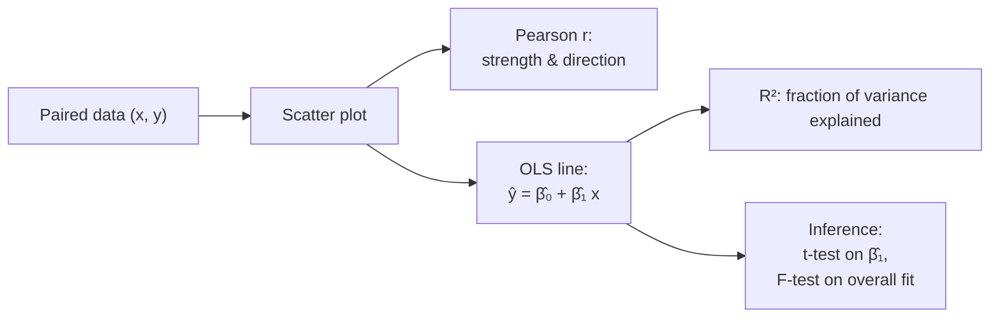

## Correlation & Regression

Big picture (no jargon)

**Correlation** measures *how tightly two variables move together* on a fixed scale of $[-1, 1]$. Plus 1 = "they march in perfect lockstep upward"; $-1$ = "perfectly opposite"; 0 = "no linear relationship".

**Regression** goes one step further: it gives you a *prediction equation* — the best-fitting straight line (or hyperplane) that lets you estimate $y$ from $x$. Once you have the line, you can predict, you can quantify how good the fit is ($R^2$), and you can test whether the relationship is real or just chance.

**Real-world analogy.** Plot 30 students' study-hours vs exam-scores on a scatter plot. Pearson's $r$ tells you how cigar-shaped the cloud is. The regression line tells you "for every extra hour studied, the score is expected to go up by 4.7 points". $R^2$ tells you what fraction of the score variation that line actually explains.

### Vocabulary — every term, defined plainly

- **Pearson correlation $r$** — sample correlation coefficient; standardised covariance; in $[-1, 1]$.
- **Covariance $\operatorname{Cov}(X, Y) = E[(X - \mu_X)(Y - \mu_Y)]$** — unstandardised co-movement; units = units of $X$ × units of $Y$.
- **Linear regression** — model $y = \beta_0 + \beta_1 x + \varepsilon$ with $\varepsilon \sim \mathcal{N}(0, \sigma^2)$.
- **Intercept $\beta_0$** — predicted $y$ when $x = 0$.
- **Slope $\beta_1$** — change in $y$ for a 1-unit change in $x$.
- **Residual $e_i = y_i - \hat y_i$** — observed minus predicted.
- **Ordinary Least Squares (OLS)** — picks $(\hat\beta_0, \hat\beta_1)$ to minimise $\sum e_i^2$.
- **SS_tot, SS_res, SS_reg** — total, residual (unexplained), regression (explained) sums of squares. SS_tot = SS_reg + SS_res.
- **Coefficient of determination $R^2$** — fraction of variance in $y$ explained by the model. For simple regression $R^2 = r^2$.
- **Adjusted $R^2$** — $R^2$ penalised for adding predictors; can decrease when useless features are added.
- **Multiple regression** — extend to $p$ predictors: $\mathbf y = X\boldsymbol\beta + \boldsymbol\varepsilon$, with $X \in \mathbb R^{n \times (p+1)}$.
- **Standard error of $\hat\beta_1$, $\operatorname{SE}(\hat\beta_1)$** — std of the sampling distribution of $\hat\beta_1$.
- **t-test for $\beta_j$** — $t = \hat\beta_j / \operatorname{SE}(\hat\beta_j) \sim t_{n - p - 1}$ under $H_0: \beta_j = 0$.
- **F-test for overall fit** — $F = \text{MS}_{\text{reg}}/\text{MS}_{\text{res}} \sim F_{p,\, n-p-1}$.

### Picture it

### Build the idea — Pearson correlation

$$
r = \frac{\sum_i (x_i - \bar x)(y_i - \bar y)}{\sqrt{\sum_i (x_i - \bar x)^2 \cdot \sum_i (y_i - \bar y)^2}}, \qquad r \in [-1, 1].
$$

Interpretation:

| $r$ | Meaning |
|---|---|
| $+1$ | Perfect positive linear |
| $0$ | No *linear* relationship (could still be curved) |
| $-1$ | Perfect negative linear |
| $|r| \ge 0.7$ | "Strong" (rough convention) |

### Build the idea — Simple linear regression (OLS)

Model:

$$
y_i = \beta_0 + \beta_1 x_i + \varepsilon_i, \qquad \varepsilon_i \stackrel{\text{iid}}{\sim} \mathcal{N}(0, \sigma^2).
$$

Pick $(\hat\beta_0, \hat\beta_1)$ to minimise the residual sum of squares:

$$
(\hat\beta_0, \hat\beta_1) = \arg\min_{\beta_0, \beta_1} \sum_i (y_i - \beta_0 - \beta_1 x_i)^2.
$$

**Closed-form solutions** (let $S_{xx} = \sum (x_i - \bar x)^2$, $S_{xy} = \sum (x_i - \bar x)(y_i - \bar y)$):

$$
\hat\beta_1 = \frac{S_{xy}}{S_{xx}}, \qquad \hat\beta_0 = \bar y - \hat\beta_1 \bar x.
$$

Note: $\hat\beta_1 = r \cdot s_y / s_x$ — slope is correlation rescaled by the std ratio.

### Build the idea — Goodness of fit ($R^2$)

$$
\text{SS}_{\text{tot}} = \sum_i (y_i - \bar y)^2, \quad
\text{SS}_{\text{res}} = \sum_i (y_i - \hat y_i)^2, \quad
\text{SS}_{\text{reg}} = \sum_i (\hat y_i - \bar y)^2.
$$

$$
R^2 = 1 - \frac{\text{SS}_{\text{res}}}{\text{SS}_{\text{tot}}} = \frac{\text{SS}_{\text{reg}}}{\text{SS}_{\text{tot}}} \in [0, 1].
$$

For simple regression: $R^2 = r^2$. For multiple regression always use the formula above.

### Build the idea — Multiple regression (matrix form)

$$
\mathbf y = X \boldsymbol\beta + \boldsymbol\varepsilon, \qquad
\hat{\boldsymbol\beta} = (X^\top X)^{-1} X^\top \mathbf y.
$$

**Adjusted $R^2$** penalises adding useless predictors:

$$
R^2_{\text{adj}} = 1 - (1 - R^2)\,\frac{n - 1}{n - p - 1}.
$$

### Build the idea — Inference

| Quantity | Statistic |
|---|---|
| Test $H_0: \beta_1 = 0$ | $t = \hat\beta_1 / \operatorname{SE}(\hat\beta_1) \sim t_{n-2}$ |
| CI for $\beta_1$ | $\hat\beta_1 \pm t_{\alpha/2, n-2}\cdot \operatorname{SE}(\hat\beta_1)$ |
| Overall significance | $F = \text{MS}_{\text{reg}} / \text{MS}_{\text{res}} \sim F_{p,\, n-p-1}$ |

**Gauss–Markov theorem.** Under (1) linear model, (2) zero-mean errors, (3) constant variance, (4) uncorrelated errors — OLS is the **B**est **L**inear **U**nbiased **E**stimator (BLUE). Add normality of errors and OLS = MLE.

<dl class="symbols">
  <dt>$r$</dt><dd>Pearson correlation coefficient</dd>
  <dt>$\beta_0, \beta_1$</dt><dd>true intercept and slope</dd>
  <dt>$\hat\beta_0, \hat\beta_1$</dt><dd>OLS estimates of intercept and slope</dd>
  <dt>$R^2$</dt><dd>coefficient of determination</dd>
  <dt>$\text{SS}_{\text{tot}}, \text{SS}_{\text{res}}, \text{SS}_{\text{reg}}$</dt><dd>total, residual, regression sums of squares</dd>
  <dt>$X$</dt><dd>design matrix, $n \times (p+1)$ (column of 1s for intercept)</dd>
  <dt>$p$</dt><dd>number of predictors (excluding intercept)</dd>
</dl>

### Worked example — fully expanded, no skipped arithmetic

Worked example: hours studied vs exam score

Five students: $x = (2, 3, 5, 7, 9)$ hours; $y = (50, 55, 65, 70, 85)$ scores.

**Step 1 — Means.** $\bar x = (2+3+5+7+9)/5 = 26/5 = 5.2$. $\bar y = (50+55+65+70+85)/5 = 325/5 = 65$.

**Step 2 — Deviations and products.**

| $x_i$ | $y_i$ | $x_i - \bar x$ | $y_i - \bar y$ | $(x-\bar x)(y-\bar y)$ | $(x-\bar x)^2$ |
|---|---|---|---|---|---|
| 2 | 50 | $-3.2$ | $-15$ | $48.0$ | $10.24$ |
| 3 | 55 | $-2.2$ | $-10$ | $22.0$ | $4.84$ |
| 5 | 65 | $-0.2$ | $0$ | $0.0$ | $0.04$ |
| 7 | 70 | $1.8$ | $5$ | $9.0$ | $3.24$ |
| 9 | 85 | $3.8$ | $20$ | $76.0$ | $14.44$ |

$S_{xy} = 48 + 22 + 0 + 9 + 76 = 155$. $S_{xx} = 10.24 + 4.84 + 0.04 + 3.24 + 14.44 = 32.8$.

**Step 3 — Slope.**

$$
\hat\beta_1 = \frac{S_{xy}}{S_{xx}} = \frac{155}{32.8} \approx 4.726.
$$

**Step 4 — Intercept.**

$$
\hat\beta_0 = \bar y - \hat\beta_1 \bar x = 65 - 4.726 \cdot 5.2 = 65 - 24.575 \approx 40.43.
$$

**Step 5 — Equation.** $\hat y = 40.43 + 4.73\, x$.

**Step 6 — Predict.** For $x = 6$: $\hat y = 40.43 + 4.73 \cdot 6 = 40.43 + 28.38 = 68.81$.

**Step 7 — $R^2$.** Compute fitted values and residuals:

| $x_i$ | $y_i$ | $\hat y_i$ | $y_i - \hat y_i$ | $(y_i - \hat y_i)^2$ |
|---|---|---|---|---|
| 2 | 50 | $49.88$ | $0.12$ | $0.014$ |
| 3 | 55 | $54.61$ | $0.39$ | $0.152$ |
| 5 | 65 | $64.07$ | $0.93$ | $0.865$ |
| 7 | 70 | $73.52$ | $-3.52$ | $12.39$ |
| 9 | 85 | $82.98$ | $2.02$ | $4.08$ |

$\text{SS}_{\text{res}} = 0.014 + 0.152 + 0.865 + 12.39 + 4.08 \approx 17.50$.

$\text{SS}_{\text{tot}} = (-15)^2 + (-10)^2 + 0^2 + 5^2 + 20^2 = 225 + 100 + 0 + 25 + 400 = 750$.

$$
R^2 = 1 - \frac{17.50}{750} \approx 1 - 0.0233 \approx 0.977.
$$

So **97.7% of the variation in scores is explained by hours studied** — an excellent fit.

**Step 8 — Pearson $r$.** $r = \sqrt{R^2} \approx 0.988$ (positive sign — slope is positive).

### How to think about it

Mental model

**Correlation $r$** = "how cigar-shaped is the cloud?". **Slope $\hat\beta_1$** = "how steep is the best-fit line?". They're related ($\hat\beta_1 = r \cdot s_y/s_x$) but distinct: a tiny slope can still give $r = 1$ if the scatter is perfectly aligned.

**Why squared errors?** Squaring (a) makes errors positive, (b) is differentiable everywhere (unlike absolute value), and (c) corresponds to MLE under Gaussian noise. The "minimise $\sum e_i^2$" recipe is OLS.

**Why $R^2 = 1 - \text{SS}_{\text{res}}/\text{SS}_{\text{tot}}$?** $\text{SS}_{\text{tot}}$ is "how much variation is there to explain". $\text{SS}_{\text{res}}$ is "how much is left after the model". Their ratio is the fraction left over; subtracting from 1 gives the fraction explained.

**When this comes up in ML.** Linear regression is the simplest supervised learner. OLS is the closed-form template; gradient descent generalises to non-linear losses. $R^2$ is the canonical regression metric. Multicollinearity (correlated predictors) causes $X^\top X$ to be near-singular — fixed by ridge / lasso / dropping features.

Watch out — common traps

- **Correlation ≠ causation.** A high $r$ between ice-cream sales and shark attacks doesn't mean ice cream causes attacks (both depend on summer).
- **$r = 0$ does NOT mean "unrelated".** It means "no *linear* relationship". A perfect parabola has $r \approx 0$ but is fully determined by $x$.
- **Outliers can wreck OLS.** A single extreme point can swing $\hat\beta_1$ wildly. Plot residuals; consider robust regression (Huber loss).
- **OLS assumptions:** linearity, independence, equal variance (homoscedasticity), normality of errors. Violations break inference (CIs, p-values) but the point estimate is still BLUE under (1)-(4).
- **Extrapolation is dangerous** — a line fit on $x \in [2, 9]$ is unlikely to be valid at $x = 100$.
- **Multicollinearity** (predictors highly correlated) inflates SE of $\hat\beta_j$ — coefficients become unstable.
- **$R^2$ can be misleading**: always increases when you add predictors. Use **adjusted $R^2$** for model comparison.
- **No intercept ⇒ no SS decomposition** in the usual sense; $R^2$ becomes ill-defined or even negative.

Exam tip

Memorise $\hat\beta_1 = S_{xy}/S_{xx}$ and $\hat\beta_0 = \bar y - \hat\beta_1 \bar x$. Build a 5-column table ($x_i, y_i, x_i-\bar x, y_i-\bar y$, products and squares) and sum the columns — easy partial credit. For $R^2$, compute residuals and use $1 - \text{SS}_{\text{res}}/\text{SS}_{\text{tot}}$. For multiple regression, **always state the matrix solution** $\hat\beta = (X^\top X)^{-1} X^\top \mathbf y$.

