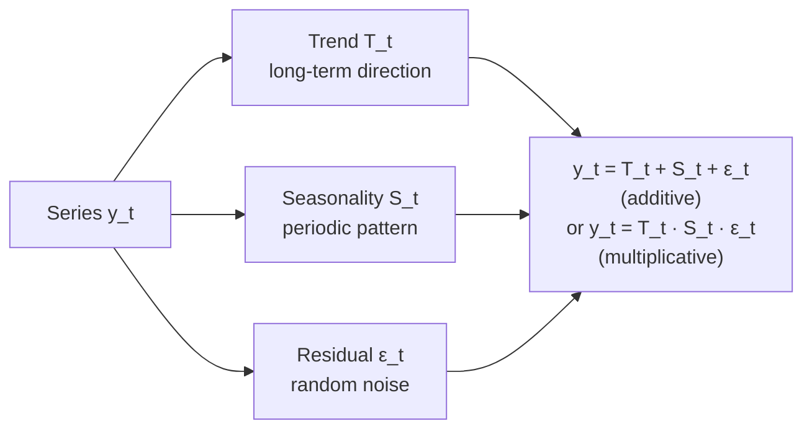

## Time Series — Basics & Moving Average Models

Big picture (no jargon)

A **time series** is data ordered by time — daily stock prices, hourly temperatures, monthly sales. The crucial difference from regular data: *order matters* and consecutive observations are usually **correlated**. You cannot just shuffle and apply your favourite ML model.

The standard workflow is:

1. **Decompose** the series into long-term **trend** + repeating **seasonality** + leftover **residual noise**.
2. Make the residual **stationary** (constant mean and variance over time) by differencing if needed.
3. Fit a model — often a **Moving Average (MA)** model — to the stationary residual.
4. Forecast by inverting the decomposition.

This card covers steps 1–3 with MA models; AR/ARMA/ARIMA come next.

**Real-world analogy.** Monthly retail sales: long-term growth (trend), big spike every December (seasonality), random week-to-week wiggles (residual). Pulling these three apart is decomposition; modelling the wiggles is what MA(q) does.

### Vocabulary — every term, defined plainly

- **Time series $\{y_t\}$** — sequence of observations indexed by time $t = 1, 2, \dots, T$.
- **Trend $T_t$** — long-term direction (upward, downward, level).
- **Seasonality $S_t$** — periodic pattern repeating every $s$ time steps (12 for monthly with yearly cycle).
- **Residual / irregular $\varepsilon_t$** — what's left after removing trend and seasonality.
- **Additive decomposition** — $y_t = T_t + S_t + \varepsilon_t$. Use when seasonal swings are constant in magnitude.
- **Multiplicative decomposition** — $y_t = T_t \cdot S_t \cdot \varepsilon_t$. Use when swings grow with the level.
- **Stationarity (weak)** — (1) constant mean, (2) constant variance, (3) covariance $\operatorname{Cov}(y_t, y_{t+k})$ depends only on the lag $k$, not on $t$.
- **Differencing $\nabla y_t = y_t - y_{t-1}$** — first-difference operator; removes a linear trend.
- **Seasonal differencing $\nabla_s y_t = y_t - y_{t-s}$** — removes a fixed seasonal pattern of period $s$.
- **Backshift operator $B$** — $B y_t = y_{t-1}$, $B^k y_t = y_{t-k}$. Convenient algebra: $\nabla = 1 - B$.
- **White noise** — sequence of iid (or just uncorrelated) random variables with mean 0 and constant variance $\sigma^2_\varepsilon$.
- **Autocorrelation function (ACF) $\rho(k)$** — correlation between $y_t$ and $y_{t+k}$.
- **Moving average smoothing** — averaging a window of consecutive values to estimate the trend; *not the same as MA(q)*.
- **MA(q) model** — model where today's value is a weighted sum of the past $q$ random shocks plus today's shock.

### Picture it — additive decomposition

### Build the idea — Stationarity & differencing

Most useful models (AR, MA, ARMA) **require stationarity**. Steps to make a series stationary:

1. Plot it. Constant level and variance? If yes, you're done.
2. If a clear upward/downward trend → first-difference: $\nabla y_t = y_t - y_{t-1}$.
3. Still trending? Difference again: $\nabla^2 y_t = \nabla(\nabla y_t)$.
4. Periodic pattern of period $s$? Apply seasonal difference: $\nabla_s y_t = y_t - y_{t-s}$.
5. Variance growing? Take logs first to stabilise variance, *then* difference.

**ADF (Augmented Dickey–Fuller) test** is the standard formal test for a unit root (non-stationarity); reject $H_0$ → series is stationary.

### Build the idea — Autocorrelation function (ACF)

$$
\rho(k) = \frac{\operatorname{Cov}(y_t,\, y_{t+k})}{\operatorname{Var}(y_t)}, \qquad \rho(0) = 1.
$$

Sample ACF estimator on $\{y_1, \dots, y_T\}$:

$$
\hat\rho(k) = \frac{\sum_{t=1}^{T-k} (y_t - \bar y)(y_{t+k} - \bar y)}{\sum_{t=1}^{T} (y_t - \bar y)^2}.
$$

The **ACF plot** ($\hat\rho(k)$ vs lag $k$, with confidence bands) is the primary diagnostic tool for choosing model order.

### Build the idea — Moving average smoothing (for trend estimation)

Centred MA of window $2k + 1$:

$$
\hat T_t = \frac{1}{2k + 1}\sum_{i = -k}^{k} y_{t + i}.
$$

Pick the window equal to the seasonal period to wash out seasonality and reveal trend. (Loses $k$ points at each end.)

### Build the idea — MA(q) model

$$
y_t = \mu + \varepsilon_t + \theta_1 \varepsilon_{t-1} + \theta_2 \varepsilon_{t-2} + \dots + \theta_q \varepsilon_{t-q},
$$

where $\varepsilon_t$ is white noise with variance $\sigma^2_\varepsilon$ and the $\theta_i$ are constants.

**Properties:**

- **Always stationary** (a finite linear combination of stationary white noise is stationary).
- $E[y_t] = \mu$.
- $\operatorname{Var}(y_t) = \sigma^2_\varepsilon (1 + \theta_1^2 + \theta_2^2 + \dots + \theta_q^2)$.
- **ACF cuts off after lag $q$** — this is the diagnostic signature: $\rho(k) \ne 0$ for $k \le q$, $\rho(k) = 0$ for $k > q$.

For **MA(1)**: $y_t = \mu + \varepsilon_t + \theta \varepsilon_{t-1}$, $\rho(1) = \theta / (1 + \theta^2)$, $\rho(k) = 0$ for $k \ge 2$.

<dl class="symbols">
  <dt>$y_t$</dt><dd>observation at time $t$</dd>
  <dt>$\varepsilon_t$</dt><dd>white-noise shock at time $t$</dd>
  <dt>$\theta_i$</dt><dd>MA coefficients</dd>
  <dt>$\mu$</dt><dd>mean of the series</dd>
  <dt>$q$</dt><dd>MA order — number of past shocks influencing today</dd>
  <dt>$\rho(k)$</dt><dd>autocorrelation at lag $k$</dd>
  <dt>$B$</dt><dd>backshift operator, $B y_t = y_{t-1}$</dd>
  <dt>$\nabla, \nabla_s$</dt><dd>regular and seasonal differencing operators</dd>
</dl>

### Worked example — fully expanded, no skipped arithmetic

Worked example: MA(1) properties

Let $y_t = \varepsilon_t + 0.5\,\varepsilon_{t-1}$, with $\sigma^2_\varepsilon = 1$ (so $\mu = 0$).

**Step 1 — Mean.**

$$
E[y_t] = E[\varepsilon_t] + 0.5\,E[\varepsilon_{t-1}] = 0 + 0 = 0.
$$

**Step 2 — Variance.** Use $\operatorname{Var}(\varepsilon_t) = 1$ and independence of distinct $\varepsilon$:

$$
\operatorname{Var}(y_t) = \operatorname{Var}(\varepsilon_t) + (0.5)^2 \operatorname{Var}(\varepsilon_{t-1}) = 1 + 0.25 = 1.25.
$$

**Step 3 — Lag-1 autocovariance.**

$$
\operatorname{Cov}(y_t,\, y_{t-1}) = \operatorname{Cov}(\varepsilon_t + 0.5\varepsilon_{t-1},\; \varepsilon_{t-1} + 0.5\varepsilon_{t-2}).
$$

Expand: only $0.5 \cdot \operatorname{Cov}(\varepsilon_{t-1},\, \varepsilon_{t-1}) = 0.5 \cdot 1 = 0.5$ survives (all other cross-products are 0 by independence).

**Step 4 — Lag-1 autocorrelation.**

$$
\rho(1) = \frac{\operatorname{Cov}(y_t, y_{t-1})}{\operatorname{Var}(y_t)} = \frac{0.5}{1.25} = 0.4.
$$

Verify via formula: $\rho(1) = 0.5 / (1 + 0.25) = 0.4$. ✓

**Step 5 — Lag-2 autocorrelation.**

$$
\operatorname{Cov}(y_t,\, y_{t-2}) = \operatorname{Cov}(\varepsilon_t + 0.5\varepsilon_{t-1},\; \varepsilon_{t-2} + 0.5\varepsilon_{t-3}) = 0.
$$

(No shared $\varepsilon$ terms.) So $\rho(2) = 0$, and $\rho(k) = 0$ for all $k \ge 2$.

**Step 6 — Diagnostic interpretation.** A sample ACF plot showing $\hat\rho(1) \approx 0.4$ and $\hat\rho(k) \approx 0$ for $k \ge 2$ is the signature of MA(1).

### How to think about it

Mental model — MA(q) as fading echoes

An MA(q) process says today's value is a *fading echo* of the last $q$ random shocks plus today's shock. After $q$ time steps, an old shock has *no influence at all* — its contribution is zero. That's why the ACF "cuts off" cleanly at lag $q$.

Contrast with AR(p) (next card): AR has *persistent* memory because each value feeds back into future ones, so the ACF *decays* (geometrically) but never quite reaches zero. The "cuts off vs decays" pattern is the key to identifying which model you need.

**When this comes up in ML.** Time series forecasting (sales, demand, finance, weather), anomaly detection on metrics (CPU, traffic), reinforcement learning's reward smoothing (literally a moving average), and signal processing (FIR filters are MA models in disguise).

Watch out — common traps

- **"Moving average" is overloaded.** MA *smoothing* (averaging past observations) ≠ MA(q) *model* (linear combination of past shocks). Same name, totally different objects.
- **Non-stationary series produce nonsense ACFs** — they look like slow exponential decay even with no real autocorrelation. Always check stationarity (plot + ADF test) before reading ACF.
- **Differencing has a price** — each $\nabla$ removes one observation and adds noise. Don't over-difference; use the ADF test as a stopping rule.
- **Seasonality must be removed/modelled** — vanilla MA(q) doesn't capture it. Use seasonal differencing or move to SARIMA.
- **Variance must be stable.** If a series has growing variance (multiplicative seasonality), apply $\log$ first.
- A residual that *isn't* white noise means your model is misspecified — re-identify.

Exam tip

For "is this stationary?" questions, eyeball: (1) constant mean (no trend), (2) constant variance (no widening cone), (3) no obvious seasonality. If any fails, recommend differencing (regular or seasonal). For MA(q) identification, the slogan is **"ACF cuts off after lag $q$, PACF tails off"** — memorise the dual for AR(p) too: "PACF cuts off after lag $p$, ACF tails off".

